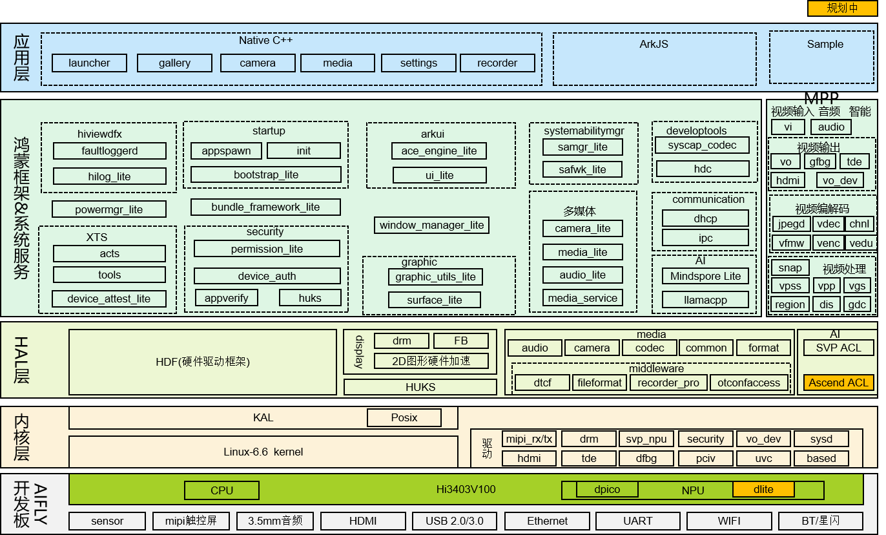

# Hi3403V100

- [简介](#简介)
- [目录](#目录)
- [文档](#文档)
- [约束](#约束)
- [许可协议](#许可协议)
- [相关仓](#相关仓)

## 简介

Hi3403V100 是上海海思推出的高性能智能视觉芯片，本目录提供其底层驱动及 SDK，为 OpenHarmony 媒体/图形子系统提供完整的多媒体处理能力。主要功能包括：音视频采集与编解码、音视频输出、视频前处理、封装与解封装、文件管理、存储管理、日志系统等。配套开发板为 **HiSpark Aifly**，系统类型为小型系统（Small System）。

### 主控芯片介绍

Hi3403V100 是一颗面向监控市场推出的专业 Ultra-HD Smart IP Camera SoC。该芯片最高支持四路 Sensor 输入，支持最高 4K60 的 ISP 图像处理能力，支持 3F WDR、多级降噪、六轴防抖、硬件拼接等多种图像增强和处理算法。Hi3403V100 内置四核 ARM Cortex-A55@1.4GHz 处理器，提供高效且灵活的 CPU 资源；集成单核 MCU，以满足低延时要求较高的场景。芯片集成了高效的神经网络推理单元，最高 10TOPS INT8 算力，支持业界主流神经网络框架；内置双核 Vision DSP，以满足差异化的 CV 计算需求。Hi3403V100 采用先进低功耗工艺和封装，支持 LPDDR4/LPDDR4x/DDR4 颗粒，满足产品小型化设计和快速量产需求。

#### 核心特性

| 特性类别 | 核心能力 |
| --- | --- |
| 处理器内核 | 四核 ARM Cortex-A55@1.4GHz（支持 Neon 加速、集成 FPU），内置 32bit MCU@500MHz，支持 TrustZone |
| 智能视频分析 | 图像分析加速引擎高达 10.4TOPS@INT8（双内核异构引擎），双核 Vision Q6 DSP，内置智能计算加速、双目深度加速、矩阵计算加速单元 |
| 视频编解码 | H.264/H.265 编解码最高分辨率 8192×8192，支持 4K60 编码和 10 路 1080p30 解码，支持 CBR/VBR/AVBR/FIXQP/QPMAP 等多种码率控制模式 |
| 视频输入 | 支持 8-Lane image sensor 串行输入（MIPI/LVDS/Sub-LVDS/HiSPi），最高支持 4 路 Sensor 输入，最大分辨率 8192×8192 |
| 数字图像处理 ISP | 支持 3A（AE/AWB/AF）功能，支持 3F WDR、多级 3D 去噪、去雾、动态对比度增强、镜头畸变校正、6-DoF 数字防抖、超感光去噪（HNR）等 |
| 视频输出 | 支持 HDMI2.0、4-Lane MIPI DSI/CSI、CVBS 等多种输出接口，最大输出能力 4096×2160@60fps + 1920×1080@60fps |
| 外部存储 | 支持 DDR4/LPDDR4/LPDDR4x（最高速率 3733Mbps，最大容量 8GB），支持 SPI Nor/SPI Nand Flash、NAND Flash、eMMC5.1 |
| 外围接口 | 2 个千兆以太网、2 个 USB3.0/USB2.0、2-Lane PCIe2.0、2 个 SDIO3.0、多个 UART/I²C/SPI/GPIO 接口 |

### 软件架构介绍

**图 1** HiSpark_AiFly small系统软件架构图



#### 应用层
基于框架层提供的能力，适配典型应用场景：
- **系统应用**：Launcher（简易桌面）、Settings（设置）
- **媒体应用**：Camera（相机）、Media（媒体播放器）、Gallery（图库）
- **示例应用**：Recorder（录音机）、MPP Sample（媒体处理示例程序）

#### 框架层
补齐 OpenHarmony 小型系统组件能力，适配图形与媒体子系统：
- **新增组件**：HDC（设备连接）、DHCP（动态主机配置）、MindSpore Lite（轻量级 AI 推理）
- **图形子系统**：适配 arkui、graphic、window 组件
- **媒体子系统**：适配 camera_lite、media_lite、audio_lite 组件
- **系统服务**：启动服务、编译配置、XTS适配

#### HAL层
采用海思芯片硬件特性增强 OpenHarmony 组件能力，提供平台级 HAL 接口：
- **hal_huks**：硬件密钥加解密模块，增强 HUKS 安全组件功能
- **hal_display**：显示适配实现，支持 FrameBuffer 和 DRM 显示框架
- **hal_media**：媒体适配（audio、camera、codec 等），提供音视频处理能力

#### 内核层
升级 Linux-6.6 内核，移植 DRM 显示框架驱动源码，适配 Hi3403V100 SDK 的驱动模块，包括：
- **显示驱动**：TDE（二维图形加速）、MIPI TX（显示接口）、HDMI 高清输出
- **采集驱动**：MIPI RX（摄像头接口），集成 HY_S0603（4K分辨率）和 OS08A20（800万像素）Sensor 驱动
- **智能驱动**：SVP NPU（Smart Vision Processing NPU）
- **系统驱动**：OSAL 系统适配层、sysconfig、ot_irq、ot_proc 等

## 目录

```bash
├── doc                        # 文档目录，含各模块开发参考、API参考、开发指南等
├── sdk_linux
│   └── smp
│       └── a55_linux
│           ├── interdrv        # 外设驱动（mipi_rx、mipi_tx、sysconfig 等）
│           ├── mpp             # 媒体处理平台（component、sample、tools）
│           ├── osal            # 系统适配层，屏蔽系统差异，提供统一接口
│           └── vendor          # 板级外设（es8388 音频、motionsensor）
└── uboot                       # U-Boot 引导二进制
```

## 文档

详细文档索引和快速导航请参见 [doc/README_zh.md](./doc/README_zh.md)。

## 约束

当前支持Hi3403V100芯片。

## 许可协议

本项目包含多种许可证，各模块遵循对应的许可协议：

### Apache License 2.0

- **SDK 自研代码**：Hi3403V100 自研代码使用 Apache License Version 2.0 许可，版权声明如下：

  ```
  Copyright (c) 2025 HiSilicon (Shanghai) Technologies Co., Ltd.
  ```

- **mbedtls**：开源加密库，采用 Apache License 2.0 许可

### GNU General Public License v2 (GPL-2.0)

以下开源组件采用 GPL-2.0 许可：

- **Linux 内核**：Linux-6.6 内核源码
- **U-Boot**：引导加载程序
- **MPP 媒体处理平台**：component、sample、cbb 等模块
- **OSAL 系统适配层**：系统抽象层实现
- **interdrv 外设驱动**：MIPI RX/TX、sysconfig 等驱动模块

### BSD 3-Clause License

- **Trusted Firmware-A (TF-A)**：ARM 安全固件，采用 BSD 3-Clause 许可

### 许可协议兼容性说明

- Hi3403V100 包含其它开源软件组件，各组件遵循其各自的开源许可声明
- 若开源软件组件许可与本项目许可冲突，以该组件许可为准
- 使用本项目代码时，请遵守相应许可证的要求和限制

## 相关仓

[vendor_hisilicon](https://gitee.com/openharmony/vendor_hisilicon)

[device_board_hisilicon](https://gitee.com/openharmony/device_board_hisilicon)
