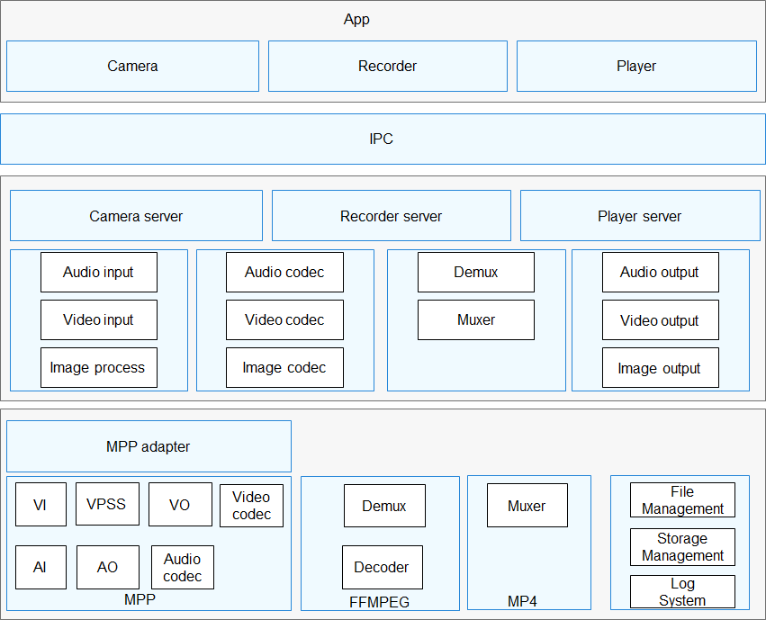

# Hi3403V100介绍<a name="ZH-CN_TOPIC_0000001142448981"></a>

-   [简介](#section11660541593)
-   [目录](#section161941989596)
-   [约束](#section119744591305)
-   [编译构建](#section137768191623)

-   [相关仓](#section1371113476307)

## 简介<a name="section11660541593"></a>

本目录为Hi3403V100芯片的底层处理驱动，为“媒体/图形子系统”提供基础的多媒体处理功能。主要功能有：音视频采集、音视频编解码、音视频输出、视频前处理、封装、解封装、文件管理、存储管理、日志系统等。如图1所示。

**图 1**  多媒体子系统架构图<a name="fig4460722185514"></a>  




## 目录<a name="section161941989596"></a>

```
/device/soc/hisilicon/hi3403v100
├── sdk_linux
│   ├── smp
│   │   ├── a55_linux
│   │   │   ├── interdrv            # 外设模块
│   │   │   │   ├── init
│   │   │   │   ├── mipi_rx         # mipi协议rx方向
│   │   │   │   ├── mipi_tx         # mipi协议rx方向
│   │   │   │   ├── ot_ir
│   │   │   │   ├── ot_user
│   │   │   │   ├── sysconfig       # 系统管脚配置相关配置
│   │   │   │   └── wtdg
│   │   │   ├── mpp
│   │   │   │   ├── cbb
│   │   │   │   ├── component
│   │   │   │   ├── out
│   │   │   │   ├── sample
│   │   │   │   └── tools
│   │   │   ├── osal                 # 驱动适配层，用于屏蔽系统差异，提供统一接口
│   │   │   │   ├── include
│   │   │   │   └── linux
│   │   │   └── vendor
│   │   │       ├── es8388
│   │   │       └── motionsensor
└── uboot                     # uboot二进制

```

## 约束<a name="section119744591305"></a>

当前支持Hi3403V100芯片。
