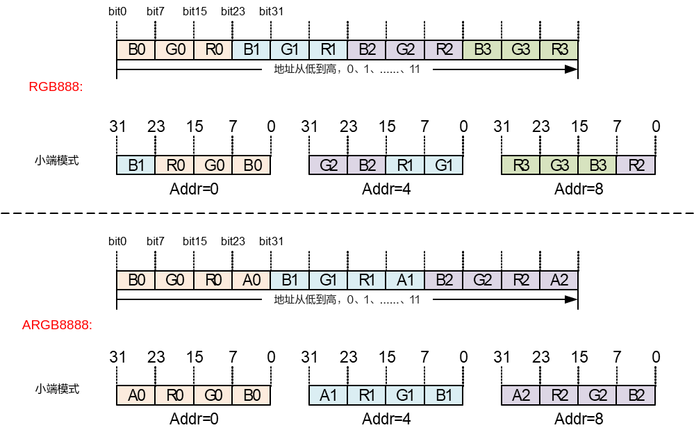

# 视频解码<a name="ZH-CN_TOPIC_0000002441659481"></a>

-   **[概述](#ZH-CN_TOPIC_0000002408100150)**  

-   **[重要概念](#ZH-CN_TOPIC_0000002408260182)**  

-   **[模块参数](#ZH-CN_TOPIC_0000002441659509)**  

-   **[错误码](#ZH-CN_TOPIC_0000002408100294)**  

## 概述<a name="ZH-CN_TOPIC_0000002408100150"></a>

VDEC模块提供驱动视频解码硬件工作的MPI接口，实现视频解码功能。

不同解决方案的VDEC特性如[表1](#_Ref322355773)所示。

**表 1**  不同解决方案的VDEC特性

<a name="_Ref322355773"></a>
<table><thead align="left"><tr id="row2533mcpsimp"><th class="cellrowborder" valign="top" width="17%" id="mcps1.2.6.1.1"><p id="p2535mcpsimp"><a name="p2535mcpsimp"></a><a name="p2535mcpsimp"></a>解决方案</p>
</th>
<th class="cellrowborder" valign="top" width="14.000000000000002%" id="mcps1.2.6.1.2"><p id="p2537mcpsimp"><a name="p2537mcpsimp"></a><a name="p2537mcpsimp"></a>硬件解码模块</p>
</th>
<th class="cellrowborder" valign="top" width="14.000000000000002%" id="mcps1.2.6.1.3"><p id="p2539mcpsimp"><a name="p2539mcpsimp"></a><a name="p2539mcpsimp"></a>支持最大通道数</p>
</th>
<th class="cellrowborder" valign="top" width="19%" id="mcps1.2.6.1.4"><p id="p2541mcpsimp"><a name="p2541mcpsimp"></a><a name="p2541mcpsimp"></a>支持协议</p>
</th>
<th class="cellrowborder" valign="top" width="36%" id="mcps1.2.6.1.5"><p id="p2543mcpsimp"><a name="p2543mcpsimp"></a><a name="p2543mcpsimp"></a>最大、最小分辨率支持</p>
</th>
</tr>
</thead>
<tbody><tr id="row2545mcpsimp"><td class="cellrowborder" valign="top" width="17%" headers="mcps1.2.6.1.1 "><p xml:lang="sv-SE" id="p2547mcpsimp"><a name="p2547mcpsimp"></a><a name="p2547mcpsimp"></a>SS528V100/SS625V100</p>
</td>
<td class="cellrowborder" valign="top" width="14.000000000000002%" headers="mcps1.2.6.1.2 "><p id="p2550mcpsimp"><a name="p2550mcpsimp"></a><a name="p2550mcpsimp"></a>VDH</p>
<p id="p2551mcpsimp"><a name="p2551mcpsimp"></a><a name="p2551mcpsimp"></a>JPEGD</p>
</td>
<td class="cellrowborder" valign="top" width="14.000000000000002%" headers="mcps1.2.6.1.3 "><p id="p2553mcpsimp"><a name="p2553mcpsimp"></a><a name="p2553mcpsimp"></a>128</p>
</td>
<td class="cellrowborder" valign="top" width="19%" headers="mcps1.2.6.1.4 "><p id="p2555mcpsimp"><a name="p2555mcpsimp"></a><a name="p2555mcpsimp"></a>VDH:</p>
<p id="p2556mcpsimp"><a name="p2556mcpsimp"></a><a name="p2556mcpsimp"></a>H.264/H.265</p>
<p id="p2557mcpsimp"><a name="p2557mcpsimp"></a><a name="p2557mcpsimp"></a>JPEGD:</p>
<p id="p2558mcpsimp"><a name="p2558mcpsimp"></a><a name="p2558mcpsimp"></a>JPEG/MJPEG</p>
</td>
<td class="cellrowborder" valign="top" width="36%" headers="mcps1.2.6.1.5 "><p id="p2560mcpsimp"><a name="p2560mcpsimp"></a><a name="p2560mcpsimp"></a>VDH:</p>
<a name="ul2561mcpsimp"></a><a name="ul2561mcpsimp"></a><ul id="ul2561mcpsimp"><li>H.264: max 8192x8192, min 96x96</li><li>H.265: max 8192x8192, min 96x96</li></ul>
<p id="p2564mcpsimp"><a name="p2564mcpsimp"></a><a name="p2564mcpsimp"></a>JPEGD：</p>
<p id="p2565mcpsimp"><a name="p2565mcpsimp"></a><a name="p2565mcpsimp"></a>JPEG/MJPEG: max 16384x16384, min 8x8</p>
</td>
</tr>
<tr id="row2566mcpsimp"><td class="cellrowborder" valign="top" width="17%" headers="mcps1.2.6.1.1 "><p id="p2568mcpsimp"><a name="p2568mcpsimp"></a><a name="p2568mcpsimp"></a>SS524V100/SS522V101</p>
</td>
<td class="cellrowborder" valign="top" width="14.000000000000002%" headers="mcps1.2.6.1.2 "><p id="p2570mcpsimp"><a name="p2570mcpsimp"></a><a name="p2570mcpsimp"></a>VDH</p>
<p id="p2571mcpsimp"><a name="p2571mcpsimp"></a><a name="p2571mcpsimp"></a>JPEGD</p>
</td>
<td class="cellrowborder" valign="top" width="14.000000000000002%" headers="mcps1.2.6.1.3 "><p id="p2573mcpsimp"><a name="p2573mcpsimp"></a><a name="p2573mcpsimp"></a>128</p>
</td>
<td class="cellrowborder" valign="top" width="19%" headers="mcps1.2.6.1.4 "><p id="p2575mcpsimp"><a name="p2575mcpsimp"></a><a name="p2575mcpsimp"></a>VDH:</p>
<p id="p2576mcpsimp"><a name="p2576mcpsimp"></a><a name="p2576mcpsimp"></a>H.264/H.265</p>
<p id="p2577mcpsimp"><a name="p2577mcpsimp"></a><a name="p2577mcpsimp"></a>JPEGD:</p>
<p id="p2578mcpsimp"><a name="p2578mcpsimp"></a><a name="p2578mcpsimp"></a>JPEG/MJPEG</p>
</td>
<td class="cellrowborder" valign="top" width="36%" headers="mcps1.2.6.1.5 "><p id="p2580mcpsimp"><a name="p2580mcpsimp"></a><a name="p2580mcpsimp"></a>VDH:</p>
<a name="ul2581mcpsimp"></a><a name="ul2581mcpsimp"></a><ul id="ul2581mcpsimp"><li>H.264: max 4096x4096, min 96x96</li><li>H.265: max 4096x4096, min 96x96</li></ul>
<p id="p2584mcpsimp"><a name="p2584mcpsimp"></a><a name="p2584mcpsimp"></a>JPEGD：</p>
<p id="p2585mcpsimp"><a name="p2585mcpsimp"></a><a name="p2585mcpsimp"></a>JPEG/MJPEG: max 16384x16384, min 8x8</p>
</td>
</tr>
<tr id="row2586mcpsimp"><td class="cellrowborder" valign="top" width="17%" headers="mcps1.2.6.1.1 "><p id="p2588mcpsimp"><a name="p2588mcpsimp"></a><a name="p2588mcpsimp"></a>SS928V100</p>
</td>
<td class="cellrowborder" valign="top" width="14.000000000000002%" headers="mcps1.2.6.1.2 "><p id="p2590mcpsimp"><a name="p2590mcpsimp"></a><a name="p2590mcpsimp"></a>VDH</p>
<p id="p2591mcpsimp"><a name="p2591mcpsimp"></a><a name="p2591mcpsimp"></a>JPEGD</p>
</td>
<td class="cellrowborder" valign="top" width="14.000000000000002%" headers="mcps1.2.6.1.3 "><p id="p2593mcpsimp"><a name="p2593mcpsimp"></a><a name="p2593mcpsimp"></a>128</p>
</td>
<td class="cellrowborder" valign="top" width="19%" headers="mcps1.2.6.1.4 "><p id="p2595mcpsimp"><a name="p2595mcpsimp"></a><a name="p2595mcpsimp"></a>VDH:</p>
<p id="p2596mcpsimp"><a name="p2596mcpsimp"></a><a name="p2596mcpsimp"></a>H.264/H.265/MPEG4</p>
<p id="p2597mcpsimp"><a name="p2597mcpsimp"></a><a name="p2597mcpsimp"></a>JPEGD:</p>
<p id="p2598mcpsimp"><a name="p2598mcpsimp"></a><a name="p2598mcpsimp"></a>JPEG/MJPEG</p>
</td>
<td class="cellrowborder" valign="top" width="36%" headers="mcps1.2.6.1.5 "><p id="p2600mcpsimp"><a name="p2600mcpsimp"></a><a name="p2600mcpsimp"></a>VDH:</p>
<a name="ul2601mcpsimp"></a><a name="ul2601mcpsimp"></a><ul id="ul2601mcpsimp"><li>H.264: max 8192x8192, min 96x96</li><li>H.265: max 8192x8192, min 96x96</li><li>MPEG4: max 4096x4096, min 64x64</li></ul>
<p id="p2605mcpsimp"><a name="p2605mcpsimp"></a><a name="p2605mcpsimp"></a>JPEGD：</p>
<p id="p2606mcpsimp"><a name="p2606mcpsimp"></a><a name="p2606mcpsimp"></a>JPEG/MJPEG: max 16384x16384, min 8x8</p>
</td>
</tr>
<tr id="row2607mcpsimp"><td class="cellrowborder" valign="top" width="17%" headers="mcps1.2.6.1.1 "><p id="p2609mcpsimp"><a name="p2609mcpsimp"></a><a name="p2609mcpsimp"></a>SS626V100</p>
</td>
<td class="cellrowborder" valign="top" width="14.000000000000002%" headers="mcps1.2.6.1.2 "><p id="p2611mcpsimp"><a name="p2611mcpsimp"></a><a name="p2611mcpsimp"></a>VDH</p>
<p id="p2612mcpsimp"><a name="p2612mcpsimp"></a><a name="p2612mcpsimp"></a>JPEGD</p>
</td>
<td class="cellrowborder" valign="top" width="14.000000000000002%" headers="mcps1.2.6.1.3 "><p id="p2614mcpsimp"><a name="p2614mcpsimp"></a><a name="p2614mcpsimp"></a>128</p>
</td>
<td class="cellrowborder" valign="top" width="19%" headers="mcps1.2.6.1.4 "><p id="p2616mcpsimp"><a name="p2616mcpsimp"></a><a name="p2616mcpsimp"></a>VDH:</p>
<p id="p2617mcpsimp"><a name="p2617mcpsimp"></a><a name="p2617mcpsimp"></a>H.264/H.265/MPEG4</p>
<p id="p2618mcpsimp"><a name="p2618mcpsimp"></a><a name="p2618mcpsimp"></a>JPEGD:</p>
<p id="p2619mcpsimp"><a name="p2619mcpsimp"></a><a name="p2619mcpsimp"></a>JPEG/MJPEG</p>
</td>
<td class="cellrowborder" valign="top" width="36%" headers="mcps1.2.6.1.5 "><p id="p2621mcpsimp"><a name="p2621mcpsimp"></a><a name="p2621mcpsimp"></a>VDH:</p>
<a name="ul2622mcpsimp"></a><a name="ul2622mcpsimp"></a><ul id="ul2622mcpsimp"><li>H.264: max 8192x8192, min 96x96</li><li>H.265: max 8192x8192, min 96x96</li><li>MPEG4: max 4096x4096, min 64x64</li></ul>
<p id="p2626mcpsimp"><a name="p2626mcpsimp"></a><a name="p2626mcpsimp"></a>JPEGD:</p>
<p id="p2627mcpsimp"><a name="p2627mcpsimp"></a><a name="p2627mcpsimp"></a>JPEG/MJPEG: max 16384x16384, min 8x8</p>
</td>
</tr>
</tbody>
</table>

## 重要概念<a name="ZH-CN_TOPIC_0000002408260182"></a>

-   码流发送方式

    VDEC解码器提供三种码流发送方式：

    -   流式发送（OT\_VDEC\_SEND\_MODE\_STREAM）：用户每次可发送任意长度码流到解码器，由解码器内部完成一帧码流的识别过程。须注意，对H.264/H.265/MPEG4而言，在收到下一帧码流才能识别当前帧码流的结束，所以在该发送模式下，输入一帧H.264/H.265/MPEG4码流，不能希望马上开始解码图像。
    -   按帧发送（OT\_VDEC\_SEND\_MODE\_FRAME）：用户每次发送完整一帧码流到解码器，每调用一次发送接口，解码器就认为该帧码流已经结束，开始解码图像，因此需保证每次调用发送接口发送的码流必须为一帧，否则会出现解码错误。通过该发送方式可以达到快速解码的目的。
    -   按兼容模式发送（OT\_VDEC\_SEND\_MODE\_COMPAT）：支持一帧码流分多次发送给解码器，但是每帧码流结束时必须配置帧结束标志end\_of\_frame为TD\_TRUE，否则认为当前帧码流还未结束。

    码流发送方式mode可在接口[ss\_mpi\_vdec\_create\_chn](#ZH-CN_TOPIC_0000002408260210)中设置。

-   图像输出方式

    根据H.264/H265/MPEG4协议，解码图像可能不会在解码后立即输出。VDEC解码器可以通过设置不同的图像输出方式达到尽快输出的目的。图像输出方式包括以下两种：

    -   解码序：解码图像按照解码的先后顺序输出。
    -   显示序：解码图像按照H.264/H.265/MPEG4协议输出。

    根据H.264/H.265/MPEG4协议，视频的解码顺序未必是视频的输出顺序（即显示序）。例如B帧解码时需要前后的P帧作为参考，所以B帧后的P帧先于B帧解码，但B帧先于P帧输出。按解码序输出是保证快速输出的一个必要条件，用户选择按解码序输出，需保证码流的解码序与显示序相同。

    按帧发送码流与按解码序输出相结合能达到快速解码和快速输出的目的，用户必须保证每次发送的是完整的一帧码流以及码流的解码序和显示序相同。

    图像输出方式out\_order可在接口[ss\_mpi\_vdec\_set\_chn\_param](#ZH-CN_TOPIC_0000002441699409)中设置。

-   时间戳（PTS）处理

    在模式OT\_VDEC\_SEND\_MODE\_FRAME下发送码流时，解码输出的图像时间戳PTS为发送码流接口\([ss\_mpi\_vdec\_send\_stream](#ZH-CN_TOPIC_0000002441699449)\)中用户送入的PTS，解码器不会更改此值；如果用户配置的PTS值为0，则表示用户不进行帧率控制，而是由视频输出模块（VO）进行帧率控制；当VDEC为回放模式且VPSS为AUTO模式时，如果用户送入的PTS值为-1，则表示此图像不会被视频输出模块（VO）显示；如果是其他值，则表示视频输出模块（VO）根据用户设置的PTS值进行帧率控制。

    **注意：不能出现PTS值为0和非0混合的情况。**

    在模式OT\_VDEC\_SEND\_MODE\_STREAM下发送码流时，解码输出图像的PTS统一设为0，表示用户不进行帧率控制，而是由视频输出模块（VO）进行帧率控制。

-   用户图片

    当网络异常断开，前端没有码流送来时，用户可通过设置插入用户图片显示在VO上，以提示当前网络异常或没有码流可解码。VDEC提供两种插入用户图片方式：

    -   立刻插入用户图片：VDEC会先清空解码器内部的码流和图像，然后插入用户图片。
    -   延迟插入用户图片：VDEC会先把解码器内部的码流全部解完，待解码图像全部输出之后再插入用户图片。

-   解码帧存分配方式

    -   解码ModuleVB池：创建解码通道时不分配图像Buffer，而是由用户调用相应的MPI接口创建专属于解码模块的ModuleVB池，该VB池只允许VDEC获取VB块，其它模块只能使用不能获取。对于SS626V100，不同的解码通道部署模式使用的模块VB池不同：部署模式为OT\_VDEC\_DEPLOYMENT\_MODE0的通道，模块vb使用uid为OT\_VB\_UID\_VDEC的ModuleVB池；部署模式为OT\_VDEC\_DEPLOYMENT\_MODE1的通道，模块vb使用uid为OT\_VB\_UID\_VDEC\_ADAPT的ModuleVB池。
    -   解码PrivateVB池：创建解码通道时由VDEC创建私有VB池作为该通道的图像Buffer，用户可以在创建通道接口[ss\_mpi\_vdec\_create\_chn](#ZH-CN_TOPIC_0000002408260210)中设置私有VB池的个数frame\_buf\_cnt和VB块的大小frame\_buf\_size。
    -   解码UserVB池：创建解码通道时不分配图像Buffer，而是由用户调用接口[ss\_mpi\_vb\_create\_pool](#ss_mpi_vb_create_pool)创建一个视频缓存VB池，再通过调用接口[ss\_mpi\_vdec\_attach\_vb\_pool](#ZH-CN_TOPIC_0000002408260194)把某个解码通道绑定到固定的视频缓存VB池中。

    三种解码帧存分配方式可通过接口[ss\_mpi\_vdec\_set\_mod\_param](#ZH-CN_TOPIC_0000002441659569)的参数vb\_src来设置。当解码帧存使用ModuleVB池或者UserVB池方式时，可以不用销毁解码通道直接销毁VB池，但是销毁解码VB池前用户必须保证没有任何模块正在使用这个VB池里的任何一块VB（可通过复位解码通道，以及复位解码直接绑定的后级模块实现，如VDEC绑定VPSS，则就要同时复位VDEC和VPSS；如果用户是从VDEC里获取图像上去，也必须保证全部图像释放回VDEC），否则会出现程序异常的情况。

-   码流Buffer配置模式

    解码码流buffer配置支持两种模式：一般模式和省内存模式。

    -   一般模式：码流Buffer总大小为用户配置的stream\_buf\_size +通道宽x通道高/2，stream\_buf\_size可配置的最小值为通道宽x通道高x3/4，此模式下码流Buffer能容纳每一帧码流，包括超大帧。
    -   省内存模式：码流Buffer的总大小为用户创建解码通道时配置的stream\_buf\_size的大小，stream\_buf\_size可配置的最小值为32KB，但是用户必须保证送入码流每帧大小不能超过stream\_buf\_size的大小。流模式发送码流时省内存模式无效。

    两种模式可通过接口[ss\_mpi\_vdec\_set\_mod\_param](#ZH-CN_TOPIC_0000002441659569)的参数mini\_buf\_mode来设置。mini\_buf\_mode=1表示省内存模式；mini\_buf\_mode=0表示一般模式。

## 模块参数<a name="ZH-CN_TOPIC_0000002441659509"></a>

-   g\_vdec\_max\_chn\_num

    VDEC模块支持的最大通道数。用户可根据业务场景需求配置一个合理的最大解码通道数，以减少通道上下文相关的内存占用。取值范围：\[1, OT\_VDEC\_MAX\_CHN\_NUM\]。

    使用方法：Linux系统通过加载ssxxx\_vdec.ko或ssxxxx\_vdec.ko时设置g\_vdec\_max\_chn\_num的值。

-   g\_vfmw\_max\_chn\_num

    VFMW模块（H264/H265/MPEG4视频解码模块）支持的最大通道数。用户可根据业务场景需求配置一个合理的最大通道数，以减少通道上下文相关的内存占用。取值范围是\[1, OT\_VDEC\_MAX\_CHN\_NUM\]。

    使用方法：Linux系统通过加载ssxxx\_vfmw.ko或ssxxxx\_vfmw.ko时设置g\_vfmw\_max\_chn\_num的值。

-   g\_vdec\_compat\_mode

    码流兼容模式，范围\[0, 1\]，默认值为0。设置为1后可以提高参考帧语法错误的兼容性，但是会增加内存消耗。

    使用方法：Linux系统通过加载ssxxx\_vdec.ko时设置g\_vdec\_compat\_mode的值。

-   g\_vdec\_affinity

    支持vdec模块timer绑核，取值范围为芯片最大cpu核数，-1时默认不绑核，默认不做绑核操作，SS626V100取值范围\[-1, 7\]。

    使用方法：linux系统通过加载ssxxx\_vdec.ko时设置g\_vdec\_affinity的值。

    动态设置方法：

    1、echo argv \> /sys/module/ot\_vdec/parameters/g\_vdec\_affinity命令将vdec的timer固定绑定某个CPU上，argv参数指定cpu核。

    例如：echo 7 \> /sys/module/ot\_vdec/parameters/g\_vdec\_affinity绑到CPU7上。argv为-1时默认不绑核，取值范围为芯片最大cpu核数，SS626V100取值范围\[0, 7\]。

    2、cat /sys/module/ot\_vdec/parameters/g\_vdec\_affinity指令查看timer绑定到哪个CPU。

-   g\_vfmw\_mdc\_affinity

    支持ot\_vfmw\_mdc线程绑核，取值范围为芯片最大cpu核数，-1时默认不绑核，默认不做绑核操作，SS626V100取值范围\[-1, 7\]。

    使用方法：inux系统通过加载ssxxx\_vfmw.ko时设置g\_vfmw\_mdc\_affinity的值。

    > **须知：** 
    >-   OT\_VDEC\_MAX\_CHN\_NUM是各个解决方案默认支持最大通道数，参考[表1](#_Ref322355773)。
    >-   VDEC支持的最大通道数包括H264/H265/MPEG4/JPEG/MJPEG解码通道总数。
    >-   VFMW支持的最大通道数只包含H264/H265/MPEG4解码通道总数。

## API参考<a name="ZH-CN_TOPIC_0000002441659529"></a>

视频解码模块实现创建解码通道、发送视频码流、获取解码后图像等功能。

该功能模块提供以下MPI：

-   [ss\_mpi\_vdec\_set\_mod\_param](#ZH-CN_TOPIC_0000002441659569)：设置解码模块参数。
-   [ss\_mpi\_vdec\_get\_mod\_param](#ZH-CN_TOPIC_0000002441699441)：获取解码模块参数。
-   [ss\_mpi\_vdec\_create\_chn](#ZH-CN_TOPIC_0000002408260210)：创建视频解码通道。
-   [ss\_mpi\_vdec\_destroy\_chn](#ZH-CN_TOPIC_0000002441699333)：销毁视频解码通道。
-   [ss\_mpi\_vdec\_reset\_chn](#ZH-CN_TOPIC_0000002408100310)：复位解码通道。
-   [ss\_mpi\_vdec\_get\_chn\_attr](#ZH-CN_TOPIC_0000002441699429)：获取视频解码通道属性。
-   [ss\_mpi\_vdec\_set\_chn\_attr](#ZH-CN_TOPIC_0000002408100178)：设置视频解码通道属性。
-   [ss\_mpi\_vdec\_start\_recv\_stream](#ZH-CN_TOPIC_0000002408100234)：解码器开始接收用户发送的码流。
-   [ss\_mpi\_vdec\_stop\_recv\_stream](#ZH-CN_TOPIC_0000002408100258)：解码器停止接收用户发送的码流。
-   [ss\_mpi\_vdec\_query\_status](#ZH-CN_TOPIC_0000002441699405)：查询解码通道状态。
-   [ss\_mpi\_vdec\_send\_stream](#ZH-CN_TOPIC_0000002441699449)：向视频解码通道发送码流数据。
-   [ss\_mpi\_vdec\_get\_frame](#ZH-CN_TOPIC_0000002408100190)：获取视频解码通道的解码图像。
-   [ss\_mpi\_vdec\_release\_frame](#ZH-CN_TOPIC_0000002441699417)：释放视频解码通道的解码图像。
-   [ss\_mpi\_vdec\_set\_chn\_param](#ZH-CN_TOPIC_0000002441699409)：设置解码通道参数。
-   [ss\_mpi\_vdec\_get\_chn\_param](#ZH-CN_TOPIC_0000002441659517)：获取解码通道参数。
-   [ss\_mpi\_vdec\_set\_protocol\_param](#ZH-CN_TOPIC_0000002408260066)：设置协议相关的内存分配通道参数。
-   [ss\_mpi\_vdec\_get\_protocol\_param](#ZH-CN_TOPIC_0000002408260166)：获取协议相关的内存分配通道参数。
-   [ss\_mpi\_vdec\_set\_user\_data\_attr](#ZH-CN_TOPIC_0000002408260174)：设置解码通道用户数据属性。
-   [ss\_mpi\_vdec\_get\_user\_data\_attr](#ZH-CN_TOPIC_0000002441659625)：获取解码通道用户数据属性。
-   [ss\_mpi\_vdec\_get\_user\_data](#ZH-CN_TOPIC_0000002441659497)：获取视频解码通道的用户数据。
-   [ss\_mpi\_vdec\_release\_user\_data](#ZH-CN_TOPIC_0000002441659601)：释放视频解码通道的用户数据。
-   [ss\_mpi\_vdec\_set\_user\_pic](#ZH-CN_TOPIC_0000002441659545)：设置用户图片属性。
-   [ss\_mpi\_vdec\_enable\_user\_pic](#ZH-CN_TOPIC_0000002408260074)：使能插入用户图片。
-   [ss\_mpi\_vdec\_disable\_user\_pic](#ZH-CN_TOPIC_0000002441699305)：禁止使能插入用户图片。
-   [ss\_mpi\_vdec\_set\_display\_mode](#ZH-CN_TOPIC_0000002408260134)：设置显示模式。
-   [ss\_mpi\_vdec\_get\_display\_mode](#ZH-CN_TOPIC_0000002408100242)：获取显示模式。
-   [ss\_mpi\_vdec\_set\_rotation](#ZH-CN_TOPIC_0000002441659593)：设置解码图像旋转角度。
-   [ss\_mpi\_vdec\_get\_rotation](#ZH-CN_TOPIC_0000002408260218)：获取解码图像旋转角度。
-   [ss\_mpi\_vdec\_attach\_vb\_pool](#ZH-CN_TOPIC_0000002408260194)：将解码通道绑定到某个视频缓存VB池中。
-   [ss\_mpi\_vdec\_detach\_vb\_pool](#ZH-CN_TOPIC_0000002441659553)：将解码通道从某个视频缓存VB池中解绑定。
-   [ss\_mpi\_vdec\_get\_fd](#ZH-CN_TOPIC_0000002408100166)：获取视频解码通道的设备文件句柄。
-   [ss\_mpi\_vdec\_close\_fd](#ZH-CN_TOPIC_0000002441699313)：关闭视频解码通道的设备文件句柄。
-   [ss\_mpi\_vdec\_set\_low\_delay\_attr](#ZH-CN_TOPIC_0000002408100218)：设置解码通道低延时属性。
-   [ss\_mpi\_vdec\_get\_low\_delay\_attr](#ZH-CN_TOPIC_0000002441659577)：获取解码通道低延时属性。
-   [ss\_mpi\_vdec\_set\_chn\_config](#ZH-CN_TOPIC_0000002441659585)：设置解码通道配置。
-   [ss\_mpi\_vdec\_get\_chn\_config](#ZH-CN_TOPIC_0000002441659641)：获取解码通道配置。
-   [ss\_mpi\_vdec\_set\_deployment\_mode1\_cfg](#ZH-CN_TOPIC_0000002441699381)：设置部署模式为OT\_VDEC\_DEPLOYMENT\_MODE1的解码通道的配置参数。
-   [ss\_mpi\_vdec\_get\_deployment\_mode1\_cfg](#ZH-CN_TOPIC_0000002408260086)：获取部署模式为OT\_VDEC\_DEPLOYMENT\_MODE1的解码通道的配置参数。

### ss\_mpi\_vdec\_set\_mod\_param<a name="ZH-CN_TOPIC_0000002441659569"></a>

【描述】

设置解码模块参数。

【语法】

```
td_s32 ss_mpi_vdec_set_mod_param(const ot_vdec_mod_param *mod_param);
```

【参数】

<a name="table4888mcpsimp"></a>
<table><thead align="left"><tr id="row4894mcpsimp"><th class="cellrowborder" valign="top" width="19%" id="mcps1.1.4.1.1"><p id="p4896mcpsimp"><a name="p4896mcpsimp"></a><a name="p4896mcpsimp"></a>参数名称</p>
</th>
<th class="cellrowborder" valign="top" width="61%" id="mcps1.1.4.1.2"><p id="p4898mcpsimp"><a name="p4898mcpsimp"></a><a name="p4898mcpsimp"></a>描述</p>
</th>
<th class="cellrowborder" valign="top" width="20%" id="mcps1.1.4.1.3"><p id="p4900mcpsimp"><a name="p4900mcpsimp"></a><a name="p4900mcpsimp"></a>输入/输出</p>
</th>
</tr>
</thead>
<tbody><tr id="row4902mcpsimp"><td class="cellrowborder" valign="top" width="19%" headers="mcps1.1.4.1.1 "><p id="p4904mcpsimp"><a name="p4904mcpsimp"></a><a name="p4904mcpsimp"></a>mod_param</p>
</td>
<td class="cellrowborder" valign="top" width="61%" headers="mcps1.1.4.1.2 "><p id="p4906mcpsimp"><a name="p4906mcpsimp"></a><a name="p4906mcpsimp"></a>模块参数结构体指针。</p>
</td>
<td class="cellrowborder" valign="top" width="20%" headers="mcps1.1.4.1.3 "><p id="p4908mcpsimp"><a name="p4908mcpsimp"></a><a name="p4908mcpsimp"></a>输入</p>
</td>
</tr>
</tbody>
</table>

【返回值】

<a name="table4910mcpsimp"></a>
<table><thead align="left"><tr id="row4915mcpsimp"><th class="cellrowborder" valign="top" width="50%" id="mcps1.1.3.1.1"><p id="p4917mcpsimp"><a name="p4917mcpsimp"></a><a name="p4917mcpsimp"></a>返回值</p>
</th>
<th class="cellrowborder" valign="top" width="50%" id="mcps1.1.3.1.2"><p id="p4919mcpsimp"><a name="p4919mcpsimp"></a><a name="p4919mcpsimp"></a>描述</p>
</th>
</tr>
</thead>
<tbody><tr id="row4921mcpsimp"><td class="cellrowborder" valign="top" width="50%" headers="mcps1.1.3.1.1 "><p id="p4923mcpsimp"><a name="p4923mcpsimp"></a><a name="p4923mcpsimp"></a>0</p>
</td>
<td class="cellrowborder" valign="top" width="50%" headers="mcps1.1.3.1.2 "><p id="p4925mcpsimp"><a name="p4925mcpsimp"></a><a name="p4925mcpsimp"></a>成功。</p>
</td>
</tr>
<tr id="row4926mcpsimp"><td class="cellrowborder" valign="top" width="50%" headers="mcps1.1.3.1.1 "><p id="p4928mcpsimp"><a name="p4928mcpsimp"></a><a name="p4928mcpsimp"></a>非0</p>
</td>
<td class="cellrowborder" valign="top" width="50%" headers="mcps1.1.3.1.2 "><p id="p4930mcpsimp"><a name="p4930mcpsimp"></a><a name="p4930mcpsimp"></a>失败，其值为<a href="#ZH-CN_TOPIC_0000002408100294"><span xml:lang="fr-FR" id="ph4932mcpsimp"><a name="ph4932mcpsimp"></a><a name="ph4932mcpsimp"></a>错误码</span></a>。</p>
</td>
</tr>
</tbody>
</table>

【需求】

-   头文件：ss\_mpi\_vdec.h、ot\_common\_vdec.h
-   库文件：libss\_mpi.a

【注意】

-   此接口必须在所有解码通道创建前调用，否则会返回错误码[OT\_ERR\_VDEC\_NOT\_PERM](#OT_ERR_VDEC_NOT_PERM)。
-   如果系统已设置为OT\_SCHEDULE\_QUICK模式，vb模式不支持OT\_VB\_SRC\_PRIVATE，返回错误码[OT\_ERR\_VDEC\_NOT\_SUPPORT](#OT_ERR_VDEC_NOT_SUPPORT)。

【举例】

无。

【相关主题】

无。

### ss\_mpi\_vdec\_get\_mod\_param<a name="ZH-CN_TOPIC_0000002441699441"></a>

【描述】

获取解码模块参数。

【语法】

```
td_s32 ss_mpi_vdec_get_mod_param(ot_vdec_mod_param *mod_param);
```

【参数】

<a name="table3662mcpsimp"></a>
<table><thead align="left"><tr id="row3668mcpsimp"><th class="cellrowborder" valign="top" width="19%" id="mcps1.1.4.1.1"><p id="p3670mcpsimp"><a name="p3670mcpsimp"></a><a name="p3670mcpsimp"></a>参数名称</p>
</th>
<th class="cellrowborder" valign="top" width="63%" id="mcps1.1.4.1.2"><p id="p3672mcpsimp"><a name="p3672mcpsimp"></a><a name="p3672mcpsimp"></a>描述</p>
</th>
<th class="cellrowborder" valign="top" width="18%" id="mcps1.1.4.1.3"><p id="p3674mcpsimp"><a name="p3674mcpsimp"></a><a name="p3674mcpsimp"></a>输入/输出</p>
</th>
</tr>
</thead>
<tbody><tr id="row3676mcpsimp"><td class="cellrowborder" valign="top" width="19%" headers="mcps1.1.4.1.1 "><p id="p3678mcpsimp"><a name="p3678mcpsimp"></a><a name="p3678mcpsimp"></a>mod_param</p>
</td>
<td class="cellrowborder" valign="top" width="63%" headers="mcps1.1.4.1.2 "><p id="p3680mcpsimp"><a name="p3680mcpsimp"></a><a name="p3680mcpsimp"></a>模块参数结构体指针。</p>
</td>
<td class="cellrowborder" valign="top" width="18%" headers="mcps1.1.4.1.3 "><p id="p3682mcpsimp"><a name="p3682mcpsimp"></a><a name="p3682mcpsimp"></a>输出</p>
</td>
</tr>
</tbody>
</table>

【返回值】

<a name="table3684mcpsimp"></a>
<table><thead align="left"><tr id="row3689mcpsimp"><th class="cellrowborder" valign="top" width="50%" id="mcps1.1.3.1.1"><p id="p3691mcpsimp"><a name="p3691mcpsimp"></a><a name="p3691mcpsimp"></a>返回值</p>
</th>
<th class="cellrowborder" valign="top" width="50%" id="mcps1.1.3.1.2"><p id="p3693mcpsimp"><a name="p3693mcpsimp"></a><a name="p3693mcpsimp"></a>描述</p>
</th>
</tr>
</thead>
<tbody><tr id="row3695mcpsimp"><td class="cellrowborder" valign="top" width="50%" headers="mcps1.1.3.1.1 "><p id="p3697mcpsimp"><a name="p3697mcpsimp"></a><a name="p3697mcpsimp"></a>0</p>
</td>
<td class="cellrowborder" valign="top" width="50%" headers="mcps1.1.3.1.2 "><p id="p3699mcpsimp"><a name="p3699mcpsimp"></a><a name="p3699mcpsimp"></a>成功。</p>
</td>
</tr>
<tr id="row3700mcpsimp"><td class="cellrowborder" valign="top" width="50%" headers="mcps1.1.3.1.1 "><p id="p3702mcpsimp"><a name="p3702mcpsimp"></a><a name="p3702mcpsimp"></a>非0</p>
</td>
<td class="cellrowborder" valign="top" width="50%" headers="mcps1.1.3.1.2 "><p id="p3704mcpsimp"><a name="p3704mcpsimp"></a><a name="p3704mcpsimp"></a>失败，其值为<a href="#ZH-CN_TOPIC_0000002408100294"><span xml:lang="fr-FR" id="ph3706mcpsimp"><a name="ph3706mcpsimp"></a><a name="ph3706mcpsimp"></a>错误码</span></a>。</p>
</td>
</tr>
</tbody>
</table>

【需求】

-   头文件：ss\_mpi\_vdec.h、ot\_common\_vdec.h
-   库文件：libss\_mpi.a

【注意】

无。

【举例】

无。

【相关主题】

无。

### ss\_mpi\_vdec\_create\_chn<a name="ZH-CN_TOPIC_0000002408260210"></a>

【描述】

创建视频解码通道。

【语法】

```
td_s32 ss_mpi_vdec_create_chn(ot_vdec_chn chn, const ot_vdec_chn_attr *attr);
```

【参数】

<a name="table654mcpsimp"></a>
<table><thead align="left"><tr id="row660mcpsimp"><th class="cellrowborder" valign="top" width="17.82%" id="mcps1.1.4.1.1"><p id="p662mcpsimp"><a name="p662mcpsimp"></a><a name="p662mcpsimp"></a>参数名称</p>
</th>
<th class="cellrowborder" valign="top" width="66.34%" id="mcps1.1.4.1.2"><p id="p664mcpsimp"><a name="p664mcpsimp"></a><a name="p664mcpsimp"></a>描述</p>
</th>
<th class="cellrowborder" valign="top" width="15.840000000000002%" id="mcps1.1.4.1.3"><p id="p666mcpsimp"><a name="p666mcpsimp"></a><a name="p666mcpsimp"></a>输入/输出</p>
</th>
</tr>
</thead>
<tbody><tr id="row668mcpsimp"><td class="cellrowborder" valign="top" width="17.82%" headers="mcps1.1.4.1.1 "><p id="p670mcpsimp"><a name="p670mcpsimp"></a><a name="p670mcpsimp"></a>chn</p>
</td>
<td class="cellrowborder" valign="top" width="66.34%" headers="mcps1.1.4.1.2 "><p id="p672mcpsimp"><a name="p672mcpsimp"></a><a name="p672mcpsimp"></a>视频解码通道号。</p>
<p id="p673mcpsimp"><a name="p673mcpsimp"></a><a name="p673mcpsimp"></a>取值范围：[0, <a href="#ZH-CN_TOPIC_0000002408260142">OT_VDEC_MAX_CHN_NUM</a>)。</p>
</td>
<td class="cellrowborder" valign="top" width="15.840000000000002%" headers="mcps1.1.4.1.3 "><p id="p676mcpsimp"><a name="p676mcpsimp"></a><a name="p676mcpsimp"></a>输入</p>
</td>
</tr>
<tr id="row677mcpsimp"><td class="cellrowborder" valign="top" width="17.82%" headers="mcps1.1.4.1.1 "><p id="p679mcpsimp"><a name="p679mcpsimp"></a><a name="p679mcpsimp"></a>attr</p>
</td>
<td class="cellrowborder" valign="top" width="66.34%" headers="mcps1.1.4.1.2 "><p id="p681mcpsimp"><a name="p681mcpsimp"></a><a name="p681mcpsimp"></a>解码通道属性指针。</p>
</td>
<td class="cellrowborder" valign="top" width="15.840000000000002%" headers="mcps1.1.4.1.3 "><p id="p683mcpsimp"><a name="p683mcpsimp"></a><a name="p683mcpsimp"></a>输入</p>
</td>
</tr>
</tbody>
</table>

【返回值】

<a name="table685mcpsimp"></a>
<table><thead align="left"><tr id="row690mcpsimp"><th class="cellrowborder" valign="top" width="45%" id="mcps1.1.3.1.1"><p id="p692mcpsimp"><a name="p692mcpsimp"></a><a name="p692mcpsimp"></a>返回值</p>
</th>
<th class="cellrowborder" valign="top" width="55.00000000000001%" id="mcps1.1.3.1.2"><p id="p694mcpsimp"><a name="p694mcpsimp"></a><a name="p694mcpsimp"></a>描述</p>
</th>
</tr>
</thead>
<tbody><tr id="row696mcpsimp"><td class="cellrowborder" valign="top" width="45%" headers="mcps1.1.3.1.1 "><p id="p698mcpsimp"><a name="p698mcpsimp"></a><a name="p698mcpsimp"></a>0</p>
</td>
<td class="cellrowborder" valign="top" width="55.00000000000001%" headers="mcps1.1.3.1.2 "><p id="p700mcpsimp"><a name="p700mcpsimp"></a><a name="p700mcpsimp"></a>成功。</p>
</td>
</tr>
<tr id="row701mcpsimp"><td class="cellrowborder" valign="top" width="45%" headers="mcps1.1.3.1.1 "><p id="p703mcpsimp"><a name="p703mcpsimp"></a><a name="p703mcpsimp"></a>非0</p>
</td>
<td class="cellrowborder" valign="top" width="55.00000000000001%" headers="mcps1.1.3.1.2 "><p id="p705mcpsimp"><a name="p705mcpsimp"></a><a name="p705mcpsimp"></a>失败，其值为<a href="#ZH-CN_TOPIC_0000002408100294"><span xml:lang="fr-FR" id="ph707mcpsimp"><a name="ph707mcpsimp"></a><a name="ph707mcpsimp"></a>错误码</span></a>。</p>
</td>
</tr>
</tbody>
</table>

【需求】

-   头文件：ss\_mpi\_vdec.h、ot\_common\_vdec.h
-   库文件：libss\_mpi.a

【注意】

-   通道号不能超出最大的通道号范围。
-   如果参数attr为空，会返回错误码[OT\_ERR\_VDEC\_NULL\_PTR](#OT_ERR_VDEC_NULL_PTR)。
-   在创建视频解码通道之前必须保证通道未创建（或者已经销毁），否则会直接返回通道已存在错误[OT\_ERR\_VDEC\_EXIST](#OT_ERR_VDEC_EXIST)。
-   系统内存不足时会返回OT\_ERR\_VDEC\_NO\_MEM的错误码，可考虑扩展MMZ内存或OS内存。
-   当通道属性attr中的值超过解码能力集时，会返回[OT\_ERR\_VDEC\_ILLEGAL\_PARAM](#OT_ERR_VDEC_ILLEGAL_PARAM)的错误码。目前解码能力集如[表1](#_Ref322355773)所示。
-   使用解码ModuleVB池方式时要在创建解码通道之前要先创建专属于VDEC的模块VB池，使用解码UserVB方式时也要先创建用于解码的视频缓存VB池,且要保证VB块的大小和个数满足当前解码通道所需图像Buffer的大小和个数。H264、H265、MPEG4解码每个解码通道所需VB个数至少为参考帧+显示帧+1，JPEG/MJPEG解码每个解码通道所需VB个数至少为显示帧+1。不同协议解码所需的图像VB块大小不同，具体计算方法可参见ot\_buffer.h里面的函数ot\_vdec\_get\_pic\_buf\_size。
-   如果需要解码的H.264/MPEG4码流有B帧，或者需要解码的H.265码流支持时域运动矢量预测（**sps\_temporal\_mvp\_enabled\_flag = 1**），则创建通道时需要设置此通道支持时域运动矢量预测（temporal\_mvp\_en设置为1），还需要为其分配输出每一帧tmv信息的VB块，该VB块的大小比图像VB块小很多，所需个数为ref\_frame\_num  +1，具体大小计算可参见ot\_buffer.h里面的函数ot\_vdec\_get\_tmv\_buf\_size，否则会导致解码出现花屏等错误。
-   如果H.264/MPEG4解码不需要解码B帧，或者H.265解码不需要解码支持时域运动矢量预测（**sps\_temporal\_mvp\_enabled\_flag = 1**）的码流，则创建通道时可设置此通道不支持时域运动矢量预测（temporal\_mvp\_en设置为0），此种情况不输出tmv信息，可以不用创建tmv VB池，节省MMZ内存。
-   如果解码帧存分配方式使用的是解码PrivateVB池，则用户需要根据解码码流配置解码所需的帧存VB大小frame\_buf\_size和个数frame\_buf\_cnt，以及存放tmv信息的VB大小tmv\_buf\_size，解码器内部按此配置创建相应的私有VB池。
-   使用MoudleVB和UserVB方式时参数frame\_buf\_size、frame\_buf\_cnt和tmv\_buf\_size无效。
-   只要帧存buffer和tmv buffer足够大，当capacity\_strategy为OT\_VDEC\_CAPACITY\_STRATEGY\_BY\_MOD时，解码通道能解码在模块参数最大最小分辨率范围内的任意分辨率码流；当capacity\_strategy为OT\_VDEC\_CAPACITY\_STRATEGY\_BY\_CHN时，解码通道能解码在通道属性最大最小分辨率范围内的任意分辨率码流。通道宽高当前只与码流buffer、SCD buffer大小有关。
-   当接口  [ss\_mpi\_vdec\_set\_mod\_param](#ZH-CN_TOPIC_0000002441659569)设置的最大宽高小于当前解决方案支持的最大宽高时，本接口设置的通道宽高以接口  [ss\_mpi\_vdec\_set\_mod\_param](#ZH-CN_TOPIC_0000002441659569)设置的最大宽高为上限。
-   开启快速调度功能后，分配VB时可参考以下计算公式pic\_vb\_cnt = ref\_frame\_num \* vdec\_chn\_num + vdec\_chn\_num / 2，tmv\_vb\_cnt = ref\_frame\_num \* vdec\_chn\_num + vdec\_chn\_num / 2。实际分配的VB个数需要根据实际情况决定。
-   创建多路视频解码通道时，不支持使能slice低延时。如果已经存在slice低延时视频解码通道，返回[OT\_ERR\_VDEC\_NOT\_SUPPORT](#OT_ERR_VDEC_NOT_SUPPORT)。

【举例】

无。

【相关主题】

无。

### ss\_mpi\_vdec\_destroy\_chn<a name="ZH-CN_TOPIC_0000002441699333"></a>

【描述】

销毁视频解码通道。

【语法】

```
td_s32 ss_mpi_vdec_destroy_chn(ot_vdec_chn chn);
```

【参数】

<a name="table4393mcpsimp"></a>
<table><thead align="left"><tr id="row4399mcpsimp"><th class="cellrowborder" valign="top" width="17.82%" id="mcps1.1.4.1.1"><p id="p4401mcpsimp"><a name="p4401mcpsimp"></a><a name="p4401mcpsimp"></a>参数名称</p>
</th>
<th class="cellrowborder" valign="top" width="65.35%" id="mcps1.1.4.1.2"><p id="p4403mcpsimp"><a name="p4403mcpsimp"></a><a name="p4403mcpsimp"></a>描述</p>
</th>
<th class="cellrowborder" valign="top" width="16.830000000000002%" id="mcps1.1.4.1.3"><p id="p4405mcpsimp"><a name="p4405mcpsimp"></a><a name="p4405mcpsimp"></a>输入/输出</p>
</th>
</tr>
</thead>
<tbody><tr id="row4407mcpsimp"><td class="cellrowborder" valign="top" width="17.82%" headers="mcps1.1.4.1.1 "><p id="p4409mcpsimp"><a name="p4409mcpsimp"></a><a name="p4409mcpsimp"></a>chn</p>
</td>
<td class="cellrowborder" valign="top" width="65.35%" headers="mcps1.1.4.1.2 "><p id="p4411mcpsimp"><a name="p4411mcpsimp"></a><a name="p4411mcpsimp"></a>视频解码通道号。</p>
<p id="p4412mcpsimp"><a name="p4412mcpsimp"></a><a name="p4412mcpsimp"></a>取值范围：[0, <a href="#ZH-CN_TOPIC_0000002408260142">OT_VDEC_MAX_CHN_NUM</a>)。</p>
</td>
<td class="cellrowborder" valign="top" width="16.830000000000002%" headers="mcps1.1.4.1.3 "><p id="p4415mcpsimp"><a name="p4415mcpsimp"></a><a name="p4415mcpsimp"></a>输入</p>
</td>
</tr>
</tbody>
</table>

【返回值】

<a name="table4417mcpsimp"></a>
<table><thead align="left"><tr id="row4422mcpsimp"><th class="cellrowborder" valign="top" width="50%" id="mcps1.1.3.1.1"><p id="p4424mcpsimp"><a name="p4424mcpsimp"></a><a name="p4424mcpsimp"></a>返回值</p>
</th>
<th class="cellrowborder" valign="top" width="50%" id="mcps1.1.3.1.2"><p id="p4426mcpsimp"><a name="p4426mcpsimp"></a><a name="p4426mcpsimp"></a>描述</p>
</th>
</tr>
</thead>
<tbody><tr id="row4428mcpsimp"><td class="cellrowborder" valign="top" width="50%" headers="mcps1.1.3.1.1 "><p id="p4430mcpsimp"><a name="p4430mcpsimp"></a><a name="p4430mcpsimp"></a>0</p>
</td>
<td class="cellrowborder" valign="top" width="50%" headers="mcps1.1.3.1.2 "><p id="p4432mcpsimp"><a name="p4432mcpsimp"></a><a name="p4432mcpsimp"></a>成功。</p>
</td>
</tr>
<tr id="row4433mcpsimp"><td class="cellrowborder" valign="top" width="50%" headers="mcps1.1.3.1.1 "><p id="p4435mcpsimp"><a name="p4435mcpsimp"></a><a name="p4435mcpsimp"></a>非0</p>
</td>
<td class="cellrowborder" valign="top" width="50%" headers="mcps1.1.3.1.2 "><p id="p4437mcpsimp"><a name="p4437mcpsimp"></a><a name="p4437mcpsimp"></a>失败，其值为<a href="#ZH-CN_TOPIC_0000002408100294"><span xml:lang="fr-FR" id="ph4439mcpsimp"><a name="ph4439mcpsimp"></a><a name="ph4439mcpsimp"></a>错误码</span></a>。</p>
</td>
</tr>
</tbody>
</table>

【需求】

-   头文件：ss\_mpi\_vdec.h、ot\_common\_vdec.h
-   库文件：libss\_mpi.a

【注意】

-   销毁前必须保证通道已创建，否则会返回通道未创建的错误。
-   销毁前必须停止接收码流（或者尚未开始接收码流），否则返回错误码[OT\_ERR\_VDEC\_NOT\_PERM](#OT_ERR_VDEC_NOT_PERM)。
-   解码帧存模式为私有vb模式时，销毁通道时如果vb被其他模块占用，会销毁失败，模块占用释放后可再次调用接口进行销毁。

【举例】

无。

【相关主题】

无。

### ss\_mpi\_vdec\_reset\_chn<a name="ZH-CN_TOPIC_0000002408100310"></a>

【描述】

复位视频解码通道。

【语法】

```
td_s32 ss_mpi_vdec_reset_chn(ot_vdec_chn chn);
```

【参数】

<a name="table1031mcpsimp"></a>
<table><thead align="left"><tr id="row1037mcpsimp"><th class="cellrowborder" valign="top" width="17.82%" id="mcps1.1.4.1.1"><p id="p1039mcpsimp"><a name="p1039mcpsimp"></a><a name="p1039mcpsimp"></a>参数名称</p>
</th>
<th class="cellrowborder" valign="top" width="65.35%" id="mcps1.1.4.1.2"><p id="p1041mcpsimp"><a name="p1041mcpsimp"></a><a name="p1041mcpsimp"></a>描述</p>
</th>
<th class="cellrowborder" valign="top" width="16.830000000000002%" id="mcps1.1.4.1.3"><p id="p1043mcpsimp"><a name="p1043mcpsimp"></a><a name="p1043mcpsimp"></a>输入/输出</p>
</th>
</tr>
</thead>
<tbody><tr id="row1045mcpsimp"><td class="cellrowborder" valign="top" width="17.82%" headers="mcps1.1.4.1.1 "><p id="p1047mcpsimp"><a name="p1047mcpsimp"></a><a name="p1047mcpsimp"></a>chn</p>
</td>
<td class="cellrowborder" valign="top" width="65.35%" headers="mcps1.1.4.1.2 "><p id="p1049mcpsimp"><a name="p1049mcpsimp"></a><a name="p1049mcpsimp"></a>视频解码通道号。</p>
<p id="p1050mcpsimp"><a name="p1050mcpsimp"></a><a name="p1050mcpsimp"></a>取值范围：[0, <a href="#ZH-CN_TOPIC_0000002408260142">OT_VDEC_MAX_CHN_NUM</a>)。</p>
</td>
<td class="cellrowborder" valign="top" width="16.830000000000002%" headers="mcps1.1.4.1.3 "><p id="p1053mcpsimp"><a name="p1053mcpsimp"></a><a name="p1053mcpsimp"></a>输入</p>
</td>
</tr>
</tbody>
</table>

【返回值】

<a name="table1055mcpsimp"></a>
<table><thead align="left"><tr id="row1060mcpsimp"><th class="cellrowborder" valign="top" width="50%" id="mcps1.1.3.1.1"><p id="p1062mcpsimp"><a name="p1062mcpsimp"></a><a name="p1062mcpsimp"></a>返回值</p>
</th>
<th class="cellrowborder" valign="top" width="50%" id="mcps1.1.3.1.2"><p id="p1064mcpsimp"><a name="p1064mcpsimp"></a><a name="p1064mcpsimp"></a>描述</p>
</th>
</tr>
</thead>
<tbody><tr id="row1066mcpsimp"><td class="cellrowborder" valign="top" width="50%" headers="mcps1.1.3.1.1 "><p id="p1068mcpsimp"><a name="p1068mcpsimp"></a><a name="p1068mcpsimp"></a>0</p>
</td>
<td class="cellrowborder" valign="top" width="50%" headers="mcps1.1.3.1.2 "><p id="p1070mcpsimp"><a name="p1070mcpsimp"></a><a name="p1070mcpsimp"></a>成功。</p>
</td>
</tr>
<tr id="row1071mcpsimp"><td class="cellrowborder" valign="top" width="50%" headers="mcps1.1.3.1.1 "><p id="p1073mcpsimp"><a name="p1073mcpsimp"></a><a name="p1073mcpsimp"></a>非0</p>
</td>
<td class="cellrowborder" valign="top" width="50%" headers="mcps1.1.3.1.2 "><p id="p1075mcpsimp"><a name="p1075mcpsimp"></a><a name="p1075mcpsimp"></a>失败，其值为<a href="#ZH-CN_TOPIC_0000002408100294"><span xml:lang="fr-FR" id="ph1077mcpsimp"><a name="ph1077mcpsimp"></a><a name="ph1077mcpsimp"></a>错误码</span></a>。</p>
</td>
</tr>
</tbody>
</table>

【需求】

-   头文件：ss\_mpi\_vdec.h、ot\_common\_vdec.h
-   库文件：libss\_mpi.a

【注意】

-   复位前必须保证通道已创建，否则会返回错误码[OT\_ERR\_VDEC\_UNEXIST](#OT_ERR_VDEC_UNEXIST)。
-   复位前必须停止接收码流，否则返回错误码[OT\_ERR\_VDEC\_NOT\_PERM](#OT_ERR_VDEC_NOT_PERM)。

【举例】

无。

【相关主题】

无。

### ss\_mpi\_vdec\_get\_chn\_attr<a name="ZH-CN_TOPIC_0000002441699429"></a>

【描述】

获取视频解码通道属性。

【语法】

```
td_s32 ss_mpi_vdec_get_chn_attr(ot_vdec_chn chn, ot_vdec_chn_attr *attr);
```

【参数】

<a name="table839mcpsimp"></a>
<table><thead align="left"><tr id="row845mcpsimp"><th class="cellrowborder" valign="top" width="18%" id="mcps1.1.4.1.1"><p id="p847mcpsimp"><a name="p847mcpsimp"></a><a name="p847mcpsimp"></a>参数名称</p>
</th>
<th class="cellrowborder" valign="top" width="66%" id="mcps1.1.4.1.2"><p id="p849mcpsimp"><a name="p849mcpsimp"></a><a name="p849mcpsimp"></a>描述</p>
</th>
<th class="cellrowborder" valign="top" width="16%" id="mcps1.1.4.1.3"><p id="p851mcpsimp"><a name="p851mcpsimp"></a><a name="p851mcpsimp"></a>输入/输出</p>
</th>
</tr>
</thead>
<tbody><tr id="row853mcpsimp"><td class="cellrowborder" valign="top" width="18%" headers="mcps1.1.4.1.1 "><p id="p855mcpsimp"><a name="p855mcpsimp"></a><a name="p855mcpsimp"></a>chn</p>
</td>
<td class="cellrowborder" valign="top" width="66%" headers="mcps1.1.4.1.2 "><p id="p857mcpsimp"><a name="p857mcpsimp"></a><a name="p857mcpsimp"></a>视频解码通道号。</p>
<p id="p858mcpsimp"><a name="p858mcpsimp"></a><a name="p858mcpsimp"></a>取值范围：[0, <a href="#ZH-CN_TOPIC_0000002408260142">OT_VDEC_MAX_CHN_NUM</a>)。</p>
</td>
<td class="cellrowborder" valign="top" width="16%" headers="mcps1.1.4.1.3 "><p id="p861mcpsimp"><a name="p861mcpsimp"></a><a name="p861mcpsimp"></a>输入</p>
</td>
</tr>
<tr id="row862mcpsimp"><td class="cellrowborder" valign="top" width="18%" headers="mcps1.1.4.1.1 "><p id="p864mcpsimp"><a name="p864mcpsimp"></a><a name="p864mcpsimp"></a>attr</p>
</td>
<td class="cellrowborder" valign="top" width="66%" headers="mcps1.1.4.1.2 "><p id="p866mcpsimp"><a name="p866mcpsimp"></a><a name="p866mcpsimp"></a>解码通道属性指针。</p>
</td>
<td class="cellrowborder" valign="top" width="16%" headers="mcps1.1.4.1.3 "><p id="p868mcpsimp"><a name="p868mcpsimp"></a><a name="p868mcpsimp"></a>输出</p>
</td>
</tr>
</tbody>
</table>

【返回值】

<a name="table870mcpsimp"></a>
<table><thead align="left"><tr id="row875mcpsimp"><th class="cellrowborder" valign="top" width="50%" id="mcps1.1.3.1.1"><p id="p877mcpsimp"><a name="p877mcpsimp"></a><a name="p877mcpsimp"></a>返回值</p>
</th>
<th class="cellrowborder" valign="top" width="50%" id="mcps1.1.3.1.2"><p id="p879mcpsimp"><a name="p879mcpsimp"></a><a name="p879mcpsimp"></a>描述</p>
</th>
</tr>
</thead>
<tbody><tr id="row881mcpsimp"><td class="cellrowborder" valign="top" width="50%" headers="mcps1.1.3.1.1 "><p id="p883mcpsimp"><a name="p883mcpsimp"></a><a name="p883mcpsimp"></a>0</p>
</td>
<td class="cellrowborder" valign="top" width="50%" headers="mcps1.1.3.1.2 "><p id="p885mcpsimp"><a name="p885mcpsimp"></a><a name="p885mcpsimp"></a>成功。</p>
</td>
</tr>
<tr id="row886mcpsimp"><td class="cellrowborder" valign="top" width="50%" headers="mcps1.1.3.1.1 "><p id="p888mcpsimp"><a name="p888mcpsimp"></a><a name="p888mcpsimp"></a>非0</p>
</td>
<td class="cellrowborder" valign="top" width="50%" headers="mcps1.1.3.1.2 "><p id="p890mcpsimp"><a name="p890mcpsimp"></a><a name="p890mcpsimp"></a>失败，其值为<a href="#ZH-CN_TOPIC_0000002408100294"><span xml:lang="fr-FR" id="ph892mcpsimp"><a name="ph892mcpsimp"></a><a name="ph892mcpsimp"></a>错误码</span></a>。</p>
</td>
</tr>
</tbody>
</table>

【需求】

-   头文件：ss\_mpi\_vdec.h、ot\_common\_vdec.h
-   库文件：libss\_mpi.a

【注意】

获取属性前必须保证通道已创建，否则会返回通道未创建的错误码[OT\_ERR\_VDEC\_UNEXIST](#OT_ERR_VDEC_UNEXIST)。

【举例】

无。

【相关主题】

无。

### ss\_mpi\_vdec\_set\_chn\_attr<a name="ZH-CN_TOPIC_0000002408100178"></a>

【描述】

设置视频解码通道属性。

【语法】

```
td_s32 ss_mpi_vdec_set_chn_attr(ot_vdec_chn chn, const ot_vdec_chn_attr *attr);
```

【参数】

<a name="table1692mcpsimp"></a>
<table><thead align="left"><tr id="row1698mcpsimp"><th class="cellrowborder" valign="top" width="18%" id="mcps1.1.4.1.1"><p id="p1700mcpsimp"><a name="p1700mcpsimp"></a><a name="p1700mcpsimp"></a>参数名称</p>
</th>
<th class="cellrowborder" valign="top" width="66%" id="mcps1.1.4.1.2"><p id="p1702mcpsimp"><a name="p1702mcpsimp"></a><a name="p1702mcpsimp"></a>描述</p>
</th>
<th class="cellrowborder" valign="top" width="16%" id="mcps1.1.4.1.3"><p id="p1704mcpsimp"><a name="p1704mcpsimp"></a><a name="p1704mcpsimp"></a>输入/输出</p>
</th>
</tr>
</thead>
<tbody><tr id="row1706mcpsimp"><td class="cellrowborder" valign="top" width="18%" headers="mcps1.1.4.1.1 "><p id="p1708mcpsimp"><a name="p1708mcpsimp"></a><a name="p1708mcpsimp"></a>chn</p>
</td>
<td class="cellrowborder" valign="top" width="66%" headers="mcps1.1.4.1.2 "><p id="p1710mcpsimp"><a name="p1710mcpsimp"></a><a name="p1710mcpsimp"></a>视频解码通道号。</p>
<p id="p1711mcpsimp"><a name="p1711mcpsimp"></a><a name="p1711mcpsimp"></a>取值范围：[0, <a href="#ZH-CN_TOPIC_0000002408260142">OT_VDEC_MAX_CHN_NUM</a>)。</p>
</td>
<td class="cellrowborder" valign="top" width="16%" headers="mcps1.1.4.1.3 "><p id="p1714mcpsimp"><a name="p1714mcpsimp"></a><a name="p1714mcpsimp"></a>输入</p>
</td>
</tr>
<tr id="row1715mcpsimp"><td class="cellrowborder" valign="top" width="18%" headers="mcps1.1.4.1.1 "><p id="p1717mcpsimp"><a name="p1717mcpsimp"></a><a name="p1717mcpsimp"></a>attr</p>
</td>
<td class="cellrowborder" valign="top" width="66%" headers="mcps1.1.4.1.2 "><p id="p1719mcpsimp"><a name="p1719mcpsimp"></a><a name="p1719mcpsimp"></a>解码通道属性指针。</p>
</td>
<td class="cellrowborder" valign="top" width="16%" headers="mcps1.1.4.1.3 "><p id="p1721mcpsimp"><a name="p1721mcpsimp"></a><a name="p1721mcpsimp"></a>输入</p>
</td>
</tr>
</tbody>
</table>

【返回值】

<a name="table1723mcpsimp"></a>
<table><thead align="left"><tr id="row1728mcpsimp"><th class="cellrowborder" valign="top" width="50%" id="mcps1.1.3.1.1"><p id="p1730mcpsimp"><a name="p1730mcpsimp"></a><a name="p1730mcpsimp"></a>返回值</p>
</th>
<th class="cellrowborder" valign="top" width="50%" id="mcps1.1.3.1.2"><p id="p1732mcpsimp"><a name="p1732mcpsimp"></a><a name="p1732mcpsimp"></a>描述</p>
</th>
</tr>
</thead>
<tbody><tr id="row1734mcpsimp"><td class="cellrowborder" valign="top" width="50%" headers="mcps1.1.3.1.1 "><p id="p1736mcpsimp"><a name="p1736mcpsimp"></a><a name="p1736mcpsimp"></a>0</p>
</td>
<td class="cellrowborder" valign="top" width="50%" headers="mcps1.1.3.1.2 "><p id="p1738mcpsimp"><a name="p1738mcpsimp"></a><a name="p1738mcpsimp"></a>成功。</p>
</td>
</tr>
<tr id="row1739mcpsimp"><td class="cellrowborder" valign="top" width="50%" headers="mcps1.1.3.1.1 "><p id="p1741mcpsimp"><a name="p1741mcpsimp"></a><a name="p1741mcpsimp"></a>非0</p>
</td>
<td class="cellrowborder" valign="top" width="50%" headers="mcps1.1.3.1.2 "><p id="p1743mcpsimp"><a name="p1743mcpsimp"></a><a name="p1743mcpsimp"></a>失败，其值为<a href="#ZH-CN_TOPIC_0000002408100294"><span xml:lang="fr-FR" id="ph1745mcpsimp"><a name="ph1745mcpsimp"></a><a name="ph1745mcpsimp"></a>错误码</span></a>。</p>
</td>
</tr>
</tbody>
</table>

【需求】

-   头文件：ss\_mpi\_vdec.h、ot\_common\_vdec.h
-   库文件：libss\_mpi.a

【注意】

-   设置属性前必须保证通道已创建，否则会返回通道未创建的错误码[OT\_ERR\_VDEC\_UNEXIST](#OT_ERR_VDEC_UNEXIST)。
-   可以改变的属性有type、mode、ref\_frame\_num，其它属性不能改变。其中type只能H264、H265、MPEG4相互切换，JPEG、MJPEG相互切换。切换协议时通道参数会恢复系统默认值。
-   解码器内部会在改变属性时自动复位解码通道。
-   切换通道属性之前必须先停止接收码流，否则返回错误码[OT\_ERR\_VDEC\_NOT\_PERM](#OT_ERR_VDEC_NOT_PERM)。

【举例】

无。

【相关主题】

无。

### ss\_mpi\_vdec\_start\_recv\_stream<a name="ZH-CN_TOPIC_0000002408100234"></a>

【描述】

解码器开始接收用户发送的码流。

【语法】

```
td_s32 ss_mpi_vdec_start_recv_stream(ot_vdec_chn chn);
```

【参数】

<a name="table1482mcpsimp"></a>
<table><thead align="left"><tr id="row1488mcpsimp"><th class="cellrowborder" valign="top" width="17.82%" id="mcps1.1.4.1.1"><p id="p1490mcpsimp"><a name="p1490mcpsimp"></a><a name="p1490mcpsimp"></a>参数名称</p>
</th>
<th class="cellrowborder" valign="top" width="66.34%" id="mcps1.1.4.1.2"><p id="p1492mcpsimp"><a name="p1492mcpsimp"></a><a name="p1492mcpsimp"></a>描述</p>
</th>
<th class="cellrowborder" valign="top" width="15.840000000000002%" id="mcps1.1.4.1.3"><p id="p1494mcpsimp"><a name="p1494mcpsimp"></a><a name="p1494mcpsimp"></a>输入/输出</p>
</th>
</tr>
</thead>
<tbody><tr id="row1496mcpsimp"><td class="cellrowborder" valign="top" width="17.82%" headers="mcps1.1.4.1.1 "><p id="p1498mcpsimp"><a name="p1498mcpsimp"></a><a name="p1498mcpsimp"></a>chn</p>
</td>
<td class="cellrowborder" valign="top" width="66.34%" headers="mcps1.1.4.1.2 "><p id="p1500mcpsimp"><a name="p1500mcpsimp"></a><a name="p1500mcpsimp"></a>视频解码通道号。</p>
<p id="p1501mcpsimp"><a name="p1501mcpsimp"></a><a name="p1501mcpsimp"></a>取值范围：[0, <a href="#ZH-CN_TOPIC_0000002408260142">OT_VDEC_MAX_CHN_NUM</a>)。</p>
</td>
<td class="cellrowborder" valign="top" width="15.840000000000002%" headers="mcps1.1.4.1.3 "><p id="p1504mcpsimp"><a name="p1504mcpsimp"></a><a name="p1504mcpsimp"></a>输入</p>
</td>
</tr>
</tbody>
</table>

【返回值】

<a name="table1506mcpsimp"></a>
<table><thead align="left"><tr id="row1511mcpsimp"><th class="cellrowborder" valign="top" width="50%" id="mcps1.1.3.1.1"><p id="p1513mcpsimp"><a name="p1513mcpsimp"></a><a name="p1513mcpsimp"></a>返回值</p>
</th>
<th class="cellrowborder" valign="top" width="50%" id="mcps1.1.3.1.2"><p id="p1515mcpsimp"><a name="p1515mcpsimp"></a><a name="p1515mcpsimp"></a>描述</p>
</th>
</tr>
</thead>
<tbody><tr id="row1517mcpsimp"><td class="cellrowborder" valign="top" width="50%" headers="mcps1.1.3.1.1 "><p id="p1519mcpsimp"><a name="p1519mcpsimp"></a><a name="p1519mcpsimp"></a>0</p>
</td>
<td class="cellrowborder" valign="top" width="50%" headers="mcps1.1.3.1.2 "><p id="p1521mcpsimp"><a name="p1521mcpsimp"></a><a name="p1521mcpsimp"></a>成功。</p>
</td>
</tr>
<tr id="row1522mcpsimp"><td class="cellrowborder" valign="top" width="50%" headers="mcps1.1.3.1.1 "><p id="p1524mcpsimp"><a name="p1524mcpsimp"></a><a name="p1524mcpsimp"></a>非0</p>
</td>
<td class="cellrowborder" valign="top" width="50%" headers="mcps1.1.3.1.2 "><p id="p1526mcpsimp"><a name="p1526mcpsimp"></a><a name="p1526mcpsimp"></a>失败，其值为<a href="#ZH-CN_TOPIC_0000002408100294"><span xml:lang="fr-FR" id="ph1528mcpsimp"><a name="ph1528mcpsimp"></a><a name="ph1528mcpsimp"></a>错误码</span></a>。</p>
</td>
</tr>
</tbody>
</table>

【需求】

-   头文件：ss\_mpi\_vdec.h、ot\_common\_vdec.h
-   库文件：libss\_mpi.a

【注意】

-   启动接收码流前必须保证通道已创建，否则会返回通道未创建的错误码[OT\_ERR\_VDEC\_UNEXIST](#OT_ERR_VDEC_UNEXIST)。
-   启动接收码流前必须保证已经禁止使能用户图片，否则返回该操作不允许的错误码[OT\_ERR\_VDEC\_NOT\_PERM](#OT_ERR_VDEC_NOT_PERM)。
-   启动接收码流之后，才能调用[ss\_mpi\_vdec\_send\_stream](#ZH-CN_TOPIC_0000002441699449)发送码流成功。
-   重复调用启动接收码流接口时，返回成功。

【举例】

无。

【相关主题】

无。

### ss\_mpi\_vdec\_stop\_recv\_stream<a name="ZH-CN_TOPIC_0000002408100258"></a>

【描述】

解码器停止接收用户发送的码流。

【语法】

```
td_s32 ss_mpi_vdec_stop_recv_stream(ot_vdec_chn chn);
```

【参数】

<a name="table2268mcpsimp"></a>
<table><thead align="left"><tr id="row2274mcpsimp"><th class="cellrowborder" valign="top" width="17.82%" id="mcps1.1.4.1.1"><p id="p2276mcpsimp"><a name="p2276mcpsimp"></a><a name="p2276mcpsimp"></a>参数名称</p>
</th>
<th class="cellrowborder" valign="top" width="66.34%" id="mcps1.1.4.1.2"><p id="p2278mcpsimp"><a name="p2278mcpsimp"></a><a name="p2278mcpsimp"></a>描述</p>
</th>
<th class="cellrowborder" valign="top" width="15.840000000000002%" id="mcps1.1.4.1.3"><p id="p2280mcpsimp"><a name="p2280mcpsimp"></a><a name="p2280mcpsimp"></a>输入/输出</p>
</th>
</tr>
</thead>
<tbody><tr id="row2282mcpsimp"><td class="cellrowborder" valign="top" width="17.82%" headers="mcps1.1.4.1.1 "><p id="p2284mcpsimp"><a name="p2284mcpsimp"></a><a name="p2284mcpsimp"></a>chn</p>
</td>
<td class="cellrowborder" valign="top" width="66.34%" headers="mcps1.1.4.1.2 "><p id="p2286mcpsimp"><a name="p2286mcpsimp"></a><a name="p2286mcpsimp"></a>视频解码通道号。</p>
<p id="p2287mcpsimp"><a name="p2287mcpsimp"></a><a name="p2287mcpsimp"></a>取值范围：[0, <a href="#ZH-CN_TOPIC_0000002408260142">OT_VDEC_MAX_CHN_NUM</a>)。</p>
</td>
<td class="cellrowborder" valign="top" width="15.840000000000002%" headers="mcps1.1.4.1.3 "><p id="p2290mcpsimp"><a name="p2290mcpsimp"></a><a name="p2290mcpsimp"></a>输入</p>
</td>
</tr>
</tbody>
</table>

【返回值】

<a name="table2292mcpsimp"></a>
<table><thead align="left"><tr id="row2297mcpsimp"><th class="cellrowborder" valign="top" width="50%" id="mcps1.1.3.1.1"><p id="p2299mcpsimp"><a name="p2299mcpsimp"></a><a name="p2299mcpsimp"></a>返回值</p>
</th>
<th class="cellrowborder" valign="top" width="50%" id="mcps1.1.3.1.2"><p id="p2301mcpsimp"><a name="p2301mcpsimp"></a><a name="p2301mcpsimp"></a>描述</p>
</th>
</tr>
</thead>
<tbody><tr id="row2303mcpsimp"><td class="cellrowborder" valign="top" width="50%" headers="mcps1.1.3.1.1 "><p id="p2305mcpsimp"><a name="p2305mcpsimp"></a><a name="p2305mcpsimp"></a>0</p>
</td>
<td class="cellrowborder" valign="top" width="50%" headers="mcps1.1.3.1.2 "><p id="p2307mcpsimp"><a name="p2307mcpsimp"></a><a name="p2307mcpsimp"></a>成功。</p>
</td>
</tr>
<tr id="row2308mcpsimp"><td class="cellrowborder" valign="top" width="50%" headers="mcps1.1.3.1.1 "><p id="p2310mcpsimp"><a name="p2310mcpsimp"></a><a name="p2310mcpsimp"></a>非0</p>
</td>
<td class="cellrowborder" valign="top" width="50%" headers="mcps1.1.3.1.2 "><p id="p2312mcpsimp"><a name="p2312mcpsimp"></a><a name="p2312mcpsimp"></a>失败，其值为<a href="#ZH-CN_TOPIC_0000002408100294"><span xml:lang="fr-FR" id="ph2314mcpsimp"><a name="ph2314mcpsimp"></a><a name="ph2314mcpsimp"></a>错误码</span></a>。</p>
</td>
</tr>
</tbody>
</table>

【需求】

-   头文件：ss\_mpi\_vdec.h、ot\_common\_vdec.h
-   库文件：libss\_mpi.a

【注意】

-   停止接收码流前必须保证通道已创建，否则会返回通道未创建的错误码[OT\_ERR\_VDEC\_UNEXIST](#OT_ERR_VDEC_UNEXIST)。
-   调用此接口后，调用发送码流接口[ss\_mpi\_vdec\_send\_stream](#ZH-CN_TOPIC_0000002441699449)会返回[OT\_ERR\_VDEC\_NOT\_PERM](#OT_ERR_VDEC_NOT_PERM)。
-   重复调用停止接收码流接口时，返回成功。

【举例】

无。

【相关主题】

无。

### ss\_mpi\_vdec\_query\_status<a name="ZH-CN_TOPIC_0000002441699405"></a>

【描述】

查询解码通道状态。

【语法】

```
td_s32 ss_mpi_vdec_query_status(ot_vdec_chn chn, ot_vdec_chn_status *status);
```

【参数】

<a name="table2051mcpsimp"></a>
<table><thead align="left"><tr id="row2057mcpsimp"><th class="cellrowborder" valign="top" width="18%" id="mcps1.1.4.1.1"><p id="p2059mcpsimp"><a name="p2059mcpsimp"></a><a name="p2059mcpsimp"></a>参数名称</p>
</th>
<th class="cellrowborder" valign="top" width="66%" id="mcps1.1.4.1.2"><p id="p2061mcpsimp"><a name="p2061mcpsimp"></a><a name="p2061mcpsimp"></a>描述</p>
</th>
<th class="cellrowborder" valign="top" width="16%" id="mcps1.1.4.1.3"><p id="p2063mcpsimp"><a name="p2063mcpsimp"></a><a name="p2063mcpsimp"></a>输入/输出</p>
</th>
</tr>
</thead>
<tbody><tr id="row2065mcpsimp"><td class="cellrowborder" valign="top" width="18%" headers="mcps1.1.4.1.1 "><p id="p2067mcpsimp"><a name="p2067mcpsimp"></a><a name="p2067mcpsimp"></a>chn</p>
</td>
<td class="cellrowborder" valign="top" width="66%" headers="mcps1.1.4.1.2 "><p id="p2069mcpsimp"><a name="p2069mcpsimp"></a><a name="p2069mcpsimp"></a>视频解码通道号。</p>
<p id="p2070mcpsimp"><a name="p2070mcpsimp"></a><a name="p2070mcpsimp"></a>取值范围：[0, <a href="#ZH-CN_TOPIC_0000002408260142">OT_VDEC_MAX_CHN_NUM</a>)。</p>
</td>
<td class="cellrowborder" valign="top" width="16%" headers="mcps1.1.4.1.3 "><p id="p2073mcpsimp"><a name="p2073mcpsimp"></a><a name="p2073mcpsimp"></a>输入</p>
</td>
</tr>
<tr id="row2074mcpsimp"><td class="cellrowborder" valign="top" width="18%" headers="mcps1.1.4.1.1 "><p id="p2076mcpsimp"><a name="p2076mcpsimp"></a><a name="p2076mcpsimp"></a>status</p>
</td>
<td class="cellrowborder" valign="top" width="66%" headers="mcps1.1.4.1.2 "><p id="p2078mcpsimp"><a name="p2078mcpsimp"></a><a name="p2078mcpsimp"></a>视频解码通道状态结构体指针。</p>
</td>
<td class="cellrowborder" valign="top" width="16%" headers="mcps1.1.4.1.3 "><p id="p2080mcpsimp"><a name="p2080mcpsimp"></a><a name="p2080mcpsimp"></a>输出</p>
</td>
</tr>
</tbody>
</table>

【返回值】

<a name="table2082mcpsimp"></a>
<table><thead align="left"><tr id="row2087mcpsimp"><th class="cellrowborder" valign="top" width="50%" id="mcps1.1.3.1.1"><p id="p2089mcpsimp"><a name="p2089mcpsimp"></a><a name="p2089mcpsimp"></a>返回值</p>
</th>
<th class="cellrowborder" valign="top" width="50%" id="mcps1.1.3.1.2"><p id="p2091mcpsimp"><a name="p2091mcpsimp"></a><a name="p2091mcpsimp"></a>描述</p>
</th>
</tr>
</thead>
<tbody><tr id="row2093mcpsimp"><td class="cellrowborder" valign="top" width="50%" headers="mcps1.1.3.1.1 "><p id="p2095mcpsimp"><a name="p2095mcpsimp"></a><a name="p2095mcpsimp"></a>0</p>
</td>
<td class="cellrowborder" valign="top" width="50%" headers="mcps1.1.3.1.2 "><p id="p2097mcpsimp"><a name="p2097mcpsimp"></a><a name="p2097mcpsimp"></a>成功。</p>
</td>
</tr>
<tr id="row2098mcpsimp"><td class="cellrowborder" valign="top" width="50%" headers="mcps1.1.3.1.1 "><p id="p2100mcpsimp"><a name="p2100mcpsimp"></a><a name="p2100mcpsimp"></a>非0</p>
</td>
<td class="cellrowborder" valign="top" width="50%" headers="mcps1.1.3.1.2 "><p id="p2102mcpsimp"><a name="p2102mcpsimp"></a><a name="p2102mcpsimp"></a>失败，其值为<a href="#ZH-CN_TOPIC_0000002408100294"><span xml:lang="fr-FR" id="ph2104mcpsimp"><a name="ph2104mcpsimp"></a><a name="ph2104mcpsimp"></a>错误码</span></a>。</p>
</td>
</tr>
</tbody>
</table>

【需求】

-   头文件：ss\_mpi\_vdec.h、ot\_common\_vdec.h
-   库文件：libss\_mpi.a

【注意】

查询通道状态前必须保证通道已创建，否则会返回通道未创建的错误码[OT\_ERR\_VDEC\_UNEXIST](#OT_ERR_VDEC_UNEXIST)。

【举例】

无。

【相关主题】

无。

### ss\_mpi\_vdec\_send\_stream<a name="ZH-CN_TOPIC_0000002441699449"></a>

【描述】

向视频解码通道发送码流数据。

【语法】

```
td_s32 ss_mpi_vdec_send_stream(ot_vdec_chn chn, const ot_vdec_stream *stream, td_s32 milli_sec);
```

【参数】

<a name="table1370mcpsimp"></a>
<table><thead align="left"><tr id="row1376mcpsimp"><th class="cellrowborder" valign="top" width="18%" id="mcps1.1.4.1.1"><p id="p1378mcpsimp"><a name="p1378mcpsimp"></a><a name="p1378mcpsimp"></a>参数名称</p>
</th>
<th class="cellrowborder" valign="top" width="66%" id="mcps1.1.4.1.2"><p id="p1380mcpsimp"><a name="p1380mcpsimp"></a><a name="p1380mcpsimp"></a>描述</p>
</th>
<th class="cellrowborder" valign="top" width="16%" id="mcps1.1.4.1.3"><p id="p1382mcpsimp"><a name="p1382mcpsimp"></a><a name="p1382mcpsimp"></a>输入/输出</p>
</th>
</tr>
</thead>
<tbody><tr id="row1384mcpsimp"><td class="cellrowborder" valign="top" width="18%" headers="mcps1.1.4.1.1 "><p id="p1386mcpsimp"><a name="p1386mcpsimp"></a><a name="p1386mcpsimp"></a>chn</p>
</td>
<td class="cellrowborder" valign="top" width="66%" headers="mcps1.1.4.1.2 "><p id="p1388mcpsimp"><a name="p1388mcpsimp"></a><a name="p1388mcpsimp"></a>视频解码通道号。</p>
<p id="p1389mcpsimp"><a name="p1389mcpsimp"></a><a name="p1389mcpsimp"></a>取值范围：[0, <a href="#ZH-CN_TOPIC_0000002408260142">OT_VDEC_MAX_CHN_NUM</a>)。</p>
</td>
<td class="cellrowborder" valign="top" width="16%" headers="mcps1.1.4.1.3 "><p id="p1392mcpsimp"><a name="p1392mcpsimp"></a><a name="p1392mcpsimp"></a>输入</p>
</td>
</tr>
<tr id="row1393mcpsimp"><td class="cellrowborder" valign="top" width="18%" headers="mcps1.1.4.1.1 "><p id="p1395mcpsimp"><a name="p1395mcpsimp"></a><a name="p1395mcpsimp"></a>stream</p>
</td>
<td class="cellrowborder" valign="top" width="66%" headers="mcps1.1.4.1.2 "><p id="p1397mcpsimp"><a name="p1397mcpsimp"></a><a name="p1397mcpsimp"></a>解码码流数据指针。</p>
</td>
<td class="cellrowborder" valign="top" width="16%" headers="mcps1.1.4.1.3 "><p id="p1399mcpsimp"><a name="p1399mcpsimp"></a><a name="p1399mcpsimp"></a>输入</p>
</td>
</tr>
<tr id="row1400mcpsimp"><td class="cellrowborder" valign="top" width="18%" headers="mcps1.1.4.1.1 "><p id="p1402mcpsimp"><a name="p1402mcpsimp"></a><a name="p1402mcpsimp"></a>milli_sec</p>
</td>
<td class="cellrowborder" valign="top" width="66%" headers="mcps1.1.4.1.2 "><p id="p1404mcpsimp"><a name="p1404mcpsimp"></a><a name="p1404mcpsimp"></a>送码流方式标志。</p>
<p id="p1405mcpsimp"><a name="p1405mcpsimp"></a><a name="p1405mcpsimp"></a>取值范围：</p>
<a name="ul1406mcpsimp"></a><a name="ul1406mcpsimp"></a><ul id="ul1406mcpsimp"><li xml:lang="it-IT">-1：<span xml:lang="en-US" id="ph1408mcpsimp"><a name="ph1408mcpsimp"></a><a name="ph1408mcpsimp"></a>阻塞。</span></li><li xml:lang="it-IT">0：非<span xml:lang="en-US" id="ph1410mcpsimp"><a name="ph1410mcpsimp"></a><a name="ph1410mcpsimp"></a>阻塞。</span></li><li>正值：超时时间，没有上限值，以ms为单位</li></ul>
<p id="p1412mcpsimp"><a name="p1412mcpsimp"></a><a name="p1412mcpsimp"></a>动态属性。</p>
</td>
<td class="cellrowborder" valign="top" width="16%" headers="mcps1.1.4.1.3 "><p id="p1414mcpsimp"><a name="p1414mcpsimp"></a><a name="p1414mcpsimp"></a>输入</p>
</td>
</tr>
</tbody>
</table>

【返回值】

<a name="table1416mcpsimp"></a>
<table><thead align="left"><tr id="row1421mcpsimp"><th class="cellrowborder" valign="top" width="50%" id="mcps1.1.3.1.1"><p id="p1423mcpsimp"><a name="p1423mcpsimp"></a><a name="p1423mcpsimp"></a>返回值</p>
</th>
<th class="cellrowborder" valign="top" width="50%" id="mcps1.1.3.1.2"><p id="p1425mcpsimp"><a name="p1425mcpsimp"></a><a name="p1425mcpsimp"></a>描述</p>
</th>
</tr>
</thead>
<tbody><tr id="row1427mcpsimp"><td class="cellrowborder" valign="top" width="50%" headers="mcps1.1.3.1.1 "><p id="p1429mcpsimp"><a name="p1429mcpsimp"></a><a name="p1429mcpsimp"></a>0</p>
</td>
<td class="cellrowborder" valign="top" width="50%" headers="mcps1.1.3.1.2 "><p id="p1431mcpsimp"><a name="p1431mcpsimp"></a><a name="p1431mcpsimp"></a>成功。</p>
</td>
</tr>
<tr id="row1432mcpsimp"><td class="cellrowborder" valign="top" width="50%" headers="mcps1.1.3.1.1 "><p id="p1434mcpsimp"><a name="p1434mcpsimp"></a><a name="p1434mcpsimp"></a>非0</p>
</td>
<td class="cellrowborder" valign="top" width="50%" headers="mcps1.1.3.1.2 "><p id="p1436mcpsimp"><a name="p1436mcpsimp"></a><a name="p1436mcpsimp"></a>失败，其值为<a href="#ZH-CN_TOPIC_0000002408100294"><span xml:lang="fr-FR" id="ph1438mcpsimp"><a name="ph1438mcpsimp"></a><a name="ph1438mcpsimp"></a>错误码</span></a>。</p>
</td>
</tr>
</tbody>
</table>

【需求】

-   头文件：ss\_mpi\_vdec.h、ot\_common\_vdec.h
-   库文件：libss\_mpi.a

【注意】

-   此接口通过改变milli\_sec值支持阻塞方式、非阻塞方式、超时方式发送码流。
-   发送数据前必须保证已经调用[ss\_mpi\_vdec\_start\_recv\_stream](#ZH-CN_TOPIC_0000002408100234)接口启动接收码流，否则直接返回该操作不允许的错误码[OT\_ERR\_VDEC\_NOT\_PERM](#OT_ERR_VDEC_NOT_PERM)。如果在发送数据过程中停止接收码流，就会立刻返回[OT\_ERR\_VDEC\_NOT\_PERM](#OT_ERR_VDEC_NOT_PERM)。
-   发送数据前必须保证通道已经被创建，否则直接返回通道未创建的错误码[OT\_ERR\_VDEC\_UNEXIST](#OT_ERR_VDEC_UNEXIST)。如果在发送码流过程中复位通道或者销毁通道，就会立刻返回错误码。
-   发送码流时需要按照创建解码通道时设置的发送方式进行发送。按帧发送时，调用此接口一次，必须发送完整的一帧码流，否则解码会出现错误。兼容模式发送时，一帧可以分多次接口调用，每帧码流结束时必须配置帧结束标志end\_of\_frame为1，否则解码会出现错误。流式发送则无此限制。
-   不能发送end\_of\_stream为0的空码流包（码流长度为0或码流地址为空），否则返回错误码[OT\_ERR\_VDEC\_ILLEGAL\_PARAM](#OT_ERR_VDEC_ILLEGAL_PARAM)。
-   在发送完所有码流后，可以发送end\_of\_stream为1的空码流包，表示当前码流文件结束，解码器会把所有码流全部解完并输出全部图像。除此之外，其它情况应该把end\_of\_stream置为0。
-   当码流buffer为空且装不下当前包码流时，会返回参数超出范围的错误码[OT\_ERR\_VDEC\_ILLEGAL\_PARAM](#OT_ERR_VDEC_ILLEGAL_PARAM)。
-   按帧/兼容模式发送码流时，解码图像的时间戳等于传入参数stream结构体中的时间戳，按流发送时，解码图像的时间戳等于0。
-   以非阻塞方式发送码流，如果码流缓冲区已满，会立刻返回错误码[OT\_ERR\_VDEC\_BUF\_FULL](#OT_ERR_VDEC_BUF_FULL)。
-   以超时方式发送码流，到达设定的超时时间还不能成功发送码流会返回错误码[OT\_ERR\_VDEC\_BUF\_FULL](#OT_ERR_VDEC_BUF_FULL)。
-   超时的有效时间单位为10ms，因此实际最长等待时间为10ms倍数，具体等待时间与系统调度有关。
-   复合码流帧模式送流时建议将基础层和增强层分开送帧。

【举例】

无。

【相关主题】

无。

### ss\_mpi\_vdec\_get\_frame<a name="ZH-CN_TOPIC_0000002408100190"></a>

【描述】

获取视频解码通道的解码图像。

【语法】

```
td_s32 ss_mpi_vdec_get_frame(ot_vdec_chn chn, ot_video_frame_info *frame_info, ot_vdec_supplement_info *supplement, td_s32 milli_sec);
```

【参数】

<a name="table210mcpsimp"></a>
<table><thead align="left"><tr id="row216mcpsimp"><th class="cellrowborder" valign="top" width="21%" id="mcps1.1.4.1.1"><p id="p218mcpsimp"><a name="p218mcpsimp"></a><a name="p218mcpsimp"></a>参数名称</p>
</th>
<th class="cellrowborder" valign="top" width="63%" id="mcps1.1.4.1.2"><p id="p220mcpsimp"><a name="p220mcpsimp"></a><a name="p220mcpsimp"></a>描述</p>
</th>
<th class="cellrowborder" valign="top" width="16%" id="mcps1.1.4.1.3"><p id="p222mcpsimp"><a name="p222mcpsimp"></a><a name="p222mcpsimp"></a>输入/输出</p>
</th>
</tr>
</thead>
<tbody><tr id="row224mcpsimp"><td class="cellrowborder" valign="top" width="21%" headers="mcps1.1.4.1.1 "><p id="p226mcpsimp"><a name="p226mcpsimp"></a><a name="p226mcpsimp"></a>chn</p>
</td>
<td class="cellrowborder" valign="top" width="63%" headers="mcps1.1.4.1.2 "><p id="p228mcpsimp"><a name="p228mcpsimp"></a><a name="p228mcpsimp"></a>视频解码通道号。</p>
<p id="p229mcpsimp"><a name="p229mcpsimp"></a><a name="p229mcpsimp"></a>取值范围：[0, <a href="#ZH-CN_TOPIC_0000002408260142">OT_VDEC_MAX_CHN_NUM</a>)。</p>
</td>
<td class="cellrowborder" valign="top" width="16%" headers="mcps1.1.4.1.3 "><p id="p232mcpsimp"><a name="p232mcpsimp"></a><a name="p232mcpsimp"></a>输入</p>
</td>
</tr>
<tr id="row233mcpsimp"><td class="cellrowborder" valign="top" width="21%" headers="mcps1.1.4.1.1 "><p id="p235mcpsimp"><a name="p235mcpsimp"></a><a name="p235mcpsimp"></a>frame_info</p>
</td>
<td class="cellrowborder" valign="top" width="63%" headers="mcps1.1.4.1.2 "><p id="p237mcpsimp"><a name="p237mcpsimp"></a><a name="p237mcpsimp"></a>获取的解码图像信息。具体请参见“系统控制”章节。</p>
</td>
<td class="cellrowborder" valign="top" width="16%" headers="mcps1.1.4.1.3 "><p id="p239mcpsimp"><a name="p239mcpsimp"></a><a name="p239mcpsimp"></a>输出</p>
</td>
</tr>
<tr id="row240mcpsimp"><td class="cellrowborder" valign="top" width="21%" headers="mcps1.1.4.1.1 "><p id="p242mcpsimp"><a name="p242mcpsimp"></a><a name="p242mcpsimp"></a>supplement</p>
</td>
<td class="cellrowborder" valign="top" width="63%" headers="mcps1.1.4.1.2 "><p id="p244mcpsimp"><a name="p244mcpsimp"></a><a name="p244mcpsimp"></a>获取的解码图像补充信息。</p>
</td>
<td class="cellrowborder" valign="top" width="16%" headers="mcps1.1.4.1.3 "><p id="p246mcpsimp"><a name="p246mcpsimp"></a><a name="p246mcpsimp"></a>输出</p>
</td>
</tr>
<tr id="row247mcpsimp"><td class="cellrowborder" valign="top" width="21%" headers="mcps1.1.4.1.1 "><p id="p249mcpsimp"><a name="p249mcpsimp"></a><a name="p249mcpsimp"></a>milli_sec</p>
</td>
<td class="cellrowborder" valign="top" width="63%" headers="mcps1.1.4.1.2 "><p id="p251mcpsimp"><a name="p251mcpsimp"></a><a name="p251mcpsimp"></a>获取图像方式标志。</p>
<p id="p252mcpsimp"><a name="p252mcpsimp"></a><a name="p252mcpsimp"></a>取值范围：</p>
<a name="ul253mcpsimp"></a><a name="ul253mcpsimp"></a><ul id="ul253mcpsimp"><li xml:lang="it-IT">-1：<span xml:lang="en-US" id="ph255mcpsimp"><a name="ph255mcpsimp"></a><a name="ph255mcpsimp"></a>阻塞。</span></li><li xml:lang="it-IT">0：非<span xml:lang="en-US" id="ph257mcpsimp"><a name="ph257mcpsimp"></a><a name="ph257mcpsimp"></a>阻塞。</span></li><li>正值：超时时间，没有上限值，以ms为单位</li></ul>
<p id="p259mcpsimp"><a name="p259mcpsimp"></a><a name="p259mcpsimp"></a>动态属性。</p>
</td>
<td class="cellrowborder" valign="top" width="16%" headers="mcps1.1.4.1.3 "><p id="p261mcpsimp"><a name="p261mcpsimp"></a><a name="p261mcpsimp"></a>输入</p>
</td>
</tr>
</tbody>
</table>

【返回值】

<a name="table263mcpsimp"></a>
<table><thead align="left"><tr id="row268mcpsimp"><th class="cellrowborder" valign="top" width="50%" id="mcps1.1.3.1.1"><p id="p270mcpsimp"><a name="p270mcpsimp"></a><a name="p270mcpsimp"></a>返回值</p>
</th>
<th class="cellrowborder" valign="top" width="50%" id="mcps1.1.3.1.2"><p id="p272mcpsimp"><a name="p272mcpsimp"></a><a name="p272mcpsimp"></a>描述</p>
</th>
</tr>
</thead>
<tbody><tr id="row274mcpsimp"><td class="cellrowborder" valign="top" width="50%" headers="mcps1.1.3.1.1 "><p id="p276mcpsimp"><a name="p276mcpsimp"></a><a name="p276mcpsimp"></a>0</p>
</td>
<td class="cellrowborder" valign="top" width="50%" headers="mcps1.1.3.1.2 "><p id="p278mcpsimp"><a name="p278mcpsimp"></a><a name="p278mcpsimp"></a>成功。</p>
</td>
</tr>
<tr id="row279mcpsimp"><td class="cellrowborder" valign="top" width="50%" headers="mcps1.1.3.1.1 "><p id="p281mcpsimp"><a name="p281mcpsimp"></a><a name="p281mcpsimp"></a>非0</p>
</td>
<td class="cellrowborder" valign="top" width="50%" headers="mcps1.1.3.1.2 "><p id="p283mcpsimp"><a name="p283mcpsimp"></a><a name="p283mcpsimp"></a>失败，其值为<a href="#ZH-CN_TOPIC_0000002408100294"><span xml:lang="fr-FR" id="ph285mcpsimp"><a name="ph285mcpsimp"></a><a name="ph285mcpsimp"></a>错误码</span></a>。</p>
</td>
</tr>
</tbody>
</table>

【需求】

-   头文件：ss\_mpi\_vdec.h、ot\_common\_vdec.h
-   库文件：libss\_mpi.a

【注意】

-   此接口通过改变milli\_sec值支持阻塞方式、非阻塞方式、超时方式获取解码图像。
-   通过ss\_mpi\_vdec\_get\_frame获取解码图像数据后，需要通过[ss\_mpi\_vdec\_release\_frame](#ZH-CN_TOPIC_0000002441699417)来释放。
-   如果不需要获取补充信息，可以置位supplement为NULL。
-   获取解码图像时必须保证通道已经被创建，否则直接返回通道未创建的错误码[OT\_ERR\_VDEC\_UNEXIST](#OT_ERR_VDEC_UNEXIST)。失败如果在获取图像的过程中销毁通道，就会立刻返回错误码
-   如果在获取解码图像的过程中复位通道，则会返回错误码[OT\_ERR\_VDEC\_UNEXIST](#OT_ERR_VDEC_UNEXIST)。
-   以非阻塞方式获取解码图像，如果缓冲区内无图像，会立刻返回错误码[OT\_ERR\_VDEC\_BUF\_EMPTY](#OT_ERR_VDEC_BUF_EMPTY)。
-   以超时方式获取解码图像，到达设定的超时时间还不能获取到图像则会返回错误码[OT\_ERR\_VDEC\_BUF\_EMPTY](#OT_ERR_VDEC_BUF_EMPTY)。
-   超时的有效时间单位为10ms，因此实际最长等待时间为10ms倍数，具体等待时间与系统调度有关。
-   此接口支持select操作。
-   输入码流为奇数宽高分辨率的JPEG图像时，解码会对原宽高向下裁剪为2对齐。因此保存为YUV或RGB文件时，需要直接使用帧信息中的stride，不能用输出后的宽度计算stride。

【举例】

无。

【相关主题】

无。

### ss\_mpi\_vdec\_release\_frame<a name="ZH-CN_TOPIC_0000002441699417"></a>

【描述】

释放视频解码通道的图像。

【语法】

```
td_s32 ss_mpi_vdec_release_frame(ot_vdec_chn chn, const ot_video_frame_info *frame_info);
```

【参数】

<a name="table3001mcpsimp"></a>
<table><thead align="left"><tr id="row3007mcpsimp"><th class="cellrowborder" valign="top" width="17.82%" id="mcps1.1.4.1.1"><p id="p3009mcpsimp"><a name="p3009mcpsimp"></a><a name="p3009mcpsimp"></a>参数名称</p>
</th>
<th class="cellrowborder" valign="top" width="69.31%" id="mcps1.1.4.1.2"><p id="p3011mcpsimp"><a name="p3011mcpsimp"></a><a name="p3011mcpsimp"></a>描述</p>
</th>
<th class="cellrowborder" valign="top" width="12.870000000000001%" id="mcps1.1.4.1.3"><p id="p3013mcpsimp"><a name="p3013mcpsimp"></a><a name="p3013mcpsimp"></a>输入/输出</p>
</th>
</tr>
</thead>
<tbody><tr id="row3015mcpsimp"><td class="cellrowborder" valign="top" width="17.82%" headers="mcps1.1.4.1.1 "><p id="p3017mcpsimp"><a name="p3017mcpsimp"></a><a name="p3017mcpsimp"></a>chn</p>
</td>
<td class="cellrowborder" valign="top" width="69.31%" headers="mcps1.1.4.1.2 "><p id="p3019mcpsimp"><a name="p3019mcpsimp"></a><a name="p3019mcpsimp"></a>视频解码通道号。</p>
<p id="p3020mcpsimp"><a name="p3020mcpsimp"></a><a name="p3020mcpsimp"></a>取值范围：[0, <a href="#ZH-CN_TOPIC_0000002408260142">OT_VDEC_MAX_CHN_NUM</a>)。</p>
</td>
<td class="cellrowborder" valign="top" width="12.870000000000001%" headers="mcps1.1.4.1.3 "><p id="p3023mcpsimp"><a name="p3023mcpsimp"></a><a name="p3023mcpsimp"></a>输入</p>
</td>
</tr>
<tr id="row3024mcpsimp"><td class="cellrowborder" valign="top" width="17.82%" headers="mcps1.1.4.1.1 "><p id="p3026mcpsimp"><a name="p3026mcpsimp"></a><a name="p3026mcpsimp"></a>frame_info</p>
</td>
<td class="cellrowborder" valign="top" width="69.31%" headers="mcps1.1.4.1.2 "><p id="p3028mcpsimp"><a name="p3028mcpsimp"></a><a name="p3028mcpsimp"></a>解码后的图像信息指针，由<a href="#ZH-CN_TOPIC_0000002408100190">ss_mpi_vdec_get_frame</a>接口获取。具体请参见“系统控制”章节。</p>
</td>
<td class="cellrowborder" valign="top" width="12.870000000000001%" headers="mcps1.1.4.1.3 "><p id="p3031mcpsimp"><a name="p3031mcpsimp"></a><a name="p3031mcpsimp"></a>输入</p>
</td>
</tr>
</tbody>
</table>

【返回值】

<a name="table3033mcpsimp"></a>
<table><thead align="left"><tr id="row3038mcpsimp"><th class="cellrowborder" valign="top" width="50%" id="mcps1.1.3.1.1"><p id="p3040mcpsimp"><a name="p3040mcpsimp"></a><a name="p3040mcpsimp"></a>返回值</p>
</th>
<th class="cellrowborder" valign="top" width="50%" id="mcps1.1.3.1.2"><p id="p3042mcpsimp"><a name="p3042mcpsimp"></a><a name="p3042mcpsimp"></a>描述</p>
</th>
</tr>
</thead>
<tbody><tr id="row3044mcpsimp"><td class="cellrowborder" valign="top" width="50%" headers="mcps1.1.3.1.1 "><p id="p3046mcpsimp"><a name="p3046mcpsimp"></a><a name="p3046mcpsimp"></a>0</p>
</td>
<td class="cellrowborder" valign="top" width="50%" headers="mcps1.1.3.1.2 "><p id="p3048mcpsimp"><a name="p3048mcpsimp"></a><a name="p3048mcpsimp"></a>成功。</p>
</td>
</tr>
<tr id="row3049mcpsimp"><td class="cellrowborder" valign="top" width="50%" headers="mcps1.1.3.1.1 "><p id="p3051mcpsimp"><a name="p3051mcpsimp"></a><a name="p3051mcpsimp"></a>非0</p>
</td>
<td class="cellrowborder" valign="top" width="50%" headers="mcps1.1.3.1.2 "><p id="p3053mcpsimp"><a name="p3053mcpsimp"></a><a name="p3053mcpsimp"></a>失败，其值为<a href="#ZH-CN_TOPIC_0000002408100294"><span xml:lang="fr-FR" id="ph3055mcpsimp"><a name="ph3055mcpsimp"></a><a name="ph3055mcpsimp"></a>错误码</span></a>。</p>
</td>
</tr>
</tbody>
</table>

【需求】

-   头文件：ss\_mpi\_vdec.h、ot\_common\_vdec.h
-   库文件：libss\_mpi.a

【注意】

-   此接口需与[ss\_mpi\_vdec\_get\_frame](#ZH-CN_TOPIC_0000002408100190)配对使用，获取的数据应当在使用完之后立即释放，如果不及时释放，会导致解码过程阻塞等待资源。
-   释放的数据必须是[ss\_mpi\_vdec\_get\_frame](#ZH-CN_TOPIC_0000002408100190)从该通道获取的数据，不得对数据信息结构体进行任何修改。
-   允许用户非顺序释放，即不按照获取图像的顺序释放图像。
-   尽量在通道销毁前将获取的通道图像释放。如果获取了通道图像，而通道被重新销毁再创建，释放图像时驱动会因为找不到图像节点而释放不成功。PrivateVB模式下，因通道图像占用而销毁不成功时，当图像释放后，需要重新调用一次销毁通道接口才能销毁成功。

【举例】

无。

【相关主题】

无。

### ss\_mpi\_vdec\_set\_chn\_param<a name="ZH-CN_TOPIC_0000002441699409"></a>

【描述】

设置解码通道参数。

【语法】

```
td_s32 ss_mpi_vdec_set_chn_param(ot_vdec_chn chn, const ot_vdec_chn_param *chn_param);
```

【参数】

<a name="table3500mcpsimp"></a>
<table><thead align="left"><tr id="row3506mcpsimp"><th class="cellrowborder" valign="top" width="19%" id="mcps1.1.4.1.1"><p id="p3508mcpsimp"><a name="p3508mcpsimp"></a><a name="p3508mcpsimp"></a>参数名称</p>
</th>
<th class="cellrowborder" valign="top" width="61%" id="mcps1.1.4.1.2"><p id="p3510mcpsimp"><a name="p3510mcpsimp"></a><a name="p3510mcpsimp"></a>描述</p>
</th>
<th class="cellrowborder" valign="top" width="20%" id="mcps1.1.4.1.3"><p id="p3512mcpsimp"><a name="p3512mcpsimp"></a><a name="p3512mcpsimp"></a>输入/输出</p>
</th>
</tr>
</thead>
<tbody><tr id="row3514mcpsimp"><td class="cellrowborder" valign="top" width="19%" headers="mcps1.1.4.1.1 "><p id="p3516mcpsimp"><a name="p3516mcpsimp"></a><a name="p3516mcpsimp"></a>chn</p>
</td>
<td class="cellrowborder" valign="top" width="61%" headers="mcps1.1.4.1.2 "><p id="p3518mcpsimp"><a name="p3518mcpsimp"></a><a name="p3518mcpsimp"></a>视频解码通道号。</p>
<p id="p3519mcpsimp"><a name="p3519mcpsimp"></a><a name="p3519mcpsimp"></a>取值范围：[0, <a href="#ZH-CN_TOPIC_0000002408260142">OT_VDEC_MAX_CHN_NUM</a>)。</p>
</td>
<td class="cellrowborder" valign="top" width="20%" headers="mcps1.1.4.1.3 "><p id="p3522mcpsimp"><a name="p3522mcpsimp"></a><a name="p3522mcpsimp"></a>输入</p>
</td>
</tr>
<tr id="row3523mcpsimp"><td class="cellrowborder" valign="top" width="19%" headers="mcps1.1.4.1.1 "><p id="p3525mcpsimp"><a name="p3525mcpsimp"></a><a name="p3525mcpsimp"></a>chn_param</p>
</td>
<td class="cellrowborder" valign="top" width="61%" headers="mcps1.1.4.1.2 "><p id="p3527mcpsimp"><a name="p3527mcpsimp"></a><a name="p3527mcpsimp"></a>通道参数。</p>
</td>
<td class="cellrowborder" valign="top" width="20%" headers="mcps1.1.4.1.3 "><p id="p3529mcpsimp"><a name="p3529mcpsimp"></a><a name="p3529mcpsimp"></a>输入</p>
</td>
</tr>
</tbody>
</table>

【返回值】

<a name="table3531mcpsimp"></a>
<table><thead align="left"><tr id="row3536mcpsimp"><th class="cellrowborder" valign="top" width="50%" id="mcps1.1.3.1.1"><p id="p3538mcpsimp"><a name="p3538mcpsimp"></a><a name="p3538mcpsimp"></a>返回值</p>
</th>
<th class="cellrowborder" valign="top" width="50%" id="mcps1.1.3.1.2"><p id="p3540mcpsimp"><a name="p3540mcpsimp"></a><a name="p3540mcpsimp"></a>描述</p>
</th>
</tr>
</thead>
<tbody><tr id="row3542mcpsimp"><td class="cellrowborder" valign="top" width="50%" headers="mcps1.1.3.1.1 "><p id="p3544mcpsimp"><a name="p3544mcpsimp"></a><a name="p3544mcpsimp"></a>0</p>
</td>
<td class="cellrowborder" valign="top" width="50%" headers="mcps1.1.3.1.2 "><p id="p3546mcpsimp"><a name="p3546mcpsimp"></a><a name="p3546mcpsimp"></a>成功。</p>
</td>
</tr>
<tr id="row3547mcpsimp"><td class="cellrowborder" valign="top" width="50%" headers="mcps1.1.3.1.1 "><p id="p3549mcpsimp"><a name="p3549mcpsimp"></a><a name="p3549mcpsimp"></a>非0</p>
</td>
<td class="cellrowborder" valign="top" width="50%" headers="mcps1.1.3.1.2 "><p id="p3551mcpsimp"><a name="p3551mcpsimp"></a><a name="p3551mcpsimp"></a>失败，其值为<a href="#ZH-CN_TOPIC_0000002408100294"><span xml:lang="fr-FR" id="ph3553mcpsimp"><a name="ph3553mcpsimp"></a><a name="ph3553mcpsimp"></a>错误码</span></a>。</p>
</td>
</tr>
</tbody>
</table>

【需求】

-   头文件：ss\_mpi\_vdec.h、ot\_common\_vdec.h
-   库文件：libss\_mpi.a

【注意】

-   必须保证通道已创建，否则会返回错误码[OT\_ERR\_VDEC\_UNEXIST](#OT_ERR_VDEC_UNEXIST)。
-   该接口可设置通道的一些高级属性，创建通道后有默认值，默认值见数据类型[ot\_vdec\_chn\_param](#ZH-CN_TOPIC_0000002441659561)的说明。
-   各项参数如超过合法范围，会返回[OT\_ERR\_VDEC\_ILLEGAL\_PARAM](#OT_ERR_VDEC_ILLEGAL_PARAM)的错误码，各参数范围见数据类型[ot\_vdec\_chn\_param](#ZH-CN_TOPIC_0000002441659561)的说明。
-   H.264/H.265/MPEG4解码切换压缩/非压缩输出模式、OT\_VIDEO\_FORMAT\_TILE\_64x16/OT\_VIDEO\_FORMAT\_LINEAR视频格式时，必须先调用接口[ss\_mpi\_vdec\_stop\_recv\_stream](#ZH-CN_TOPIC_0000002408100258)停止接收码流。压缩/非压缩切换之后解码器内部会自动复位解码通道。
-   仅H265通道支持复合解码功能。
-   复合解码使能后，不支持IPB解码模式，否则会返回错误码[OT\_ERR\_VDEC\_ILLEGAL\_PARAM](#OT_ERR_VDEC_ILLEGAL_PARAM)。复合解码使能后，每帧图像会解码两次，逻辑性能开销增加一倍。
-   复合解码使能后，参考帧个数需要增加，根据实际情况设置。
-   仅H264/H265通道支持slice低延时功能，否则会返回错误码[OT\_ERR\_VDEC\_ILLEGAL\_PARAM](#OT_ERR_VDEC_ILLEGAL_PARAM)。
-   使能slice低延时时不支持流模式送流，否则会返回错误码[OT\_ERR\_VDEC\_NOT\_SUPPORT](#OT_ERR_VDEC_NOT_SUPPORT)。
-   创建多路视频解码通道时，不支持使能slice低延时，否则会返回错误码[OT\_ERR\_VDEC\_NOT\_SUPPORT](#OT_ERR_VDEC_NOT_SUPPORT)。
-   视频格式为OT\_VIDEO\_FORMAT\_LINEAR时，仅支持非压模式输出，否则会返回错误码[OT\_ERR\_VDEC\_ILLEGAL\_PARAM](#OT_ERR_VDEC_ILLEGAL_PARAM)。
-   调用SYS接口ss\_mpi\_sys\_set\_schedule\_mode并设置参数为OT\_SCHEDULE\_QUICK时，不支持显示序和IPB解码模式功能，否则会返回错误码[OT\_ERR\_VDEC\_NOT\_SUPPORT](#OT_ERR_VDEC_NOT_SUPPORT)。
-   快速释放参考帧模式为自适应模式或者强制模式时，复合码流不支持解码增强层。

【举例】

无。

【相关主题】

无。

### ss\_mpi\_vdec\_get\_chn\_param<a name="ZH-CN_TOPIC_0000002441659517"></a>

【描述】

获取解码通道参数。

【语法】

```
td_s32 ss_mpi_vdec_get_chn_param(ot_vdec_chn chn, ot_vdec_chn_param *chn_param);
```

【参数】

<a name="table4321mcpsimp"></a>
<table><thead align="left"><tr id="row4327mcpsimp"><th class="cellrowborder" valign="top" width="19%" id="mcps1.1.4.1.1"><p id="p4329mcpsimp"><a name="p4329mcpsimp"></a><a name="p4329mcpsimp"></a>参数名称</p>
</th>
<th class="cellrowborder" valign="top" width="63%" id="mcps1.1.4.1.2"><p id="p4331mcpsimp"><a name="p4331mcpsimp"></a><a name="p4331mcpsimp"></a>描述</p>
</th>
<th class="cellrowborder" valign="top" width="18%" id="mcps1.1.4.1.3"><p id="p4333mcpsimp"><a name="p4333mcpsimp"></a><a name="p4333mcpsimp"></a>输入/输出</p>
</th>
</tr>
</thead>
<tbody><tr id="row4335mcpsimp"><td class="cellrowborder" valign="top" width="19%" headers="mcps1.1.4.1.1 "><p id="p4337mcpsimp"><a name="p4337mcpsimp"></a><a name="p4337mcpsimp"></a>chn</p>
</td>
<td class="cellrowborder" valign="top" width="63%" headers="mcps1.1.4.1.2 "><p id="p4339mcpsimp"><a name="p4339mcpsimp"></a><a name="p4339mcpsimp"></a>视频解码通道号。</p>
<p id="p4340mcpsimp"><a name="p4340mcpsimp"></a><a name="p4340mcpsimp"></a>取值范围：[0, <a href="#ZH-CN_TOPIC_0000002408260142">OT_VDEC_MAX_CHN_NUM</a>)。</p>
</td>
<td class="cellrowborder" valign="top" width="18%" headers="mcps1.1.4.1.3 "><p id="p4343mcpsimp"><a name="p4343mcpsimp"></a><a name="p4343mcpsimp"></a>输入</p>
</td>
</tr>
<tr id="row4344mcpsimp"><td class="cellrowborder" valign="top" width="19%" headers="mcps1.1.4.1.1 "><p id="p4346mcpsimp"><a name="p4346mcpsimp"></a><a name="p4346mcpsimp"></a>chn_param</p>
</td>
<td class="cellrowborder" valign="top" width="63%" headers="mcps1.1.4.1.2 "><p id="p4348mcpsimp"><a name="p4348mcpsimp"></a><a name="p4348mcpsimp"></a>通道参数。</p>
</td>
<td class="cellrowborder" valign="top" width="18%" headers="mcps1.1.4.1.3 "><p id="p4350mcpsimp"><a name="p4350mcpsimp"></a><a name="p4350mcpsimp"></a>输出</p>
</td>
</tr>
</tbody>
</table>

【返回值】

<a name="table4352mcpsimp"></a>
<table><thead align="left"><tr id="row4357mcpsimp"><th class="cellrowborder" valign="top" width="50%" id="mcps1.1.3.1.1"><p id="p4359mcpsimp"><a name="p4359mcpsimp"></a><a name="p4359mcpsimp"></a>返回值</p>
</th>
<th class="cellrowborder" valign="top" width="50%" id="mcps1.1.3.1.2"><p id="p4361mcpsimp"><a name="p4361mcpsimp"></a><a name="p4361mcpsimp"></a>描述</p>
</th>
</tr>
</thead>
<tbody><tr id="row4363mcpsimp"><td class="cellrowborder" valign="top" width="50%" headers="mcps1.1.3.1.1 "><p id="p4365mcpsimp"><a name="p4365mcpsimp"></a><a name="p4365mcpsimp"></a>0</p>
</td>
<td class="cellrowborder" valign="top" width="50%" headers="mcps1.1.3.1.2 "><p id="p4367mcpsimp"><a name="p4367mcpsimp"></a><a name="p4367mcpsimp"></a>成功。</p>
</td>
</tr>
<tr id="row4368mcpsimp"><td class="cellrowborder" valign="top" width="50%" headers="mcps1.1.3.1.1 "><p id="p4370mcpsimp"><a name="p4370mcpsimp"></a><a name="p4370mcpsimp"></a>非0</p>
</td>
<td class="cellrowborder" valign="top" width="50%" headers="mcps1.1.3.1.2 "><p id="p4372mcpsimp"><a name="p4372mcpsimp"></a><a name="p4372mcpsimp"></a>失败，其值为<a href="#ZH-CN_TOPIC_0000002408100294"><span xml:lang="fr-FR" id="ph4374mcpsimp"><a name="ph4374mcpsimp"></a><a name="ph4374mcpsimp"></a>错误码</span></a>。</p>
</td>
</tr>
</tbody>
</table>

【需求】

-   头文件：ss\_mpi\_vdec.h、ot\_common\_vdec.h
-   库文件：libss\_mpi.a

【注意】

须保证通道已创建，否则会返回错误码[OT\_ERR\_VDEC\_UNEXIST](#OT_ERR_VDEC_UNEXIST)。

【举例】

无。

【相关主题】

无。

### ss\_mpi\_vdec\_set\_protocol\_param<a name="ZH-CN_TOPIC_0000002408260066"></a>

【描述】

设置协议相关的内存分配通道参数。

【语法】

```
td_s32 ss_mpi_vdec_set_protocol_param(ot_vdec_chn chn, const ot_vdec_protocol_param *protocol_param);
```

【参数】

<a name="table1100mcpsimp"></a>
<table><thead align="left"><tr id="row1106mcpsimp"><th class="cellrowborder" valign="top" width="21%" id="mcps1.1.4.1.1"><p id="p1108mcpsimp"><a name="p1108mcpsimp"></a><a name="p1108mcpsimp"></a>参数名称</p>
</th>
<th class="cellrowborder" valign="top" width="59%" id="mcps1.1.4.1.2"><p id="p1110mcpsimp"><a name="p1110mcpsimp"></a><a name="p1110mcpsimp"></a>描述</p>
</th>
<th class="cellrowborder" valign="top" width="20%" id="mcps1.1.4.1.3"><p id="p1112mcpsimp"><a name="p1112mcpsimp"></a><a name="p1112mcpsimp"></a>输入/输出</p>
</th>
</tr>
</thead>
<tbody><tr id="row1114mcpsimp"><td class="cellrowborder" valign="top" width="21%" headers="mcps1.1.4.1.1 "><p id="p1116mcpsimp"><a name="p1116mcpsimp"></a><a name="p1116mcpsimp"></a>chn</p>
</td>
<td class="cellrowborder" valign="top" width="59%" headers="mcps1.1.4.1.2 "><p id="p1118mcpsimp"><a name="p1118mcpsimp"></a><a name="p1118mcpsimp"></a>视频解码通道号。</p>
<p id="p1119mcpsimp"><a name="p1119mcpsimp"></a><a name="p1119mcpsimp"></a>取值范围：[0, <a href="#ZH-CN_TOPIC_0000002408260142">OT_VDEC_MAX_CHN_NUM</a>)。</p>
</td>
<td class="cellrowborder" valign="top" width="20%" headers="mcps1.1.4.1.3 "><p id="p1122mcpsimp"><a name="p1122mcpsimp"></a><a name="p1122mcpsimp"></a>输入</p>
</td>
</tr>
<tr id="row1123mcpsimp"><td class="cellrowborder" valign="top" width="21%" headers="mcps1.1.4.1.1 "><p id="p1125mcpsimp"><a name="p1125mcpsimp"></a><a name="p1125mcpsimp"></a>protocol_param</p>
</td>
<td class="cellrowborder" valign="top" width="59%" headers="mcps1.1.4.1.2 "><p id="p1127mcpsimp"><a name="p1127mcpsimp"></a><a name="p1127mcpsimp"></a>通道参数。</p>
</td>
<td class="cellrowborder" valign="top" width="20%" headers="mcps1.1.4.1.3 "><p id="p1129mcpsimp"><a name="p1129mcpsimp"></a><a name="p1129mcpsimp"></a>输入</p>
</td>
</tr>
</tbody>
</table>

【返回值】

<a name="table1131mcpsimp"></a>
<table><thead align="left"><tr id="row1136mcpsimp"><th class="cellrowborder" valign="top" width="50%" id="mcps1.1.3.1.1"><p id="p1138mcpsimp"><a name="p1138mcpsimp"></a><a name="p1138mcpsimp"></a>返回值</p>
</th>
<th class="cellrowborder" valign="top" width="50%" id="mcps1.1.3.1.2"><p id="p1140mcpsimp"><a name="p1140mcpsimp"></a><a name="p1140mcpsimp"></a>描述</p>
</th>
</tr>
</thead>
<tbody><tr id="row1142mcpsimp"><td class="cellrowborder" valign="top" width="50%" headers="mcps1.1.3.1.1 "><p id="p1144mcpsimp"><a name="p1144mcpsimp"></a><a name="p1144mcpsimp"></a>0</p>
</td>
<td class="cellrowborder" valign="top" width="50%" headers="mcps1.1.3.1.2 "><p id="p1146mcpsimp"><a name="p1146mcpsimp"></a><a name="p1146mcpsimp"></a>成功。</p>
</td>
</tr>
<tr id="row1147mcpsimp"><td class="cellrowborder" valign="top" width="50%" headers="mcps1.1.3.1.1 "><p id="p1149mcpsimp"><a name="p1149mcpsimp"></a><a name="p1149mcpsimp"></a>非0</p>
</td>
<td class="cellrowborder" valign="top" width="50%" headers="mcps1.1.3.1.2 "><p id="p1151mcpsimp"><a name="p1151mcpsimp"></a><a name="p1151mcpsimp"></a>失败，其值为<a href="#ZH-CN_TOPIC_0000002408100294"><span xml:lang="fr-FR" id="ph1153mcpsimp"><a name="ph1153mcpsimp"></a><a name="ph1153mcpsimp"></a>错误码</span></a>。</p>
</td>
</tr>
</tbody>
</table>

【需求】

-   头文件：ss\_mpi\_vdec.h、ot\_common\_vdec.h
-   库文件：libss\_mpi.a

【注意】

-   必须保证通道已创建，否则会返回错误码[OT\_ERR\_VDEC\_UNEXIST](#OT_ERR_VDEC_UNEXIST)。
-   设置协议参数前必须先停止接收码流，否则返回错误码[OT\_ERR\_VDEC\_NOT\_PERM](#OT_ERR_VDEC_NOT_PERM)。
-   切换协议参数时，解码器内部会复位解码通道。
-   协议参数所需的内存是解码器内部根据当前码流实际vps/sps/pps/slice个数使用vmalloc动态分配的，最大上限不超过此接口设置的最大vps/sps/pps/slice个数。
-   当接口[ss\_mpi\_vdec\_set\_mod\_param](#ZH-CN_TOPIC_0000002441659569)设置的max\_slice\_num小于当前解决方案支持的最大slice数时，本接口设置的通道最大slice数以接口[ss\_mpi\_vdec\_set\_mod\_param](#ZH-CN_TOPIC_0000002441659569)设置的max\_slice\_num为上限。
-   仅H264、H265通道支持设置协议参数，其他协议通道设置时返回错误码[OT\_ERR\_VDEC\_NOT\_SUPPORT](#OT_ERR_VDEC_NOT_SUPPORT)。

【举例】

无。

【相关主题】

无。

### ss\_mpi\_vdec\_get\_protocol\_param<a name="ZH-CN_TOPIC_0000002408260166"></a>

【描述】

获取协议相关的内存分配通道参数。

【语法】

```
td_s32 ss_mpi_vdec_get_protocol_param(ot_vdec_chn chn, ot_vdec_protocol_param *protocol_param);
```

【参数】

<a name="table2402mcpsimp"></a>
<table><thead align="left"><tr id="row2408mcpsimp"><th class="cellrowborder" valign="top" width="21.21%" id="mcps1.1.4.1.1"><p id="p2410mcpsimp"><a name="p2410mcpsimp"></a><a name="p2410mcpsimp"></a>参数名称</p>
</th>
<th class="cellrowborder" valign="top" width="64.64999999999999%" id="mcps1.1.4.1.2"><p id="p2412mcpsimp"><a name="p2412mcpsimp"></a><a name="p2412mcpsimp"></a>描述</p>
</th>
<th class="cellrowborder" valign="top" width="14.14%" id="mcps1.1.4.1.3"><p id="p2414mcpsimp"><a name="p2414mcpsimp"></a><a name="p2414mcpsimp"></a>输入/输出</p>
</th>
</tr>
</thead>
<tbody><tr id="row2416mcpsimp"><td class="cellrowborder" valign="top" width="21.21%" headers="mcps1.1.4.1.1 "><p id="p2418mcpsimp"><a name="p2418mcpsimp"></a><a name="p2418mcpsimp"></a>chn</p>
</td>
<td class="cellrowborder" valign="top" width="64.64999999999999%" headers="mcps1.1.4.1.2 "><p id="p2420mcpsimp"><a name="p2420mcpsimp"></a><a name="p2420mcpsimp"></a>视频解码通道号。</p>
<p id="p2421mcpsimp"><a name="p2421mcpsimp"></a><a name="p2421mcpsimp"></a>取值范围：[0, <a href="#ZH-CN_TOPIC_0000002408260142">OT_VDEC_MAX_CHN_NUM</a>)。</p>
</td>
<td class="cellrowborder" valign="top" width="14.14%" headers="mcps1.1.4.1.3 "><p id="p2424mcpsimp"><a name="p2424mcpsimp"></a><a name="p2424mcpsimp"></a>输入</p>
</td>
</tr>
<tr id="row2425mcpsimp"><td class="cellrowborder" valign="top" width="21.21%" headers="mcps1.1.4.1.1 "><p id="p2427mcpsimp"><a name="p2427mcpsimp"></a><a name="p2427mcpsimp"></a>protocol_param</p>
</td>
<td class="cellrowborder" valign="top" width="64.64999999999999%" headers="mcps1.1.4.1.2 "><p id="p2429mcpsimp"><a name="p2429mcpsimp"></a><a name="p2429mcpsimp"></a>通道参数。</p>
</td>
<td class="cellrowborder" valign="top" width="14.14%" headers="mcps1.1.4.1.3 "><p id="p2431mcpsimp"><a name="p2431mcpsimp"></a><a name="p2431mcpsimp"></a>输出</p>
</td>
</tr>
</tbody>
</table>

【返回值】

<a name="table2433mcpsimp"></a>
<table><thead align="left"><tr id="row2438mcpsimp"><th class="cellrowborder" valign="top" width="50%" id="mcps1.1.3.1.1"><p id="p2440mcpsimp"><a name="p2440mcpsimp"></a><a name="p2440mcpsimp"></a>返回值</p>
</th>
<th class="cellrowborder" valign="top" width="50%" id="mcps1.1.3.1.2"><p id="p2442mcpsimp"><a name="p2442mcpsimp"></a><a name="p2442mcpsimp"></a>描述</p>
</th>
</tr>
</thead>
<tbody><tr id="row2444mcpsimp"><td class="cellrowborder" valign="top" width="50%" headers="mcps1.1.3.1.1 "><p id="p2446mcpsimp"><a name="p2446mcpsimp"></a><a name="p2446mcpsimp"></a>0</p>
</td>
<td class="cellrowborder" valign="top" width="50%" headers="mcps1.1.3.1.2 "><p id="p2448mcpsimp"><a name="p2448mcpsimp"></a><a name="p2448mcpsimp"></a>成功。</p>
</td>
</tr>
<tr id="row2449mcpsimp"><td class="cellrowborder" valign="top" width="50%" headers="mcps1.1.3.1.1 "><p id="p2451mcpsimp"><a name="p2451mcpsimp"></a><a name="p2451mcpsimp"></a>非0</p>
</td>
<td class="cellrowborder" valign="top" width="50%" headers="mcps1.1.3.1.2 "><p id="p2453mcpsimp"><a name="p2453mcpsimp"></a><a name="p2453mcpsimp"></a>失败，其值为<a href="#ZH-CN_TOPIC_0000002408100294"><span xml:lang="fr-FR" id="ph2455mcpsimp"><a name="ph2455mcpsimp"></a><a name="ph2455mcpsimp"></a>错误码</span></a>。</p>
</td>
</tr>
</tbody>
</table>

【需求】

-   头文件：ss\_mpi\_vdec.h、ot\_common\_vdec.h
-   库文件：libss\_mpi.a

【注意】

-   仅H264、H265通道支持获取协议参数，其他协议通道获取时返回错误码[OT\_ERR\_VDEC\_NOT\_SUPPORT](#OT_ERR_VDEC_NOT_SUPPORT)。
-   必须保证通道已创建，否则会返回错误码[OT\_ERR\_VDEC\_UNEXIST](#OT_ERR_VDEC_UNEXIST)。

【举例】

无。

【相关主题】

无。

### ss\_mpi\_vdec\_set\_user\_data\_attr<a name="ZH-CN_TOPIC_0000002408260174"></a>

【描述】

设置解码通道用户数据属性。

【语法】

```
td_s32 ss_mpi_vdec_set_user_data_attr(ot_vdec_chn chn, const ot_vdec_user_data_attr *user_data_attr);
```

【参数】

<a name="table4153mcpsimp"></a>
<table><thead align="left"><tr id="row4159mcpsimp"><th class="cellrowborder" valign="top" width="20%" id="mcps1.1.4.1.1"><p id="p4161mcpsimp"><a name="p4161mcpsimp"></a><a name="p4161mcpsimp"></a>参数名称</p>
</th>
<th class="cellrowborder" valign="top" width="61%" id="mcps1.1.4.1.2"><p id="p4163mcpsimp"><a name="p4163mcpsimp"></a><a name="p4163mcpsimp"></a>描述</p>
</th>
<th class="cellrowborder" valign="top" width="19%" id="mcps1.1.4.1.3"><p id="p4165mcpsimp"><a name="p4165mcpsimp"></a><a name="p4165mcpsimp"></a>输入/输出</p>
</th>
</tr>
</thead>
<tbody><tr id="row4167mcpsimp"><td class="cellrowborder" valign="top" width="20%" headers="mcps1.1.4.1.1 "><p id="p4169mcpsimp"><a name="p4169mcpsimp"></a><a name="p4169mcpsimp"></a>chn</p>
</td>
<td class="cellrowborder" valign="top" width="61%" headers="mcps1.1.4.1.2 "><p id="p4171mcpsimp"><a name="p4171mcpsimp"></a><a name="p4171mcpsimp"></a>视频解码通道号。</p>
<p id="p4172mcpsimp"><a name="p4172mcpsimp"></a><a name="p4172mcpsimp"></a>取值范围：[0, <a href="#ZH-CN_TOPIC_0000002408260142">OT_VDEC_MAX_CHN_NUM</a>)。</p>
</td>
<td class="cellrowborder" valign="top" width="19%" headers="mcps1.1.4.1.3 "><p id="p4175mcpsimp"><a name="p4175mcpsimp"></a><a name="p4175mcpsimp"></a>输入</p>
</td>
</tr>
<tr id="row4176mcpsimp"><td class="cellrowborder" valign="top" width="20%" headers="mcps1.1.4.1.1 "><p id="p4178mcpsimp"><a name="p4178mcpsimp"></a><a name="p4178mcpsimp"></a>user_data_attr</p>
</td>
<td class="cellrowborder" valign="top" width="61%" headers="mcps1.1.4.1.2 "><p id="p4180mcpsimp"><a name="p4180mcpsimp"></a><a name="p4180mcpsimp"></a>用户数据属性。</p>
</td>
<td class="cellrowborder" valign="top" width="19%" headers="mcps1.1.4.1.3 "><p id="p4182mcpsimp"><a name="p4182mcpsimp"></a><a name="p4182mcpsimp"></a>输入</p>
</td>
</tr>
</tbody>
</table>

【返回值】

<a name="table4184mcpsimp"></a>
<table><thead align="left"><tr id="row4189mcpsimp"><th class="cellrowborder" valign="top" width="50%" id="mcps1.1.3.1.1"><p id="p4191mcpsimp"><a name="p4191mcpsimp"></a><a name="p4191mcpsimp"></a>返回值</p>
</th>
<th class="cellrowborder" valign="top" width="50%" id="mcps1.1.3.1.2"><p id="p4193mcpsimp"><a name="p4193mcpsimp"></a><a name="p4193mcpsimp"></a>描述</p>
</th>
</tr>
</thead>
<tbody><tr id="row4195mcpsimp"><td class="cellrowborder" valign="top" width="50%" headers="mcps1.1.3.1.1 "><p id="p4197mcpsimp"><a name="p4197mcpsimp"></a><a name="p4197mcpsimp"></a>0</p>
</td>
<td class="cellrowborder" valign="top" width="50%" headers="mcps1.1.3.1.2 "><p id="p4199mcpsimp"><a name="p4199mcpsimp"></a><a name="p4199mcpsimp"></a>成功。</p>
</td>
</tr>
<tr id="row4200mcpsimp"><td class="cellrowborder" valign="top" width="50%" headers="mcps1.1.3.1.1 "><p id="p4202mcpsimp"><a name="p4202mcpsimp"></a><a name="p4202mcpsimp"></a>非0</p>
</td>
<td class="cellrowborder" valign="top" width="50%" headers="mcps1.1.3.1.2 "><p id="p4204mcpsimp"><a name="p4204mcpsimp"></a><a name="p4204mcpsimp"></a>失败，其值为<a href="#ZH-CN_TOPIC_0000002408100294"><span xml:lang="fr-FR" id="ph4206mcpsimp"><a name="ph4206mcpsimp"></a><a name="ph4206mcpsimp"></a>错误码</span></a>。</p>
</td>
</tr>
</tbody>
</table>

【需求】

-   头文件：ss\_mpi\_vdec.h、ot\_common\_vdec.h
-   库文件：libss\_mpi.a

【注意】

此接口必须在解码通道创建前调用，否则会返回错误码[OT\_ERR\_VDEC\_NOT\_PERM](#OT_ERR_VDEC_NOT_PERM)。

【举例】

无。

【相关主题】

无。

### ss\_mpi\_vdec\_get\_user\_data\_attr<a name="ZH-CN_TOPIC_0000002441659625"></a>

【描述】

获取解码通道用户数据属性。

【语法】

```
td_s32 ss_mpi_vdec_get_user_data_attr(ot_vdec_chn chn, ot_vdec_user_data_attr *user_data_attr);
```

【参数】

<a name="table3091mcpsimp"></a>
<table><thead align="left"><tr id="row3097mcpsimp"><th class="cellrowborder" valign="top" width="20%" id="mcps1.1.4.1.1"><p id="p3099mcpsimp"><a name="p3099mcpsimp"></a><a name="p3099mcpsimp"></a>参数名称</p>
</th>
<th class="cellrowborder" valign="top" width="63%" id="mcps1.1.4.1.2"><p id="p3101mcpsimp"><a name="p3101mcpsimp"></a><a name="p3101mcpsimp"></a>描述</p>
</th>
<th class="cellrowborder" valign="top" width="17%" id="mcps1.1.4.1.3"><p id="p3103mcpsimp"><a name="p3103mcpsimp"></a><a name="p3103mcpsimp"></a>输入/输出</p>
</th>
</tr>
</thead>
<tbody><tr id="row3105mcpsimp"><td class="cellrowborder" valign="top" width="20%" headers="mcps1.1.4.1.1 "><p id="p3107mcpsimp"><a name="p3107mcpsimp"></a><a name="p3107mcpsimp"></a>chn</p>
</td>
<td class="cellrowborder" valign="top" width="63%" headers="mcps1.1.4.1.2 "><p id="p3109mcpsimp"><a name="p3109mcpsimp"></a><a name="p3109mcpsimp"></a>视频解码通道号。</p>
<p id="p3110mcpsimp"><a name="p3110mcpsimp"></a><a name="p3110mcpsimp"></a>取值范围：[0, <a href="#ZH-CN_TOPIC_0000002408260142">OT_VDEC_MAX_CHN_NUM</a>)。</p>
</td>
<td class="cellrowborder" valign="top" width="17%" headers="mcps1.1.4.1.3 "><p id="p3113mcpsimp"><a name="p3113mcpsimp"></a><a name="p3113mcpsimp"></a>输入</p>
</td>
</tr>
<tr id="row3114mcpsimp"><td class="cellrowborder" valign="top" width="20%" headers="mcps1.1.4.1.1 "><p id="p3116mcpsimp"><a name="p3116mcpsimp"></a><a name="p3116mcpsimp"></a>user_data_attr</p>
</td>
<td class="cellrowborder" valign="top" width="63%" headers="mcps1.1.4.1.2 "><p id="p3118mcpsimp"><a name="p3118mcpsimp"></a><a name="p3118mcpsimp"></a>用户数据属性。</p>
</td>
<td class="cellrowborder" valign="top" width="17%" headers="mcps1.1.4.1.3 "><p id="p3120mcpsimp"><a name="p3120mcpsimp"></a><a name="p3120mcpsimp"></a>输出</p>
</td>
</tr>
</tbody>
</table>

【返回值】

<a name="table3122mcpsimp"></a>
<table><thead align="left"><tr id="row3127mcpsimp"><th class="cellrowborder" valign="top" width="50%" id="mcps1.1.3.1.1"><p id="p3129mcpsimp"><a name="p3129mcpsimp"></a><a name="p3129mcpsimp"></a>返回值</p>
</th>
<th class="cellrowborder" valign="top" width="50%" id="mcps1.1.3.1.2"><p id="p3131mcpsimp"><a name="p3131mcpsimp"></a><a name="p3131mcpsimp"></a>描述</p>
</th>
</tr>
</thead>
<tbody><tr id="row3133mcpsimp"><td class="cellrowborder" valign="top" width="50%" headers="mcps1.1.3.1.1 "><p id="p3135mcpsimp"><a name="p3135mcpsimp"></a><a name="p3135mcpsimp"></a>0</p>
</td>
<td class="cellrowborder" valign="top" width="50%" headers="mcps1.1.3.1.2 "><p id="p3137mcpsimp"><a name="p3137mcpsimp"></a><a name="p3137mcpsimp"></a>成功。</p>
</td>
</tr>
<tr id="row3138mcpsimp"><td class="cellrowborder" valign="top" width="50%" headers="mcps1.1.3.1.1 "><p id="p3140mcpsimp"><a name="p3140mcpsimp"></a><a name="p3140mcpsimp"></a>非0</p>
</td>
<td class="cellrowborder" valign="top" width="50%" headers="mcps1.1.3.1.2 "><p id="p3142mcpsimp"><a name="p3142mcpsimp"></a><a name="p3142mcpsimp"></a>失败，其值为<a href="#ZH-CN_TOPIC_0000002408100294"><span xml:lang="fr-FR" id="ph3144mcpsimp"><a name="ph3144mcpsimp"></a><a name="ph3144mcpsimp"></a>错误码</span></a>。</p>
</td>
</tr>
</tbody>
</table>

【需求】

-   头文件：ss\_mpi\_vdec.h、ot\_common\_vdec.h
-   库文件：libss\_mpi.a

【注意】

无。

【举例】

无。

【相关主题】

无。

### ss\_mpi\_vdec\_get\_user\_data<a name="ZH-CN_TOPIC_0000002441659497"></a>

【描述】

获取视频解码通道的用户数据。

【语法】

```
td_s32 ss_mpi_vdec_get_user_data(ot_vdec_chn chn, ot_vdec_user_data *user_data, td_s32 milli_sec);
```

【参数】

<a name="table4782mcpsimp"></a>
<table><thead align="left"><tr id="row4788mcpsimp"><th class="cellrowborder" valign="top" width="21%" id="mcps1.1.4.1.1"><p id="p4790mcpsimp"><a name="p4790mcpsimp"></a><a name="p4790mcpsimp"></a>参数名称</p>
</th>
<th class="cellrowborder" valign="top" width="63%" id="mcps1.1.4.1.2"><p id="p4792mcpsimp"><a name="p4792mcpsimp"></a><a name="p4792mcpsimp"></a>描述</p>
</th>
<th class="cellrowborder" valign="top" width="16%" id="mcps1.1.4.1.3"><p id="p4794mcpsimp"><a name="p4794mcpsimp"></a><a name="p4794mcpsimp"></a>输入/输出</p>
</th>
</tr>
</thead>
<tbody><tr id="row4796mcpsimp"><td class="cellrowborder" valign="top" width="21%" headers="mcps1.1.4.1.1 "><p id="p4798mcpsimp"><a name="p4798mcpsimp"></a><a name="p4798mcpsimp"></a>chn</p>
</td>
<td class="cellrowborder" valign="top" width="63%" headers="mcps1.1.4.1.2 "><p id="p4800mcpsimp"><a name="p4800mcpsimp"></a><a name="p4800mcpsimp"></a>视频解码通道号。</p>
<p id="p4801mcpsimp"><a name="p4801mcpsimp"></a><a name="p4801mcpsimp"></a>取值范围：[0, <a href="#ZH-CN_TOPIC_0000002408260142">OT_VDEC_MAX_CHN_NUM</a>)。</p>
</td>
<td class="cellrowborder" valign="top" width="16%" headers="mcps1.1.4.1.3 "><p id="p4804mcpsimp"><a name="p4804mcpsimp"></a><a name="p4804mcpsimp"></a>输入</p>
</td>
</tr>
<tr id="row4805mcpsimp"><td class="cellrowborder" valign="top" width="21%" headers="mcps1.1.4.1.1 "><p id="p4807mcpsimp"><a name="p4807mcpsimp"></a><a name="p4807mcpsimp"></a>milli_sec</p>
</td>
<td class="cellrowborder" valign="top" width="63%" headers="mcps1.1.4.1.2 "><p id="p4809mcpsimp"><a name="p4809mcpsimp"></a><a name="p4809mcpsimp"></a>获取用户数据方式标志。</p>
<p id="p4810mcpsimp"><a name="p4810mcpsimp"></a><a name="p4810mcpsimp"></a>取值范围：</p>
<a name="ul4811mcpsimp"></a><a name="ul4811mcpsimp"></a><ul id="ul4811mcpsimp"><li xml:lang="it-IT">-1：<span xml:lang="en-US" id="ph4813mcpsimp"><a name="ph4813mcpsimp"></a><a name="ph4813mcpsimp"></a>阻塞。</span></li><li xml:lang="it-IT">0：非<span xml:lang="en-US" id="ph4815mcpsimp"><a name="ph4815mcpsimp"></a><a name="ph4815mcpsimp"></a>阻塞。</span></li><li>正值：超时时间，没有上限值，以ms为单位</li></ul>
<p id="p4817mcpsimp"><a name="p4817mcpsimp"></a><a name="p4817mcpsimp"></a>动态属性。</p>
</td>
<td class="cellrowborder" valign="top" width="16%" headers="mcps1.1.4.1.3 "><p id="p4819mcpsimp"><a name="p4819mcpsimp"></a><a name="p4819mcpsimp"></a>输入</p>
</td>
</tr>
<tr id="row4820mcpsimp"><td class="cellrowborder" valign="top" width="21%" headers="mcps1.1.4.1.1 "><p id="p4822mcpsimp"><a name="p4822mcpsimp"></a><a name="p4822mcpsimp"></a>user_data</p>
</td>
<td class="cellrowborder" valign="top" width="63%" headers="mcps1.1.4.1.2 "><p id="p4824mcpsimp"><a name="p4824mcpsimp"></a><a name="p4824mcpsimp"></a>获取的解码用户数据</p>
</td>
<td class="cellrowborder" valign="top" width="16%" headers="mcps1.1.4.1.3 "><p id="p4826mcpsimp"><a name="p4826mcpsimp"></a><a name="p4826mcpsimp"></a>输出</p>
</td>
</tr>
</tbody>
</table>

【返回值】

<a name="table4828mcpsimp"></a>
<table><thead align="left"><tr id="row4833mcpsimp"><th class="cellrowborder" valign="top" width="50%" id="mcps1.1.3.1.1"><p id="p4835mcpsimp"><a name="p4835mcpsimp"></a><a name="p4835mcpsimp"></a>返回值</p>
</th>
<th class="cellrowborder" valign="top" width="50%" id="mcps1.1.3.1.2"><p id="p4837mcpsimp"><a name="p4837mcpsimp"></a><a name="p4837mcpsimp"></a>描述</p>
</th>
</tr>
</thead>
<tbody><tr id="row4839mcpsimp"><td class="cellrowborder" valign="top" width="50%" headers="mcps1.1.3.1.1 "><p id="p4841mcpsimp"><a name="p4841mcpsimp"></a><a name="p4841mcpsimp"></a>0</p>
</td>
<td class="cellrowborder" valign="top" width="50%" headers="mcps1.1.3.1.2 "><p id="p4843mcpsimp"><a name="p4843mcpsimp"></a><a name="p4843mcpsimp"></a>成功。</p>
</td>
</tr>
<tr id="row4844mcpsimp"><td class="cellrowborder" valign="top" width="50%" headers="mcps1.1.3.1.1 "><p id="p4846mcpsimp"><a name="p4846mcpsimp"></a><a name="p4846mcpsimp"></a>非0</p>
</td>
<td class="cellrowborder" valign="top" width="50%" headers="mcps1.1.3.1.2 "><p id="p4848mcpsimp"><a name="p4848mcpsimp"></a><a name="p4848mcpsimp"></a>失败，其值为<a href="#ZH-CN_TOPIC_0000002408100294"><span xml:lang="fr-FR" id="ph4850mcpsimp"><a name="ph4850mcpsimp"></a><a name="ph4850mcpsimp"></a>错误码</span></a>。</p>
</td>
</tr>
</tbody>
</table>

【需求】

-   头文件：ss\_mpi\_vdec.h、ot\_common\_vdec.h
-   库文件：libss\_mpi.a

【注意】

-   此接口通过改变milli\_sec值支持阻塞方式、非阻塞方式、超时方式获取用户数据。
-   用户数据是H.264/H.265编码时，插入码流SEI segment的一段用户私有数据。
-   JPEG/MJPEG解码通道不支持获取用户数据。
-   获取用户数据时必须保证通道已经被创建，否则直接返回错误码[OT\_ERR\_VDEC\_UNEXIST](#OT_ERR_VDEC_UNEXIST)。如果在获取用户数据的过程中销毁通道，则会立刻返回错误码[OT\_ERR\_VDEC\_UNEXIST](#OT_ERR_VDEC_UNEXIST)。
-   如果在获取用户数据的过程中复位通道，则会返回错误码[OT\_ERR\_VDEC\_UNEXIST](#OT_ERR_VDEC_UNEXIST)。
-   以非阻塞方式获取用户数据，当解码器中已解用户数据小于1byte时，会立刻返回错误码[OT\_ERR\_VDEC\_BUF\_EMPTY](#OT_ERR_VDEC_BUF_EMPTY)。
-   以超时方式获取用户数据，到达设定的时间还不能成功获取用户数据，会返回错误码[OT\_ERR\_VDEC\_BUF\_EMPTY](#OT_ERR_VDEC_BUF_EMPTY)。
-   通过ss\_mpi\_vdec\_get\_user\_data获取解码用户数据后，需要通过[ss\_mpi\_vdec\_release\_user\_data](#ZH-CN_TOPIC_0000002441659601)来释放，且必须和获取时一致。
-   获取用户数据如果不及时，造成用户数据缓冲区满时，会出现丢弃用户数据的情况。
-   超时的有效时间单位为10ms，因此实际最长等待时间为10ms倍数，具体等待时间与系统调度有关。

【举例】

无。

【相关主题】

无。

### ss\_mpi\_vdec\_release\_user\_data<a name="ZH-CN_TOPIC_0000002441659601"></a>

【描述】

释放用户数据。

【语法】

```
td_s32 ss_mpi_vdec_release_user_data(ot_vdec_chn chn, const ot_vdec_user_data *user_data);
```

【参数】

<a name="table1771mcpsimp"></a>
<table><thead align="left"><tr id="row1777mcpsimp"><th class="cellrowborder" valign="top" width="22%" id="mcps1.1.4.1.1"><p id="p1779mcpsimp"><a name="p1779mcpsimp"></a><a name="p1779mcpsimp"></a>参数名称</p>
</th>
<th class="cellrowborder" valign="top" width="62%" id="mcps1.1.4.1.2"><p id="p1781mcpsimp"><a name="p1781mcpsimp"></a><a name="p1781mcpsimp"></a>描述</p>
</th>
<th class="cellrowborder" valign="top" width="16%" id="mcps1.1.4.1.3"><p id="p1783mcpsimp"><a name="p1783mcpsimp"></a><a name="p1783mcpsimp"></a>输入/输出</p>
</th>
</tr>
</thead>
<tbody><tr id="row1785mcpsimp"><td class="cellrowborder" valign="top" width="22%" headers="mcps1.1.4.1.1 "><p id="p1787mcpsimp"><a name="p1787mcpsimp"></a><a name="p1787mcpsimp"></a>chn</p>
</td>
<td class="cellrowborder" valign="top" width="62%" headers="mcps1.1.4.1.2 "><p id="p1789mcpsimp"><a name="p1789mcpsimp"></a><a name="p1789mcpsimp"></a>视频解码通道号。</p>
<p id="p1790mcpsimp"><a name="p1790mcpsimp"></a><a name="p1790mcpsimp"></a>取值范围：[0, <a href="#ZH-CN_TOPIC_0000002408260142">OT_VDEC_MAX_CHN_NUM</a>)。</p>
</td>
<td class="cellrowborder" valign="top" width="16%" headers="mcps1.1.4.1.3 "><p id="p1793mcpsimp"><a name="p1793mcpsimp"></a><a name="p1793mcpsimp"></a>输入</p>
</td>
</tr>
<tr id="row1794mcpsimp"><td class="cellrowborder" valign="top" width="22%" headers="mcps1.1.4.1.1 "><p id="p1796mcpsimp"><a name="p1796mcpsimp"></a><a name="p1796mcpsimp"></a>user_data</p>
</td>
<td class="cellrowborder" valign="top" width="62%" headers="mcps1.1.4.1.2 "><p id="p1798mcpsimp"><a name="p1798mcpsimp"></a><a name="p1798mcpsimp"></a>解码后的用户数据指针，由<a href="#ZH-CN_TOPIC_0000002441659497">ss_mpi_vdec_get_user_data</a>接口获取。</p>
</td>
<td class="cellrowborder" valign="top" width="16%" headers="mcps1.1.4.1.3 "><p id="p1801mcpsimp"><a name="p1801mcpsimp"></a><a name="p1801mcpsimp"></a>输入</p>
</td>
</tr>
</tbody>
</table>

【返回值】

<a name="table1803mcpsimp"></a>
<table><thead align="left"><tr id="row1808mcpsimp"><th class="cellrowborder" valign="top" width="50%" id="mcps1.1.3.1.1"><p id="p1810mcpsimp"><a name="p1810mcpsimp"></a><a name="p1810mcpsimp"></a>返回值</p>
</th>
<th class="cellrowborder" valign="top" width="50%" id="mcps1.1.3.1.2"><p id="p1812mcpsimp"><a name="p1812mcpsimp"></a><a name="p1812mcpsimp"></a>描述</p>
</th>
</tr>
</thead>
<tbody><tr id="row1814mcpsimp"><td class="cellrowborder" valign="top" width="50%" headers="mcps1.1.3.1.1 "><p id="p1816mcpsimp"><a name="p1816mcpsimp"></a><a name="p1816mcpsimp"></a>0</p>
</td>
<td class="cellrowborder" valign="top" width="50%" headers="mcps1.1.3.1.2 "><p id="p1818mcpsimp"><a name="p1818mcpsimp"></a><a name="p1818mcpsimp"></a>成功。</p>
</td>
</tr>
<tr id="row1819mcpsimp"><td class="cellrowborder" valign="top" width="50%" headers="mcps1.1.3.1.1 "><p id="p1821mcpsimp"><a name="p1821mcpsimp"></a><a name="p1821mcpsimp"></a>非0</p>
</td>
<td class="cellrowborder" valign="top" width="50%" headers="mcps1.1.3.1.2 "><p id="p1823mcpsimp"><a name="p1823mcpsimp"></a><a name="p1823mcpsimp"></a>失败，其值为<a href="#ZH-CN_TOPIC_0000002408100294"><span xml:lang="fr-FR" id="ph1825mcpsimp"><a name="ph1825mcpsimp"></a><a name="ph1825mcpsimp"></a>错误码</span></a>。</p>
</td>
</tr>
</tbody>
</table>

【需求】

-   头文件：ss\_mpi\_vdec.h、ot\_common\_vdec.h
-   库文件：libss\_mpi.a

【注意】

-   此接口需与[ss\_mpi\_vdec\_get\_user\_data](#ZH-CN_TOPIC_0000002441659497)配对使用，获取的数据应当在使用完之后立即释放，如果不及时释放，会造成缓冲区满时丢弃用户数据的情况。
-   释放的数据必须是[ss\_mpi\_vdec\_get\_user\_data](#ZH-CN_TOPIC_0000002441659497)从该通道获取的数据，不得对数据信息结构体进行任何修改，也不允许释放从其他的通道获取的数据，否则可能会导致释放失败。
-   释放数据时必须保证通道已经被创建，否则直接返回[OT\_ERR\_VDEC\_UNEXIST](#OT_ERR_VDEC_UNEXIST)。

【举例】

无。

【相关主题】

无。

### ss\_mpi\_vdec\_set\_user\_pic<a name="ZH-CN_TOPIC_0000002441659545"></a>

【描述】

设置用户图片属性。

【语法】

```
td_s32 ss_mpi_vdec_set_user_pic(ot_vdec_chn chn, const ot_video_frame_info *usr_pic);
```

【参数】

<a name="table4069mcpsimp"></a>
<table><thead align="left"><tr id="row4075mcpsimp"><th class="cellrowborder" valign="top" width="18%" id="mcps1.1.4.1.1"><p id="p4077mcpsimp"><a name="p4077mcpsimp"></a><a name="p4077mcpsimp"></a>参数名称</p>
</th>
<th class="cellrowborder" valign="top" width="66%" id="mcps1.1.4.1.2"><p id="p4079mcpsimp"><a name="p4079mcpsimp"></a><a name="p4079mcpsimp"></a>描述</p>
</th>
<th class="cellrowborder" valign="top" width="16%" id="mcps1.1.4.1.3"><p id="p4081mcpsimp"><a name="p4081mcpsimp"></a><a name="p4081mcpsimp"></a>输入/输出</p>
</th>
</tr>
</thead>
<tbody><tr id="row4083mcpsimp"><td class="cellrowborder" valign="top" width="18%" headers="mcps1.1.4.1.1 "><p id="p4085mcpsimp"><a name="p4085mcpsimp"></a><a name="p4085mcpsimp"></a>chn</p>
</td>
<td class="cellrowborder" valign="top" width="66%" headers="mcps1.1.4.1.2 "><p id="p4087mcpsimp"><a name="p4087mcpsimp"></a><a name="p4087mcpsimp"></a>视频解码通道号。</p>
<p id="p4088mcpsimp"><a name="p4088mcpsimp"></a><a name="p4088mcpsimp"></a>取值范围：[0, <a href="#ZH-CN_TOPIC_0000002408260142">OT_VDEC_MAX_CHN_NUM</a>)。</p>
</td>
<td class="cellrowborder" valign="top" width="16%" headers="mcps1.1.4.1.3 "><p id="p4091mcpsimp"><a name="p4091mcpsimp"></a><a name="p4091mcpsimp"></a>输入</p>
</td>
</tr>
<tr id="row4092mcpsimp"><td class="cellrowborder" valign="top" width="18%" headers="mcps1.1.4.1.1 "><p id="p4094mcpsimp"><a name="p4094mcpsimp"></a><a name="p4094mcpsimp"></a>usr_pic</p>
</td>
<td class="cellrowborder" valign="top" width="66%" headers="mcps1.1.4.1.2 "><p id="p4096mcpsimp"><a name="p4096mcpsimp"></a><a name="p4096mcpsimp"></a>用户图片属性结构指针。具体请参见“系统控制”章节。</p>
</td>
<td class="cellrowborder" valign="top" width="16%" headers="mcps1.1.4.1.3 "><p id="p4098mcpsimp"><a name="p4098mcpsimp"></a><a name="p4098mcpsimp"></a>输入</p>
</td>
</tr>
</tbody>
</table>

【返回值】

<a name="table4100mcpsimp"></a>
<table><thead align="left"><tr id="row4105mcpsimp"><th class="cellrowborder" valign="top" width="50%" id="mcps1.1.3.1.1"><p id="p4107mcpsimp"><a name="p4107mcpsimp"></a><a name="p4107mcpsimp"></a>返回值</p>
</th>
<th class="cellrowborder" valign="top" width="50%" id="mcps1.1.3.1.2"><p id="p4109mcpsimp"><a name="p4109mcpsimp"></a><a name="p4109mcpsimp"></a>描述</p>
</th>
</tr>
</thead>
<tbody><tr id="row4111mcpsimp"><td class="cellrowborder" valign="top" width="50%" headers="mcps1.1.3.1.1 "><p id="p4113mcpsimp"><a name="p4113mcpsimp"></a><a name="p4113mcpsimp"></a>0</p>
</td>
<td class="cellrowborder" valign="top" width="50%" headers="mcps1.1.3.1.2 "><p id="p4115mcpsimp"><a name="p4115mcpsimp"></a><a name="p4115mcpsimp"></a>成功。</p>
</td>
</tr>
<tr id="row4116mcpsimp"><td class="cellrowborder" valign="top" width="50%" headers="mcps1.1.3.1.1 "><p id="p4118mcpsimp"><a name="p4118mcpsimp"></a><a name="p4118mcpsimp"></a>非0</p>
</td>
<td class="cellrowborder" valign="top" width="50%" headers="mcps1.1.3.1.2 "><p id="p4120mcpsimp"><a name="p4120mcpsimp"></a><a name="p4120mcpsimp"></a>失败，其值为<a href="#ZH-CN_TOPIC_0000002408100294"><span xml:lang="fr-FR" id="ph4122mcpsimp"><a name="ph4122mcpsimp"></a><a name="ph4122mcpsimp"></a>错误码</span></a>。</p>
</td>
</tr>
</tbody>
</table>

【需求】

-   头文件：ss\_mpi\_vdec.h、ot\_common\_vdec.h
-   库文件：libss\_mpi.a

【注意】

-   设置用户图片属性前必须保证通道已创建，否则会返回通道未创建的错误码[OT\_ERR\_VDEC\_UNEXIST](#OT_ERR_VDEC_UNEXIST)。
-   设置用户图片前必须先调用接口[ss\_mpi\_vdec\_disable\_user\_pic](#ZH-CN_TOPIC_0000002441699305)禁止使能用户图片，否则返回错误码[OT\_ERR\_VDEC\_NOT\_PERM](#OT_ERR_VDEC_NOT_PERM)。
-   用户图片属性设置成功之后VDEC就会一直占着这块用户图片VB，直到销毁解码通道时才释放。
-   存放用户图片的VB可以从公共VB池里获取。用户也可以创建一个私有VB池，从这个私有VB池里获取一块VB存放用户图片，但是用户必须保证只有在销毁解码通道之后才能销毁这个私有VB池，否则会出现程序异常的情况。
-   用户图片属性支持重复设置，重复设置用户图片属性时，解码器会先释放之前的用户图片VB块，然后占住当前的用户图片VB块。
-   不同的通道可以设置同一个用户图片的属性，也可以设置不同用户图片的属性，用户图片的宽高不受解码通道宽高的限制。
-   用户图片的PTS统一置为0。
-   目前只支持设置8bit YVU420 Linear格式不压缩的用户图片。

【举例】

无。

【相关主题】

无。

### ss\_mpi\_vdec\_enable\_user\_pic<a name="ZH-CN_TOPIC_0000002408260074"></a>

【描述】

使能插入用户图片。

【语法】

```
td_s32 ss_mpi_vdec_enable_user_pic(ot_vdec_chn chn, td_bool instant);
```

【参数】

<a name="table752mcpsimp"></a>
<table><thead align="left"><tr id="row758mcpsimp"><th class="cellrowborder" valign="top" width="18%" id="mcps1.1.4.1.1"><p id="p760mcpsimp"><a name="p760mcpsimp"></a><a name="p760mcpsimp"></a>参数名称</p>
</th>
<th class="cellrowborder" valign="top" width="66%" id="mcps1.1.4.1.2"><p id="p762mcpsimp"><a name="p762mcpsimp"></a><a name="p762mcpsimp"></a>描述</p>
</th>
<th class="cellrowborder" valign="top" width="16%" id="mcps1.1.4.1.3"><p id="p764mcpsimp"><a name="p764mcpsimp"></a><a name="p764mcpsimp"></a>输入/输出</p>
</th>
</tr>
</thead>
<tbody><tr id="row766mcpsimp"><td class="cellrowborder" valign="top" width="18%" headers="mcps1.1.4.1.1 "><p id="p768mcpsimp"><a name="p768mcpsimp"></a><a name="p768mcpsimp"></a>chn</p>
</td>
<td class="cellrowborder" valign="top" width="66%" headers="mcps1.1.4.1.2 "><p id="p770mcpsimp"><a name="p770mcpsimp"></a><a name="p770mcpsimp"></a>视频解码通道号。</p>
<p id="p771mcpsimp"><a name="p771mcpsimp"></a><a name="p771mcpsimp"></a>取值范围：[0, <a href="#ZH-CN_TOPIC_0000002408260142">OT_VDEC_MAX_CHN_NUM</a>)。</p>
</td>
<td class="cellrowborder" valign="top" width="16%" headers="mcps1.1.4.1.3 "><p id="p774mcpsimp"><a name="p774mcpsimp"></a><a name="p774mcpsimp"></a>输入</p>
</td>
</tr>
<tr id="row775mcpsimp"><td class="cellrowborder" valign="top" width="18%" headers="mcps1.1.4.1.1 "><p id="p777mcpsimp"><a name="p777mcpsimp"></a><a name="p777mcpsimp"></a>instant</p>
</td>
<td class="cellrowborder" valign="top" width="66%" headers="mcps1.1.4.1.2 "><p id="p779mcpsimp"><a name="p779mcpsimp"></a><a name="p779mcpsimp"></a>使能用户图片方式。</p>
<p id="p780mcpsimp"><a name="p780mcpsimp"></a><a name="p780mcpsimp"></a>取值范围：</p>
<p id="p781mcpsimp"><a name="p781mcpsimp"></a><a name="p781mcpsimp"></a>0：使能延迟插入用户图片；</p>
<p id="p782mcpsimp"><a name="p782mcpsimp"></a><a name="p782mcpsimp"></a>1：使能立刻插入用户图片。</p>
</td>
<td class="cellrowborder" valign="top" width="16%" headers="mcps1.1.4.1.3 "><p id="p784mcpsimp"><a name="p784mcpsimp"></a><a name="p784mcpsimp"></a>输出</p>
</td>
</tr>
</tbody>
</table>

【返回值】

<a name="table786mcpsimp"></a>
<table><thead align="left"><tr id="row791mcpsimp"><th class="cellrowborder" valign="top" width="50%" id="mcps1.1.3.1.1"><p id="p793mcpsimp"><a name="p793mcpsimp"></a><a name="p793mcpsimp"></a>返回值</p>
</th>
<th class="cellrowborder" valign="top" width="50%" id="mcps1.1.3.1.2"><p id="p795mcpsimp"><a name="p795mcpsimp"></a><a name="p795mcpsimp"></a>描述</p>
</th>
</tr>
</thead>
<tbody><tr id="row797mcpsimp"><td class="cellrowborder" valign="top" width="50%" headers="mcps1.1.3.1.1 "><p id="p799mcpsimp"><a name="p799mcpsimp"></a><a name="p799mcpsimp"></a>0</p>
</td>
<td class="cellrowborder" valign="top" width="50%" headers="mcps1.1.3.1.2 "><p id="p801mcpsimp"><a name="p801mcpsimp"></a><a name="p801mcpsimp"></a>成功。</p>
</td>
</tr>
<tr id="row802mcpsimp"><td class="cellrowborder" valign="top" width="50%" headers="mcps1.1.3.1.1 "><p id="p804mcpsimp"><a name="p804mcpsimp"></a><a name="p804mcpsimp"></a>非0</p>
</td>
<td class="cellrowborder" valign="top" width="50%" headers="mcps1.1.3.1.2 "><p id="p806mcpsimp"><a name="p806mcpsimp"></a><a name="p806mcpsimp"></a>失败，其值为<a href="#ZH-CN_TOPIC_0000002408100294"><span xml:lang="fr-FR" id="ph808mcpsimp"><a name="ph808mcpsimp"></a><a name="ph808mcpsimp"></a>错误码</span></a>。</p>
</td>
</tr>
</tbody>
</table>

【需求】

-   头文件：ss\_mpi\_vdec.h、ot\_common\_vdec.h
-   库文件：libss\_mpi.a

【注意】

-   使能插入用户图片前必须保证通道已创建，否则会返回通道未创建的错误码[OT\_ERR\_VDEC\_UNEXIST](#OT_ERR_VDEC_UNEXIST)。
-   使能插入用户图片之前必须先设置用户图片属性，否则返回错误码[OT\_ERR\_VDEC\_NOT\_PERM](#OT_ERR_VDEC_NOT_PERM)。
-   使能插入用户图片之前必须先停止接收码流，否则返回错误码[OT\_ERR\_VDEC\_NOT\_PERM](#OT_ERR_VDEC_NOT_PERM)。
-   调用ss\_mpi\_vdec\_enable\_user\_pic接口使能插入用户图片之后，必须调用接口[ss\_mpi\_vdec\_disable\_user\_pic](#ZH-CN_TOPIC_0000002441699305)禁止使能插入用户图片。
-   重复使能插入用户图片返回成功，但不会再次插入用户图片。
-   instant为1是使能立刻插入用户图片，这时VDEC会先复位解码通道，然后插入用户图片。因此当禁止使能用户图片后送入新码流时，不能希望马上开始正确解码，必须等到下一个I帧到来才能开始正确解码。
-   instant为0是使能延迟插入用户图片，这时VDEC会先等待解码器把所有码流解完并输出全部图像之后才插入用户图片。如果在码流解完之前禁止使能了用户图片，则码流解完后也不会插入用户图片。

【举例】

无。

【相关主题】

无。

### ss\_mpi\_vdec\_disable\_user\_pic<a name="ZH-CN_TOPIC_0000002441699305"></a>

【描述】

禁止使能插入用户图片。

【语法】

```
td_s32 ss_mpi_vdec_disable_user_pic(ot_vdec_chn chn);
```

【参数】

<a name="table3926mcpsimp"></a>
<table><thead align="left"><tr id="row3932mcpsimp"><th class="cellrowborder" valign="top" width="18%" id="mcps1.1.4.1.1"><p id="p3934mcpsimp"><a name="p3934mcpsimp"></a><a name="p3934mcpsimp"></a>参数名称</p>
</th>
<th class="cellrowborder" valign="top" width="66%" id="mcps1.1.4.1.2"><p id="p3936mcpsimp"><a name="p3936mcpsimp"></a><a name="p3936mcpsimp"></a>描述</p>
</th>
<th class="cellrowborder" valign="top" width="16%" id="mcps1.1.4.1.3"><p id="p3938mcpsimp"><a name="p3938mcpsimp"></a><a name="p3938mcpsimp"></a>输入/输出</p>
</th>
</tr>
</thead>
<tbody><tr id="row3940mcpsimp"><td class="cellrowborder" valign="top" width="18%" headers="mcps1.1.4.1.1 "><p id="p3942mcpsimp"><a name="p3942mcpsimp"></a><a name="p3942mcpsimp"></a>chn</p>
</td>
<td class="cellrowborder" valign="top" width="66%" headers="mcps1.1.4.1.2 "><p id="p3944mcpsimp"><a name="p3944mcpsimp"></a><a name="p3944mcpsimp"></a>视频解码通道号。</p>
<p id="p3945mcpsimp"><a name="p3945mcpsimp"></a><a name="p3945mcpsimp"></a>取值范围：[0, <a href="#ZH-CN_TOPIC_0000002408260142">OT_VDEC_MAX_CHN_NUM</a>)。</p>
</td>
<td class="cellrowborder" valign="top" width="16%" headers="mcps1.1.4.1.3 "><p id="p3948mcpsimp"><a name="p3948mcpsimp"></a><a name="p3948mcpsimp"></a>输入</p>
</td>
</tr>
</tbody>
</table>

【返回值】

<a name="table3950mcpsimp"></a>
<table><thead align="left"><tr id="row3955mcpsimp"><th class="cellrowborder" valign="top" width="50%" id="mcps1.1.3.1.1"><p id="p3957mcpsimp"><a name="p3957mcpsimp"></a><a name="p3957mcpsimp"></a>返回值</p>
</th>
<th class="cellrowborder" valign="top" width="50%" id="mcps1.1.3.1.2"><p id="p3959mcpsimp"><a name="p3959mcpsimp"></a><a name="p3959mcpsimp"></a>描述</p>
</th>
</tr>
</thead>
<tbody><tr id="row3961mcpsimp"><td class="cellrowborder" valign="top" width="50%" headers="mcps1.1.3.1.1 "><p id="p3963mcpsimp"><a name="p3963mcpsimp"></a><a name="p3963mcpsimp"></a>0</p>
</td>
<td class="cellrowborder" valign="top" width="50%" headers="mcps1.1.3.1.2 "><p id="p3965mcpsimp"><a name="p3965mcpsimp"></a><a name="p3965mcpsimp"></a>成功。</p>
</td>
</tr>
<tr id="row3966mcpsimp"><td class="cellrowborder" valign="top" width="50%" headers="mcps1.1.3.1.1 "><p id="p3968mcpsimp"><a name="p3968mcpsimp"></a><a name="p3968mcpsimp"></a>非0</p>
</td>
<td class="cellrowborder" valign="top" width="50%" headers="mcps1.1.3.1.2 "><p id="p3970mcpsimp"><a name="p3970mcpsimp"></a><a name="p3970mcpsimp"></a>失败，其值为<a href="#ZH-CN_TOPIC_0000002408100294"><span xml:lang="fr-FR" id="ph3972mcpsimp"><a name="ph3972mcpsimp"></a><a name="ph3972mcpsimp"></a>错误码</span></a>。</p>
</td>
</tr>
</tbody>
</table>

【需求】

-   头文件：ss\_mpi\_vdec.h、ot\_common\_vdec.h
-   库文件：libss\_mpi.a

【注意】

-   查询通道状态前必须保证通道已创建，否则会返回通道未创建的错误码[OT\_ERR\_VDEC\_UNEXIST](#OT_ERR_VDEC_UNEXIST)。
-   重复禁止使能用户图片，返回成功。

【举例】

无。

【相关主题】

无。

### ss\_mpi\_vdec\_set\_display\_mode<a name="ZH-CN_TOPIC_0000002408260134"></a>

【描述】

设置显示模式。

【语法】

```
td_s32 ss_mpi_vdec_set_display_mode(ot_vdec_chn chn, ot_video_display_mode display_mode);
```

【参数】

<a name="table4640mcpsimp"></a>
<table><thead align="left"><tr id="row4646mcpsimp"><th class="cellrowborder" valign="top" width="19.88%" id="mcps1.1.4.1.1"><p id="p4648mcpsimp"><a name="p4648mcpsimp"></a><a name="p4648mcpsimp"></a>参数名称</p>
</th>
<th class="cellrowborder" valign="top" width="67.25%" id="mcps1.1.4.1.2"><p id="p4650mcpsimp"><a name="p4650mcpsimp"></a><a name="p4650mcpsimp"></a>描述</p>
</th>
<th class="cellrowborder" valign="top" width="12.870000000000001%" id="mcps1.1.4.1.3"><p id="p4652mcpsimp"><a name="p4652mcpsimp"></a><a name="p4652mcpsimp"></a>输入/输出</p>
</th>
</tr>
</thead>
<tbody><tr id="row4654mcpsimp"><td class="cellrowborder" valign="top" width="19.88%" headers="mcps1.1.4.1.1 "><p id="p4656mcpsimp"><a name="p4656mcpsimp"></a><a name="p4656mcpsimp"></a>chn</p>
</td>
<td class="cellrowborder" valign="top" width="67.25%" headers="mcps1.1.4.1.2 "><p id="p4658mcpsimp"><a name="p4658mcpsimp"></a><a name="p4658mcpsimp"></a>视频解码通道号。</p>
<p id="p4659mcpsimp"><a name="p4659mcpsimp"></a><a name="p4659mcpsimp"></a>取值范围：[0, <a href="#ZH-CN_TOPIC_0000002408260142">OT_VDEC_MAX_CHN_NUM</a>)。</p>
</td>
<td class="cellrowborder" valign="top" width="12.870000000000001%" headers="mcps1.1.4.1.3 "><p id="p4662mcpsimp"><a name="p4662mcpsimp"></a><a name="p4662mcpsimp"></a>输入</p>
</td>
</tr>
<tr id="row4663mcpsimp"><td class="cellrowborder" valign="top" width="19.88%" headers="mcps1.1.4.1.1 "><p id="p4665mcpsimp"><a name="p4665mcpsimp"></a><a name="p4665mcpsimp"></a>display_mode</p>
</td>
<td class="cellrowborder" valign="top" width="67.25%" headers="mcps1.1.4.1.2 "><p id="p112061824181520"><a name="p112061824181520"></a><a name="p112061824181520"></a>显示模式枚举，默认值：OT_VIDEO_DISPLAY_MODE_PLAYBACK</p>
<p id="p4667mcpsimp"><a name="p4667mcpsimp"></a><a name="p4667mcpsimp"></a>具体请参见“系统控制”章节。</p>
</td>
<td class="cellrowborder" valign="top" width="12.870000000000001%" headers="mcps1.1.4.1.3 "><p id="p4669mcpsimp"><a name="p4669mcpsimp"></a><a name="p4669mcpsimp"></a>输入</p>
</td>
</tr>
</tbody>
</table>

【返回值】

<a name="table4671mcpsimp"></a>
<table><thead align="left"><tr id="row4676mcpsimp"><th class="cellrowborder" valign="top" width="50%" id="mcps1.1.3.1.1"><p id="p4678mcpsimp"><a name="p4678mcpsimp"></a><a name="p4678mcpsimp"></a>返回值</p>
</th>
<th class="cellrowborder" valign="top" width="50%" id="mcps1.1.3.1.2"><p id="p4680mcpsimp"><a name="p4680mcpsimp"></a><a name="p4680mcpsimp"></a>描述</p>
</th>
</tr>
</thead>
<tbody><tr id="row4682mcpsimp"><td class="cellrowborder" valign="top" width="50%" headers="mcps1.1.3.1.1 "><p id="p4684mcpsimp"><a name="p4684mcpsimp"></a><a name="p4684mcpsimp"></a>0</p>
</td>
<td class="cellrowborder" valign="top" width="50%" headers="mcps1.1.3.1.2 "><p id="p4686mcpsimp"><a name="p4686mcpsimp"></a><a name="p4686mcpsimp"></a>成功。</p>
</td>
</tr>
<tr id="row4687mcpsimp"><td class="cellrowborder" valign="top" width="50%" headers="mcps1.1.3.1.1 "><p id="p4689mcpsimp"><a name="p4689mcpsimp"></a><a name="p4689mcpsimp"></a>非0</p>
</td>
<td class="cellrowborder" valign="top" width="50%" headers="mcps1.1.3.1.2 "><p id="p4691mcpsimp"><a name="p4691mcpsimp"></a><a name="p4691mcpsimp"></a>失败，其值为<a href="#ZH-CN_TOPIC_0000002408100294"><span xml:lang="fr-FR" id="ph4693mcpsimp"><a name="ph4693mcpsimp"></a><a name="ph4693mcpsimp"></a>错误码</span></a>。</p>
</td>
</tr>
</tbody>
</table>

【需求】

-   头文件：ss\_mpi\_vdec.h、ot\_common\_vdec.h
-   库文件：libss\_mpi.a

【注意】

-   设置显示模式前必须保证通道已创建，否则会返回通道未创建的错误码[OT\_ERR\_VDEC\_UNEXIST](#OT_ERR_VDEC_UNEXIST)。
-   预览模式（OT\_VIDEO\_DISPLAY\_MODE\_PREVIEW）：预览模式下VDEC绑定的直接后级模块（比如VPSS）以非阻塞方式接收解码图像，即当VPSS的图像Buffer满时（解码帧存个数比VPSS缓存队列个数多），VPSS丢弃VDEC发送过来的图像，以达到不反压VDEC解码的目的，实现实时预览。需要注意的是，当解码帧存个数比VPSS缓存队列个数少时，即使开启预览模式，VPSS还是会反压解码。
-   回放模式（OT\_VIDEO\_DISPLAY\_MODE\_PLAYBACK）：回放模式下VDEC绑定的直接后级模块（比如VPSS）以阻塞方式接收解码图像，即当VPSS的图像Buffer满时，拒绝接收VDEC发送过来的图像，VDEC发现当前图像发送失败后启动图像重新发送机制，直到图像发送成功为止。回放模式下VDEC绑定的直接后级模块能够反压VDEC解码，以达到不丢弃任何一帧解码图像的回放效果。

【举例】

无。

【相关主题】

无。

### ss\_mpi\_vdec\_get\_display\_mode<a name="ZH-CN_TOPIC_0000002408100242"></a>

【描述】

获取显示模式。

【语法】

```
td_s32 ss_mpi_vdec_get_display_mode(ot_vdec_chn chn, ot_video_display_mode *display_mode);
```

【参数】

<a name="table2157mcpsimp"></a>
<table><thead align="left"><tr id="row2163mcpsimp"><th class="cellrowborder" valign="top" width="30.000000000000004%" id="mcps1.1.4.1.1"><p id="p2165mcpsimp"><a name="p2165mcpsimp"></a><a name="p2165mcpsimp"></a>参数名称</p>
</th>
<th class="cellrowborder" valign="top" width="59.00000000000001%" id="mcps1.1.4.1.2"><p id="p2167mcpsimp"><a name="p2167mcpsimp"></a><a name="p2167mcpsimp"></a>描述</p>
</th>
<th class="cellrowborder" valign="top" width="11.000000000000002%" id="mcps1.1.4.1.3"><p id="p2169mcpsimp"><a name="p2169mcpsimp"></a><a name="p2169mcpsimp"></a>输入/输出</p>
</th>
</tr>
</thead>
<tbody><tr id="row2171mcpsimp"><td class="cellrowborder" valign="top" width="30.000000000000004%" headers="mcps1.1.4.1.1 "><p id="p2173mcpsimp"><a name="p2173mcpsimp"></a><a name="p2173mcpsimp"></a>chn</p>
</td>
<td class="cellrowborder" valign="top" width="59.00000000000001%" headers="mcps1.1.4.1.2 "><p id="p2175mcpsimp"><a name="p2175mcpsimp"></a><a name="p2175mcpsimp"></a>视频解码通道号。</p>
<p id="p2176mcpsimp"><a name="p2176mcpsimp"></a><a name="p2176mcpsimp"></a>取值范围：[0, <a href="#ZH-CN_TOPIC_0000002408260142">OT_VDEC_MAX_CHN_NUM</a>)。</p>
</td>
<td class="cellrowborder" valign="top" width="11.000000000000002%" headers="mcps1.1.4.1.3 "><p id="p2179mcpsimp"><a name="p2179mcpsimp"></a><a name="p2179mcpsimp"></a>输入</p>
</td>
</tr>
<tr id="row2180mcpsimp"><td class="cellrowborder" valign="top" width="30.000000000000004%" headers="mcps1.1.4.1.1 "><p id="p2182mcpsimp"><a name="p2182mcpsimp"></a><a name="p2182mcpsimp"></a>display_mode</p>
</td>
<td class="cellrowborder" valign="top" width="59.00000000000001%" headers="mcps1.1.4.1.2 "><p id="p2184mcpsimp"><a name="p2184mcpsimp"></a><a name="p2184mcpsimp"></a>显示模式枚举指针。具体请参见“系统控制”章节。</p>
</td>
<td class="cellrowborder" valign="top" width="11.000000000000002%" headers="mcps1.1.4.1.3 "><p id="p2186mcpsimp"><a name="p2186mcpsimp"></a><a name="p2186mcpsimp"></a>输出</p>
</td>
</tr>
</tbody>
</table>

【返回值】

<a name="table2188mcpsimp"></a>
<table><thead align="left"><tr id="row2193mcpsimp"><th class="cellrowborder" valign="top" width="50%" id="mcps1.1.3.1.1"><p id="p2195mcpsimp"><a name="p2195mcpsimp"></a><a name="p2195mcpsimp"></a>返回值</p>
</th>
<th class="cellrowborder" valign="top" width="50%" id="mcps1.1.3.1.2"><p id="p2197mcpsimp"><a name="p2197mcpsimp"></a><a name="p2197mcpsimp"></a>描述</p>
</th>
</tr>
</thead>
<tbody><tr id="row2199mcpsimp"><td class="cellrowborder" valign="top" width="50%" headers="mcps1.1.3.1.1 "><p id="p2201mcpsimp"><a name="p2201mcpsimp"></a><a name="p2201mcpsimp"></a>0</p>
</td>
<td class="cellrowborder" valign="top" width="50%" headers="mcps1.1.3.1.2 "><p id="p2203mcpsimp"><a name="p2203mcpsimp"></a><a name="p2203mcpsimp"></a>成功。</p>
</td>
</tr>
<tr id="row2204mcpsimp"><td class="cellrowborder" valign="top" width="50%" headers="mcps1.1.3.1.1 "><p id="p2206mcpsimp"><a name="p2206mcpsimp"></a><a name="p2206mcpsimp"></a>非0</p>
</td>
<td class="cellrowborder" valign="top" width="50%" headers="mcps1.1.3.1.2 "><p id="p2208mcpsimp"><a name="p2208mcpsimp"></a><a name="p2208mcpsimp"></a>失败，其值为<a href="#ZH-CN_TOPIC_0000002408100294"><span xml:lang="fr-FR" id="ph2210mcpsimp"><a name="ph2210mcpsimp"></a><a name="ph2210mcpsimp"></a>错误码</span></a>。</p>
</td>
</tr>
</tbody>
</table>

【需求】

-   头文件：ss\_mpi\_vdec.h、ot\_common\_vdec.h
-   库文件：libss\_mpi.a

【注意】

获取显示模式前必须保证通道已创建，否则会返回通道未创建的错误码[OT\_ERR\_VDEC\_UNEXIST](#OT_ERR_VDEC_UNEXIST)。

【举例】

无。

【相关主题】

无。

### ss\_mpi\_vdec\_set\_rotation<a name="ZH-CN_TOPIC_0000002441659593"></a>

【描述】

设置解码图像旋转角度。

【语法】

```
td_s32 ss_mpi_vdec_set_rotation(ot_vdec_chn chn, ot_rotation rotation);
```

【参数】

<a name="table1247mcpsimp"></a>
<table><thead align="left"><tr id="row1253mcpsimp"><th class="cellrowborder" valign="top" width="22%" id="mcps1.1.4.1.1"><p id="p1255mcpsimp"><a name="p1255mcpsimp"></a><a name="p1255mcpsimp"></a>参数名称</p>
</th>
<th class="cellrowborder" valign="top" width="62%" id="mcps1.1.4.1.2"><p id="p1257mcpsimp"><a name="p1257mcpsimp"></a><a name="p1257mcpsimp"></a>描述</p>
</th>
<th class="cellrowborder" valign="top" width="16%" id="mcps1.1.4.1.3"><p id="p1259mcpsimp"><a name="p1259mcpsimp"></a><a name="p1259mcpsimp"></a>输入/输出</p>
</th>
</tr>
</thead>
<tbody><tr id="row1261mcpsimp"><td class="cellrowborder" valign="top" width="22%" headers="mcps1.1.4.1.1 "><p id="p1263mcpsimp"><a name="p1263mcpsimp"></a><a name="p1263mcpsimp"></a>chn</p>
</td>
<td class="cellrowborder" valign="top" width="62%" headers="mcps1.1.4.1.2 "><p id="p1265mcpsimp"><a name="p1265mcpsimp"></a><a name="p1265mcpsimp"></a>视频解码通道号。</p>
<p id="p1266mcpsimp"><a name="p1266mcpsimp"></a><a name="p1266mcpsimp"></a>取值范围：[0, <a href="#ZH-CN_TOPIC_0000002408260142">OT_VDEC_MAX_CHN_NUM</a>)。</p>
</td>
<td class="cellrowborder" valign="top" width="16%" headers="mcps1.1.4.1.3 "><p id="p1269mcpsimp"><a name="p1269mcpsimp"></a><a name="p1269mcpsimp"></a>输入</p>
</td>
</tr>
<tr id="row1270mcpsimp"><td class="cellrowborder" valign="top" width="22%" headers="mcps1.1.4.1.1 "><p id="p1272mcpsimp"><a name="p1272mcpsimp"></a><a name="p1272mcpsimp"></a>rotation</p>
</td>
<td class="cellrowborder" valign="top" width="62%" headers="mcps1.1.4.1.2 "><p id="p1274mcpsimp"><a name="p1274mcpsimp"></a><a name="p1274mcpsimp"></a>旋转角度枚举。</p>
</td>
<td class="cellrowborder" valign="top" width="16%" headers="mcps1.1.4.1.3 "><p id="p1276mcpsimp"><a name="p1276mcpsimp"></a><a name="p1276mcpsimp"></a>输入</p>
</td>
</tr>
</tbody>
</table>

【返回值】

<a name="table1278mcpsimp"></a>
<table><thead align="left"><tr id="row1283mcpsimp"><th class="cellrowborder" valign="top" width="50%" id="mcps1.1.3.1.1"><p id="p1285mcpsimp"><a name="p1285mcpsimp"></a><a name="p1285mcpsimp"></a>返回值</p>
</th>
<th class="cellrowborder" valign="top" width="50%" id="mcps1.1.3.1.2"><p id="p1287mcpsimp"><a name="p1287mcpsimp"></a><a name="p1287mcpsimp"></a>描述</p>
</th>
</tr>
</thead>
<tbody><tr id="row1289mcpsimp"><td class="cellrowborder" valign="top" width="50%" headers="mcps1.1.3.1.1 "><p id="p1291mcpsimp"><a name="p1291mcpsimp"></a><a name="p1291mcpsimp"></a>0</p>
</td>
<td class="cellrowborder" valign="top" width="50%" headers="mcps1.1.3.1.2 "><p id="p1293mcpsimp"><a name="p1293mcpsimp"></a><a name="p1293mcpsimp"></a>成功。</p>
</td>
</tr>
<tr id="row1294mcpsimp"><td class="cellrowborder" valign="top" width="50%" headers="mcps1.1.3.1.1 "><p id="p1296mcpsimp"><a name="p1296mcpsimp"></a><a name="p1296mcpsimp"></a>非0</p>
</td>
<td class="cellrowborder" valign="top" width="50%" headers="mcps1.1.3.1.2 "><p id="p1298mcpsimp"><a name="p1298mcpsimp"></a><a name="p1298mcpsimp"></a>失败，其值为<a href="#ZH-CN_TOPIC_0000002408100294"><span xml:lang="fr-FR" id="ph1300mcpsimp"><a name="ph1300mcpsimp"></a><a name="ph1300mcpsimp"></a>错误码</span></a>。</p>
</td>
</tr>
</tbody>
</table>

【需求】

-   头文件：ss\_mpi\_vdec.h、ot\_common\_vdec.h
-   库文件：libss\_mpi.a

【注意】

-   必须保证通道已创建，否则会返回错误码[OT\_ERR\_VDEC\_UNEXIST](#OT_ERR_VDEC_UNEXIST)。
-   如果不支持旋转功能，返回错误码[OT\_ERR\_VDEC\_NOT\_SUPPORT](#OT_ERR_VDEC_NOT_SUPPORT)。
-   旋转前的图像压缩格式可以是压缩或非压缩，旋转后的图像都是OT\_VIDEO\_FORMAT\_LINEAR非压缩格式的。
-   旋转解码图像需要占用VB块，这些VB块是从公共VB池里获取的，每个通道-能获取的用于旋转输出buffer的最大VB个数为display\_frame\_num+1，display\_frame\_num越大，可用于VGS和后级模块轮转的VB越多，系统运行就越流畅。
-   仅宽、高都是2对齐的图像支持旋转。
-   解码图像旋转是VDEC内部调用VGS实现的，如果没有加载ssxx\_vgs.ko或ssxxx\_vgs.ko，则会返回错误码[OT\_ERR\_VDEC\_SYS\_NOT\_READY](#OT_ERR_VDEC_SYS_NOT_READY)。
-   SS928V100解码输出OT\_VIDEO\_FORMAT\_TILE\_64x16格式时不支持旋转，会返回错误码[OT\_ERR\_VDEC\_NOT\_SUPPORT](#OT_ERR_VDEC_NOT_SUPPORT)。
-   开启输出低延时功能时不支持旋转，会返回错误码[OT\_ERR\_VDEC\_NOT\_SUPPORT](#OT_ERR_VDEC_NOT_SUPPORT)。

【举例】

无。

【相关主题】

无。

### ss\_mpi\_vdec\_get\_rotation<a name="ZH-CN_TOPIC_0000002408260218"></a>

【描述】

获取解码图像的旋转角度。

【语法】

```
td_s32 ss_mpi_vdec_get_rotation(ot_vdec_chn chn, ot_rotation *rotation);
```

【参数】

<a name="table3272mcpsimp"></a>
<table><thead align="left"><tr id="row3278mcpsimp"><th class="cellrowborder" valign="top" width="18%" id="mcps1.1.4.1.1"><p id="p3280mcpsimp"><a name="p3280mcpsimp"></a><a name="p3280mcpsimp"></a>参数名称</p>
</th>
<th class="cellrowborder" valign="top" width="66%" id="mcps1.1.4.1.2"><p id="p3282mcpsimp"><a name="p3282mcpsimp"></a><a name="p3282mcpsimp"></a>描述</p>
</th>
<th class="cellrowborder" valign="top" width="16%" id="mcps1.1.4.1.3"><p id="p3284mcpsimp"><a name="p3284mcpsimp"></a><a name="p3284mcpsimp"></a>输入/输出</p>
</th>
</tr>
</thead>
<tbody><tr id="row3286mcpsimp"><td class="cellrowborder" valign="top" width="18%" headers="mcps1.1.4.1.1 "><p id="p3288mcpsimp"><a name="p3288mcpsimp"></a><a name="p3288mcpsimp"></a>chn</p>
</td>
<td class="cellrowborder" valign="top" width="66%" headers="mcps1.1.4.1.2 "><p id="p3290mcpsimp"><a name="p3290mcpsimp"></a><a name="p3290mcpsimp"></a>视频解码通道号。</p>
<p id="p3291mcpsimp"><a name="p3291mcpsimp"></a><a name="p3291mcpsimp"></a>取值范围：[0, <a href="#ZH-CN_TOPIC_0000002408260142">OT_VDEC_MAX_CHN_NUM</a>)。</p>
</td>
<td class="cellrowborder" valign="top" width="16%" headers="mcps1.1.4.1.3 "><p id="p3294mcpsimp"><a name="p3294mcpsimp"></a><a name="p3294mcpsimp"></a>输入</p>
</td>
</tr>
<tr id="row3295mcpsimp"><td class="cellrowborder" valign="top" width="18%" headers="mcps1.1.4.1.1 "><p id="p3297mcpsimp"><a name="p3297mcpsimp"></a><a name="p3297mcpsimp"></a>rotation</p>
</td>
<td class="cellrowborder" valign="top" width="66%" headers="mcps1.1.4.1.2 "><p id="p3299mcpsimp"><a name="p3299mcpsimp"></a><a name="p3299mcpsimp"></a>旋转角度枚举指针。</p>
</td>
<td class="cellrowborder" valign="top" width="16%" headers="mcps1.1.4.1.3 "><p id="p3301mcpsimp"><a name="p3301mcpsimp"></a><a name="p3301mcpsimp"></a>输出</p>
</td>
</tr>
</tbody>
</table>

【返回值】

<a name="table3303mcpsimp"></a>
<table><thead align="left"><tr id="row3308mcpsimp"><th class="cellrowborder" valign="top" width="50%" id="mcps1.1.3.1.1"><p id="p3310mcpsimp"><a name="p3310mcpsimp"></a><a name="p3310mcpsimp"></a>返回值</p>
</th>
<th class="cellrowborder" valign="top" width="50%" id="mcps1.1.3.1.2"><p id="p3312mcpsimp"><a name="p3312mcpsimp"></a><a name="p3312mcpsimp"></a>描述</p>
</th>
</tr>
</thead>
<tbody><tr id="row3314mcpsimp"><td class="cellrowborder" valign="top" width="50%" headers="mcps1.1.3.1.1 "><p id="p3316mcpsimp"><a name="p3316mcpsimp"></a><a name="p3316mcpsimp"></a>0</p>
</td>
<td class="cellrowborder" valign="top" width="50%" headers="mcps1.1.3.1.2 "><p id="p3318mcpsimp"><a name="p3318mcpsimp"></a><a name="p3318mcpsimp"></a>成功。</p>
</td>
</tr>
<tr id="row3319mcpsimp"><td class="cellrowborder" valign="top" width="50%" headers="mcps1.1.3.1.1 "><p id="p3321mcpsimp"><a name="p3321mcpsimp"></a><a name="p3321mcpsimp"></a>非0</p>
</td>
<td class="cellrowborder" valign="top" width="50%" headers="mcps1.1.3.1.2 "><p id="p3323mcpsimp"><a name="p3323mcpsimp"></a><a name="p3323mcpsimp"></a>失败，其值为<a href="#ZH-CN_TOPIC_0000002408100294"><span xml:lang="fr-FR" id="ph3325mcpsimp"><a name="ph3325mcpsimp"></a><a name="ph3325mcpsimp"></a>错误码</span></a>。</p>
</td>
</tr>
</tbody>
</table>

【需求】

-   头文件：ss\_mpi\_vdec.h、ot\_common\_vdec.h
-   库文件：libss\_mpi.a

【注意】

获取属性前必须保证通道已创建，否则会返回通道未创建的错误码[OT\_ERR\_VDEC\_UNEXIST](#OT_ERR_VDEC_UNEXIST)。

【举例】

无。

【相关主题】

无。

### ss\_mpi\_vdec\_attach\_vb\_pool<a name="ZH-CN_TOPIC_0000002408260194"></a>

【描述】

将解码通道绑定到某个视频缓存VB池中。

【语法】

```
td_s32 ss_mpi_vdec_attach_vb_pool(ot_vdec_chn chn, const ot_vdec_chn_pool *pool);
```

【参数】

<a name="table3726mcpsimp"></a>
<table><thead align="left"><tr id="row3732mcpsimp"><th class="cellrowborder" valign="top" width="20.200000000000003%" id="mcps1.1.4.1.1"><p id="p3734mcpsimp"><a name="p3734mcpsimp"></a><a name="p3734mcpsimp"></a>参数名称</p>
</th>
<th class="cellrowborder" valign="top" width="63.63999999999999%" id="mcps1.1.4.1.2"><p id="p3736mcpsimp"><a name="p3736mcpsimp"></a><a name="p3736mcpsimp"></a>描述</p>
</th>
<th class="cellrowborder" valign="top" width="16.16%" id="mcps1.1.4.1.3"><p id="p3738mcpsimp"><a name="p3738mcpsimp"></a><a name="p3738mcpsimp"></a>输入/输出</p>
</th>
</tr>
</thead>
<tbody><tr id="row3740mcpsimp"><td class="cellrowborder" valign="top" width="20.200000000000003%" headers="mcps1.1.4.1.1 "><p id="p3742mcpsimp"><a name="p3742mcpsimp"></a><a name="p3742mcpsimp"></a>chn</p>
</td>
<td class="cellrowborder" valign="top" width="63.63999999999999%" headers="mcps1.1.4.1.2 "><p id="p3744mcpsimp"><a name="p3744mcpsimp"></a><a name="p3744mcpsimp"></a>视频解码通道号。</p>
<p id="p3745mcpsimp"><a name="p3745mcpsimp"></a><a name="p3745mcpsimp"></a>取值范围：[0, <a href="#ZH-CN_TOPIC_0000002408260142">OT_VDEC_MAX_CHN_NUM</a>)。</p>
</td>
<td class="cellrowborder" valign="top" width="16.16%" headers="mcps1.1.4.1.3 "><p id="p3748mcpsimp"><a name="p3748mcpsimp"></a><a name="p3748mcpsimp"></a>输入</p>
</td>
</tr>
<tr id="row3749mcpsimp"><td class="cellrowborder" valign="top" width="20.200000000000003%" headers="mcps1.1.4.1.1 "><p id="p3751mcpsimp"><a name="p3751mcpsimp"></a><a name="p3751mcpsimp"></a>pool</p>
</td>
<td class="cellrowborder" valign="top" width="63.63999999999999%" headers="mcps1.1.4.1.2 "><p id="p3753mcpsimp"><a name="p3753mcpsimp"></a><a name="p3753mcpsimp"></a>视频缓存VB池信息。</p>
</td>
<td class="cellrowborder" valign="top" width="16.16%" headers="mcps1.1.4.1.3 "><p id="p3755mcpsimp"><a name="p3755mcpsimp"></a><a name="p3755mcpsimp"></a>输入</p>
</td>
</tr>
</tbody>
</table>

【返回值】

<a name="table3757mcpsimp"></a>
<table><thead align="left"><tr id="row3762mcpsimp"><th class="cellrowborder" valign="top" width="50%" id="mcps1.1.3.1.1"><p id="p3764mcpsimp"><a name="p3764mcpsimp"></a><a name="p3764mcpsimp"></a>返回值</p>
</th>
<th class="cellrowborder" valign="top" width="50%" id="mcps1.1.3.1.2"><p id="p3766mcpsimp"><a name="p3766mcpsimp"></a><a name="p3766mcpsimp"></a>描述</p>
</th>
</tr>
</thead>
<tbody><tr id="row3768mcpsimp"><td class="cellrowborder" valign="top" width="50%" headers="mcps1.1.3.1.1 "><p id="p3770mcpsimp"><a name="p3770mcpsimp"></a><a name="p3770mcpsimp"></a>0</p>
</td>
<td class="cellrowborder" valign="top" width="50%" headers="mcps1.1.3.1.2 "><p id="p3772mcpsimp"><a name="p3772mcpsimp"></a><a name="p3772mcpsimp"></a>成功。</p>
</td>
</tr>
<tr id="row3773mcpsimp"><td class="cellrowborder" valign="top" width="50%" headers="mcps1.1.3.1.1 "><p id="p3775mcpsimp"><a name="p3775mcpsimp"></a><a name="p3775mcpsimp"></a>非0</p>
</td>
<td class="cellrowborder" valign="top" width="50%" headers="mcps1.1.3.1.2 "><p id="p3777mcpsimp"><a name="p3777mcpsimp"></a><a name="p3777mcpsimp"></a>失败，其值为<a href="#ZH-CN_TOPIC_0000002408100294"><span xml:lang="fr-FR" id="ph3779mcpsimp"><a name="ph3779mcpsimp"></a><a name="ph3779mcpsimp"></a>错误码</span></a>。</p>
</td>
</tr>
</tbody>
</table>

【需求】

-   头文件：ss\_mpi\_vdec.h、ot\_common\_vdec.h
-   库文件：libss\_mpi.a

【注意】

-   必须保证通道已创建，否则会返回通道未创建的错误码[OT\_ERR\_VDEC\_UNEXIST](#OT_ERR_VDEC_UNEXIST)。
-   用户必须调用接口ss\_mpi\_vb\_create\_pool\(见“系统控制”章节\) 创建一个视频缓存VB池，再通过调用接口ss\_mpi\_vdec\_attach\_vb\_pool把当前解码通道绑定到固定pool id的VB池中。可以把多个解码通道绑定到同一个VB池中，但是不能把同一个解码通道绑定到多个VB池中。
-   当要切换当前解码通道绑定的VB池时，只需再调一次接口ss\_mpi\_vdec\_attach\_vb\_pool正确配置需要绑定到的VB池即可。
-   如果当前解码帧存分配方式使用的不是解码UserVB池，则返回错误码[OT\_ERR\_VDEC\_NOT\_SURPPORT](#OT_ERR_VDEC_NOT_SUPPORT)。
-   pic\_vb\_pool必须保证是已创建VB池的有效pool id，否则返回错误码[OT\_ERR\_VDEC\_ILLEGAL\_PARAM](#OT_ERR_VDEC_ILLEGAL_PARAM)。H.264/H.265/ MPEG4解码，如果支持时域运动矢量预测（temporal\_mvp\_en设置为1），pic\_vb\_pool也必须是已创建VB池的有效pool id，否则返回错误码[OT\_ERR\_VDEC\_ILLEGAL\_PARAM](#OT_ERR_VDEC_ILLEGAL_PARAM)。
-   绑定VB池和创建通道的操作，需要在同一个进程中执行。

### ss\_mpi\_vdec\_detach\_vb\_pool<a name="ZH-CN_TOPIC_0000002441659553"></a>

【描述】

将解码通道从某个视频缓存VB池中解绑定。

【语法】

```
td_s32 ss_mpi_vdec_detach_vb_pool(ot_vdec_chn chn);
```

【参数】

<a name="table4715mcpsimp"></a>
<table><thead align="left"><tr id="row4721mcpsimp"><th class="cellrowborder" valign="top" width="20.200000000000003%" id="mcps1.1.4.1.1"><p id="p4723mcpsimp"><a name="p4723mcpsimp"></a><a name="p4723mcpsimp"></a>参数名称</p>
</th>
<th class="cellrowborder" valign="top" width="63.63999999999999%" id="mcps1.1.4.1.2"><p id="p4725mcpsimp"><a name="p4725mcpsimp"></a><a name="p4725mcpsimp"></a>描述</p>
</th>
<th class="cellrowborder" valign="top" width="16.16%" id="mcps1.1.4.1.3"><p id="p4727mcpsimp"><a name="p4727mcpsimp"></a><a name="p4727mcpsimp"></a>输入/输出</p>
</th>
</tr>
</thead>
<tbody><tr id="row4729mcpsimp"><td class="cellrowborder" valign="top" width="20.200000000000003%" headers="mcps1.1.4.1.1 "><p id="p4731mcpsimp"><a name="p4731mcpsimp"></a><a name="p4731mcpsimp"></a>chn</p>
</td>
<td class="cellrowborder" valign="top" width="63.63999999999999%" headers="mcps1.1.4.1.2 "><p id="p4733mcpsimp"><a name="p4733mcpsimp"></a><a name="p4733mcpsimp"></a>视频解码通道号。</p>
<p id="p4734mcpsimp"><a name="p4734mcpsimp"></a><a name="p4734mcpsimp"></a>取值范围：[0, <a href="#ZH-CN_TOPIC_0000002408260142">OT_VDEC_MAX_CHN_NUM</a>)。</p>
</td>
<td class="cellrowborder" valign="top" width="16.16%" headers="mcps1.1.4.1.3 "><p id="p4737mcpsimp"><a name="p4737mcpsimp"></a><a name="p4737mcpsimp"></a>输入</p>
</td>
</tr>
</tbody>
</table>

【返回值】

<a name="table4739mcpsimp"></a>
<table><thead align="left"><tr id="row4744mcpsimp"><th class="cellrowborder" valign="top" width="50%" id="mcps1.1.3.1.1"><p id="p4746mcpsimp"><a name="p4746mcpsimp"></a><a name="p4746mcpsimp"></a>返回值</p>
</th>
<th class="cellrowborder" valign="top" width="50%" id="mcps1.1.3.1.2"><p id="p4748mcpsimp"><a name="p4748mcpsimp"></a><a name="p4748mcpsimp"></a>描述</p>
</th>
</tr>
</thead>
<tbody><tr id="row4750mcpsimp"><td class="cellrowborder" valign="top" width="50%" headers="mcps1.1.3.1.1 "><p id="p4752mcpsimp"><a name="p4752mcpsimp"></a><a name="p4752mcpsimp"></a>0</p>
</td>
<td class="cellrowborder" valign="top" width="50%" headers="mcps1.1.3.1.2 "><p id="p4754mcpsimp"><a name="p4754mcpsimp"></a><a name="p4754mcpsimp"></a>成功。</p>
</td>
</tr>
<tr id="row4755mcpsimp"><td class="cellrowborder" valign="top" width="50%" headers="mcps1.1.3.1.1 "><p id="p4757mcpsimp"><a name="p4757mcpsimp"></a><a name="p4757mcpsimp"></a>非0</p>
</td>
<td class="cellrowborder" valign="top" width="50%" headers="mcps1.1.3.1.2 "><p id="p4759mcpsimp"><a name="p4759mcpsimp"></a><a name="p4759mcpsimp"></a>失败，其值为<a href="#ZH-CN_TOPIC_0000002408100294"><span xml:lang="fr-FR" id="ph4761mcpsimp"><a name="ph4761mcpsimp"></a><a name="ph4761mcpsimp"></a>错误码</span></a>。</p>
</td>
</tr>
</tbody>
</table>

【需求】

-   头文件：ss\_mpi\_vdec.h、ot\_common\_vdec.h
-   库文件：libss\_mpi.a

【注意】

-   必须保证通道已创建，否则会返回通道未创建的错误码[OT\_ERR\_VDEC\_UNEXIST](#OT_ERR_VDEC_UNEXIST)。
-   如果当前解码帧存分配方式使用的不是解码UserVB池，则返回错误码[OT\_ERR\_VDEC\_NOT\_SURPPORT](#OT_ERR_VDEC_NOT_SUPPORT)。

### ss\_mpi\_vdec\_get\_fd<a name="ZH-CN_TOPIC_0000002408100166"></a>

【描述】

获取视频解码通道的设备文件句柄。

【语法】

```
td_s32 ss_mpi_vdec_get_fd(ot_vdec_chn chn);
```

【参数】

<a name="table4538mcpsimp"></a>
<table><thead align="left"><tr id="row4544mcpsimp"><th class="cellrowborder" valign="top" width="17.82%" id="mcps1.1.4.1.1"><p id="p4546mcpsimp"><a name="p4546mcpsimp"></a><a name="p4546mcpsimp"></a>参数名称</p>
</th>
<th class="cellrowborder" valign="top" width="66.34%" id="mcps1.1.4.1.2"><p id="p4548mcpsimp"><a name="p4548mcpsimp"></a><a name="p4548mcpsimp"></a>描述</p>
</th>
<th class="cellrowborder" valign="top" width="15.840000000000002%" id="mcps1.1.4.1.3"><p id="p4550mcpsimp"><a name="p4550mcpsimp"></a><a name="p4550mcpsimp"></a>输入/输出</p>
</th>
</tr>
</thead>
<tbody><tr id="row4552mcpsimp"><td class="cellrowborder" valign="top" width="17.82%" headers="mcps1.1.4.1.1 "><p id="p4554mcpsimp"><a name="p4554mcpsimp"></a><a name="p4554mcpsimp"></a>chn</p>
</td>
<td class="cellrowborder" valign="top" width="66.34%" headers="mcps1.1.4.1.2 "><p id="p4556mcpsimp"><a name="p4556mcpsimp"></a><a name="p4556mcpsimp"></a>视频解码通道号。</p>
<p id="p4557mcpsimp"><a name="p4557mcpsimp"></a><a name="p4557mcpsimp"></a>取值范围：[0, <a href="#ZH-CN_TOPIC_0000002408260142">OT_VDEC_MAX_CHN_NUM</a>)。</p>
</td>
<td class="cellrowborder" valign="top" width="15.840000000000002%" headers="mcps1.1.4.1.3 "><p id="p4560mcpsimp"><a name="p4560mcpsimp"></a><a name="p4560mcpsimp"></a>输入</p>
</td>
</tr>
</tbody>
</table>

【返回值】

<a name="table4562mcpsimp"></a>
<table><thead align="left"><tr id="row4567mcpsimp"><th class="cellrowborder" valign="top" width="50%" id="mcps1.1.3.1.1"><p id="p4569mcpsimp"><a name="p4569mcpsimp"></a><a name="p4569mcpsimp"></a>返回值</p>
</th>
<th class="cellrowborder" valign="top" width="50%" id="mcps1.1.3.1.2"><p id="p4571mcpsimp"><a name="p4571mcpsimp"></a><a name="p4571mcpsimp"></a>描述</p>
</th>
</tr>
</thead>
<tbody><tr id="row4573mcpsimp"><td class="cellrowborder" valign="top" width="50%" headers="mcps1.1.3.1.1 "><p id="p4575mcpsimp"><a name="p4575mcpsimp"></a><a name="p4575mcpsimp"></a>正数值</p>
</td>
<td class="cellrowborder" valign="top" width="50%" headers="mcps1.1.3.1.2 "><p id="p4577mcpsimp"><a name="p4577mcpsimp"></a><a name="p4577mcpsimp"></a>有效返回值。</p>
</td>
</tr>
<tr id="row4578mcpsimp"><td class="cellrowborder" valign="top" width="50%" headers="mcps1.1.3.1.1 "><p id="p4580mcpsimp"><a name="p4580mcpsimp"></a><a name="p4580mcpsimp"></a>非正数值</p>
</td>
<td class="cellrowborder" valign="top" width="50%" headers="mcps1.1.3.1.2 "><p id="p4582mcpsimp"><a name="p4582mcpsimp"></a><a name="p4582mcpsimp"></a>无效返回值。</p>
</td>
</tr>
</tbody>
</table>

【错误码】

无。

【需求】

-   头文件：ss\_mpi\_vdec.h、ot\_common\_vdec.h
-   库文件：libss\_mpi.a

【注意】

无。

【举例】

无。

【相关主题】

无。

### ss\_mpi\_vdec\_close\_fd<a name="ZH-CN_TOPIC_0000002441699313"></a>

【描述】

关闭视频解码的设备文件句柄。

【语法】

```
td_s32 ss_mpi_vdec_close_fd(ot_vdec_chn chn);
```

【参数】

<a name="table3344mcpsimp"></a>
<table><thead align="left"><tr id="row3350mcpsimp"><th class="cellrowborder" valign="top" width="17.82%" id="mcps1.1.4.1.1"><p id="p3352mcpsimp"><a name="p3352mcpsimp"></a><a name="p3352mcpsimp"></a>参数名称</p>
</th>
<th class="cellrowborder" valign="top" width="66.34%" id="mcps1.1.4.1.2"><p id="p3354mcpsimp"><a name="p3354mcpsimp"></a><a name="p3354mcpsimp"></a>描述</p>
</th>
<th class="cellrowborder" valign="top" width="15.840000000000002%" id="mcps1.1.4.1.3"><p id="p3356mcpsimp"><a name="p3356mcpsimp"></a><a name="p3356mcpsimp"></a>输入/输出</p>
</th>
</tr>
</thead>
<tbody><tr id="row3358mcpsimp"><td class="cellrowborder" valign="top" width="17.82%" headers="mcps1.1.4.1.1 "><p id="p3360mcpsimp"><a name="p3360mcpsimp"></a><a name="p3360mcpsimp"></a>chn</p>
</td>
<td class="cellrowborder" valign="top" width="66.34%" headers="mcps1.1.4.1.2 "><p id="p3362mcpsimp"><a name="p3362mcpsimp"></a><a name="p3362mcpsimp"></a>视频解码通道号。</p>
<p id="p3363mcpsimp"><a name="p3363mcpsimp"></a><a name="p3363mcpsimp"></a>取值范围：[0, <a href="#ZH-CN_TOPIC_0000002408260142">OT_VDEC_MAX_CHN_NUM</a>)。</p>
</td>
<td class="cellrowborder" valign="top" width="15.840000000000002%" headers="mcps1.1.4.1.3 "><p id="p3366mcpsimp"><a name="p3366mcpsimp"></a><a name="p3366mcpsimp"></a>输入</p>
</td>
</tr>
</tbody>
</table>

【返回值】

<a name="table3368mcpsimp"></a>
<table><thead align="left"><tr id="row3373mcpsimp"><th class="cellrowborder" valign="top" width="50%" id="mcps1.1.3.1.1"><p id="p3375mcpsimp"><a name="p3375mcpsimp"></a><a name="p3375mcpsimp"></a>返回值</p>
</th>
<th class="cellrowborder" valign="top" width="50%" id="mcps1.1.3.1.2"><p id="p3377mcpsimp"><a name="p3377mcpsimp"></a><a name="p3377mcpsimp"></a>描述</p>
</th>
</tr>
</thead>
<tbody><tr id="row3379mcpsimp"><td class="cellrowborder" valign="top" width="50%" headers="mcps1.1.3.1.1 "><p id="p3381mcpsimp"><a name="p3381mcpsimp"></a><a name="p3381mcpsimp"></a>0</p>
</td>
<td class="cellrowborder" valign="top" width="50%" headers="mcps1.1.3.1.2 "><p id="p3383mcpsimp"><a name="p3383mcpsimp"></a><a name="p3383mcpsimp"></a>关闭成功。</p>
</td>
</tr>
<tr id="row3384mcpsimp"><td class="cellrowborder" valign="top" width="50%" headers="mcps1.1.3.1.1 "><p id="p3386mcpsimp"><a name="p3386mcpsimp"></a><a name="p3386mcpsimp"></a>-1</p>
</td>
<td class="cellrowborder" valign="top" width="50%" headers="mcps1.1.3.1.2 "><p id="p3388mcpsimp"><a name="p3388mcpsimp"></a><a name="p3388mcpsimp"></a>关闭失败。</p>
</td>
</tr>
</tbody>
</table>

【错误码】

无。

【需求】

-   头文件：ss\_mpi\_vdec.h、ot\_common\_vdec.h
-   库文件：libss\_mpi.a

【注意】

此接口不能与其它MPI接口同时调用，用户必须保证此接口与其它接口在时间上是串行调用的。

【举例】

无。

【相关主题】

无。

### ss\_mpi\_vdec\_set\_low\_delay\_attr<a name="ZH-CN_TOPIC_0000002408100218"></a>

【描述】

设置解码通道低延时属性。

【语法】

```
td_s32 ss_mpi_vdec_set_low_delay_attr(ot_vdec_chn chn, const ot_low_delay_info *low_delay_attr);
```

【参数】

<a name="table2680mcpsimp"></a>
<table><thead align="left"><tr id="row2686mcpsimp"><th class="cellrowborder" valign="top" width="20%" id="mcps1.1.4.1.1"><p id="p2688mcpsimp"><a name="p2688mcpsimp"></a><a name="p2688mcpsimp"></a>参数名称</p>
</th>
<th class="cellrowborder" valign="top" width="61%" id="mcps1.1.4.1.2"><p id="p2690mcpsimp"><a name="p2690mcpsimp"></a><a name="p2690mcpsimp"></a>描述</p>
</th>
<th class="cellrowborder" valign="top" width="19%" id="mcps1.1.4.1.3"><p id="p2692mcpsimp"><a name="p2692mcpsimp"></a><a name="p2692mcpsimp"></a>输入/输出</p>
</th>
</tr>
</thead>
<tbody><tr id="row2694mcpsimp"><td class="cellrowborder" valign="top" width="20%" headers="mcps1.1.4.1.1 "><p id="p2696mcpsimp"><a name="p2696mcpsimp"></a><a name="p2696mcpsimp"></a>chn</p>
</td>
<td class="cellrowborder" valign="top" width="61%" headers="mcps1.1.4.1.2 "><p id="p2698mcpsimp"><a name="p2698mcpsimp"></a><a name="p2698mcpsimp"></a>视频解码通道号。</p>
<p id="p2699mcpsimp"><a name="p2699mcpsimp"></a><a name="p2699mcpsimp"></a>取值范围：[0, <a href="#ZH-CN_TOPIC_0000002408260142">OT_VDEC_MAX_CHN_NUM</a>)。</p>
</td>
<td class="cellrowborder" valign="top" width="19%" headers="mcps1.1.4.1.3 "><p id="p2702mcpsimp"><a name="p2702mcpsimp"></a><a name="p2702mcpsimp"></a>输入</p>
</td>
</tr>
<tr id="row2703mcpsimp"><td class="cellrowborder" valign="top" width="20%" headers="mcps1.1.4.1.1 "><p id="p2705mcpsimp"><a name="p2705mcpsimp"></a><a name="p2705mcpsimp"></a>low_delay_attr</p>
</td>
<td class="cellrowborder" valign="top" width="61%" headers="mcps1.1.4.1.2 "><p id="p2707mcpsimp"><a name="p2707mcpsimp"></a><a name="p2707mcpsimp"></a>低延时属性。ot_low_delay_info具体请参见“系统控制”章节。</p>
</td>
<td class="cellrowborder" valign="top" width="19%" headers="mcps1.1.4.1.3 "><p id="p2709mcpsimp"><a name="p2709mcpsimp"></a><a name="p2709mcpsimp"></a>输入</p>
</td>
</tr>
</tbody>
</table>

【返回值】

<a name="table2711mcpsimp"></a>
<table><thead align="left"><tr id="row2716mcpsimp"><th class="cellrowborder" valign="top" width="50%" id="mcps1.1.3.1.1"><p id="p2718mcpsimp"><a name="p2718mcpsimp"></a><a name="p2718mcpsimp"></a>返回值</p>
</th>
<th class="cellrowborder" valign="top" width="50%" id="mcps1.1.3.1.2"><p id="p2720mcpsimp"><a name="p2720mcpsimp"></a><a name="p2720mcpsimp"></a>描述</p>
</th>
</tr>
</thead>
<tbody><tr id="row2722mcpsimp"><td class="cellrowborder" valign="top" width="50%" headers="mcps1.1.3.1.1 "><p id="p2724mcpsimp"><a name="p2724mcpsimp"></a><a name="p2724mcpsimp"></a>0</p>
</td>
<td class="cellrowborder" valign="top" width="50%" headers="mcps1.1.3.1.2 "><p id="p2726mcpsimp"><a name="p2726mcpsimp"></a><a name="p2726mcpsimp"></a>成功。</p>
</td>
</tr>
<tr id="row2727mcpsimp"><td class="cellrowborder" valign="top" width="50%" headers="mcps1.1.3.1.1 "><p id="p2729mcpsimp"><a name="p2729mcpsimp"></a><a name="p2729mcpsimp"></a>非0</p>
</td>
<td class="cellrowborder" valign="top" width="50%" headers="mcps1.1.3.1.2 "><p id="p2731mcpsimp"><a name="p2731mcpsimp"></a><a name="p2731mcpsimp"></a>失败，其值为<a href="#ZH-CN_TOPIC_0000002408100294"><span xml:lang="fr-FR" id="ph2733mcpsimp"><a name="ph2733mcpsimp"></a><a name="ph2733mcpsimp"></a>错误码</span></a>。</p>
</td>
</tr>
</tbody>
</table>

【需求】

-   头文件：ss\_mpi\_vdec.h、ot\_common\_video.h
-   库文件：libss\_mpi.a

【注意】

-   设置属性前必须保证通道已创建，否则会返回[OT\_ERR\_VDEC\_UNEXIST](#OT_ERR_VDEC_UNEXIST)。
-   仅H264/H265通道支持设置，否则会返回[OT\_ERR\_VDEC\_NOT\_SUPPORT](#OT_ERR_VDEC_NOT_SUPPORT)。
-   仅解码图像输出顺序为解码序时支持设置，否则会返回[OT\_ERR\_VDEC\_NOT\_SUPPORT](#OT_ERR_VDEC_NOT_SUPPORT)。
-   设置low\_delay\_attr参数line\_cnt不符合合法范围\[16, 8192\]时，会返回[OT\_ERR\_VDEC\_ILLEGAL\_PARAM](#OT_ERR_VDEC_ILLEGAL_PARAM)。
-   当前通道为旋转状态时，不支持使能低延时，否则会返回[OT\_ERR\_VDEC\_NOT\_PERM](#OT_ERR_VDEC_NOT_PERM)。
-   低延时属性中one\_buf\_en参数设置无效。
-   仅SS928V100/SS626V100支持此接口，其他解决方案调用时会返回[OT\_ERR\_VDEC\_NOT\_SUPPORT](#OT_ERR_VDEC_NOT_SUPPORT)。

【举例】

无。

【相关主题】

无。

### ss\_mpi\_vdec\_get\_low\_delay\_attr<a name="ZH-CN_TOPIC_0000002441659577"></a>

【描述】

获取解码通道低延时属性。

【语法】

```
td_s32 ss_mpi_vdec_get_low_delay_attr(ot_vdec_chn chn, ot_low_delay_info *low_delay_attr);
```

【参数】

<a name="table3993mcpsimp"></a>
<table><thead align="left"><tr id="row3999mcpsimp"><th class="cellrowborder" valign="top" width="20%" id="mcps1.1.4.1.1"><p id="p4001mcpsimp"><a name="p4001mcpsimp"></a><a name="p4001mcpsimp"></a>参数名称</p>
</th>
<th class="cellrowborder" valign="top" width="63%" id="mcps1.1.4.1.2"><p id="p4003mcpsimp"><a name="p4003mcpsimp"></a><a name="p4003mcpsimp"></a>描述</p>
</th>
<th class="cellrowborder" valign="top" width="17%" id="mcps1.1.4.1.3"><p id="p4005mcpsimp"><a name="p4005mcpsimp"></a><a name="p4005mcpsimp"></a>输入/输出</p>
</th>
</tr>
</thead>
<tbody><tr id="row4007mcpsimp"><td class="cellrowborder" valign="top" width="20%" headers="mcps1.1.4.1.1 "><p id="p4009mcpsimp"><a name="p4009mcpsimp"></a><a name="p4009mcpsimp"></a>chn</p>
</td>
<td class="cellrowborder" valign="top" width="63%" headers="mcps1.1.4.1.2 "><p id="p4011mcpsimp"><a name="p4011mcpsimp"></a><a name="p4011mcpsimp"></a>视频解码通道号。</p>
<p id="p4012mcpsimp"><a name="p4012mcpsimp"></a><a name="p4012mcpsimp"></a>取值范围：[0, <a href="#ZH-CN_TOPIC_0000002408260142">OT_VDEC_MAX_CHN_NUM</a>)。</p>
<p id="p4014mcpsimp"><a name="p4014mcpsimp"></a><a name="p4014mcpsimp"></a>具体请参见“系统控制”章节。</p>
</td>
<td class="cellrowborder" valign="top" width="17%" headers="mcps1.1.4.1.3 "><p id="p4016mcpsimp"><a name="p4016mcpsimp"></a><a name="p4016mcpsimp"></a>输入</p>
</td>
</tr>
<tr id="row4017mcpsimp"><td class="cellrowborder" valign="top" width="20%" headers="mcps1.1.4.1.1 "><p id="p4019mcpsimp"><a name="p4019mcpsimp"></a><a name="p4019mcpsimp"></a>low_delay_attr</p>
</td>
<td class="cellrowborder" valign="top" width="63%" headers="mcps1.1.4.1.2 "><p id="p4021mcpsimp"><a name="p4021mcpsimp"></a><a name="p4021mcpsimp"></a>低延时属性。具体请参见“系统控制”章节。</p>
</td>
<td class="cellrowborder" valign="top" width="17%" headers="mcps1.1.4.1.3 "><p id="p4023mcpsimp"><a name="p4023mcpsimp"></a><a name="p4023mcpsimp"></a>输出</p>
</td>
</tr>
</tbody>
</table>

【返回值】

<a name="table4025mcpsimp"></a>
<table><thead align="left"><tr id="row4030mcpsimp"><th class="cellrowborder" valign="top" width="50%" id="mcps1.1.3.1.1"><p id="p4032mcpsimp"><a name="p4032mcpsimp"></a><a name="p4032mcpsimp"></a>返回值</p>
</th>
<th class="cellrowborder" valign="top" width="50%" id="mcps1.1.3.1.2"><p id="p4034mcpsimp"><a name="p4034mcpsimp"></a><a name="p4034mcpsimp"></a>描述</p>
</th>
</tr>
</thead>
<tbody><tr id="row4036mcpsimp"><td class="cellrowborder" valign="top" width="50%" headers="mcps1.1.3.1.1 "><p id="p4038mcpsimp"><a name="p4038mcpsimp"></a><a name="p4038mcpsimp"></a>0</p>
</td>
<td class="cellrowborder" valign="top" width="50%" headers="mcps1.1.3.1.2 "><p id="p4040mcpsimp"><a name="p4040mcpsimp"></a><a name="p4040mcpsimp"></a>成功。</p>
</td>
</tr>
<tr id="row4041mcpsimp"><td class="cellrowborder" valign="top" width="50%" headers="mcps1.1.3.1.1 "><p id="p4043mcpsimp"><a name="p4043mcpsimp"></a><a name="p4043mcpsimp"></a>非0</p>
</td>
<td class="cellrowborder" valign="top" width="50%" headers="mcps1.1.3.1.2 "><p id="p4045mcpsimp"><a name="p4045mcpsimp"></a><a name="p4045mcpsimp"></a>失败，其值为<a href="#ZH-CN_TOPIC_0000002408100294"><span xml:lang="fr-FR" id="ph4047mcpsimp"><a name="ph4047mcpsimp"></a><a name="ph4047mcpsimp"></a>错误码</span></a>。</p>
</td>
</tr>
</tbody>
</table>

【需求】

-   头文件：ss\_mpi\_vdec.h、ot\_common\_video.h
-   库文件：libss\_mpi.a

【注意】

-   获取属性前必须保证通道已创建，否则会返回[OT\_ERR\_VDEC\_UNEXIST](#OT_ERR_VDEC_UNEXIST)。
-   仅SS928V100/SS626V100支持此接口，其他解决方案调用时会返回[OT\_ERR\_VDEC\_NOT\_SUPPORT](#OT_ERR_VDEC_NOT_SUPPORT)。

【举例】

无。

【相关主题】

无。

### ss\_mpi\_vdec\_set\_chn\_config<a name="ZH-CN_TOPIC_0000002441659585"></a>

【描述】

设置解码通道配置。

【语法】

```
td_s32 ss_mpi_vdec_set_chn_config(ot_vdec_chn chn, const ot_vdec_chn_config *chn_config);
```

【参数】

<a name="table2924mcpsimp"></a>
<table><thead align="left"><tr id="row2930mcpsimp"><th class="cellrowborder" valign="top" width="20%" id="mcps1.1.4.1.1"><p id="p2932mcpsimp"><a name="p2932mcpsimp"></a><a name="p2932mcpsimp"></a>参数名称</p>
</th>
<th class="cellrowborder" valign="top" width="61%" id="mcps1.1.4.1.2"><p id="p2934mcpsimp"><a name="p2934mcpsimp"></a><a name="p2934mcpsimp"></a>描述</p>
</th>
<th class="cellrowborder" valign="top" width="19%" id="mcps1.1.4.1.3"><p id="p2936mcpsimp"><a name="p2936mcpsimp"></a><a name="p2936mcpsimp"></a>输入/输出</p>
</th>
</tr>
</thead>
<tbody><tr id="row2938mcpsimp"><td class="cellrowborder" valign="top" width="20%" headers="mcps1.1.4.1.1 "><p id="p2940mcpsimp"><a name="p2940mcpsimp"></a><a name="p2940mcpsimp"></a>chn</p>
</td>
<td class="cellrowborder" valign="top" width="61%" headers="mcps1.1.4.1.2 "><p id="p2942mcpsimp"><a name="p2942mcpsimp"></a><a name="p2942mcpsimp"></a>视频解码通道号。</p>
<p id="p2943mcpsimp"><a name="p2943mcpsimp"></a><a name="p2943mcpsimp"></a>取值范围：[0, <a href="#ZH-CN_TOPIC_0000002408260142">OT_VDEC_MAX_CHN_NUM</a>)。</p>
</td>
<td class="cellrowborder" valign="top" width="19%" headers="mcps1.1.4.1.3 "><p id="p2946mcpsimp"><a name="p2946mcpsimp"></a><a name="p2946mcpsimp"></a>输入</p>
</td>
</tr>
<tr id="row2947mcpsimp"><td class="cellrowborder" valign="top" width="20%" headers="mcps1.1.4.1.1 "><p id="p2949mcpsimp"><a name="p2949mcpsimp"></a><a name="p2949mcpsimp"></a>chn_config</p>
</td>
<td class="cellrowborder" valign="top" width="61%" headers="mcps1.1.4.1.2 "><p id="p2951mcpsimp"><a name="p2951mcpsimp"></a><a name="p2951mcpsimp"></a>解码通道配置。</p>
</td>
<td class="cellrowborder" valign="top" width="19%" headers="mcps1.1.4.1.3 "><p id="p2953mcpsimp"><a name="p2953mcpsimp"></a><a name="p2953mcpsimp"></a>输入</p>
</td>
</tr>
</tbody>
</table>

【返回值】

<a name="table2955mcpsimp"></a>
<table><thead align="left"><tr id="row2960mcpsimp"><th class="cellrowborder" valign="top" width="50%" id="mcps1.1.3.1.1"><p id="p2962mcpsimp"><a name="p2962mcpsimp"></a><a name="p2962mcpsimp"></a>返回值</p>
</th>
<th class="cellrowborder" valign="top" width="50%" id="mcps1.1.3.1.2"><p id="p2964mcpsimp"><a name="p2964mcpsimp"></a><a name="p2964mcpsimp"></a>描述</p>
</th>
</tr>
</thead>
<tbody><tr id="row2966mcpsimp"><td class="cellrowborder" valign="top" width="50%" headers="mcps1.1.3.1.1 "><p id="p2968mcpsimp"><a name="p2968mcpsimp"></a><a name="p2968mcpsimp"></a>0</p>
</td>
<td class="cellrowborder" valign="top" width="50%" headers="mcps1.1.3.1.2 "><p id="p2970mcpsimp"><a name="p2970mcpsimp"></a><a name="p2970mcpsimp"></a>成功。</p>
</td>
</tr>
<tr id="row2971mcpsimp"><td class="cellrowborder" valign="top" width="50%" headers="mcps1.1.3.1.1 "><p id="p2973mcpsimp"><a name="p2973mcpsimp"></a><a name="p2973mcpsimp"></a>非0</p>
</td>
<td class="cellrowborder" valign="top" width="50%" headers="mcps1.1.3.1.2 "><p id="p2975mcpsimp"><a name="p2975mcpsimp"></a><a name="p2975mcpsimp"></a>失败，其值为<a href="#ZH-CN_TOPIC_0000002408100294"><span xml:lang="fr-FR" id="ph2977mcpsimp"><a name="ph2977mcpsimp"></a><a name="ph2977mcpsimp"></a>错误码</span></a>。</p>
</td>
</tr>
</tbody>
</table>

【需求】

-   头文件：ss\_mpi\_vdec.h、ss\_common\_video.h
-   库文件：libmpi.a

【注意】

-   仅SS626V100支持此接口。
-   本接口需要在创建通道之前调用。
-   解码部署模式仅对H264/H265/MPEG4通道有效。
-   部署模式为OT\_VDEC\_DEPLOYMENT\_MODE0时，解码通道部署在arm主核侧。
-   部署模式为OT\_VDEC\_DEPLOYMENT\_MODE1时，解码通道部署在独立的mdc（micro decoding controller）上。需要主核侧加载ot\_ipcm.ko、ot\_dcc.ko、ot\_vdec\_adapt.ko驱动；mdc侧需要加载mmz、base、sys、ipcm、dcc、vfmw、vdec\_server驱动，可参考文件amp/riscv\_liteos/mdc/app\_init.c。
-   部署模式为OT\_VDEC\_DEPLOYMENT\_MODE1时，mdc侧可通过dev/logmpp\_mdc查看。

【举例】

无。

【相关主题】

无。

### ss\_mpi\_vdec\_get\_chn\_config<a name="ZH-CN_TOPIC_0000002441659641"></a>

【描述】

获取解码通道配置。

【语法】

```
td_s32 ss_mpi_vdec_get_chn_config(ot_vdec_chn chn, ot_vdec_chn_config *chn_config);
```

【参数】

<a name="table325mcpsimp"></a>
<table><thead align="left"><tr id="row331mcpsimp"><th class="cellrowborder" valign="top" width="20%" id="mcps1.1.4.1.1"><p id="p333mcpsimp"><a name="p333mcpsimp"></a><a name="p333mcpsimp"></a>参数名称</p>
</th>
<th class="cellrowborder" valign="top" width="63%" id="mcps1.1.4.1.2"><p id="p335mcpsimp"><a name="p335mcpsimp"></a><a name="p335mcpsimp"></a>描述</p>
</th>
<th class="cellrowborder" valign="top" width="17%" id="mcps1.1.4.1.3"><p id="p337mcpsimp"><a name="p337mcpsimp"></a><a name="p337mcpsimp"></a>输入/输出</p>
</th>
</tr>
</thead>
<tbody><tr id="row339mcpsimp"><td class="cellrowborder" valign="top" width="20%" headers="mcps1.1.4.1.1 "><p id="p341mcpsimp"><a name="p341mcpsimp"></a><a name="p341mcpsimp"></a>chn</p>
</td>
<td class="cellrowborder" valign="top" width="63%" headers="mcps1.1.4.1.2 "><p id="p343mcpsimp"><a name="p343mcpsimp"></a><a name="p343mcpsimp"></a>视频解码通道号。</p>
<p id="p344mcpsimp"><a name="p344mcpsimp"></a><a name="p344mcpsimp"></a>取值范围：[0, <a href="#ZH-CN_TOPIC_0000002408260142">OT_VDEC_MAX_CHN_NUM</a>)。</p>
<p id="p346mcpsimp"><a name="p346mcpsimp"></a><a name="p346mcpsimp"></a>具体请参见“系统控制”章节。</p>
</td>
<td class="cellrowborder" valign="top" width="17%" headers="mcps1.1.4.1.3 "><p id="p348mcpsimp"><a name="p348mcpsimp"></a><a name="p348mcpsimp"></a>输入</p>
</td>
</tr>
<tr id="row349mcpsimp"><td class="cellrowborder" valign="top" width="20%" headers="mcps1.1.4.1.1 "><p id="p351mcpsimp"><a name="p351mcpsimp"></a><a name="p351mcpsimp"></a>chn_config</p>
</td>
<td class="cellrowborder" valign="top" width="63%" headers="mcps1.1.4.1.2 "><p id="p353mcpsimp"><a name="p353mcpsimp"></a><a name="p353mcpsimp"></a>解码通道配置。</p>
</td>
<td class="cellrowborder" valign="top" width="17%" headers="mcps1.1.4.1.3 "><p id="p355mcpsimp"><a name="p355mcpsimp"></a><a name="p355mcpsimp"></a>输出</p>
</td>
</tr>
</tbody>
</table>

【返回值】

<a name="table357mcpsimp"></a>
<table><thead align="left"><tr id="row362mcpsimp"><th class="cellrowborder" valign="top" width="50%" id="mcps1.1.3.1.1"><p id="p364mcpsimp"><a name="p364mcpsimp"></a><a name="p364mcpsimp"></a>返回值</p>
</th>
<th class="cellrowborder" valign="top" width="50%" id="mcps1.1.3.1.2"><p id="p366mcpsimp"><a name="p366mcpsimp"></a><a name="p366mcpsimp"></a>描述</p>
</th>
</tr>
</thead>
<tbody><tr id="row368mcpsimp"><td class="cellrowborder" valign="top" width="50%" headers="mcps1.1.3.1.1 "><p id="p370mcpsimp"><a name="p370mcpsimp"></a><a name="p370mcpsimp"></a>0</p>
</td>
<td class="cellrowborder" valign="top" width="50%" headers="mcps1.1.3.1.2 "><p id="p372mcpsimp"><a name="p372mcpsimp"></a><a name="p372mcpsimp"></a>成功。</p>
</td>
</tr>
<tr id="row373mcpsimp"><td class="cellrowborder" valign="top" width="50%" headers="mcps1.1.3.1.1 "><p id="p375mcpsimp"><a name="p375mcpsimp"></a><a name="p375mcpsimp"></a>非0</p>
</td>
<td class="cellrowborder" valign="top" width="50%" headers="mcps1.1.3.1.2 "><p id="p377mcpsimp"><a name="p377mcpsimp"></a><a name="p377mcpsimp"></a>失败，其值为<a href="#ZH-CN_TOPIC_0000002408100294"><span xml:lang="fr-FR" id="ph379mcpsimp"><a name="ph379mcpsimp"></a><a name="ph379mcpsimp"></a>错误码</span></a>。</p>
</td>
</tr>
</tbody>
</table>

【需求】

-   头文件：ss\_mpi\_vdec.h、ss\_common\_video.h
-   库文件：libmpi.a

【注意】

仅SS626V100支持此接口。

【举例】

无。

【相关主题】

无。

### ss\_mpi\_vdec\_set\_deployment\_mode1\_cfg<a name="ZH-CN_TOPIC_0000002441699381"></a>

【描述】

设置部署模式为OT\_VDEC\_DEPLOYMENT\_MODE1的解码通道的配置参数。

【语法】

```
td_s32 ss_mpi_vdec_set_deployment_mode1_cfg(const ot_vdec_deployment_mode1_config *config);
```

【参数】

<a name="table325mcpsimp"></a>
<table><thead align="left"><tr id="row331mcpsimp"><th class="cellrowborder" valign="top" width="20%" id="mcps1.1.4.1.1"><p id="p333mcpsimp"><a name="p333mcpsimp"></a><a name="p333mcpsimp"></a>参数名称</p>
</th>
<th class="cellrowborder" valign="top" width="63%" id="mcps1.1.4.1.2"><p id="p335mcpsimp"><a name="p335mcpsimp"></a><a name="p335mcpsimp"></a>描述</p>
</th>
<th class="cellrowborder" valign="top" width="17%" id="mcps1.1.4.1.3"><p id="p337mcpsimp"><a name="p337mcpsimp"></a><a name="p337mcpsimp"></a>输入/输出</p>
</th>
</tr>
</thead>
<tbody><tr id="row349mcpsimp"><td class="cellrowborder" valign="top" width="20%" headers="mcps1.1.4.1.1 "><p id="p4360114841315"><a name="p4360114841315"></a><a name="p4360114841315"></a>config</p>
</td>
<td class="cellrowborder" valign="top" width="63%" headers="mcps1.1.4.1.2 "><p id="p353mcpsimp"><a name="p353mcpsimp"></a><a name="p353mcpsimp"></a>解码通道配置参数。</p>
</td>
<td class="cellrowborder" valign="top" width="17%" headers="mcps1.1.4.1.3 "><p id="p355mcpsimp"><a name="p355mcpsimp"></a><a name="p355mcpsimp"></a>输出</p>
</td>
</tr>
</tbody>
</table>

【返回值】

<a name="table357mcpsimp"></a>
<table><thead align="left"><tr id="row362mcpsimp"><th class="cellrowborder" valign="top" width="50%" id="mcps1.1.3.1.1"><p id="p364mcpsimp"><a name="p364mcpsimp"></a><a name="p364mcpsimp"></a>返回值</p>
</th>
<th class="cellrowborder" valign="top" width="50%" id="mcps1.1.3.1.2"><p id="p366mcpsimp"><a name="p366mcpsimp"></a><a name="p366mcpsimp"></a>描述</p>
</th>
</tr>
</thead>
<tbody><tr id="row368mcpsimp"><td class="cellrowborder" valign="top" width="50%" headers="mcps1.1.3.1.1 "><p id="p370mcpsimp"><a name="p370mcpsimp"></a><a name="p370mcpsimp"></a>0</p>
</td>
<td class="cellrowborder" valign="top" width="50%" headers="mcps1.1.3.1.2 "><p id="p372mcpsimp"><a name="p372mcpsimp"></a><a name="p372mcpsimp"></a>成功。</p>
</td>
</tr>
<tr id="row373mcpsimp"><td class="cellrowborder" valign="top" width="50%" headers="mcps1.1.3.1.1 "><p id="p375mcpsimp"><a name="p375mcpsimp"></a><a name="p375mcpsimp"></a>非0</p>
</td>
<td class="cellrowborder" valign="top" width="50%" headers="mcps1.1.3.1.2 "><p id="p377mcpsimp"><a name="p377mcpsimp"></a><a name="p377mcpsimp"></a>失败，其值为<a href="#ZH-CN_TOPIC_0000002408100294">错误码</a>。</p>
</td>
</tr>
</tbody>
</table>

【需求】

-   头文件：ss\_mpi\_vdec.h、ss\_common\_video.h
-   库文件：libmpi.a

【注意】

-   在创建解码通道之前设置。
-   仅SS626V100支持此接口。

【举例】

无。

【相关主题】

无。

### ss\_mpi\_vdec\_get\_deployment\_mode1\_cfg<a name="ZH-CN_TOPIC_0000002408260086"></a>

【描述】

获取部署模式为OT\_VDEC\_DEPLOYMENT\_MODE1的解码通道的配置参数。

【语法】

```
td_s32 ss_mpi_vdec_get_deployment_mode1_cfg(ot_vdec_deployment_mode1_config *config);
```

【参数】

<a name="table325mcpsimp"></a>
<table><thead align="left"><tr id="row331mcpsimp"><th class="cellrowborder" valign="top" width="20%" id="mcps1.1.4.1.1"><p id="p333mcpsimp"><a name="p333mcpsimp"></a><a name="p333mcpsimp"></a>参数名称</p>
</th>
<th class="cellrowborder" valign="top" width="63%" id="mcps1.1.4.1.2"><p id="p335mcpsimp"><a name="p335mcpsimp"></a><a name="p335mcpsimp"></a>描述</p>
</th>
<th class="cellrowborder" valign="top" width="17%" id="mcps1.1.4.1.3"><p id="p337mcpsimp"><a name="p337mcpsimp"></a><a name="p337mcpsimp"></a>输入/输出</p>
</th>
</tr>
</thead>
<tbody><tr id="row349mcpsimp"><td class="cellrowborder" valign="top" width="20%" headers="mcps1.1.4.1.1 "><p id="p4360114841315"><a name="p4360114841315"></a><a name="p4360114841315"></a>config</p>
</td>
<td class="cellrowborder" valign="top" width="63%" headers="mcps1.1.4.1.2 "><p id="p353mcpsimp"><a name="p353mcpsimp"></a><a name="p353mcpsimp"></a>解码通道配置参数。</p>
</td>
<td class="cellrowborder" valign="top" width="17%" headers="mcps1.1.4.1.3 "><p id="p355mcpsimp"><a name="p355mcpsimp"></a><a name="p355mcpsimp"></a>输出</p>
</td>
</tr>
</tbody>
</table>

【返回值】

<a name="table357mcpsimp"></a>
<table><thead align="left"><tr id="row362mcpsimp"><th class="cellrowborder" valign="top" width="50%" id="mcps1.1.3.1.1"><p id="p364mcpsimp"><a name="p364mcpsimp"></a><a name="p364mcpsimp"></a>返回值</p>
</th>
<th class="cellrowborder" valign="top" width="50%" id="mcps1.1.3.1.2"><p id="p366mcpsimp"><a name="p366mcpsimp"></a><a name="p366mcpsimp"></a>描述</p>
</th>
</tr>
</thead>
<tbody><tr id="row368mcpsimp"><td class="cellrowborder" valign="top" width="50%" headers="mcps1.1.3.1.1 "><p id="p370mcpsimp"><a name="p370mcpsimp"></a><a name="p370mcpsimp"></a>0</p>
</td>
<td class="cellrowborder" valign="top" width="50%" headers="mcps1.1.3.1.2 "><p id="p372mcpsimp"><a name="p372mcpsimp"></a><a name="p372mcpsimp"></a>成功。</p>
</td>
</tr>
<tr id="row373mcpsimp"><td class="cellrowborder" valign="top" width="50%" headers="mcps1.1.3.1.1 "><p id="p375mcpsimp"><a name="p375mcpsimp"></a><a name="p375mcpsimp"></a>非0</p>
</td>
<td class="cellrowborder" valign="top" width="50%" headers="mcps1.1.3.1.2 "><p id="p377mcpsimp"><a name="p377mcpsimp"></a><a name="p377mcpsimp"></a>失败，其值为<a href="#ZH-CN_TOPIC_0000002408100294">错误码</a>。</p>
</td>
</tr>
</tbody>
</table>

【需求】

-   头文件：ss\_mpi\_vdec.h、ss\_common\_video.h
-   库文件：libmpi.a

【注意】

仅SS626V100支持此接口。

【举例】

无。

【相关主题】

无。

## 数据类型<a name="ZH-CN_TOPIC_0000002441659617"></a>

视频解码相关数据类型、数据结构定义如下：

-   [OT\_VDEC\_MAX\_CHN\_NUM](#ZH-CN_TOPIC_0000002408260142)：定义最大解码通道数。
-   [ot\_vdec\_chn](#ZH-CN_TOPIC_0000002408100302)：定义VDEC通道号。
-   [ot\_vdec\_chn\_attr](#ZH-CN_TOPIC_0000002441659485)：定义解码通道属性。
-   [ot\_vdec\_video\_attr](#ZH-CN_TOPIC_0000002408100202)：定义视频解码视频通道属性。
-   [ot\_vdec\_send\_mode](#ZH-CN_TOPIC_0000002408100274)：定义码流发送方式枚举。
-   [ot\_vdec\_chn\_status](#ZH-CN_TOPIC_0000002408100250)：定义通道状态结构体。
-   [ot\_vdec\_dec\_err](#ZH-CN_TOPIC_0000002441699469)：定义解码错误信息结构体。
-   [ot\_vdec\_event](#ZH-CN_TOPIC_0000002408100286)：定义解码事件上报类型。
-   [ot\_vdec\_chn\_param](#ZH-CN_TOPIC_0000002441659561)：定义解码通道高级参数结构体。
-   [ot\_vdec\_video\_param](#ZH-CN_TOPIC_0000002441699457)：定义视频解码高级参数结构体。
-   [ot\_vdec\_pic\_param](#ZH-CN_TOPIC_0000002441699349)：定义图片解码高级参数结构体。
-   [ot\_video\_dec\_mode](#ZH-CN_TOPIC_0000002408100210)：定义解码模式枚举。
-   [ot\_video\_out\_order](#ZH-CN_TOPIC_0000002408260106)：定义解码输出顺序枚举。
-   [ot\_h264\_protocol\_param](#ZH-CN_TOPIC_0000002441699397): 与H.264协议相关的内存分配参数。
-   [ot\_h265\_protocol\_param](#ZH-CN_TOPIC_0000002408260230): 定义与H.265协议相关的内存分配参数。
-   [ot\_vdec\_protocol\_param](#ZH-CN_TOPIC_0000002441699373)：定义与协议相关的内存分配参数结构体。
-   [ot\_vdec\_frame\_type](#ZH-CN_TOPIC_0000002441699357)：定义输出帧类型。
-   [ot\_vdec\_supplement\_info](#ZH-CN_TOPIC_0000002408260150)：定义输出帧补充信息。
-   [ot\_vdec\_video\_supplement\_info](#ZH-CN_TOPIC_0000002408260094)：定义输出视频帧补充信息。
-   [ot\_vdec\_stream](#ZH-CN_TOPIC_0000002408260118)：定义解码码流结构体。
-   [ot\_vdec\_user\_data\_attr](#ZH-CN_TOPIC_0000002441659537)：定义用户数据属性。
-   [ot\_vdec\_user\_data](#ZH-CN_TOPIC_0000002441699389)：定义用户数据结构体。
-   [ot\_vdec\_chn\_pool](#ZH-CN_TOPIC_0000002441659633)：定义解码通道绑定的VB池结构体。
-   [ot\_vdec\_capacity\_strategy](#ZH-CN_TOPIC_0000002408100226)：定义解码图像最大宽高能力集。
-   [ot\_vdec\_video\_mod\_param](#ZH-CN_TOPIC_0000002441699365)：定义视频解码模块参数结构体。
-   [ot\_vdec\_pic\_mod\_param](#ZH-CN_TOPIC_0000002408260158)：定义图片解码模块参数结构体。
-   [ot\_vdec\_mod\_param](#ZH-CN_TOPIC_0000002408260202)：定义解码模块参数结构体。
-   [ot\_quick\_mark\_mode](#ZH-CN_TOPIC_0000002441699321)：定义快速释放参考帧模式枚举。
-   [vdec\_deployment\_mode](#ZH-CN_TOPIC_0000002408260126)：定义解码部署模式枚举。
-   [ot\_vdec\_chn\_config](#ZH-CN_TOPIC_0000002408100266)：定义解码通道配置。
-   [ot\_vdec\_deployment\_mode1\_config](#ZH-CN_TOPIC_0000002408100158)：定义部署模式为OT\_VDEC\_DEPLOYMENT\_MODE1的解码通道的配置参数。

### OT\_VDEC\_MAX\_CHN\_NUM<a name="ZH-CN_TOPIC_0000002408260142"></a>

【说明】

定义最大解码通道个数。

【定义】

```
#define  OT_VDEC_MAX_CHN_NUM	128
```

【注意事项】

最大解码通道数：由于最大通道个数涉及到内存的分配，允许用户根据实际需要重新指定最大解码通道个数，具体方式为：Linux系统通过加载ssxxx\_vdec.ko或ssxxxx\_vdec.ko时设置g\_vdec\_max\_chn\_num的值。

【相关数据类型及接口】

无。

### ot\_vdec\_chn<a name="ZH-CN_TOPIC_0000002408100302"></a>

【说明】

定义VDEC通道号。

【定义】

```
typedef   td_s32 	ot_vdec_chn；
```

【注意事项】

取值范围：\[0, OT\_VDEC\_MAX\_CHN\_NUM\)。

【相关数据类型及接口】

无。

### ot\_vdec\_chn\_attr<a name="ZH-CN_TOPIC_0000002441659485"></a>

【说明】

定义解码通道属性结构体。

【定义】

```
typedef struct {
    ot_payload_type type; 
    ot_vdec_send_mode mode;  
    td_u32 pic_width;  
    td_u32 pic_height;  
    td_u32 stream_buf_size; 
    td_u32 frame_buf_size;
    td_u32 frame_buf_cnt;
    union {
    ot_vdec_video_attr video_attr;
    };
} ot_vdec_chn_attr;
```

【成员】

<a name="table514mcpsimp"></a>
<table><thead align="left"><tr id="row519mcpsimp"><th class="cellrowborder" valign="top" width="23%" id="mcps1.1.3.1.1"><p id="p521mcpsimp"><a name="p521mcpsimp"></a><a name="p521mcpsimp"></a>成员名称</p>
</th>
<th class="cellrowborder" valign="top" width="77%" id="mcps1.1.3.1.2"><p id="p523mcpsimp"><a name="p523mcpsimp"></a><a name="p523mcpsimp"></a>描述</p>
</th>
</tr>
</thead>
<tbody><tr id="row525mcpsimp"><td class="cellrowborder" valign="top" width="23%" headers="mcps1.1.3.1.1 "><p xml:lang="fr-FR" id="p527mcpsimp"><a name="p527mcpsimp"></a><a name="p527mcpsimp"></a>type</p>
</td>
<td class="cellrowborder" valign="top" width="77%" headers="mcps1.1.3.1.2 "><p id="p529mcpsimp"><a name="p529mcpsimp"></a><a name="p529mcpsimp"></a>解码协议类型枚举值。</p>
<p id="p530mcpsimp"><a name="p530mcpsimp"></a><a name="p530mcpsimp"></a>动态属性。</p>
<p id="p531mcpsimp"><a name="p531mcpsimp"></a><a name="p531mcpsimp"></a>具体描述请参见“系统控制”章节，其中JPEG和MJPEG在解码器内部无任何区别。H264、MPEG4与H265之间，JPEG与MJPEG之间可以进行通道协议切换。</p>
</td>
</tr>
<tr id="row532mcpsimp"><td class="cellrowborder" valign="top" width="23%" headers="mcps1.1.3.1.1 "><p xml:lang="fr-FR" id="p534mcpsimp"><a name="p534mcpsimp"></a><a name="p534mcpsimp"></a>mode</p>
</td>
<td class="cellrowborder" valign="top" width="77%" headers="mcps1.1.3.1.2 "><p id="p536mcpsimp"><a name="p536mcpsimp"></a><a name="p536mcpsimp"></a>码流发送方式。</p>
<p id="p537mcpsimp"><a name="p537mcpsimp"></a><a name="p537mcpsimp"></a>动态属性。</p>
</td>
</tr>
<tr id="row538mcpsimp"><td class="cellrowborder" valign="top" width="23%" headers="mcps1.1.3.1.1 "><p xml:lang="fr-FR" id="p540mcpsimp"><a name="p540mcpsimp"></a><a name="p540mcpsimp"></a>pic_width</p>
</td>
<td class="cellrowborder" valign="top" width="77%" headers="mcps1.1.3.1.2 "><p xml:lang="fr-FR" id="p542mcpsimp"><a name="p542mcpsimp"></a><a name="p542mcpsimp"></a>通道支持的解码图像最大宽（以像素为单位）</p>
<p xml:lang="fr-FR" id="p543mcpsimp"><a name="p543mcpsimp"></a><a name="p543mcpsimp"></a>静态属性。</p>
</td>
</tr>
<tr id="row544mcpsimp"><td class="cellrowborder" valign="top" width="23%" headers="mcps1.1.3.1.1 "><p xml:lang="fr-FR" id="p546mcpsimp"><a name="p546mcpsimp"></a><a name="p546mcpsimp"></a>pic_height</p>
</td>
<td class="cellrowborder" valign="top" width="77%" headers="mcps1.1.3.1.2 "><p xml:lang="fr-FR" id="p548mcpsimp"><a name="p548mcpsimp"></a><a name="p548mcpsimp"></a>通道支持的解码图像最大高（以像素为单位）</p>
<p xml:lang="fr-FR" id="p549mcpsimp"><a name="p549mcpsimp"></a><a name="p549mcpsimp"></a>静态属性。</p>
</td>
</tr>
<tr id="row550mcpsimp"><td class="cellrowborder" valign="top" width="23%" headers="mcps1.1.3.1.1 "><p xml:lang="fr-FR" id="p552mcpsimp"><a name="p552mcpsimp"></a><a name="p552mcpsimp"></a>stream_buf_size</p>
</td>
<td class="cellrowborder" valign="top" width="77%" headers="mcps1.1.3.1.2 "><p xml:lang="fr-FR" id="p554mcpsimp"><a name="p554mcpsimp"></a><a name="p554mcpsimp"></a>码流缓存的大小。</p>
<p xml:lang="fr-FR" id="p555mcpsimp"><a name="p555mcpsimp"></a><a name="p555mcpsimp"></a>取值范围：帧模式或者兼容模式解码且使用码流Buffer省内存模式时，大于等于32KB；其它情况大于等于解码通道大小（宽x高）的3/4倍，即420图像大小的一半（宽x高x3/2x1/2），以byte为单位。</p>
<p xml:lang="fr-FR" id="p556mcpsimp"><a name="p556mcpsimp"></a><a name="p556mcpsimp"></a>推荐值：一幅YUV420解码图像大小。即：宽x高x1.5。</p>
<p xml:lang="fr-FR" id="p557mcpsimp"><a name="p557mcpsimp"></a><a name="p557mcpsimp"></a>静态属性。</p>
</td>
</tr>
<tr id="row558mcpsimp"><td class="cellrowborder" valign="top" width="23%" headers="mcps1.1.3.1.1 "><p xml:lang="fr-FR" id="p560mcpsimp"><a name="p560mcpsimp"></a><a name="p560mcpsimp"></a>frame_buf_size</p>
</td>
<td class="cellrowborder" valign="top" width="77%" headers="mcps1.1.3.1.2 "><p xml:lang="fr-FR" id="p562mcpsimp"><a name="p562mcpsimp"></a><a name="p562mcpsimp"></a>解码图像帧存buffer大小。</p>
<p xml:lang="fr-FR" id="p563mcpsimp"><a name="p563mcpsimp"></a><a name="p563mcpsimp"></a>取值范围：大于0，但是用户必须保证所配置的帧存大小满足解码码流内存要求，否则不能正常解码。</p>
<p xml:lang="fr-FR" id="p564mcpsimp"><a name="p564mcpsimp"></a><a name="p564mcpsimp"></a>仅PrivateVB模式有效。</p>
<p id="p329495612588"><a name="p329495612588"></a><a name="p329495612588"></a>静态属性。</p>
</td>
</tr>
<tr id="row565mcpsimp"><td class="cellrowborder" valign="top" width="23%" headers="mcps1.1.3.1.1 "><p id="p567mcpsimp"><a name="p567mcpsimp"></a><a name="p567mcpsimp"></a>frame_buf_cnt</p>
</td>
<td class="cellrowborder" valign="top" width="77%" headers="mcps1.1.3.1.2 "><p xml:lang="fr-FR" id="p569mcpsimp"><a name="p569mcpsimp"></a><a name="p569mcpsimp"></a>解码图像帧存个数。</p>
<p xml:lang="fr-FR" id="p570mcpsimp"><a name="p570mcpsimp"></a><a name="p570mcpsimp"></a>取值范围：(0, 33]，但是用户必须保证所配置的帧存个数满足解码码流帧存个数要求，否则无法正常解码。</p>
<p xml:lang="fr-FR" id="p571mcpsimp"><a name="p571mcpsimp"></a><a name="p571mcpsimp"></a>H.264/H.265/MPEG4解码所需帧存个数为参考帧+显示帧+1。</p>
<p xml:lang="fr-FR" id="p572mcpsimp"><a name="p572mcpsimp"></a><a name="p572mcpsimp"></a>JPEG/MJPEG解码所需帧存个数为显示帧+1。</p>
<p xml:lang="fr-FR" id="p573mcpsimp"><a name="p573mcpsimp"></a><a name="p573mcpsimp"></a>仅PrivateVB模式有效。</p>
<p xml:lang="fr-FR" id="p574mcpsimp"><a name="p574mcpsimp"></a><a name="p574mcpsimp"></a>静态属性。</p>
</td>
</tr>
<tr id="row575mcpsimp"><td class="cellrowborder" valign="top" width="23%" headers="mcps1.1.3.1.1 "><p xml:lang="fr-FR" id="p577mcpsimp"><a name="p577mcpsimp"></a><a name="p577mcpsimp"></a>video_attr</p>
</td>
<td class="cellrowborder" valign="top" width="77%" headers="mcps1.1.3.1.2 "><p xml:lang="fr-FR" id="p579mcpsimp"><a name="p579mcpsimp"></a><a name="p579mcpsimp"></a>视频(H.264/H.265/MPEG4)解码通道属性。</p>
</td>
</tr>
</tbody>
</table>

【描述】

无。

【相关数据类型及接口】

无。

### ot\_vdec\_video\_attr<a name="ZH-CN_TOPIC_0000002408100202"></a>

【说明】

定义视频解码视频通道属性。

【定义】

```
typedef struct {
    td_u32 ref_frame_num; 
    td_bool temporal_mvp_en;
    td_u32 tmv_buf_size; 
} ot_vdec_video_attr;
```

【成员】

<a name="table594mcpsimp"></a>
<table><thead align="left"><tr id="row599mcpsimp"><th class="cellrowborder" valign="top" width="37%" id="mcps1.1.3.1.1"><p id="p601mcpsimp"><a name="p601mcpsimp"></a><a name="p601mcpsimp"></a>成员名称</p>
</th>
<th class="cellrowborder" valign="top" width="63%" id="mcps1.1.3.1.2"><p id="p603mcpsimp"><a name="p603mcpsimp"></a><a name="p603mcpsimp"></a>描述</p>
</th>
</tr>
</thead>
<tbody><tr id="row605mcpsimp"><td class="cellrowborder" valign="top" width="37%" headers="mcps1.1.3.1.1 "><p xml:lang="fr-FR" id="p607mcpsimp"><a name="p607mcpsimp"></a><a name="p607mcpsimp"></a>ref_frame_num</p>
</td>
<td class="cellrowborder" valign="top" width="63%" headers="mcps1.1.3.1.2 "><p id="p609mcpsimp"><a name="p609mcpsimp"></a><a name="p609mcpsimp"></a>参考帧的数目。</p>
<p id="p610mcpsimp"><a name="p610mcpsimp"></a><a name="p610mcpsimp"></a>取值范围：[0, 16]，以帧为单位。</p>
<p id="p611mcpsimp"><a name="p611mcpsimp"></a><a name="p611mcpsimp"></a>参考帧的数目决定解码时需要的参考帧个数，会较大的影响内存VB块占用，根据实际情况设置合适的值。</p>
<a name="ul612mcpsimp"></a><a name="ul612mcpsimp"></a><ul id="ul612mcpsimp"><li>自编码流：推荐设为3。如果复合解码使能，推荐设置为6。</li><li>其他码流：推荐设为5。</li><li>测试码流：推荐设为16。</li></ul>
<p id="p616mcpsimp"><a name="p616mcpsimp"></a><a name="p616mcpsimp"></a>动态属性。</p>
</td>
</tr>
<tr id="row617mcpsimp"><td class="cellrowborder" valign="top" width="37%" headers="mcps1.1.3.1.1 "><p xml:lang="fr-FR" id="p619mcpsimp"><a name="p619mcpsimp"></a><a name="p619mcpsimp"></a>temporal_mvp_en</p>
</td>
<td class="cellrowborder" valign="top" width="63%" headers="mcps1.1.3.1.2 "><p id="p621mcpsimp"><a name="p621mcpsimp"></a><a name="p621mcpsimp"></a><span xml:lang="fr-FR" id="ph622mcpsimp"><a name="ph622mcpsimp"></a><a name="ph622mcpsimp"></a>是否</span>支持时域运动矢量预测</p>
<p xml:lang="fr-FR" id="p623mcpsimp"><a name="p623mcpsimp"></a><a name="p623mcpsimp"></a>取值范围：[0, 1]。</p>
<p xml:lang="fr-FR" id="p624mcpsimp"><a name="p624mcpsimp"></a><a name="p624mcpsimp"></a><span xml:lang="en-US" id="ph625mcpsimp"><a name="ph625mcpsimp"></a><a name="ph625mcpsimp"></a>如果</span>H.264、MPEG4<span xml:lang="en-US" id="ph626mcpsimp"><a name="ph626mcpsimp"></a><a name="ph626mcpsimp"></a>解码不需要解码</span>B<span xml:lang="en-US" id="ph627mcpsimp"><a name="ph627mcpsimp"></a><a name="ph627mcpsimp"></a>帧</span>，<span xml:lang="en-US" id="ph628mcpsimp"><a name="ph628mcpsimp"></a><a name="ph628mcpsimp"></a>或者</span>H.265<span xml:lang="en-US" id="ph629mcpsimp"><a name="ph629mcpsimp"></a><a name="ph629mcpsimp"></a>解码不需要解码支持时域运动矢量预测</span>（sps_temporal_mvp_enabled_flag = 1）<span xml:lang="en-US" id="ph630mcpsimp"><a name="ph630mcpsimp"></a><a name="ph630mcpsimp"></a>的码流</span>，<span xml:lang="en-US" id="ph631mcpsimp"><a name="ph631mcpsimp"></a><a name="ph631mcpsimp"></a>则配置</span>temporal_mvp_en为0，否则配置为1。</p>
<p xml:lang="fr-FR" id="p632mcpsimp"><a name="p632mcpsimp"></a><a name="p632mcpsimp"></a>当配置为0时，可不分配输出tmv信息的VB块，节省MMZ内存。</p>
<p xml:lang="fr-FR" id="p633mcpsimp"><a name="p633mcpsimp"></a><a name="p633mcpsimp"></a>静态属性。</p>
</td>
</tr>
<tr id="row634mcpsimp"><td class="cellrowborder" valign="top" width="37%" headers="mcps1.1.3.1.1 "><p xml:lang="fr-FR" id="p636mcpsimp"><a name="p636mcpsimp"></a><a name="p636mcpsimp"></a>tmv_buf_size</p>
</td>
<td class="cellrowborder" valign="top" width="63%" headers="mcps1.1.3.1.2 "><p xml:lang="fr-FR" id="p638mcpsimp"><a name="p638mcpsimp"></a><a name="p638mcpsimp"></a>视频解码图像tmv Buffer大小，仅PrivateVB模式且temporal_mvp_en为1时有效。</p>
<p xml:lang="fr-FR" id="p639mcpsimp"><a name="p639mcpsimp"></a><a name="p639mcpsimp"></a>静态属性。</p>
</td>
</tr>
</tbody>
</table>

【注意事项】

-   帧码流解码只解I帧时可以把参考帧设置为0以节省帧存。
-   仅SS626V100支持解码H264/H265场码流。

【相关数据类型及接口】

无。

### ot\_vdec\_send\_mode<a name="ZH-CN_TOPIC_0000002408100274"></a>

【说明】

定义码流发送方式。

【定义】

```
typedef enum {
    OT_VDEC_SEND_MODE_STREAM = 0,
    OT_VDEC_SEND_MODE_FRAME,
    OT_VDEC_SEND_MODE_COMPAT,
    OT_VDEC_SEND_MODE_BUTT
} ot_vdec_send_mode;
```

【成员】

<a name="table3214mcpsimp"></a>
<table><thead align="left"><tr id="row3219mcpsimp"><th class="cellrowborder" valign="top" width="46.79%" id="mcps1.1.3.1.1"><p id="p3221mcpsimp"><a name="p3221mcpsimp"></a><a name="p3221mcpsimp"></a>成员名称</p>
</th>
<th class="cellrowborder" valign="top" width="53.21%" id="mcps1.1.3.1.2"><p id="p3223mcpsimp"><a name="p3223mcpsimp"></a><a name="p3223mcpsimp"></a>描述</p>
</th>
</tr>
</thead>
<tbody><tr id="row3225mcpsimp"><td class="cellrowborder" valign="top" width="46.79%" headers="mcps1.1.3.1.1 "><p xml:lang="fr-FR" id="p3227mcpsimp"><a name="p3227mcpsimp"></a><a name="p3227mcpsimp"></a>OT_VDEC_SEND_MODE_STREAM</p>
</td>
<td class="cellrowborder" valign="top" width="53.21%" headers="mcps1.1.3.1.2 "><p id="p3229mcpsimp"><a name="p3229mcpsimp"></a><a name="p3229mcpsimp"></a>按流方式发送码流。JPEG/MJPEG解码不支持此模式。</p>
</td>
</tr>
<tr id="row3230mcpsimp"><td class="cellrowborder" valign="top" width="46.79%" headers="mcps1.1.3.1.1 "><p id="p3232mcpsimp"><a name="p3232mcpsimp"></a><a name="p3232mcpsimp"></a>OT_VDEC_SEND_MODE_FRAME</p>
</td>
<td class="cellrowborder" valign="top" width="53.21%" headers="mcps1.1.3.1.2 "><p id="p3234mcpsimp"><a name="p3234mcpsimp"></a><a name="p3234mcpsimp"></a>按帧方式发送码流。</p>
<p id="p3235mcpsimp"><a name="p3235mcpsimp"></a><a name="p3235mcpsimp"></a>以帧为单位。</p>
</td>
</tr>
<tr id="row3236mcpsimp"><td class="cellrowborder" valign="top" width="46.79%" headers="mcps1.1.3.1.1 "><p id="p3238mcpsimp"><a name="p3238mcpsimp"></a><a name="p3238mcpsimp"></a>OT_VDEC_SEND_MODE_COMPAT</p>
</td>
<td class="cellrowborder" valign="top" width="53.21%" headers="mcps1.1.3.1.2 "><p id="p3240mcpsimp"><a name="p3240mcpsimp"></a><a name="p3240mcpsimp"></a>兼容模式发送码流。</p>
<p id="p3241mcpsimp"><a name="p3241mcpsimp"></a><a name="p3241mcpsimp"></a>一帧码流可以分多次发送，当一帧码流发送完毕时end_of_frame需要置为TD_TRUE。</p>
</td>
</tr>
</tbody>
</table>

【注意事项】

-   OT\_VDEC\_SEND\_MODE\_COMPAT模式发送码流时，当前帧码流PTS和need\_display记录的是当前帧第一个slice发送完成时给解码器的PTS和need\_display标志。建议一帧内每包码流PTS和need\_display和第一包保持一致。
-   当一帧码流的最后一包没有把end\_of\_frame为TD\_TRUE时，还可以再发送一个end\_of\_frame为TD\_TRUE的空包（注意带上当前帧的PTS和need\_display标志）给解码器内部标识当前帧码流已发送完毕。
-   OT\_VDEC\_SEND\_MODE\_COMPAT模式发送码流，当码流buffer内部仅有当前帧数据且直到装满整个buffer也没有接收到end\_of\_frame为TD\_TRUE的标志时，意味着整个码流buffer的大小都不足以装下一帧码流，这时会返回参数超出范围的错误码[OT\_ERR\_VDEC\_ILLEGAL\_PARAM](#OT_ERR_VDEC_ILLEGAL_PARAM)。此时用户可选择复位解码通道或者发送一个end\_of\_frame为TD\_TRUE的空包下来结束当前帧码流（码流实际未结束，强制解码一定会报错）。

【相关数据类型及接口】

无。

### ot\_vdec\_chn\_status<a name="ZH-CN_TOPIC_0000002408100250"></a>

【说明】

定义通道状态结构体。

【定义】

```
typedef struct {
    ot_payload_type type;  
    td_u32 left_stream_bytes;  
    td_u32 left_stream_frames;  
    td_u32 left_decoded_frames; 
    td_bool is_started;  
    td_u32 recv_stream_frames;  
    td_u32 dec_stream_frames;  
    ot_vdec_dec_err dec_err;  
    td_u32 width;  
    td_u32 height;  
    td_u64 latest_frame_pts; 
} ot_vdec_chn_status;
```

【成员】

<a name="table4238mcpsimp"></a>
<table><thead align="left"><tr id="row4243mcpsimp"><th class="cellrowborder" valign="top" width="30%" id="mcps1.1.3.1.1"><p id="p4245mcpsimp"><a name="p4245mcpsimp"></a><a name="p4245mcpsimp"></a>成员名称</p>
</th>
<th class="cellrowborder" valign="top" width="70%" id="mcps1.1.3.1.2"><p id="p4247mcpsimp"><a name="p4247mcpsimp"></a><a name="p4247mcpsimp"></a>描述</p>
</th>
</tr>
</thead>
<tbody><tr id="row4249mcpsimp"><td class="cellrowborder" valign="top" width="30%" headers="mcps1.1.3.1.1 "><p id="p4251mcpsimp"><a name="p4251mcpsimp"></a><a name="p4251mcpsimp"></a>type</p>
</td>
<td class="cellrowborder" valign="top" width="70%" headers="mcps1.1.3.1.2 "><p id="p4253mcpsimp"><a name="p4253mcpsimp"></a><a name="p4253mcpsimp"></a>解码协议。具体描述请参见“系统控制”章节。</p>
</td>
</tr>
<tr id="row4254mcpsimp"><td class="cellrowborder" valign="top" width="30%" headers="mcps1.1.3.1.1 "><p id="p4256mcpsimp"><a name="p4256mcpsimp"></a><a name="p4256mcpsimp"></a>left_stream_bytes</p>
</td>
<td class="cellrowborder" valign="top" width="70%" headers="mcps1.1.3.1.2 "><p id="p4258mcpsimp"><a name="p4258mcpsimp"></a><a name="p4258mcpsimp"></a>码流buffer中待解码的byte数，包括正在解码的当前帧中未解码的byte数。</p>
</td>
</tr>
<tr id="row4259mcpsimp"><td class="cellrowborder" valign="top" width="30%" headers="mcps1.1.3.1.1 "><p id="p4261mcpsimp"><a name="p4261mcpsimp"></a><a name="p4261mcpsimp"></a>left_stream_frames</p>
</td>
<td class="cellrowborder" valign="top" width="70%" headers="mcps1.1.3.1.2 "><p id="p4263mcpsimp"><a name="p4263mcpsimp"></a><a name="p4263mcpsimp"></a>码流buffer中待解码的帧数，不包括正在解码的当前帧。</p>
<p id="p4264mcpsimp"><a name="p4264mcpsimp"></a><a name="p4264mcpsimp"></a>-1表示无效。</p>
<p id="p4265mcpsimp"><a name="p4265mcpsimp"></a><a name="p4265mcpsimp"></a>流模式发送时无效。码流有错丢帧时可能计数不准。</p>
</td>
</tr>
<tr id="row4266mcpsimp"><td class="cellrowborder" valign="top" width="30%" headers="mcps1.1.3.1.1 "><p id="p4268mcpsimp"><a name="p4268mcpsimp"></a><a name="p4268mcpsimp"></a>left_decoded_frames</p>
</td>
<td class="cellrowborder" valign="top" width="70%" headers="mcps1.1.3.1.2 "><p id="p4270mcpsimp"><a name="p4270mcpsimp"></a><a name="p4270mcpsimp"></a>图像buffer中剩余的pic数目。</p>
</td>
</tr>
<tr id="row4271mcpsimp"><td class="cellrowborder" valign="top" width="30%" headers="mcps1.1.3.1.1 "><p id="p4273mcpsimp"><a name="p4273mcpsimp"></a><a name="p4273mcpsimp"></a>is_started</p>
</td>
<td class="cellrowborder" valign="top" width="70%" headers="mcps1.1.3.1.2 "><p id="p4275mcpsimp"><a name="p4275mcpsimp"></a><a name="p4275mcpsimp"></a>解码器是否已经启动接收码流。</p>
</td>
</tr>
<tr id="row4276mcpsimp"><td class="cellrowborder" valign="top" width="30%" headers="mcps1.1.3.1.1 "><p id="p4278mcpsimp"><a name="p4278mcpsimp"></a><a name="p4278mcpsimp"></a>recv_stream_frames</p>
</td>
<td class="cellrowborder" valign="top" width="70%" headers="mcps1.1.3.1.2 "><p id="p4280mcpsimp"><a name="p4280mcpsimp"></a><a name="p4280mcpsimp"></a>码流buffer中已接收码流帧数。</p>
<p id="p4281mcpsimp"><a name="p4281mcpsimp"></a><a name="p4281mcpsimp"></a>-1表示无效。</p>
<p id="p4282mcpsimp"><a name="p4282mcpsimp"></a><a name="p4282mcpsimp"></a>流模式发送时无效。</p>
</td>
</tr>
<tr id="row4283mcpsimp"><td class="cellrowborder" valign="top" width="30%" headers="mcps1.1.3.1.1 "><p id="p4285mcpsimp"><a name="p4285mcpsimp"></a><a name="p4285mcpsimp"></a>dec_stream_frames</p>
</td>
<td class="cellrowborder" valign="top" width="70%" headers="mcps1.1.3.1.2 "><p id="p4287mcpsimp"><a name="p4287mcpsimp"></a><a name="p4287mcpsimp"></a>码流buffer中已解码帧数。</p>
</td>
</tr>
<tr id="row4288mcpsimp"><td class="cellrowborder" valign="top" width="30%" headers="mcps1.1.3.1.1 "><p id="p4290mcpsimp"><a name="p4290mcpsimp"></a><a name="p4290mcpsimp"></a>dec_err</p>
</td>
<td class="cellrowborder" valign="top" width="70%" headers="mcps1.1.3.1.2 "><p id="p4292mcpsimp"><a name="p4292mcpsimp"></a><a name="p4292mcpsimp"></a>解码错误信息。</p>
</td>
</tr>
<tr id="row4293mcpsimp"><td class="cellrowborder" valign="top" width="30%" headers="mcps1.1.3.1.1 "><p id="p4295mcpsimp"><a name="p4295mcpsimp"></a><a name="p4295mcpsimp"></a>width</p>
</td>
<td class="cellrowborder" valign="top" width="70%" headers="mcps1.1.3.1.2 "><p id="p4297mcpsimp"><a name="p4297mcpsimp"></a><a name="p4297mcpsimp"></a>图像宽度。</p>
</td>
</tr>
<tr id="row4298mcpsimp"><td class="cellrowborder" valign="top" width="30%" headers="mcps1.1.3.1.1 "><p id="p4300mcpsimp"><a name="p4300mcpsimp"></a><a name="p4300mcpsimp"></a>height</p>
</td>
<td class="cellrowborder" valign="top" width="70%" headers="mcps1.1.3.1.2 "><p id="p4302mcpsimp"><a name="p4302mcpsimp"></a><a name="p4302mcpsimp"></a>图像高度。</p>
</td>
</tr>
<tr id="row4303mcpsimp"><td class="cellrowborder" valign="top" width="30%" headers="mcps1.1.3.1.1 "><p id="p4305mcpsimp"><a name="p4305mcpsimp"></a><a name="p4305mcpsimp"></a>latest_frame_pts</p>
</td>
<td class="cellrowborder" valign="top" width="70%" headers="mcps1.1.3.1.2 "><p id="p4307mcpsimp"><a name="p4307mcpsimp"></a><a name="p4307mcpsimp"></a>最新解码图像的时间戳。</p>
</td>
</tr>
</tbody>
</table>

【注意事项】

无。

【相关数据类型及接口】

无。

### ot\_vdec\_dec\_err<a name="ZH-CN_TOPIC_0000002441699469"></a>

【说明】

定义解码错误信息结构体。

【定义】

```
typedef struct {
    td_s32 set_pic_size_err;  
    td_s32 set_protocol_num_err;  
    td_s32 set_ref_num_err;  
    td_s32 set_pic_buf_size_err;  
    td_s32 format_err;  
    td_s32 stream_unsupport;
    td_s32 pack_err;  
    td_s32 stream_size_over;  
    td_s32 stream_not_release;
 } ot_vdec_dec_err;
```

【成员】

<a name="table920mcpsimp"></a>
<table><thead align="left"><tr id="row925mcpsimp"><th class="cellrowborder" valign="top" width="37%" id="mcps1.1.3.1.1"><p id="p927mcpsimp"><a name="p927mcpsimp"></a><a name="p927mcpsimp"></a>成员名称</p>
</th>
<th class="cellrowborder" valign="top" width="63%" id="mcps1.1.3.1.2"><p id="p929mcpsimp"><a name="p929mcpsimp"></a><a name="p929mcpsimp"></a>描述</p>
</th>
</tr>
</thead>
<tbody><tr id="row931mcpsimp"><td class="cellrowborder" valign="top" width="37%" headers="mcps1.1.3.1.1 "><p id="p933mcpsimp"><a name="p933mcpsimp"></a><a name="p933mcpsimp"></a>set_pic_size_err</p>
</td>
<td class="cellrowborder" valign="top" width="63%" headers="mcps1.1.3.1.2 "><p id="p935mcpsimp"><a name="p935mcpsimp"></a><a name="p935mcpsimp"></a>图像的宽（或高）比通道的宽（或高）大，保留。</p>
</td>
</tr>
<tr id="row936mcpsimp"><td class="cellrowborder" valign="top" width="37%" headers="mcps1.1.3.1.1 "><p id="p938mcpsimp"><a name="p938mcpsimp"></a><a name="p938mcpsimp"></a>set_protocol_num_err</p>
</td>
<td class="cellrowborder" valign="top" width="63%" headers="mcps1.1.3.1.2 "><p id="p940mcpsimp"><a name="p940mcpsimp"></a><a name="p940mcpsimp"></a>设置的协议参数个数不够。比如：Slice、Pps、Sps个数。（此参数仅对H.264/H.265解码有效）</p>
</td>
</tr>
<tr id="row941mcpsimp"><td class="cellrowborder" valign="top" width="37%" headers="mcps1.1.3.1.1 "><p id="p943mcpsimp"><a name="p943mcpsimp"></a><a name="p943mcpsimp"></a>set_ref_num_err</p>
</td>
<td class="cellrowborder" valign="top" width="63%" headers="mcps1.1.3.1.2 "><p id="p945mcpsimp"><a name="p945mcpsimp"></a><a name="p945mcpsimp"></a>设置的参考帧个数不够。（此参数仅对H.264/H.265/MPEG4解码有效）</p>
</td>
</tr>
<tr id="row946mcpsimp"><td class="cellrowborder" valign="top" width="37%" headers="mcps1.1.3.1.1 "><p id="p948mcpsimp"><a name="p948mcpsimp"></a><a name="p948mcpsimp"></a>set_pic_buf_size_err</p>
</td>
<td class="cellrowborder" valign="top" width="63%" headers="mcps1.1.3.1.2 "><p id="p950mcpsimp"><a name="p950mcpsimp"></a><a name="p950mcpsimp"></a>图像buffer内存大小不够。</p>
</td>
</tr>
<tr id="row951mcpsimp"><td class="cellrowborder" valign="top" width="37%" headers="mcps1.1.3.1.1 "><p id="p953mcpsimp"><a name="p953mcpsimp"></a><a name="p953mcpsimp"></a>format_err</p>
</td>
<td class="cellrowborder" valign="top" width="63%" headers="mcps1.1.3.1.2 "><p id="p955mcpsimp"><a name="p955mcpsimp"></a><a name="p955mcpsimp"></a>不支持的格式。比如H.264场码流，JPEG的Progressive码流。</p>
</td>
</tr>
<tr id="row956mcpsimp"><td class="cellrowborder" valign="top" width="37%" headers="mcps1.1.3.1.1 "><p id="p958mcpsimp"><a name="p958mcpsimp"></a><a name="p958mcpsimp"></a>stream_unsupport</p>
</td>
<td class="cellrowborder" valign="top" width="63%" headers="mcps1.1.3.1.2 "><p id="p960mcpsimp"><a name="p960mcpsimp"></a><a name="p960mcpsimp"></a>不支持的规格（码流规格与解决方案宣称支持的规格不一致）。</p>
</td>
</tr>
<tr id="row961mcpsimp"><td class="cellrowborder" valign="top" width="37%" headers="mcps1.1.3.1.1 "><p id="p963mcpsimp"><a name="p963mcpsimp"></a><a name="p963mcpsimp"></a>pack_err</p>
</td>
<td class="cellrowborder" valign="top" width="63%" headers="mcps1.1.3.1.2 "><p id="p965mcpsimp"><a name="p965mcpsimp"></a><a name="p965mcpsimp"></a>码流有错。</p>
</td>
</tr>
<tr id="row966mcpsimp"><td class="cellrowborder" valign="top" width="37%" headers="mcps1.1.3.1.1 "><p id="p968mcpsimp"><a name="p968mcpsimp"></a><a name="p968mcpsimp"></a>stream_size_over</p>
</td>
<td class="cellrowborder" valign="top" width="63%" headers="mcps1.1.3.1.2 "><p id="p970mcpsimp"><a name="p970mcpsimp"></a><a name="p970mcpsimp"></a>一帧码流太大了，当整个SCDbuffer都装不下一帧码流时，强制清空SCDbuffer。</p>
<p id="p971mcpsimp"><a name="p971mcpsimp"></a><a name="p971mcpsimp"></a>（此参数仅对H.264/H.265/MPEG4解码有效）</p>
</td>
</tr>
<tr id="row972mcpsimp"><td class="cellrowborder" valign="top" width="37%" headers="mcps1.1.3.1.1 "><p id="p974mcpsimp"><a name="p974mcpsimp"></a><a name="p974mcpsimp"></a>stream_not_release</p>
</td>
<td class="cellrowborder" valign="top" width="63%" headers="mcps1.1.3.1.2 "><p id="p976mcpsimp"><a name="p976mcpsimp"></a><a name="p976mcpsimp"></a>VFMW内部管理码流错误，出现长时间不释放码流的情况，保留。</p>
</td>
</tr>
</tbody>
</table>

【注意事项】

-   所有错误信息均以累加计数的形式表现。比如解码每发现一次码流有错， pack\_err数值就加1。
-   复位通道后所有错误信息计数清零。

【相关数据类型及接口】

无。

### ot\_vdec\_event<a name="ZH-CN_TOPIC_0000002408100286"></a>

【说明】

定义解码事件上报类型。

【定义】

```
typedef enum {
    OT_VDEC_EVENT_STREAM_ERR = 1,
    OT_VDEC_EVENT_UNSUPPORT,
    OT_VDEC_EVENT_ERR_THRESHOLD_OVER,
    OT_VDEC_EVENT_REF_NUM_OVER,
    OT_VDEC_EVENT_SLICE_NUM_OVER,
    OT_VDEC_EVENT_SPS_NUM_OVER,
    OT_VDEC_EVENT_PPS_NUM_OVER,
    OT_VDEC_EVENT_PIC_BUF_SIZE_ERR,
    OT_VDEC_EVENT_SIZE_OVER,
    OT_VDEC_EVENT_FRAME_SIZE_CHG,
    OT_VDEC_EVENT_VPS_NUM_OVER,
    OT_VDEC_EVENT_BUTT
} ot_vdec_event;
```

【成员】

<a name="table4962mcpsimp"></a>
<table><thead align="left"><tr id="row4967mcpsimp"><th class="cellrowborder" valign="top" width="50%" id="mcps1.1.3.1.1"><p id="p4969mcpsimp"><a name="p4969mcpsimp"></a><a name="p4969mcpsimp"></a>成员名称</p>
</th>
<th class="cellrowborder" valign="top" width="50%" id="mcps1.1.3.1.2"><p id="p4971mcpsimp"><a name="p4971mcpsimp"></a><a name="p4971mcpsimp"></a>描述</p>
</th>
</tr>
</thead>
<tbody><tr id="row4973mcpsimp"><td class="cellrowborder" valign="top" width="50%" headers="mcps1.1.3.1.1 "><p id="p4975mcpsimp"><a name="p4975mcpsimp"></a><a name="p4975mcpsimp"></a>OT_VDEC_EVENT_STREAM_ERR</p>
</td>
<td class="cellrowborder" valign="top" width="50%" headers="mcps1.1.3.1.2 "><p id="p4977mcpsimp"><a name="p4977mcpsimp"></a><a name="p4977mcpsimp"></a>码流包解码错误，例如解码slice_header、pps、sps错误。</p>
</td>
</tr>
<tr id="row4978mcpsimp"><td class="cellrowborder" valign="top" width="50%" headers="mcps1.1.3.1.1 "><p id="p4980mcpsimp"><a name="p4980mcpsimp"></a><a name="p4980mcpsimp"></a>OT_VDEC_EVENT_UNSUPPORT</p>
</td>
<td class="cellrowborder" valign="top" width="50%" headers="mcps1.1.3.1.2 "><p id="p4982mcpsimp"><a name="p4982mcpsimp"></a><a name="p4982mcpsimp"></a>不支持的解码规格。</p>
</td>
</tr>
<tr id="row4983mcpsimp"><td class="cellrowborder" valign="top" width="50%" headers="mcps1.1.3.1.1 "><p id="p4985mcpsimp"><a name="p4985mcpsimp"></a><a name="p4985mcpsimp"></a>OT_VDEC_EVENT_ERR_THRESHOLD_OVER</p>
</td>
<td class="cellrowborder" valign="top" width="50%" headers="mcps1.1.3.1.2 "><p id="p4987mcpsimp"><a name="p4987mcpsimp"></a><a name="p4987mcpsimp"></a>错误率超过设定的err_threshold值。</p>
</td>
</tr>
<tr id="row4988mcpsimp"><td class="cellrowborder" valign="top" width="50%" headers="mcps1.1.3.1.1 "><p id="p4990mcpsimp"><a name="p4990mcpsimp"></a><a name="p4990mcpsimp"></a>OT_VDEC_EVENT_REF_NUM_OVER</p>
</td>
<td class="cellrowborder" valign="top" width="50%" headers="mcps1.1.3.1.2 "><p id="p4992mcpsimp"><a name="p4992mcpsimp"></a><a name="p4992mcpsimp"></a>解码需要参考帧数超过配置的参考帧数目。</p>
</td>
</tr>
<tr id="row4993mcpsimp"><td class="cellrowborder" valign="top" width="50%" headers="mcps1.1.3.1.1 "><p id="p4995mcpsimp"><a name="p4995mcpsimp"></a><a name="p4995mcpsimp"></a>OT_VDEC_EVENT_SLICE_NUM_OVER</p>
</td>
<td class="cellrowborder" valign="top" width="50%" headers="mcps1.1.3.1.2 "><p id="p4997mcpsimp"><a name="p4997mcpsimp"></a><a name="p4997mcpsimp"></a>码流里实际slice数超出配置的最大slice数。</p>
</td>
</tr>
<tr id="row4998mcpsimp"><td class="cellrowborder" valign="top" width="50%" headers="mcps1.1.3.1.1 "><p id="p5000mcpsimp"><a name="p5000mcpsimp"></a><a name="p5000mcpsimp"></a>OT_VDEC_EVENT_SPS_NUM_OVER</p>
</td>
<td class="cellrowborder" valign="top" width="50%" headers="mcps1.1.3.1.2 "><p id="p5002mcpsimp"><a name="p5002mcpsimp"></a><a name="p5002mcpsimp"></a>码流里实际sps数超出配置的最大sps数。</p>
</td>
</tr>
<tr id="row5003mcpsimp"><td class="cellrowborder" valign="top" width="50%" headers="mcps1.1.3.1.1 "><p id="p5005mcpsimp"><a name="p5005mcpsimp"></a><a name="p5005mcpsimp"></a>OT_VDEC_EVENT_PPS_NUM_OVER</p>
</td>
<td class="cellrowborder" valign="top" width="50%" headers="mcps1.1.3.1.2 "><p id="p5007mcpsimp"><a name="p5007mcpsimp"></a><a name="p5007mcpsimp"></a>码流里实际pps数超出配置的最大pps数。</p>
</td>
</tr>
<tr id="row5008mcpsimp"><td class="cellrowborder" valign="top" width="50%" headers="mcps1.1.3.1.1 "><p id="p5010mcpsimp"><a name="p5010mcpsimp"></a><a name="p5010mcpsimp"></a>OT_VDEC_EVENT_PIC_BUF_SIZE_ERR</p>
</td>
<td class="cellrowborder" valign="top" width="50%" headers="mcps1.1.3.1.2 "><p id="p5012mcpsimp"><a name="p5012mcpsimp"></a><a name="p5012mcpsimp"></a>解码输出buf大小不足导致解码失败。</p>
</td>
</tr>
<tr id="row5013mcpsimp"><td class="cellrowborder" valign="top" width="50%" headers="mcps1.1.3.1.1 "><p id="p5015mcpsimp"><a name="p5015mcpsimp"></a><a name="p5015mcpsimp"></a>OT_VDEC_EVENT_SIZE_OVER</p>
</td>
<td class="cellrowborder" valign="top" width="50%" headers="mcps1.1.3.1.2 "><p id="p5017mcpsimp"><a name="p5017mcpsimp"></a><a name="p5017mcpsimp"></a>解码图像宽高超过通道配置宽高。</p>
</td>
</tr>
<tr id="row5018mcpsimp"><td class="cellrowborder" valign="top" width="50%" headers="mcps1.1.3.1.1 "><p id="p5020mcpsimp"><a name="p5020mcpsimp"></a><a name="p5020mcpsimp"></a>OT_VDEC_EVENT_FRAME_SIZE_CHG</p>
</td>
<td class="cellrowborder" valign="top" width="50%" headers="mcps1.1.3.1.2 "><p id="p5022mcpsimp"><a name="p5022mcpsimp"></a><a name="p5022mcpsimp"></a>解码图像分辨率变化。</p>
</td>
</tr>
<tr id="row5023mcpsimp"><td class="cellrowborder" valign="top" width="50%" headers="mcps1.1.3.1.1 "><p id="p5025mcpsimp"><a name="p5025mcpsimp"></a><a name="p5025mcpsimp"></a>OT_VDEC_EVENT_VPS_NUM_OVER</p>
</td>
<td class="cellrowborder" valign="top" width="50%" headers="mcps1.1.3.1.2 "><p id="p5027mcpsimp"><a name="p5027mcpsimp"></a><a name="p5027mcpsimp"></a>码流里实际vps数超出配置的最大vps数。</p>
</td>
</tr>
</tbody>
</table>

【注意事项】

无。

【相关数据类型及接口】

无。

### ot\_vdec\_chn\_param<a name="ZH-CN_TOPIC_0000002441659561"></a>

【说明】

定义解码通道高级参数。

【定义】

```
typedef struct {
    ot_payload_type type;
    td_u32 display_frame_num;
    union {
        ot_vdec_video_param video_param;
        ot_vdec_pic_param pic_param;
    };
} ot_vdec_chn_param;
```

【成员】

<a name="table3617mcpsimp"></a>
<table><thead align="left"><tr id="row3622mcpsimp"><th class="cellrowborder" valign="top" width="32%" id="mcps1.1.3.1.1"><p id="p3624mcpsimp"><a name="p3624mcpsimp"></a><a name="p3624mcpsimp"></a>成员名称</p>
</th>
<th class="cellrowborder" valign="top" width="68%" id="mcps1.1.3.1.2"><p id="p3626mcpsimp"><a name="p3626mcpsimp"></a><a name="p3626mcpsimp"></a>描述</p>
</th>
</tr>
</thead>
<tbody><tr id="row3628mcpsimp"><td class="cellrowborder" valign="top" width="32%" headers="mcps1.1.3.1.1 "><p id="p3630mcpsimp"><a name="p3630mcpsimp"></a><a name="p3630mcpsimp"></a>type</p>
</td>
<td class="cellrowborder" valign="top" width="68%" headers="mcps1.1.3.1.2 "><p id="p3632mcpsimp"><a name="p3632mcpsimp"></a><a name="p3632mcpsimp"></a>解码协议。具体描述请参见“系统控制”章节。</p>
</td>
</tr>
<tr id="row3633mcpsimp"><td class="cellrowborder" valign="top" width="32%" headers="mcps1.1.3.1.1 "><p id="p3635mcpsimp"><a name="p3635mcpsimp"></a><a name="p3635mcpsimp"></a>display_frame_num</p>
</td>
<td class="cellrowborder" valign="top" width="68%" headers="mcps1.1.3.1.2 "><p id="p3637mcpsimp"><a name="p3637mcpsimp"></a><a name="p3637mcpsimp"></a>解码缓存图像的最小帧数。</p>
<p id="p3638mcpsimp"><a name="p3638mcpsimp"></a><a name="p3638mcpsimp"></a>取值范围：[0, 16]。</p>
<p id="p3639mcpsimp"><a name="p3639mcpsimp"></a><a name="p3639mcpsimp"></a>Default：2。</p>
</td>
</tr>
<tr id="row3640mcpsimp"><td class="cellrowborder" valign="top" width="32%" headers="mcps1.1.3.1.1 "><p xml:lang="fr-FR" id="p3642mcpsimp"><a name="p3642mcpsimp"></a><a name="p3642mcpsimp"></a>video_param</p>
</td>
<td class="cellrowborder" valign="top" width="68%" headers="mcps1.1.3.1.2 "><p xml:lang="fr-FR" id="p3644mcpsimp"><a name="p3644mcpsimp"></a><a name="p3644mcpsimp"></a>视频(H.264/H.265/MPEG4)解码高级参数。</p>
</td>
</tr>
<tr id="row3645mcpsimp"><td class="cellrowborder" valign="top" width="32%" headers="mcps1.1.3.1.1 "><p xml:lang="fr-FR" id="p3647mcpsimp"><a name="p3647mcpsimp"></a><a name="p3647mcpsimp"></a>pic_param</p>
</td>
<td class="cellrowborder" valign="top" width="68%" headers="mcps1.1.3.1.2 "><p xml:lang="fr-FR" id="p3649mcpsimp"><a name="p3649mcpsimp"></a><a name="p3649mcpsimp"></a>图片(JPEG/MJPEG)解码高级参数。</p>
</td>
</tr>
</tbody>
</table>

【注意事项】

只有在用户态获取解码图像或者VDEC绑定的后级模块不会缓存任何解码图像的情况下才能把display\_frame\_num设置为0，否则解码可能会由于帧存不够而被反压，停止解码。

【相关数据类型及接口】

无。

### ot\_vdec\_video\_param<a name="ZH-CN_TOPIC_0000002441699457"></a>

【说明】

定义视频解码高级参数。

【定义】

```
typedef struct {
    td_bool composite_dec_en;
    td_bool slice_input_en;
    td_s32 err_threshold;
    ot_video_dec_mode dec_mode;
    ot_video_out_order out_order;
    ot_compress_mode compress_mode;
    ot_video_format video_format;
    ot_quick_mark_mode quick_mark_mode;
} ot_vdec_video_param;
```

【成员】

<a name="table406mcpsimp"></a>
<table><thead align="left"><tr id="row411mcpsimp"><th class="cellrowborder" valign="top" width="25%" id="mcps1.1.3.1.1"><p id="p413mcpsimp"><a name="p413mcpsimp"></a><a name="p413mcpsimp"></a>成员名称</p>
</th>
<th class="cellrowborder" valign="top" width="75%" id="mcps1.1.3.1.2"><p id="p415mcpsimp"><a name="p415mcpsimp"></a><a name="p415mcpsimp"></a>描述</p>
</th>
</tr>
</thead>
<tbody><tr id="row417mcpsimp"><td class="cellrowborder" valign="top" width="25%" headers="mcps1.1.3.1.1 "><p xml:lang="fr-FR" id="p419mcpsimp"><a name="p419mcpsimp"></a><a name="p419mcpsimp"></a>composite_dec_en</p>
</td>
<td class="cellrowborder" valign="top" width="75%" headers="mcps1.1.3.1.2 "><p xml:lang="fr-FR" id="p421mcpsimp"><a name="p421mcpsimp"></a><a name="p421mcpsimp"></a>复合解码使能开关。用于隐私保护编码码流的解码, 同一条码流可以输出两种效果。基础层是公众可见的图像效果(例如人脸区域用马赛克保护起来), 增强层是高权限者可以看的效果(例如人脸区域不遮挡)。</p>
<p xml:lang="fr-FR" id="p422mcpsimp"><a name="p422mcpsimp"></a><a name="p422mcpsimp"></a>普通码流composite_dec_en设置为TD_TRUE解码器可能无图像输出,请设置为默认值TD_FALSE。</p>
<p xml:lang="fr-FR" id="p423mcpsimp"><a name="p423mcpsimp"></a><a name="p423mcpsimp"></a>TD_FALSE：输出基本层；</p>
<p xml:lang="fr-FR" id="p424mcpsimp"><a name="p424mcpsimp"></a><a name="p424mcpsimp"></a>TD_TRUE：输出增强层；</p>
<p xml:lang="fr-FR" id="p425mcpsimp"><a name="p425mcpsimp"></a><a name="p425mcpsimp"></a>Default：TD_FALSE。</p>
<p xml:lang="fr-FR" id="p426mcpsimp"><a name="p426mcpsimp"></a><a name="p426mcpsimp"></a>仅SS528V100/SS625V100/SS524V100/SS522V101/SS928V100/SS626V100支持</p>
</td>
</tr>
<tr id="row10862174313226"><td class="cellrowborder" valign="top" width="25%" headers="mcps1.1.3.1.1 "><p id="p156617528222"><a name="p156617528222"></a><a name="p156617528222"></a>slice_input_en</p>
</td>
<td class="cellrowborder" valign="top" width="75%" headers="mcps1.1.3.1.2 "><p id="p175663523226"><a name="p175663523226"></a><a name="p175663523226"></a>slice输入低延时使能开关。</p>
<p id="p55661152122216"><a name="p55661152122216"></a><a name="p55661152122216"></a>Default：TD_FALSE。</p>
<p id="p165661652102215"><a name="p165661652102215"></a><a name="p165661652102215"></a>仅SS928V100/SS626V100支持</p>
</td>
</tr>
<tr id="row427mcpsimp"><td class="cellrowborder" valign="top" width="25%" headers="mcps1.1.3.1.1 "><p xml:lang="fr-FR" id="p429mcpsimp"><a name="p429mcpsimp"></a><a name="p429mcpsimp"></a>err_threshold</p>
</td>
<td class="cellrowborder" valign="top" width="75%" headers="mcps1.1.3.1.2 "><p xml:lang="fr-FR" id="p431mcpsimp"><a name="p431mcpsimp"></a><a name="p431mcpsimp"></a>错误阈值。</p>
<p xml:lang="fr-FR" id="p432mcpsimp"><a name="p432mcpsimp"></a><a name="p432mcpsimp"></a>取值范围：[0, 100]。</p>
<p xml:lang="fr-FR" id="p433mcpsimp"><a name="p433mcpsimp"></a><a name="p433mcpsimp"></a>0代表有错即丢，100代表无论错误多少均继续解码显示。</p>
<p id="p434mcpsimp"><a name="p434mcpsimp"></a><a name="p434mcpsimp"></a>解码器计算每帧的错误率（错误宏块数 / 总宏块数 x 100%），如果错误率大于e<span xml:lang="fr-FR" id="ph435mcpsimp"><a name="ph435mcpsimp"></a><a name="ph435mcpsimp"></a>rr_threshold</span>则丢弃该帧不显示，而且如果此帧为参考帧，则后续所有帧都丢弃，直到下一个I帧。</p>
<p xml:lang="fr-FR" id="p436mcpsimp"><a name="p436mcpsimp"></a><a name="p436mcpsimp"></a>Default：30</p>
<p xml:lang="fr-FR" id="p437mcpsimp"><a name="p437mcpsimp"></a><a name="p437mcpsimp"></a>仅VDH解码有效。</p>
</td>
</tr>
<tr id="row438mcpsimp"><td class="cellrowborder" valign="top" width="25%" headers="mcps1.1.3.1.1 "><p xml:lang="fr-FR" id="p440mcpsimp"><a name="p440mcpsimp"></a><a name="p440mcpsimp"></a>dec_mode</p>
</td>
<td class="cellrowborder" valign="top" width="75%" headers="mcps1.1.3.1.2 "><p xml:lang="fr-FR" id="p442mcpsimp"><a name="p442mcpsimp"></a><a name="p442mcpsimp"></a>解码模式：</p>
<p xml:lang="fr-FR" id="p443mcpsimp"><a name="p443mcpsimp"></a><a name="p443mcpsimp"></a>Default：OT_VIDEO_DEC_MODE_IP。</p>
</td>
</tr>
<tr id="row444mcpsimp"><td class="cellrowborder" valign="top" width="25%" headers="mcps1.1.3.1.1 "><p xml:lang="fr-FR" id="p446mcpsimp"><a name="p446mcpsimp"></a><a name="p446mcpsimp"></a>out_order</p>
</td>
<td class="cellrowborder" valign="top" width="75%" headers="mcps1.1.3.1.2 "><p xml:lang="fr-FR" id="p448mcpsimp"><a name="p448mcpsimp"></a><a name="p448mcpsimp"></a>解码图像输出顺序。</p>
<p xml:lang="fr-FR" id="p449mcpsimp"><a name="p449mcpsimp"></a><a name="p449mcpsimp"></a>Default：OT_VIDEO_OUT_ORDER_DEC</p>
</td>
</tr>
<tr id="row450mcpsimp"><td class="cellrowborder" valign="top" width="25%" headers="mcps1.1.3.1.1 "><p id="p452mcpsimp"><a name="p452mcpsimp"></a><a name="p452mcpsimp"></a>compress_mode</p>
</td>
<td class="cellrowborder" valign="top" width="75%" headers="mcps1.1.3.1.2 "><p xml:lang="fr-FR" id="p454mcpsimp"><a name="p454mcpsimp"></a><a name="p454mcpsimp"></a>解码图像压缩模式。</p>
<p xml:lang="fr-FR" id="p455mcpsimp"><a name="p455mcpsimp"></a><a name="p455mcpsimp"></a>取值范围：仅支持OT_COMPRESS_MODE_NONE和OT_COMPRESS_MODE_TILE。</p>
<p xml:lang="fr-FR" id="p456mcpsimp"><a name="p456mcpsimp"></a><a name="p456mcpsimp"></a>Default：OT_COMPRESS_MODE_TILE</p>
<p id="p457mcpsimp"><a name="p457mcpsimp"></a><a name="p457mcpsimp"></a>详细描述请参考“系统控制”章节</p>
</td>
</tr>
<tr id="row458mcpsimp"><td class="cellrowborder" valign="top" width="25%" headers="mcps1.1.3.1.1 "><p id="p460mcpsimp"><a name="p460mcpsimp"></a><a name="p460mcpsimp"></a>video_format</p>
</td>
<td class="cellrowborder" valign="top" width="75%" headers="mcps1.1.3.1.2 "><p id="p462mcpsimp"><a name="p462mcpsimp"></a><a name="p462mcpsimp"></a>解码图像数据格式。详细描述请参考“系统控制”章节</p>
<p id="p463mcpsimp"><a name="p463mcpsimp"></a><a name="p463mcpsimp"></a>SS528V100/ SS625V100/SS524V100/SS522V101<span xml:lang="fr-FR" id="ph464mcpsimp"><a name="ph464mcpsimp"></a><a name="ph464mcpsimp"></a>仅支持OT_VIDEO_FORMAT_TILE_64x16。</span></p>
<p xml:lang="fr-FR" id="p465mcpsimp"><a name="p465mcpsimp"></a><a name="p465mcpsimp"></a>SS928V100支持OT_VIDEO_FORMAT_TILE_64x16和OT_VIDEO_FORMAT_LINEAR</p>
<p xml:lang="fr-FR" id="p466mcpsimp"><a name="p466mcpsimp"></a><a name="p466mcpsimp"></a>Default：OT_VIDEO_FORMAT_TILE_64x16</p>
</td>
</tr>
<tr id="row474mcpsimp"><td class="cellrowborder" valign="top" width="25%" headers="mcps1.1.3.1.1 "><p id="p476mcpsimp"><a name="p476mcpsimp"></a><a name="p476mcpsimp"></a>quick_mark_mode</p>
</td>
<td class="cellrowborder" valign="top" width="75%" headers="mcps1.1.3.1.2 "><p id="p478mcpsimp"><a name="p478mcpsimp"></a><a name="p478mcpsimp"></a>快速释放参考帧模式。仅SS528V100/SS625V100/SS524V100/SS522V101/SS626V100支持。</p>
<p id="p479mcpsimp"><a name="p479mcpsimp"></a><a name="p479mcpsimp"></a>Default：OT_QUICK_MARK_ADAPT。</p>
<p id="p480mcpsimp"><a name="p480mcpsimp"></a><a name="p480mcpsimp"></a>SS626V100使能mdc解码的通道不支持，默认OT_QUICK_MARK_NONE。</p>
</td>
</tr>
</tbody>
</table>

【注意事项】

-   普通码流composite\_dec\_en设置为TD\_TRUE解码器可能无图像输出，请设置为默认值TD\_FALSE。
-   复合解码使能在下一个GOP生效。关闭复合解码立即生效。
-   开启输出低延时后，错误阈值失效。
-   开启slice低延时后，如果解码带B帧码流，需要设置为IPB解码模式，否则会出现解码错误。
-   视频解码仅支持OT\_PIXEL\_FORMAT\_YVU\_SEMIPLANAR\_420格式输出。

【相关数据类型及接口】

无。

### ot\_vdec\_pic\_param<a name="ZH-CN_TOPIC_0000002441699349"></a>

【说明】

定义图形解码高级参数。

【定义】

```
typedef struct {
    ot_pixel_format pixel_format;
    td_u32 alpha;
} ot_vdec_pic_param;
```

【成员】

<a name="table2340mcpsimp"></a>
<table><thead align="left"><tr id="row2345mcpsimp"><th class="cellrowborder" valign="top" width="23%" id="mcps1.1.3.1.1"><p id="p2347mcpsimp"><a name="p2347mcpsimp"></a><a name="p2347mcpsimp"></a>成员名称</p>
</th>
<th class="cellrowborder" valign="top" width="77%" id="mcps1.1.3.1.2"><p id="p2349mcpsimp"><a name="p2349mcpsimp"></a><a name="p2349mcpsimp"></a>描述</p>
</th>
</tr>
</thead>
<tbody><tr id="row2351mcpsimp"><td class="cellrowborder" valign="top" width="23%" headers="mcps1.1.3.1.1 "><p xml:lang="fr-FR" id="p2353mcpsimp"><a name="p2353mcpsimp"></a><a name="p2353mcpsimp"></a>pixel_format</p>
</td>
<td class="cellrowborder" valign="top" width="77%" headers="mcps1.1.3.1.2 "><p xml:lang="fr-FR" id="p2355mcpsimp"><a name="p2355mcpsimp"></a><a name="p2355mcpsimp"></a>JPEG(MJPEG)解码输出格式。<span xml:lang="en-US" id="ph2356mcpsimp"><a name="ph2356mcpsimp"></a><a name="ph2356mcpsimp"></a>具体描述请参见“系统控制”章节。</span></p>
<p xml:lang="fr-FR" id="p2357mcpsimp"><a name="p2357mcpsimp"></a><a name="p2357mcpsimp"></a>取值范围：仅支持以下几种输出格式</p>
<p xml:lang="fr-FR" id="p2358mcpsimp"><a name="p2358mcpsimp"></a><a name="p2358mcpsimp"></a>OT_PIXEL_FORMAT_RGB_565、OT_PIXEL_FORMAT_BGR_565、</p>
<p xml:lang="fr-FR" id="p2360mcpsimp"><a name="p2360mcpsimp"></a><a name="p2360mcpsimp"></a>OT_PIXEL_FORMAT_RGB_888、OT_PIXEL_FORMAT_BGR_888、</p>
<p xml:lang="fr-FR" id="p2362mcpsimp"><a name="p2362mcpsimp"></a><a name="p2362mcpsimp"></a>OT_PIXEL_FORMAT_ARGB_1555、OT_PIXEL_FORMAT_ABGR_1555、</p>
<p xml:lang="fr-FR" id="p2364mcpsimp"><a name="p2364mcpsimp"></a><a name="p2364mcpsimp"></a>OT_PIXEL_FORMAT_ARGB_8888、OT_PIXEL_FORMAT_ABGR_8888、</p>
<p xml:lang="fr-FR" id="p2366mcpsimp"><a name="p2366mcpsimp"></a><a name="p2366mcpsimp"></a>OT_PIXEL_FORMAT_YVU_SEMIPLANAR_420、OT_PIXEL_FORMAT_YVU_SEMIPLANAR_422</p>
<p xml:lang="fr-FR" id="p2368mcpsimp"><a name="p2368mcpsimp"></a><a name="p2368mcpsimp"></a>Default：OT_PIXEL_FORMAT_YVU_SEMIPLANAR_420</p>
</td>
</tr>
<tr id="row2369mcpsimp"><td class="cellrowborder" valign="top" width="23%" headers="mcps1.1.3.1.1 "><p xml:lang="fr-FR" id="p2371mcpsimp"><a name="p2371mcpsimp"></a><a name="p2371mcpsimp"></a>alpha</p>
</td>
<td class="cellrowborder" valign="top" width="77%" headers="mcps1.1.3.1.2 "><p xml:lang="fr-FR" id="p2373mcpsimp"><a name="p2373mcpsimp"></a><a name="p2373mcpsimp"></a>ARGB格式输出时的全局alpha，仅ARGB输出时有效。</p>
<p xml:lang="fr-FR" id="p2374mcpsimp"><a name="p2374mcpsimp"></a><a name="p2374mcpsimp"></a>取值范围：[0, 255]。</p>
<p xml:lang="fr-FR" id="p2375mcpsimp"><a name="p2375mcpsimp"></a><a name="p2375mcpsimp"></a>Default：255。</p>
<p xml:lang="fr-FR" id="p2376mcpsimp"><a name="p2376mcpsimp"></a><a name="p2376mcpsimp"></a>注：当输出格式为ARGB1555或者ABGR1555时，[0, 127]表示透明，[128, 255]表示不透明。</p>
</td>
</tr>
</tbody>
</table>

【注意事项】

-   如果原JPEG图片格式是YUV400，则解码输出的YUV只能是OT\_PIXEL\_FORMAT\_YUV\_400格式。
-   SS528V100/SS625V100/SS524V100/SS522V101仅支持OT\_PIXEL\_FORMAT\_YVU\_SEMIPLANAR\_420输出，SS928V100/SS626V100支持OT\_PIXEL\_FORMAT\_YVU\_SEMIPLANAR\_420和OT\_PIXEL\_FORMAT\_YVU\_SEMIPLANAR\_422输出。
-   当原JPEG图片格式是YUV422/YVU422且设置输出格式为OT\_PIXEL\_FORMAT\_YVU\_SEMIPLANAR\_422时，才能正确输出YVU422图像。
-   RGB888、ARGB8888格式的图像的在内存存储示意图如下，其他格式类似。

**图 1**  RGB888/ARGB8888格式的图像在内存存储示意图<a name="fig2193194318491"></a>  


【相关数据类型及接口】

无。

### ot\_video\_dec\_mode<a name="ZH-CN_TOPIC_0000002408100210"></a>

【说明】

定义视频解码模式枚举。

【定义】

```
typedef enum {
    OT_VIDEO_DEC_MODE_IPB = 0,
    OT_VIDEO_DEC_MODE_IP,
    OT_VIDEO_DEC_MODE_I,
    OT_VIDEO_DEC_MODE_BUTT
} ot_video_dec_mode;
```

【成员】

<a name="table2884mcpsimp"></a>
<table><thead align="left"><tr id="row2889mcpsimp"><th class="cellrowborder" valign="top" width="38%" id="mcps1.1.3.1.1"><p id="p2891mcpsimp"><a name="p2891mcpsimp"></a><a name="p2891mcpsimp"></a>成员名称</p>
</th>
<th class="cellrowborder" valign="top" width="62%" id="mcps1.1.3.1.2"><p id="p2893mcpsimp"><a name="p2893mcpsimp"></a><a name="p2893mcpsimp"></a>描述</p>
</th>
</tr>
</thead>
<tbody><tr id="row2895mcpsimp"><td class="cellrowborder" valign="top" width="38%" headers="mcps1.1.3.1.1 "><p id="p2897mcpsimp"><a name="p2897mcpsimp"></a><a name="p2897mcpsimp"></a>OT_VIDEO_DEC_MODE_IPB</p>
</td>
<td class="cellrowborder" valign="top" width="62%" headers="mcps1.1.3.1.2 "><p xml:lang="fr-FR" id="p2899mcpsimp"><a name="p2899mcpsimp"></a><a name="p2899mcpsimp"></a><span xml:lang="en-US" id="ph2900mcpsimp"><a name="ph2900mcpsimp"></a><a name="ph2900mcpsimp"></a>IPB模式，即</span>I、P、B帧都解码。</p>
</td>
</tr>
<tr id="row2901mcpsimp"><td class="cellrowborder" valign="top" width="38%" headers="mcps1.1.3.1.1 "><p id="p2903mcpsimp"><a name="p2903mcpsimp"></a><a name="p2903mcpsimp"></a>OT_VIDEO_DEC_MODE_IP</p>
</td>
<td class="cellrowborder" valign="top" width="62%" headers="mcps1.1.3.1.2 "><p xml:lang="fr-FR" id="p2905mcpsimp"><a name="p2905mcpsimp"></a><a name="p2905mcpsimp"></a>IP模式，即只解码I帧和P帧。</p>
</td>
</tr>
<tr id="row2906mcpsimp"><td class="cellrowborder" valign="top" width="38%" headers="mcps1.1.3.1.1 "><p id="p2908mcpsimp"><a name="p2908mcpsimp"></a><a name="p2908mcpsimp"></a>OT_VIDEO_DEC_MODE_I</p>
</td>
<td class="cellrowborder" valign="top" width="62%" headers="mcps1.1.3.1.2 "><p id="p2910mcpsimp"><a name="p2910mcpsimp"></a><a name="p2910mcpsimp"></a>I模式，即只解码I帧。</p>
</td>
</tr>
</tbody>
</table>

【注意事项】

设置为I模式只解码I帧时，可把参考帧个数设置为0以节省帧存。

【相关数据类型及接口】

无。

### ot\_video\_out\_order<a name="ZH-CN_TOPIC_0000002408260106"></a>

【说明】

定义视频解码输出顺序枚举。

【定义】

```
typedef enum {
    OT_VIDEO_OUT_ORDER_DISPLAY = 0,
    OT_VIDEO_OUT_ORDER_DEC,
    OT_VIDEO_OUT_ORDER_BUTT
} ot_video_out_order;
```

【成员】

<a name="table3463mcpsimp"></a>
<table><thead align="left"><tr id="row3468mcpsimp"><th class="cellrowborder" valign="top" width="47%" id="mcps1.1.3.1.1"><p id="p3470mcpsimp"><a name="p3470mcpsimp"></a><a name="p3470mcpsimp"></a>成员名称</p>
</th>
<th class="cellrowborder" valign="top" width="53%" id="mcps1.1.3.1.2"><p id="p3472mcpsimp"><a name="p3472mcpsimp"></a><a name="p3472mcpsimp"></a>描述</p>
</th>
</tr>
</thead>
<tbody><tr id="row3474mcpsimp"><td class="cellrowborder" valign="top" width="47%" headers="mcps1.1.3.1.1 "><p id="p3476mcpsimp"><a name="p3476mcpsimp"></a><a name="p3476mcpsimp"></a>OT_VIDEO_OUT_ORDER_DISPLAY</p>
</td>
<td class="cellrowborder" valign="top" width="53%" headers="mcps1.1.3.1.2 "><p id="p3478mcpsimp"><a name="p3478mcpsimp"></a><a name="p3478mcpsimp"></a>显示序输出<span xml:lang="fr-FR" id="ph3479mcpsimp"><a name="ph3479mcpsimp"></a><a name="ph3479mcpsimp"></a>。</span></p>
</td>
</tr>
<tr id="row3480mcpsimp"><td class="cellrowborder" valign="top" width="47%" headers="mcps1.1.3.1.1 "><p id="p3482mcpsimp"><a name="p3482mcpsimp"></a><a name="p3482mcpsimp"></a>OT_VIDEO_OUT_ORDER_DEC</p>
</td>
<td class="cellrowborder" valign="top" width="53%" headers="mcps1.1.3.1.2 "><p xml:lang="fr-FR" id="p3484mcpsimp"><a name="p3484mcpsimp"></a><a name="p3484mcpsimp"></a>解码序输出。</p>
</td>
</tr>
</tbody>
</table>

【注意事项】

解码有B帧的码流应设置为显示序输出。

【相关数据类型及接口】

无。

### ot\_h264\_protocol\_param<a name="ZH-CN_TOPIC_0000002441699397"></a>

【说明】

与H.264协议相关的内存分配参数。

【定义】

```
typedef struct {
    td_s32 max_slice_num;  
    td_s32 max_sps_num;  
    td_s32 max_pps_num;  
} ot_h264_protocol_param;
```

【成员】

<a name="table3166mcpsimp"></a>
<table><thead align="left"><tr id="row3171mcpsimp"><th class="cellrowborder" valign="top" width="42%" id="mcps1.1.3.1.1"><p id="p3173mcpsimp"><a name="p3173mcpsimp"></a><a name="p3173mcpsimp"></a>成员名称</p>
</th>
<th class="cellrowborder" valign="top" width="57.99999999999999%" id="mcps1.1.3.1.2"><p id="p3175mcpsimp"><a name="p3175mcpsimp"></a><a name="p3175mcpsimp"></a>描述</p>
</th>
</tr>
</thead>
<tbody><tr id="row3177mcpsimp"><td class="cellrowborder" valign="top" width="42%" headers="mcps1.1.3.1.1 "><p id="p3179mcpsimp"><a name="p3179mcpsimp"></a><a name="p3179mcpsimp"></a>max_slice_num</p>
</td>
<td class="cellrowborder" valign="top" width="57.99999999999999%" headers="mcps1.1.3.1.2 "><p id="p3181mcpsimp"><a name="p3181mcpsimp"></a><a name="p3181mcpsimp"></a>该通道解码支持的最大Slice个数。</p>
<p id="p3182mcpsimp"><a name="p3182mcpsimp"></a><a name="p3182mcpsimp"></a>取值范围：[1, 600]</p>
<p id="p3183mcpsimp"><a name="p3183mcpsimp"></a><a name="p3183mcpsimp"></a>Default：16。</p>
</td>
</tr>
<tr id="row3184mcpsimp"><td class="cellrowborder" valign="top" width="42%" headers="mcps1.1.3.1.1 "><p id="p3186mcpsimp"><a name="p3186mcpsimp"></a><a name="p3186mcpsimp"></a>max_sps_num</p>
</td>
<td class="cellrowborder" valign="top" width="57.99999999999999%" headers="mcps1.1.3.1.2 "><p id="p3188mcpsimp"><a name="p3188mcpsimp"></a><a name="p3188mcpsimp"></a>该通道解码支持的最大SPS个数。</p>
<p id="p3189mcpsimp"><a name="p3189mcpsimp"></a><a name="p3189mcpsimp"></a>取值范围：[1, 32]</p>
<p id="p3190mcpsimp"><a name="p3190mcpsimp"></a><a name="p3190mcpsimp"></a>Default：2。</p>
</td>
</tr>
<tr id="row3191mcpsimp"><td class="cellrowborder" valign="top" width="42%" headers="mcps1.1.3.1.1 "><p id="p3193mcpsimp"><a name="p3193mcpsimp"></a><a name="p3193mcpsimp"></a>max_pps_num</p>
</td>
<td class="cellrowborder" valign="top" width="57.99999999999999%" headers="mcps1.1.3.1.2 "><p id="p3195mcpsimp"><a name="p3195mcpsimp"></a><a name="p3195mcpsimp"></a>该通道解码支持的最大PPS个数。</p>
<p id="p3196mcpsimp"><a name="p3196mcpsimp"></a><a name="p3196mcpsimp"></a>取值范围：[1, 256]</p>
<p id="p3197mcpsimp"><a name="p3197mcpsimp"></a><a name="p3197mcpsimp"></a>Default：2。</p>
</td>
</tr>
</tbody>
</table>

【注意事项】

无。

【相关数据类型及接口】

[ot\_vdec\_protocol\_param](#ZH-CN_TOPIC_0000002441699373)

### ot\_h265\_protocol\_param<a name="ZH-CN_TOPIC_0000002408260230"></a>

【说明】

定义与H.265协议相关的内存分配参数。

【定义】

```
typedef struct {
    td_s32 max_slice_segment_num;  
    td_s32 max_vps_num;
    td_s32 max_sps_num; 
    td_s32 max_pps_num;
} ot_h265_protocol_param;
```

【成员】

<a name="table154mcpsimp"></a>
<table><thead align="left"><tr id="row159mcpsimp"><th class="cellrowborder" valign="top" width="36%" id="mcps1.1.3.1.1"><p id="p161mcpsimp"><a name="p161mcpsimp"></a><a name="p161mcpsimp"></a>成员名称</p>
</th>
<th class="cellrowborder" valign="top" width="64%" id="mcps1.1.3.1.2"><p id="p163mcpsimp"><a name="p163mcpsimp"></a><a name="p163mcpsimp"></a>描述</p>
</th>
</tr>
</thead>
<tbody><tr id="row165mcpsimp"><td class="cellrowborder" valign="top" width="36%" headers="mcps1.1.3.1.1 "><p id="p167mcpsimp"><a name="p167mcpsimp"></a><a name="p167mcpsimp"></a>max_slice_segment_num</p>
</td>
<td class="cellrowborder" valign="top" width="64%" headers="mcps1.1.3.1.2 "><p id="p169mcpsimp"><a name="p169mcpsimp"></a><a name="p169mcpsimp"></a>该通道解码支持的最大<span xml:lang="fr-FR" id="ph170mcpsimp"><a name="ph170mcpsimp"></a><a name="ph170mcpsimp"></a>SliceSegment</span>个数。</p>
<p xml:lang="fr-FR" id="p171mcpsimp"><a name="p171mcpsimp"></a><a name="p171mcpsimp"></a><span xml:lang="en-US" id="ph172mcpsimp"><a name="ph172mcpsimp"></a><a name="ph172mcpsimp"></a>取值范围</span>：[1, 600]</p>
<p xml:lang="fr-FR" id="p173mcpsimp"><a name="p173mcpsimp"></a><a name="p173mcpsimp"></a>Default：16<span xml:lang="en-US" id="ph174mcpsimp"><a name="ph174mcpsimp"></a><a name="ph174mcpsimp"></a>。</span></p>
</td>
</tr>
<tr id="row175mcpsimp"><td class="cellrowborder" valign="top" width="36%" headers="mcps1.1.3.1.1 "><p id="p177mcpsimp"><a name="p177mcpsimp"></a><a name="p177mcpsimp"></a>max_vps_num</p>
</td>
<td class="cellrowborder" valign="top" width="64%" headers="mcps1.1.3.1.2 "><p id="p179mcpsimp"><a name="p179mcpsimp"></a><a name="p179mcpsimp"></a>该通道解码支持的最大VPS个数。</p>
<p id="p180mcpsimp"><a name="p180mcpsimp"></a><a name="p180mcpsimp"></a>取值范围：[1, 16]。</p>
<p id="p181mcpsimp"><a name="p181mcpsimp"></a><a name="p181mcpsimp"></a>Default：2。</p>
</td>
</tr>
<tr id="row182mcpsimp"><td class="cellrowborder" valign="top" width="36%" headers="mcps1.1.3.1.1 "><p id="p184mcpsimp"><a name="p184mcpsimp"></a><a name="p184mcpsimp"></a>max_sps_num</p>
</td>
<td class="cellrowborder" valign="top" width="64%" headers="mcps1.1.3.1.2 "><p id="p186mcpsimp"><a name="p186mcpsimp"></a><a name="p186mcpsimp"></a>该通道解码支持的最大SPS个数。</p>
<p id="p187mcpsimp"><a name="p187mcpsimp"></a><a name="p187mcpsimp"></a>取值范围：[1, 16]。</p>
<p id="p188mcpsimp"><a name="p188mcpsimp"></a><a name="p188mcpsimp"></a>Default：2。</p>
</td>
</tr>
<tr id="row189mcpsimp"><td class="cellrowborder" valign="top" width="36%" headers="mcps1.1.3.1.1 "><p id="p191mcpsimp"><a name="p191mcpsimp"></a><a name="p191mcpsimp"></a>max_pps_num</p>
</td>
<td class="cellrowborder" valign="top" width="64%" headers="mcps1.1.3.1.2 "><p id="p193mcpsimp"><a name="p193mcpsimp"></a><a name="p193mcpsimp"></a>该通道解码支持的最大PPS个数。</p>
<p id="p194mcpsimp"><a name="p194mcpsimp"></a><a name="p194mcpsimp"></a>取值范围：[1, 64]。</p>
<p id="p195mcpsimp"><a name="p195mcpsimp"></a><a name="p195mcpsimp"></a>Default：2。</p>
</td>
</tr>
</tbody>
</table>

【注意事项】

无。

【相关数据类型及接口】

[ot\_vdec\_protocol\_param](#ZH-CN_TOPIC_0000002441699373)

### ot\_vdec\_protocol\_param<a name="ZH-CN_TOPIC_0000002441699373"></a>

【说明】

定义与协议相关的内存分配参数。

【定义】

```
typedef struct {
    ot_payload_type type;  
    union {
        ot_h264_protocol_param h264_param;  
        ot_h265_protocol_param h265_param;  
    };
} ot_vdec_protocol_param;
```

【成员】

<a name="table2643mcpsimp"></a>
<table><thead align="left"><tr id="row2648mcpsimp"><th class="cellrowborder" valign="top" width="42%" id="mcps1.1.3.1.1"><p id="p2650mcpsimp"><a name="p2650mcpsimp"></a><a name="p2650mcpsimp"></a>成员名称</p>
</th>
<th class="cellrowborder" valign="top" width="57.99999999999999%" id="mcps1.1.3.1.2"><p id="p2652mcpsimp"><a name="p2652mcpsimp"></a><a name="p2652mcpsimp"></a>描述</p>
</th>
</tr>
</thead>
<tbody><tr id="row2654mcpsimp"><td class="cellrowborder" valign="top" width="42%" headers="mcps1.1.3.1.1 "><p id="p2656mcpsimp"><a name="p2656mcpsimp"></a><a name="p2656mcpsimp"></a>type</p>
</td>
<td class="cellrowborder" valign="top" width="57.99999999999999%" headers="mcps1.1.3.1.2 "><p id="p2658mcpsimp"><a name="p2658mcpsimp"></a><a name="p2658mcpsimp"></a>解码通道支持的协议。具体描述请参见“系统控制”章节。</p>
</td>
</tr>
<tr id="row2659mcpsimp"><td class="cellrowborder" valign="top" width="42%" headers="mcps1.1.3.1.1 "><p id="p2661mcpsimp"><a name="p2661mcpsimp"></a><a name="p2661mcpsimp"></a>h264_param</p>
</td>
<td class="cellrowborder" valign="top" width="57.99999999999999%" headers="mcps1.1.3.1.2 "><p id="p2663mcpsimp"><a name="p2663mcpsimp"></a><a name="p2663mcpsimp"></a>H.264协议参数。</p>
</td>
</tr>
<tr id="row2664mcpsimp"><td class="cellrowborder" valign="top" width="42%" headers="mcps1.1.3.1.1 "><p id="p2666mcpsimp"><a name="p2666mcpsimp"></a><a name="p2666mcpsimp"></a>h265_param</p>
</td>
<td class="cellrowborder" valign="top" width="57.99999999999999%" headers="mcps1.1.3.1.2 "><p id="p2668mcpsimp"><a name="p2668mcpsimp"></a><a name="p2668mcpsimp"></a>H.265协议参数。</p>
</td>
</tr>
</tbody>
</table>

【注意事项】

无。

【相关数据类型及接口】

无。

### ot\_vdec\_frame\_type<a name="ZH-CN_TOPIC_0000002441699357"></a>

【说明】

定义输出帧类型。

【定义】

```
typedef enum {
     OT_VDEC_FRAME_TYPE_I = 0,
     OT_VDEC_FRAME_TYPE_P = 1,
     OT_VDEC_FRAME_TYPE_B = 2,
     OT_VDEC_FRAME_TYPE_BUTT
} ot_vdec_frame_type;
```

【成员】

<a name="table2769mcpsimp"></a>
<table><thead align="left"><tr id="row2774mcpsimp"><th class="cellrowborder" valign="top" width="38%" id="mcps1.1.3.1.1"><p id="p2776mcpsimp"><a name="p2776mcpsimp"></a><a name="p2776mcpsimp"></a>成员名称</p>
</th>
<th class="cellrowborder" valign="top" width="62%" id="mcps1.1.3.1.2"><p id="p2778mcpsimp"><a name="p2778mcpsimp"></a><a name="p2778mcpsimp"></a>描述</p>
</th>
</tr>
</thead>
<tbody><tr id="row2780mcpsimp"><td class="cellrowborder" valign="top" width="38%" headers="mcps1.1.3.1.1 "><p id="p2782mcpsimp"><a name="p2782mcpsimp"></a><a name="p2782mcpsimp"></a>OT_VDEC_FRAME_TYPE_I</p>
</td>
<td class="cellrowborder" valign="top" width="62%" headers="mcps1.1.3.1.2 "><p id="p2784mcpsimp"><a name="p2784mcpsimp"></a><a name="p2784mcpsimp"></a>IDR帧。</p>
</td>
</tr>
<tr id="row2785mcpsimp"><td class="cellrowborder" valign="top" width="38%" headers="mcps1.1.3.1.1 "><p id="p2787mcpsimp"><a name="p2787mcpsimp"></a><a name="p2787mcpsimp"></a>OT_VDEC_FRAME_TYPE_P</p>
</td>
<td class="cellrowborder" valign="top" width="62%" headers="mcps1.1.3.1.2 "><p id="p2789mcpsimp"><a name="p2789mcpsimp"></a><a name="p2789mcpsimp"></a>P帧。</p>
</td>
</tr>
<tr id="row2790mcpsimp"><td class="cellrowborder" valign="top" width="38%" headers="mcps1.1.3.1.1 "><p id="p2792mcpsimp"><a name="p2792mcpsimp"></a><a name="p2792mcpsimp"></a>OT_VDEC_FRAME_TYPE_B</p>
</td>
<td class="cellrowborder" valign="top" width="62%" headers="mcps1.1.3.1.2 "><p id="p2794mcpsimp"><a name="p2794mcpsimp"></a><a name="p2794mcpsimp"></a>B帧。</p>
</td>
</tr>
</tbody>
</table>

【注意事项】

无。

【相关数据类型及接口】

无。

### ot\_vdec\_supplement\_info<a name="ZH-CN_TOPIC_0000002408260150"></a>

【说明】

定义输出帧补充信息。

【定义】

```
typedef struct {
    ot_payload_type type;
    union {
        ot_vdec_video_supplement_info video_supplement_info;
    };
} ot_vdec_ supplement_info;
```

【成员】

<a name="table4608mcpsimp"></a>
<table><thead align="left"><tr id="row4613mcpsimp"><th class="cellrowborder" valign="top" width="36%" id="mcps1.1.3.1.1"><p id="p4615mcpsimp"><a name="p4615mcpsimp"></a><a name="p4615mcpsimp"></a>成员名称</p>
</th>
<th class="cellrowborder" valign="top" width="64%" id="mcps1.1.3.1.2"><p id="p4617mcpsimp"><a name="p4617mcpsimp"></a><a name="p4617mcpsimp"></a>描述</p>
</th>
</tr>
</thead>
<tbody><tr id="row4619mcpsimp"><td class="cellrowborder" valign="top" width="36%" headers="mcps1.1.3.1.1 "><p xml:lang="fr-FR" id="p4621mcpsimp"><a name="p4621mcpsimp"></a><a name="p4621mcpsimp"></a>type</p>
</td>
<td class="cellrowborder" valign="top" width="64%" headers="mcps1.1.3.1.2 "><p id="p4623mcpsimp"><a name="p4623mcpsimp"></a><a name="p4623mcpsimp"></a>解码协议类型枚举值。</p>
</td>
</tr>
<tr id="row4624mcpsimp"><td class="cellrowborder" valign="top" width="36%" headers="mcps1.1.3.1.1 "><p id="p4626mcpsimp"><a name="p4626mcpsimp"></a><a name="p4626mcpsimp"></a>video_supplement_info</p>
</td>
<td class="cellrowborder" valign="top" width="64%" headers="mcps1.1.3.1.2 "><p id="p4628mcpsimp"><a name="p4628mcpsimp"></a><a name="p4628mcpsimp"></a>视频帧补充信息。</p>
</td>
</tr>
</tbody>
</table>

【注意事项】

无。

【相关数据类型及接口】

无。

### ot\_vdec\_video\_supplement\_info<a name="ZH-CN_TOPIC_0000002408260094"></a>

【说明】

定义输出视频帧补充信息。

【定义】

```
typedef struct {
    ot_vdec_frame_type frame_type;
    td_u32 err_rate;
    td_u32 poc;
} ot_vdec_video_supplement_info;
```

【成员】

<a name="table994mcpsimp"></a>
<table><thead align="left"><tr id="row999mcpsimp"><th class="cellrowborder" valign="top" width="21%" id="mcps1.1.3.1.1"><p id="p1001mcpsimp"><a name="p1001mcpsimp"></a><a name="p1001mcpsimp"></a>成员名称</p>
</th>
<th class="cellrowborder" valign="top" width="79%" id="mcps1.1.3.1.2"><p id="p1003mcpsimp"><a name="p1003mcpsimp"></a><a name="p1003mcpsimp"></a>描述</p>
</th>
</tr>
</thead>
<tbody><tr id="row1005mcpsimp"><td class="cellrowborder" valign="top" width="21%" headers="mcps1.1.3.1.1 "><p id="p1007mcpsimp"><a name="p1007mcpsimp"></a><a name="p1007mcpsimp"></a>frame_type</p>
</td>
<td class="cellrowborder" valign="top" width="79%" headers="mcps1.1.3.1.2 "><p id="p1009mcpsimp"><a name="p1009mcpsimp"></a><a name="p1009mcpsimp"></a>解码帧类型。</p>
</td>
</tr>
<tr id="row1010mcpsimp"><td class="cellrowborder" valign="top" width="21%" headers="mcps1.1.3.1.1 "><p id="p1012mcpsimp"><a name="p1012mcpsimp"></a><a name="p1012mcpsimp"></a>err_rate</p>
</td>
<td class="cellrowborder" valign="top" width="79%" headers="mcps1.1.3.1.2 "><p id="p1014mcpsimp"><a name="p1014mcpsimp"></a><a name="p1014mcpsimp"></a>错误率。</p>
</td>
</tr>
<tr id="row1015mcpsimp"><td class="cellrowborder" valign="top" width="21%" headers="mcps1.1.3.1.1 "><p id="p1017mcpsimp"><a name="p1017mcpsimp"></a><a name="p1017mcpsimp"></a>poc</p>
</td>
<td class="cellrowborder" valign="top" width="79%" headers="mcps1.1.3.1.2 "><p id="p1019mcpsimp"><a name="p1019mcpsimp"></a><a name="p1019mcpsimp"></a>POC值。</p>
</td>
</tr>
</tbody>
</table>

【注意事项】

无。

【相关数据类型及接口】

无。

### ot\_vdec\_stream<a name="ZH-CN_TOPIC_0000002408260118"></a>

【说明】

定义视频解码的码流结构体。

【定义】

```
typedef struct {
    td_bool end_of_frame; 
    td_bool end_of_stream; 
    td_bool need_display; 
    td_u64 pts; 
    td_u64 private_data; 
    td_u32 len; 
    td_u8 *ATTRIBUTE addr; 
} ot_vdec_stream;
```

【成员】

<a name="table1560mcpsimp"></a>
<table><thead align="left"><tr id="row1565mcpsimp"><th class="cellrowborder" valign="top" width="28.999999999999996%" id="mcps1.1.3.1.1"><p id="p1567mcpsimp"><a name="p1567mcpsimp"></a><a name="p1567mcpsimp"></a>成员名称</p>
</th>
<th class="cellrowborder" valign="top" width="71%" id="mcps1.1.3.1.2"><p id="p1569mcpsimp"><a name="p1569mcpsimp"></a><a name="p1569mcpsimp"></a>描述</p>
</th>
</tr>
</thead>
<tbody><tr id="row1571mcpsimp"><td class="cellrowborder" valign="top" width="28.999999999999996%" headers="mcps1.1.3.1.1 "><p xml:lang="fr-FR" id="p1573mcpsimp"><a name="p1573mcpsimp"></a><a name="p1573mcpsimp"></a>end_of_frame</p>
</td>
<td class="cellrowborder" valign="top" width="71%" headers="mcps1.1.3.1.2 "><p id="p1575mcpsimp"><a name="p1575mcpsimp"></a><a name="p1575mcpsimp"></a>当前帧是否结束。</p>
<p id="p1576mcpsimp"><a name="p1576mcpsimp"></a><a name="p1576mcpsimp"></a>仅COMPAT模式发送码流时有效。</p>
</td>
</tr>
<tr id="row1577mcpsimp"><td class="cellrowborder" valign="top" width="28.999999999999996%" headers="mcps1.1.3.1.1 "><p xml:lang="fr-FR" id="p1579mcpsimp"><a name="p1579mcpsimp"></a><a name="p1579mcpsimp"></a>end_of_stream</p>
</td>
<td class="cellrowborder" valign="top" width="71%" headers="mcps1.1.3.1.2 "><p id="p1581mcpsimp"><a name="p1581mcpsimp"></a><a name="p1581mcpsimp"></a>是否发完所有码流。</p>
</td>
</tr>
<tr id="row1582mcpsimp"><td class="cellrowborder" valign="top" width="28.999999999999996%" headers="mcps1.1.3.1.1 "><p xml:lang="fr-FR" id="p1584mcpsimp"><a name="p1584mcpsimp"></a><a name="p1584mcpsimp"></a>need_display</p>
</td>
<td class="cellrowborder" valign="top" width="71%" headers="mcps1.1.3.1.2 "><p id="p1586mcpsimp"><a name="p1586mcpsimp"></a><a name="p1586mcpsimp"></a>当前帧是否输出显示。</p>
<p id="p1587mcpsimp"><a name="p1587mcpsimp"></a><a name="p1587mcpsimp"></a>0：不显示；</p>
<p id="p1588mcpsimp"><a name="p1588mcpsimp"></a><a name="p1588mcpsimp"></a>1：显示。</p>
</td>
</tr>
<tr id="row1589mcpsimp"><td class="cellrowborder" valign="top" width="28.999999999999996%" headers="mcps1.1.3.1.1 "><p xml:lang="fr-FR" id="p1591mcpsimp"><a name="p1591mcpsimp"></a><a name="p1591mcpsimp"></a>pts</p>
</td>
<td class="cellrowborder" valign="top" width="71%" headers="mcps1.1.3.1.2 "><p id="p1593mcpsimp"><a name="p1593mcpsimp"></a><a name="p1593mcpsimp"></a>码流包的时间戳。</p>
<p id="p1594mcpsimp"><a name="p1594mcpsimp"></a><a name="p1594mcpsimp"></a>以μs为单位。</p>
</td>
</tr>
<tr id="row1595mcpsimp"><td class="cellrowborder" valign="top" width="28.999999999999996%" headers="mcps1.1.3.1.1 "><p xml:lang="fr-FR" id="p1597mcpsimp"><a name="p1597mcpsimp"></a><a name="p1597mcpsimp"></a>private_data</p>
</td>
<td class="cellrowborder" valign="top" width="71%" headers="mcps1.1.3.1.2 "><p id="p1599mcpsimp"><a name="p1599mcpsimp"></a><a name="p1599mcpsimp"></a>私有数据，仅支持帧模式和兼容模式。</p>
</td>
</tr>
<tr id="row1600mcpsimp"><td class="cellrowborder" valign="top" width="28.999999999999996%" headers="mcps1.1.3.1.1 "><p xml:lang="fr-FR" id="p1602mcpsimp"><a name="p1602mcpsimp"></a><a name="p1602mcpsimp"></a>len</p>
</td>
<td class="cellrowborder" valign="top" width="71%" headers="mcps1.1.3.1.2 "><p id="p1604mcpsimp"><a name="p1604mcpsimp"></a><a name="p1604mcpsimp"></a>码流包的长度。</p>
<p id="p1605mcpsimp"><a name="p1605mcpsimp"></a><a name="p1605mcpsimp"></a>以byte为单位。</p>
</td>
</tr>
<tr id="row1606mcpsimp"><td class="cellrowborder" valign="top" width="28.999999999999996%" headers="mcps1.1.3.1.1 "><p xml:lang="fr-FR" id="p1608mcpsimp"><a name="p1608mcpsimp"></a><a name="p1608mcpsimp"></a>addr</p>
</td>
<td class="cellrowborder" valign="top" width="71%" headers="mcps1.1.3.1.2 "><p id="p1610mcpsimp"><a name="p1610mcpsimp"></a><a name="p1610mcpsimp"></a>码流包的地址。</p>
</td>
</tr>
</tbody>
</table>

【注意事项】

-   按帧/兼容模式发送时，解码图像的时间戳等于码流包中的时间戳。
-   按流发送时，解码图像的时间戳等于0。
-   当发完所有码流后，把end\_of\_stream置为1，表示码流文件结束，这时解码器会解完发送下来的所有码流并输出所有图像。如果发完所有码流后把end\_of\_stream置为0，解码器内部可能残余大于等于一帧的图像未解码输出，因为解码器必须等到下一帧码流到来才能知道当前帧已经结束，送入解码。
-   VDEC支持发送一包end\_of\_stream为1的空码流包（地址为空或长度为0）。
-   JPEG/MJPEG解码或者流模式发送码流时need\_display标志无效。
-   按兼容模式发送时，建议同一帧中每包的私有数据参数设置为相同的值。
-   解码完成后，私有数据private\_data存放至图像帧结构体ot\_video\_frame中user\_data\[0\]。具体请参考“系统控制”章节。

**【**相关数据类型及接口**】**

无。

### ot\_vdec\_user\_data\_attr<a name="ZH-CN_TOPIC_0000002441659537"></a>

【说明】

定义用户数据属性。

【定义】

```
typedef struct {
    td_bool   enable;
    td_u32  max_user_data_len;
} ot_vdec_user_data_attr;
```

【成员】

<a name="table2125mcpsimp"></a>
<table><thead align="left"><tr id="row2130mcpsimp"><th class="cellrowborder" valign="top" width="27%" id="mcps1.1.3.1.1"><p id="p2132mcpsimp"><a name="p2132mcpsimp"></a><a name="p2132mcpsimp"></a>成员名称</p>
</th>
<th class="cellrowborder" valign="top" width="73%" id="mcps1.1.3.1.2"><p id="p2134mcpsimp"><a name="p2134mcpsimp"></a><a name="p2134mcpsimp"></a>描述</p>
</th>
</tr>
</thead>
<tbody><tr id="row2136mcpsimp"><td class="cellrowborder" valign="top" width="27%" headers="mcps1.1.3.1.1 "><p id="p2138mcpsimp"><a name="p2138mcpsimp"></a><a name="p2138mcpsimp"></a>enable</p>
</td>
<td class="cellrowborder" valign="top" width="73%" headers="mcps1.1.3.1.2 "><p id="p2140mcpsimp"><a name="p2140mcpsimp"></a><a name="p2140mcpsimp"></a>是否支持用户数据，默认值1。范围为[0,1]</p>
</td>
</tr>
<tr id="row2141mcpsimp"><td class="cellrowborder" valign="top" width="27%" headers="mcps1.1.3.1.1 "><p id="p2143mcpsimp"><a name="p2143mcpsimp"></a><a name="p2143mcpsimp"></a>max_user_data_len</p>
</td>
<td class="cellrowborder" valign="top" width="73%" headers="mcps1.1.3.1.2 "><p id="p2145mcpsimp"><a name="p2145mcpsimp"></a><a name="p2145mcpsimp"></a>单个用户数据最大长度，默认值1024。范围为(0, 65536]，单位为字节。</p>
</td>
</tr>
</tbody>
</table>

【注意事项】

无。

【相关数据类型及接口】

无。

### ot\_vdec\_user\_data<a name="ZH-CN_TOPIC_0000002441699389"></a>

【说明】

定义用户数据结构体。

【定义】

```
typedef struct {
    td_phys_addr_t phys_addr;  
    td_u32 len;  
    td_bool is_valid;  
    td_u8 *ATTRIBUTE virt_addr;  
} ot_vdec_user_data;
```

【成员】

<a name="table1187mcpsimp"></a>
<table><thead align="left"><tr id="row1192mcpsimp"><th class="cellrowborder" valign="top" width="21%" id="mcps1.1.3.1.1"><p id="p1194mcpsimp"><a name="p1194mcpsimp"></a><a name="p1194mcpsimp"></a>成员名称</p>
</th>
<th class="cellrowborder" valign="top" width="79%" id="mcps1.1.3.1.2"><p id="p1196mcpsimp"><a name="p1196mcpsimp"></a><a name="p1196mcpsimp"></a>描述</p>
</th>
</tr>
</thead>
<tbody><tr id="row1198mcpsimp"><td class="cellrowborder" valign="top" width="21%" headers="mcps1.1.3.1.1 "><p id="p1200mcpsimp"><a name="p1200mcpsimp"></a><a name="p1200mcpsimp"></a>phys_addr</p>
</td>
<td class="cellrowborder" valign="top" width="79%" headers="mcps1.1.3.1.2 "><p id="p1202mcpsimp"><a name="p1202mcpsimp"></a><a name="p1202mcpsimp"></a>用户数据的物理地址</p>
</td>
</tr>
<tr id="row1203mcpsimp"><td class="cellrowborder" valign="top" width="21%" headers="mcps1.1.3.1.1 "><p xml:lang="fr-FR" id="p1205mcpsimp"><a name="p1205mcpsimp"></a><a name="p1205mcpsimp"></a>len</p>
</td>
<td class="cellrowborder" valign="top" width="79%" headers="mcps1.1.3.1.2 "><p id="p1207mcpsimp"><a name="p1207mcpsimp"></a><a name="p1207mcpsimp"></a>用户数据的长度。</p>
<p id="p1208mcpsimp"><a name="p1208mcpsimp"></a><a name="p1208mcpsimp"></a>以byte为单位。</p>
</td>
</tr>
<tr id="row1209mcpsimp"><td class="cellrowborder" valign="top" width="21%" headers="mcps1.1.3.1.1 "><p id="p1211mcpsimp"><a name="p1211mcpsimp"></a><a name="p1211mcpsimp"></a>is_valid</p>
</td>
<td class="cellrowborder" valign="top" width="79%" headers="mcps1.1.3.1.2 "><p id="p1213mcpsimp"><a name="p1213mcpsimp"></a><a name="p1213mcpsimp"></a>当前数据的有效标识。</p>
<p xml:lang="fr-FR" id="p1214mcpsimp"><a name="p1214mcpsimp"></a><a name="p1214mcpsimp"></a>取值范围：{0, 1}。</p>
<a name="ul1215mcpsimp"></a><a name="ul1215mcpsimp"></a><ul id="ul1215mcpsimp"><li><span xml:lang="fr-FR" id="ph1217mcpsimp"><a name="ph1217mcpsimp"></a><a name="ph1217mcpsimp"></a>1：</span>有效。</li><li><span xml:lang="fr-FR" id="ph1219mcpsimp"><a name="ph1219mcpsimp"></a><a name="ph1219mcpsimp"></a>0：</span>无效。</li></ul>
</td>
</tr>
<tr id="row1220mcpsimp"><td class="cellrowborder" valign="top" width="21%" headers="mcps1.1.3.1.1 "><p id="p1222mcpsimp"><a name="p1222mcpsimp"></a><a name="p1222mcpsimp"></a>virt_addr</p>
</td>
<td class="cellrowborder" valign="top" width="79%" headers="mcps1.1.3.1.2 "><p id="p1224mcpsimp"><a name="p1224mcpsimp"></a><a name="p1224mcpsimp"></a>用户数据的虚拟地址。</p>
</td>
</tr>
</tbody>
</table>

【注意事项】

-   获取用户数据失败时，is\_valid等于0。
-   获取用户数据成功时，is\_valid等于1。

【相关数据类型及接口】

无。

### ot\_vdec\_chn\_pool<a name="ZH-CN_TOPIC_0000002441659633"></a>

【说明】

定义解码通道绑定的VB池结构体。

【定义】

```
typedef struct {
    ot_vb_pool pic_vb_pool;
    ot_vb_pool tmv_vb_pool;
} ot_vdec_chn_pool;
```

【成员】

<a name="table3411mcpsimp"></a>
<table><thead align="left"><tr id="row3416mcpsimp"><th class="cellrowborder" valign="top" width="21%" id="mcps1.1.3.1.1"><p id="p3418mcpsimp"><a name="p3418mcpsimp"></a><a name="p3418mcpsimp"></a>成员名称</p>
</th>
<th class="cellrowborder" valign="top" width="79%" id="mcps1.1.3.1.2"><p id="p3420mcpsimp"><a name="p3420mcpsimp"></a><a name="p3420mcpsimp"></a>描述</p>
</th>
</tr>
</thead>
<tbody><tr id="row3422mcpsimp"><td class="cellrowborder" valign="top" width="21%" headers="mcps1.1.3.1.1 "><p id="p3424mcpsimp"><a name="p3424mcpsimp"></a><a name="p3424mcpsimp"></a>pic_vb_pool</p>
</td>
<td class="cellrowborder" valign="top" width="79%" headers="mcps1.1.3.1.2 "><p id="p3426mcpsimp"><a name="p3426mcpsimp"></a><a name="p3426mcpsimp"></a>用于存储pic的VB池Poold。</p>
</td>
</tr>
<tr id="row3427mcpsimp"><td class="cellrowborder" valign="top" width="21%" headers="mcps1.1.3.1.1 "><p id="p3429mcpsimp"><a name="p3429mcpsimp"></a><a name="p3429mcpsimp"></a>tmv_vb_pool</p>
</td>
<td class="cellrowborder" valign="top" width="79%" headers="mcps1.1.3.1.2 "><p id="p3431mcpsimp"><a name="p3431mcpsimp"></a><a name="p3431mcpsimp"></a>用于存储tmv信息的VB池pool id。</p>
</td>
</tr>
</tbody>
</table>

【注意事项】

-   H.264/MPEG4解码且支持B帧或者H.265解码支持时域运动矢量预测（sps\_temporal\_mvp\_enabled\_flag = 1）的码流，pic\_vb\_pool和tmv\_vb\_pool都必须是已创建VB池的有效pool id。
-   H.264/MPEG4解码且不支持B帧或者JPEG/MJPEG解码，只需要配置pic\_vb\_pool是已创建VB池的有效pool id。

【相关数据类型及接口】

无。

### ot\_vdec\_capacity\_strategy<a name="ZH-CN_TOPIC_0000002408100226"></a>

【说明】

定义解码图像的最大宽高能力集策略。

【定义】

```
typedef enum {
    OT_VDEC_CAPACITY_STRATEGY_BY_MOD = 0,
    OT_VDEC_CAPACITY_STRATEGY_BY_CHN = 1,
    OT_VDEC_CAPACITY_STRATEGY_BUTT
} ot_vdec_capacity_strategy;
```

【成员】

<a name="table3811mcpsimp"></a>
<table><thead align="left"><tr id="row3816mcpsimp"><th class="cellrowborder" valign="top" width="36%" id="mcps1.1.3.1.1"><p id="p3818mcpsimp"><a name="p3818mcpsimp"></a><a name="p3818mcpsimp"></a>成员名称</p>
</th>
<th class="cellrowborder" valign="top" width="64%" id="mcps1.1.3.1.2"><p id="p3820mcpsimp"><a name="p3820mcpsimp"></a><a name="p3820mcpsimp"></a>描述</p>
</th>
</tr>
</thead>
<tbody><tr id="row3822mcpsimp"><td class="cellrowborder" valign="top" width="36%" headers="mcps1.1.3.1.1 "><p id="p3824mcpsimp"><a name="p3824mcpsimp"></a><a name="p3824mcpsimp"></a>OT_VDEC_CAPACITY_STRATEGY_BY_MOD</p>
</td>
<td class="cellrowborder" valign="top" width="64%" headers="mcps1.1.3.1.2 "><p id="p3826mcpsimp"><a name="p3826mcpsimp"></a><a name="p3826mcpsimp"></a>输入码流的宽或高超过模块参数的最大宽或高，解码器自动丢弃源码流。</p>
</td>
</tr>
<tr id="row3827mcpsimp"><td class="cellrowborder" valign="top" width="36%" headers="mcps1.1.3.1.1 "><p id="p3829mcpsimp"><a name="p3829mcpsimp"></a><a name="p3829mcpsimp"></a>OT_VDEC_CAPACITY_STRATEGY_BY_CHN</p>
</td>
<td class="cellrowborder" valign="top" width="64%" headers="mcps1.1.3.1.2 "><p id="p3831mcpsimp"><a name="p3831mcpsimp"></a><a name="p3831mcpsimp"></a>输入码流的宽或高超过通道创建的属性最大宽或高，解码器自动丢弃源码流。</p>
</td>
</tr>
</tbody>
</table>

【注意事项】

无。

【相关数据类型及接口】

无。

### ot\_vdec\_video\_mod\_param<a name="ZH-CN_TOPIC_0000002441699365"></a>

【说明】

定义视频解码模块参数结构体。

【定义】

```
typedef struct {
    td_u32 max_pic_width;
    td_u32 max_pic_height;
    td_u32 max_slice_num;
    td_u32 vdh_msg_num;
    td_u32 compat_no_ref;
} ot_vdec_video_mod_param;
```

【成员】

<a name="table1978mcpsimp"></a>
<table><thead align="left"><tr id="row1983mcpsimp"><th class="cellrowborder" valign="top" width="36%" id="mcps1.1.3.1.1"><p id="p1985mcpsimp"><a name="p1985mcpsimp"></a><a name="p1985mcpsimp"></a>成员名称</p>
</th>
<th class="cellrowborder" valign="top" width="64%" id="mcps1.1.3.1.2"><p id="p1987mcpsimp"><a name="p1987mcpsimp"></a><a name="p1987mcpsimp"></a>描述</p>
</th>
</tr>
</thead>
<tbody><tr id="row1989mcpsimp"><td class="cellrowborder" valign="top" width="36%" headers="mcps1.1.3.1.1 "><p id="p1991mcpsimp"><a name="p1991mcpsimp"></a><a name="p1991mcpsimp"></a>max_pic_width</p>
</td>
<td class="cellrowborder" valign="top" width="64%" headers="mcps1.1.3.1.2 "><p id="p1993mcpsimp"><a name="p1993mcpsimp"></a><a name="p1993mcpsimp"></a>视频解码支持的最大宽度。</p>
<p id="p1994mcpsimp"><a name="p1994mcpsimp"></a><a name="p1994mcpsimp"></a>取值范围：参见<a href="#_Ref322355773">表1</a>，最小值为H.264/MPEG4/H.265解码支持分辨率的最小宽度。最大值为H.264/MPEG4/H.265解码支持分辨率的最大宽度。默认为最大值。</p>
</td>
</tr>
<tr id="row1996mcpsimp"><td class="cellrowborder" valign="top" width="36%" headers="mcps1.1.3.1.1 "><p id="p1998mcpsimp"><a name="p1998mcpsimp"></a><a name="p1998mcpsimp"></a>max_pic_height</p>
</td>
<td class="cellrowborder" valign="top" width="64%" headers="mcps1.1.3.1.2 "><p id="p2000mcpsimp"><a name="p2000mcpsimp"></a><a name="p2000mcpsimp"></a>视频解码支持的最大高度。</p>
<p id="p2001mcpsimp"><a name="p2001mcpsimp"></a><a name="p2001mcpsimp"></a>取值范围：参见<a href="#_Ref322355773">表1</a>，最小值为H.264/MPEG4/H.265解码支持分辨率的最小宽度。最大值为H.264/MPEG4/H.265解码支持分辨率的最大宽度。默认为最大值。</p>
</td>
</tr>
<tr id="row2003mcpsimp"><td class="cellrowborder" valign="top" width="36%" headers="mcps1.1.3.1.1 "><p id="p2005mcpsimp"><a name="p2005mcpsimp"></a><a name="p2005mcpsimp"></a>max_slice_num</p>
</td>
<td class="cellrowborder" valign="top" width="64%" headers="mcps1.1.3.1.2 "><p id="p2007mcpsimp"><a name="p2007mcpsimp"></a><a name="p2007mcpsimp"></a>H.264/H.265解码支持的最大slice个数。</p>
<p id="p2008mcpsimp"><a name="p2008mcpsimp"></a><a name="p2008mcpsimp"></a>取值范围：最小值为1，最大值为H264/H265解码支持slice的最大个数。默认为最大值。</p>
</td>
</tr>
<tr id="row2009mcpsimp"><td class="cellrowborder" valign="top" width="36%" headers="mcps1.1.3.1.1 "><p id="p2011mcpsimp"><a name="p2011mcpsimp"></a><a name="p2011mcpsimp"></a>vdh_msg_num</p>
</td>
<td class="cellrowborder" valign="top" width="64%" headers="mcps1.1.3.1.2 "><p id="p2013mcpsimp"><a name="p2013mcpsimp"></a><a name="p2013mcpsimp"></a>VDH解码消息池个数。</p>
<p id="p2014mcpsimp"><a name="p2014mcpsimp"></a><a name="p2014mcpsimp"></a>取值范围：[1, 8]。默认值为8。仅SS528V100/SS625V100/SS928V100/SS626V100有效。</p>
</td>
</tr>
<tr id="row1707245123711"><td class="cellrowborder" valign="top" width="36%" headers="mcps1.1.3.1.1 "><p id="p2708154583717"><a name="p2708154583717"></a><a name="p2708154583717"></a>compat_no_ref</p>
</td>
<td class="cellrowborder" valign="top" width="64%" headers="mcps1.1.3.1.2 "><p id="p57081145183719"><a name="p57081145183719"></a><a name="p57081145183719"></a>兼容无参考帧的异常码流。</p>
<p id="p13846144244017"><a name="p13846144244017"></a><a name="p13846144244017"></a>取值范围：[0, 1]。默认值为1。</p>
<p id="p810621004110"><a name="p810621004110"></a><a name="p810621004110"></a>0：不兼容无参考帧的异常，解码器进行丢帧处理；</p>
<p id="p9318141154115"><a name="p9318141154115"></a><a name="p9318141154115"></a>1：兼容无参考帧的异常，解码器会尝试进行强制解码，解码出的图像会存在花屏。</p>
</td>
</tr>
</tbody>
</table>

【注意事项】

-   vdh\_msg\_num是VDH消息池“vdh\_msg\_num”的个数，参数值改小后，可能会导致解码性能下降，因此需要按具体的使用场景进行配置，一般建议单路解码vdh\_msg\_num设置为3，若场景超过3路解码，建议该值配置为8。
-   max\_slice\_num配置需要根据实际Slice数限制，否则可能导致超出限制的帧无法正常解码。其取值大小与VDH消息池“vfmw\_vdh\_msg”大小有关。
-   max\_pic\_width及max\_pic\_height建议根据实际情况配置，否则可能导致高于该分辨率无法正常解码。它们的取值大小与VDH片外内存“vfmw\_vdh\_ext”大小有关。

【相关数据类型及接口】

无。

### ot\_vdec\_pic\_mod\_param<a name="ZH-CN_TOPIC_0000002408260158"></a>

【说明】

定义图片解码模块参数结构体。

【定义】

```
typedef struct {
    td_u32 max_pic_width;
    td_u32 max_pic_height;
    td_bool progressive_en;
    td_bool dynamic_alloc_en;
    ot_vdec_capacity_strategy capacity_strategy;
} ot_vdec_pic_mod_param;
```

【成员】

<a name="table2813mcpsimp"></a>
<table><thead align="left"><tr id="row2818mcpsimp"><th class="cellrowborder" valign="top" width="27%" id="mcps1.1.3.1.1"><p id="p2820mcpsimp"><a name="p2820mcpsimp"></a><a name="p2820mcpsimp"></a>成员名称</p>
</th>
<th class="cellrowborder" valign="top" width="73%" id="mcps1.1.3.1.2"><p id="p2822mcpsimp"><a name="p2822mcpsimp"></a><a name="p2822mcpsimp"></a>描述</p>
</th>
</tr>
</thead>
<tbody><tr id="row2824mcpsimp"><td class="cellrowborder" valign="top" width="27%" headers="mcps1.1.3.1.1 "><p id="p2826mcpsimp"><a name="p2826mcpsimp"></a><a name="p2826mcpsimp"></a>max_pic_width</p>
</td>
<td class="cellrowborder" valign="top" width="73%" headers="mcps1.1.3.1.2 "><p id="p2828mcpsimp"><a name="p2828mcpsimp"></a><a name="p2828mcpsimp"></a>图片解码支持的最大宽度，默认值为当前解决方案支持最大宽度。</p>
<p id="p2829mcpsimp"><a name="p2829mcpsimp"></a><a name="p2829mcpsimp"></a>取值范围：参见<a href="#_Ref322355773">表1</a>，最小值为JPEG/MJPEG解码支持分辨率的最小宽度。最大值为JPEG/MJPEG解码支持分辨率的最大宽度。默认为最大值。</p>
</td>
</tr>
<tr id="row2831mcpsimp"><td class="cellrowborder" valign="top" width="27%" headers="mcps1.1.3.1.1 "><p id="p2833mcpsimp"><a name="p2833mcpsimp"></a><a name="p2833mcpsimp"></a>max_pic_height</p>
</td>
<td class="cellrowborder" valign="top" width="73%" headers="mcps1.1.3.1.2 "><p id="p2835mcpsimp"><a name="p2835mcpsimp"></a><a name="p2835mcpsimp"></a>图片解码支持的最大高度，默认值为当前解决方案支持最大高度。</p>
<p id="p2836mcpsimp"><a name="p2836mcpsimp"></a><a name="p2836mcpsimp"></a>取值范围：参见<a href="#_Ref322355773">表1</a>，最小值为JPEG/MJPEG解码支持分辨率的最小宽度。最大值为JPEG/MJPEG解码支持分辨率的最大宽度。默认为最大值。</p>
</td>
</tr>
<tr id="row2838mcpsimp"><td class="cellrowborder" valign="top" width="27%" headers="mcps1.1.3.1.1 "><p id="p2840mcpsimp"><a name="p2840mcpsimp"></a><a name="p2840mcpsimp"></a>progressive_en</p>
</td>
<td class="cellrowborder" valign="top" width="73%" headers="mcps1.1.3.1.2 "><p id="p2842mcpsimp"><a name="p2842mcpsimp"></a><a name="p2842mcpsimp"></a>JPEG/MJPEG解码是否支持progressive格式。</p>
<p id="p2843mcpsimp"><a name="p2843mcpsimp"></a><a name="p2843mcpsimp"></a>取值范围：[0, 1]。默认为0。</p>
</td>
</tr>
<tr id="row2844mcpsimp"><td class="cellrowborder" valign="top" width="27%" headers="mcps1.1.3.1.1 "><p id="p2846mcpsimp"><a name="p2846mcpsimp"></a><a name="p2846mcpsimp"></a>dynamic_alloc_en</p>
</td>
<td class="cellrowborder" valign="top" width="73%" headers="mcps1.1.3.1.2 "><p id="p2848mcpsimp"><a name="p2848mcpsimp"></a><a name="p2848mcpsimp"></a>JPEG/MJPEG解码支持progressive格式时，所需buf分配方式，默认值为0。</p>
<p id="p2849mcpsimp"><a name="p2849mcpsimp"></a><a name="p2849mcpsimp"></a>0：静态分配， progressive_en置为1时按照max_pic_width和max_pic_height分配buf，运行过程中不销毁，如需释放需要用户调用接口置位progressive_en为0。推荐场景，progressive图片多，对内存碎片敏感。</p>
<p id="p2850mcpsimp"><a name="p2850mcpsimp"></a><a name="p2850mcpsimp"></a>1：动态分配，progressive_en置为1时不分配buf，运行过程中根据实际图像宽高分配buf，解码当前帧完成后自动释放。推荐场景，progressive图片少，允许部分内存碎片。</p>
</td>
</tr>
<tr id="row2851mcpsimp"><td class="cellrowborder" valign="top" width="27%" headers="mcps1.1.3.1.1 "><p id="p2853mcpsimp"><a name="p2853mcpsimp"></a><a name="p2853mcpsimp"></a>capacity_strategy</p>
</td>
<td class="cellrowborder" valign="top" width="73%" headers="mcps1.1.3.1.2 "><p id="p2855mcpsimp"><a name="p2855mcpsimp"></a><a name="p2855mcpsimp"></a>解码图像的最大宽高能力集策略。默认值为OT_VDEC_CAPACITY_STRATEGY_BY_MOD。</p>
</td>
</tr>
</tbody>
</table>

【注意事项】

-   progressive\_en置位为1时，buf计算公式：ALIGN\_UP\(pic\_width, 64\) \* 16 \* 3 \* sizeof\(td\_s16\) + 4096，所有通道共用一个buf。此外，如果内存分配失败，静态分配时，接口上报错误码；动态分配时，自动丢弃源码流。
-   Progressive解码支持像素格式为：YUV420、YUV422\_2x1、YUV422\_1x2和YUV 444。
    -   YUV422\_2x1表示2:1的水平取样，没有垂直下采样；
    -   YUV422\_1x2表示没有水平下采样，2:1的垂直下采样。

-   Progressive解码仅支持软解码，其中输出图像不支持RGB格式。
-   所有创建通道宽和高必须小于或等于模块参数最大宽和高。

【相关数据类型及接口】

无。

### ot\_vdec\_mod\_param<a name="ZH-CN_TOPIC_0000002408260202"></a>

【说明】

定义解码模块参数结构体。

【定义】

```
typedef struct {
    ot_vb_src vb_src;
    td_u32 mini_buf_mode;
    td_u32 timer_interval;
    td_bool rotation_support;
    td_bool low_delay_support;
    ot_vdec_video_mod_param video_mod_param;
    ot_vdec_pic_mod_param pic_mod_param;
} ot_vdec_mod_param;
```

【成员】

<a name="table1644mcpsimp"></a>
<table><thead align="left"><tr id="row1649mcpsimp"><th class="cellrowborder" valign="top" width="39%" id="mcps1.1.3.1.1"><p id="p1651mcpsimp"><a name="p1651mcpsimp"></a><a name="p1651mcpsimp"></a>成员名称</p>
</th>
<th class="cellrowborder" valign="top" width="61%" id="mcps1.1.3.1.2"><p id="p1653mcpsimp"><a name="p1653mcpsimp"></a><a name="p1653mcpsimp"></a>描述</p>
</th>
</tr>
</thead>
<tbody><tr id="row1655mcpsimp"><td class="cellrowborder" valign="top" width="39%" headers="mcps1.1.3.1.1 "><p id="p1657mcpsimp"><a name="p1657mcpsimp"></a><a name="p1657mcpsimp"></a>vb_src</p>
</td>
<td class="cellrowborder" valign="top" width="61%" headers="mcps1.1.3.1.2 "><p id="p1659mcpsimp"><a name="p1659mcpsimp"></a><a name="p1659mcpsimp"></a>解码帧存VB来源。</p>
<p id="p1660mcpsimp"><a name="p1660mcpsimp"></a><a name="p1660mcpsimp"></a>取值范围：仅支持OT_VB_SRC_MOD、OT_VB_SRC_PRIVATE、OT_VB_SRC_USER</p>
<p id="p1661mcpsimp"><a name="p1661mcpsimp"></a><a name="p1661mcpsimp"></a>Default：OT_VB_SRC_MOD</p>
<p id="p1662mcpsimp"><a name="p1662mcpsimp"></a><a name="p1662mcpsimp"></a>具体描述请参见“系统控制”章节</p>
</td>
</tr>
<tr id="row1663mcpsimp"><td class="cellrowborder" valign="top" width="39%" headers="mcps1.1.3.1.1 "><p id="p1665mcpsimp"><a name="p1665mcpsimp"></a><a name="p1665mcpsimp"></a>mini_buf_mode</p>
</td>
<td class="cellrowborder" valign="top" width="61%" headers="mcps1.1.3.1.2 "><p id="p1667mcpsimp"><a name="p1667mcpsimp"></a><a name="p1667mcpsimp"></a>码流buffer配置模式。</p>
<p id="p1668mcpsimp"><a name="p1668mcpsimp"></a><a name="p1668mcpsimp"></a>0：一般模式；</p>
<p id="p1669mcpsimp"><a name="p1669mcpsimp"></a><a name="p1669mcpsimp"></a>1：省内存模式。</p>
</td>
</tr>
<tr id="row5670115118459"><td class="cellrowborder" valign="top" width="39%" headers="mcps1.1.3.1.1 "><p id="p1567045164510"><a name="p1567045164510"></a><a name="p1567045164510"></a>timer_interval</p>
</td>
<td class="cellrowborder" valign="top" width="61%" headers="mcps1.1.3.1.2 "><p id="p8670751134520"><a name="p8670751134520"></a><a name="p8670751134520"></a>timer定时器间隔时间。</p>
<p id="p8825101816477"><a name="p8825101816477"></a><a name="p8825101816477"></a>取值范围：[1，20]，默认为10。</p>
</td>
</tr>
<tr id="row7961446466"><td class="cellrowborder" valign="top" width="39%" headers="mcps1.1.3.1.1 "><p id="p1296542466"><a name="p1296542466"></a><a name="p1296542466"></a>rotation_support</p>
</td>
<td class="cellrowborder" valign="top" width="61%" headers="mcps1.1.3.1.2 "><p id="p91041132125410"><a name="p91041132125410"></a><a name="p91041132125410"></a>是否支持旋转。</p>
<p id="p17963444615"><a name="p17963444615"></a><a name="p17963444615"></a>取值范围：[0, 1]，默认为TD_TRUE。</p>
</td>
</tr>
<tr id="row1630181064616"><td class="cellrowborder" valign="top" width="39%" headers="mcps1.1.3.1.1 "><p id="p63012101469"><a name="p63012101469"></a><a name="p63012101469"></a>low_delay_support</p>
</td>
<td class="cellrowborder" valign="top" width="61%" headers="mcps1.1.3.1.2 "><p id="p36221455155417"><a name="p36221455155417"></a><a name="p36221455155417"></a>是否支持解码通道低延时。</p>
<p id="p13051017467"><a name="p13051017467"></a><a name="p13051017467"></a>取值范围：[0, 1]，默认为TD_TRUE。</p>
</td>
</tr>
<tr id="row1670mcpsimp"><td class="cellrowborder" valign="top" width="39%" headers="mcps1.1.3.1.1 "><p id="p1672mcpsimp"><a name="p1672mcpsimp"></a><a name="p1672mcpsimp"></a>video_mod_param</p>
</td>
<td class="cellrowborder" valign="top" width="61%" headers="mcps1.1.3.1.2 "><p id="p1674mcpsimp"><a name="p1674mcpsimp"></a><a name="p1674mcpsimp"></a>视频解码模块参数。对JPEG/MJPEG无效。</p>
</td>
</tr>
<tr id="row1675mcpsimp"><td class="cellrowborder" valign="top" width="39%" headers="mcps1.1.3.1.1 "><p id="p1677mcpsimp"><a name="p1677mcpsimp"></a><a name="p1677mcpsimp"></a>pic_mod_param</p>
</td>
<td class="cellrowborder" valign="top" width="61%" headers="mcps1.1.3.1.2 "><p id="p1679mcpsimp"><a name="p1679mcpsimp"></a><a name="p1679mcpsimp"></a>图片解码模块参数。对H264/MPEG4/H265无效。</p>
</td>
</tr>
</tbody>
</table>

【注意事项】

无。

【相关数据类型及接口】

无。

### ot\_quick\_mark\_mode<a name="ZH-CN_TOPIC_0000002441699321"></a>

【说明】

定义快速释放参考帧模式枚举。

【定义】

```
typedef enum {
    OT_QUICK_MARK_ADAPT = 0,
    OT_QUICK_MARK_FORCE,
    OT_QUICK_MARK_NONE,
    OT_QUICK_MARK_BUTT
} ot_quick_mark_mode;
```

【成员】

<a name="table112mcpsimp"></a>
<table><thead align="left"><tr id="row117mcpsimp"><th class="cellrowborder" valign="top" width="40%" id="mcps1.1.3.1.1"><p id="p119mcpsimp"><a name="p119mcpsimp"></a><a name="p119mcpsimp"></a>成员名称</p>
</th>
<th class="cellrowborder" valign="top" width="60%" id="mcps1.1.3.1.2"><p id="p121mcpsimp"><a name="p121mcpsimp"></a><a name="p121mcpsimp"></a>描述</p>
</th>
</tr>
</thead>
<tbody><tr id="row123mcpsimp"><td class="cellrowborder" valign="top" width="40%" headers="mcps1.1.3.1.1 "><p xml:lang="fr-FR" id="p125mcpsimp"><a name="p125mcpsimp"></a><a name="p125mcpsimp"></a>OT_QUICK_MARK_ADAPT</p>
</td>
<td class="cellrowborder" valign="top" width="60%" headers="mcps1.1.3.1.2 "><p id="p127mcpsimp"><a name="p127mcpsimp"></a><a name="p127mcpsimp"></a>自适应模式。</p>
</td>
</tr>
<tr id="row129mcpsimp"><td class="cellrowborder" valign="top" width="40%" headers="mcps1.1.3.1.1 "><p id="p131mcpsimp"><a name="p131mcpsimp"></a><a name="p131mcpsimp"></a>OT_QUICK_MARK_FORCE</p>
</td>
<td class="cellrowborder" valign="top" width="60%" headers="mcps1.1.3.1.2 "><p xml:lang="fr-FR" id="p133mcpsimp"><a name="p133mcpsimp"></a><a name="p133mcpsimp"></a>强制模式。</p>
</td>
</tr>
<tr id="row134mcpsimp"><td class="cellrowborder" valign="top" width="40%" headers="mcps1.1.3.1.1 "><p id="p136mcpsimp"><a name="p136mcpsimp"></a><a name="p136mcpsimp"></a>OT_QUICK_MARK_NONE</p>
</td>
<td class="cellrowborder" valign="top" width="60%" headers="mcps1.1.3.1.2 "><p xml:lang="fr-FR" id="p138mcpsimp"><a name="p138mcpsimp"></a><a name="p138mcpsimp"></a>普通模式。</p>
</td>
</tr>
</tbody>
</table>

【注意事项】

无。

【相关数据类型及接口】

无。

### vdec\_deployment\_mode<a name="ZH-CN_TOPIC_0000002408260126"></a>

【说明】

解码部署模式枚举。

【定义】

```
typedef enum {
    OT_VDEC_DEPLOYMENT_MODE0,
    OT_VDEC_DEPLOYMENT_MODE1,
    OT_VDEC_DEPLOYMENT_BUTT
} vdec_deployment_mode;
```

【成员】

<a name="table2232mcpsimp"></a>
<table><thead align="left"><tr id="row2237mcpsimp"><th class="cellrowborder" valign="top" width="46%" id="mcps1.1.3.1.1"><p id="p2239mcpsimp"><a name="p2239mcpsimp"></a><a name="p2239mcpsimp"></a>成员名称</p>
</th>
<th class="cellrowborder" valign="top" width="54%" id="mcps1.1.3.1.2"><p id="p2241mcpsimp"><a name="p2241mcpsimp"></a><a name="p2241mcpsimp"></a>描述</p>
</th>
</tr>
</thead>
<tbody><tr id="row2243mcpsimp"><td class="cellrowborder" valign="top" width="46%" headers="mcps1.1.3.1.1 "><p xml:lang="fr-FR" id="p2245mcpsimp"><a name="p2245mcpsimp"></a><a name="p2245mcpsimp"></a>OT_VDEC_DEPLOYMENT_MODE0</p>
</td>
<td class="cellrowborder" valign="top" width="54%" headers="mcps1.1.3.1.2 "><p id="p2247mcpsimp"><a name="p2247mcpsimp"></a><a name="p2247mcpsimp"></a>解码部署模式0<span xml:lang="fr-FR" id="ph2248mcpsimp"><a name="ph2248mcpsimp"></a><a name="ph2248mcpsimp"></a>。</span></p>
</td>
</tr>
<tr id="row2249mcpsimp"><td class="cellrowborder" valign="top" width="46%" headers="mcps1.1.3.1.1 "><p xml:lang="fr-FR" id="p2251mcpsimp"><a name="p2251mcpsimp"></a><a name="p2251mcpsimp"></a>OT_VDEC_DEPLOYMENT_MODE1</p>
</td>
<td class="cellrowborder" valign="top" width="54%" headers="mcps1.1.3.1.2 "><p id="p2253mcpsimp"><a name="p2253mcpsimp"></a><a name="p2253mcpsimp"></a>解码部署模式1<span xml:lang="fr-FR" id="ph2254mcpsimp"><a name="ph2254mcpsimp"></a><a name="ph2254mcpsimp"></a>。</span></p>
</td>
</tr>
</tbody>
</table>

【注意事项】

仅SS626V100支持OT\_VDEC\_DEPLOYMENT\_MODE1。

【相关数据类型及接口】

无。

### ot\_vdec\_chn\_config<a name="ZH-CN_TOPIC_0000002408100266"></a>

【说明】

定义解码通道配置。

【定义】

```
typedef struct {
    vdec_deployment_mode deployment_mode;
} ot_vdec_chn_config;
```

【成员】

<a name="table1336mcpsimp"></a>
<table><thead align="left"><tr id="row1341mcpsimp"><th class="cellrowborder" valign="top" width="32.690000000000005%" id="mcps1.1.3.1.1"><p id="p1343mcpsimp"><a name="p1343mcpsimp"></a><a name="p1343mcpsimp"></a>成员名称</p>
</th>
<th class="cellrowborder" valign="top" width="67.31%" id="mcps1.1.3.1.2"><p id="p1345mcpsimp"><a name="p1345mcpsimp"></a><a name="p1345mcpsimp"></a>描述</p>
</th>
</tr>
</thead>
<tbody><tr id="row1347mcpsimp"><td class="cellrowborder" valign="top" width="32.690000000000005%" headers="mcps1.1.3.1.1 "><p id="p1349mcpsimp"><a name="p1349mcpsimp"></a><a name="p1349mcpsimp"></a>deployment_mode</p>
</td>
<td class="cellrowborder" valign="top" width="67.31%" headers="mcps1.1.3.1.2 "><p xml:lang="fr-FR" id="p199602254536"><a name="p199602254536"></a><a name="p199602254536"></a><span xml:lang="en-US" id="ph1196112585311"><a name="ph1196112585311"></a><a name="ph1196112585311"></a>解码部署模式</span></p>
<p xml:lang="fr-FR" id="p1351mcpsimp"><a name="p1351mcpsimp"></a><a name="p1351mcpsimp"></a><span xml:lang="en-US" id="ph1352mcpsimp"><a name="ph1352mcpsimp"></a><a name="ph1352mcpsimp"></a>默认值在驱动加载后第一次创建通道时确定，h264/h265/mpeg4通道为</span>OT_VDEC_DEPLOYMENT_MODE1；jpeg/mjpeg通道为OT_VDEC_DEPLOYMENT_MODE0。</p>
</td>
</tr>
</tbody>
</table>

【注意事项】

仅SS626V100支持此数据类型。

【相关数据类型及接口】

-   [ss\_mpi\_vdec\_set\_chn\_config](#ZH-CN_TOPIC_0000002441659585)
-   [ss\_mpi\_vdec\_get\_chn\_config](#ZH-CN_TOPIC_0000002441659641)

### ot\_vdec\_deployment\_mode1\_config<a name="ZH-CN_TOPIC_0000002408100158"></a>

【说明】

定义部署模式为OT\_VDEC\_DEPLOYMENT\_MODE1的解码通道的配置参数。

【定义】

```
typedef struct {
    td_u32 max_chn_num;
} ot_vdec_deployment_mode1_config;
```

【成员】

<a name="table1336mcpsimp"></a>
<table><thead align="left"><tr id="row1341mcpsimp"><th class="cellrowborder" valign="top" width="32.690000000000005%" id="mcps1.1.3.1.1"><p id="p1343mcpsimp"><a name="p1343mcpsimp"></a><a name="p1343mcpsimp"></a>成员名称</p>
</th>
<th class="cellrowborder" valign="top" width="67.31%" id="mcps1.1.3.1.2"><p id="p1345mcpsimp"><a name="p1345mcpsimp"></a><a name="p1345mcpsimp"></a>描述</p>
</th>
</tr>
</thead>
<tbody><tr id="row1347mcpsimp"><td class="cellrowborder" valign="top" width="32.690000000000005%" headers="mcps1.1.3.1.1 "><p id="p1349mcpsimp"><a name="p1349mcpsimp"></a><a name="p1349mcpsimp"></a>max_chn_num</p>
</td>
<td class="cellrowborder" valign="top" width="67.31%" headers="mcps1.1.3.1.2 "><p xml:lang="fr-FR" id="p199602254536"><a name="p199602254536"></a><a name="p199602254536"></a>定义mdc侧最大部署解码通道路数。</p>
<p id="p6919135132012"><a name="p6919135132012"></a><a name="p6919135132012"></a>取值范围：[0，OT_VDEC_MAX_CHN_NUM]，默认值为96。</p>
</td>
</tr>
</tbody>
</table>

【注意事项】

仅SS626V100支持此数据类型。

【相关数据类型及接口】

-   [ss\_mpi\_vdec\_set\_deployment\_mode1\_cfg](#ZH-CN_TOPIC_0000002441699381)
-   [ss\_mpi\_vdec\_get\_deployment\_mode1\_cfg](#ZH-CN_TOPIC_0000002408260086)

## 错误码<a name="ZH-CN_TOPIC_0000002408100294"></a>

**表 1**  VDEC API错误码

<a name="table1845mcpsimp"></a>
<table><thead align="left"><tr id="row1853mcpsimp"><th class="cellrowborder" valign="top" width="21%" id="mcps1.2.4.1.1"><p id="p1855mcpsimp"><a name="p1855mcpsimp"></a><a name="p1855mcpsimp"></a>错误代码</p>
</th>
<th class="cellrowborder" valign="top" width="45%" id="mcps1.2.4.1.2"><p id="p1857mcpsimp"><a name="p1857mcpsimp"></a><a name="p1857mcpsimp"></a>宏定义</p>
</th>
<th class="cellrowborder" valign="top" width="34%" id="mcps1.2.4.1.3"><p id="p1859mcpsimp"><a name="p1859mcpsimp"></a><a name="p1859mcpsimp"></a>描述</p>
</th>
</tr>
</thead>
<tbody><tr id="row1861mcpsimp"><td class="cellrowborder" valign="top" width="21%" headers="mcps1.2.4.1.1 "><p id="p1863mcpsimp"><a name="p1863mcpsimp"></a><a name="p1863mcpsimp"></a>0xa0058003</p>
</td>
<td class="cellrowborder" valign="top" width="45%" headers="mcps1.2.4.1.2 "><p id="OT_ERROT_ERR_VDEC_INVALID_CHN_ID"><a name="OT_ERROT_ERR_VDEC_INVALID_CHN_ID"></a><a name="OT_ERROT_ERR_VDEC_INVALID_CHN_ID"></a>OT_ERR_VDEC_INVALID_CHN_ID</p>
</td>
<td class="cellrowborder" valign="top" width="34%" headers="mcps1.2.4.1.3 "><p id="p1866mcpsimp"><a name="p1866mcpsimp"></a><a name="p1866mcpsimp"></a>通道ID超出合法范围</p>
</td>
</tr>
<tr id="row1867mcpsimp"><td class="cellrowborder" valign="top" width="21%" headers="mcps1.2.4.1.1 "><p id="p1869mcpsimp"><a name="p1869mcpsimp"></a><a name="p1869mcpsimp"></a>0xa0058007</p>
</td>
<td class="cellrowborder" valign="top" width="45%" headers="mcps1.2.4.1.2 "><p xml:lang="it-IT" id="OT_ERR_VDEC_ILLEGAL_PARAM"><a name="OT_ERR_VDEC_ILLEGAL_PARAM"></a><a name="OT_ERR_VDEC_ILLEGAL_PARAM"></a>OT_ERR_VDEC_ILLEGAL_PARAM</p>
</td>
<td class="cellrowborder" valign="top" width="34%" headers="mcps1.2.4.1.3 "><p id="p1872mcpsimp"><a name="p1872mcpsimp"></a><a name="p1872mcpsimp"></a>参数超出合法范围</p>
</td>
</tr>
<tr id="row1873mcpsimp"><td class="cellrowborder" valign="top" width="21%" headers="mcps1.2.4.1.1 "><p id="p1875mcpsimp"><a name="p1875mcpsimp"></a><a name="p1875mcpsimp"></a>0xa0058008</p>
</td>
<td class="cellrowborder" valign="top" width="45%" headers="mcps1.2.4.1.2 "><p id="OT_ERR_VDEC_EXIST"><a name="OT_ERR_VDEC_EXIST"></a><a name="OT_ERR_VDEC_EXIST"></a>OT_ERR_VDEC_EXIST</p>
</td>
<td class="cellrowborder" valign="top" width="34%" headers="mcps1.2.4.1.3 "><p id="p1878mcpsimp"><a name="p1878mcpsimp"></a><a name="p1878mcpsimp"></a>试图创建已经存在的通道</p>
</td>
</tr>
<tr id="row1879mcpsimp"><td class="cellrowborder" valign="top" width="21%" headers="mcps1.2.4.1.1 "><p id="p1881mcpsimp"><a name="p1881mcpsimp"></a><a name="p1881mcpsimp"></a>0xa0058009</p>
</td>
<td class="cellrowborder" valign="top" width="45%" headers="mcps1.2.4.1.2 "><p id="OT_ERR_VDEC_UNEXIST"><a name="OT_ERR_VDEC_UNEXIST"></a><a name="OT_ERR_VDEC_UNEXIST"></a>OT_ERR_VDEC_UNEXIST</p>
</td>
<td class="cellrowborder" valign="top" width="34%" headers="mcps1.2.4.1.3 "><p id="p1884mcpsimp"><a name="p1884mcpsimp"></a><a name="p1884mcpsimp"></a>通道未创建或已销毁</p>
</td>
</tr>
<tr id="row1885mcpsimp"><td class="cellrowborder" valign="top" width="21%" headers="mcps1.2.4.1.1 "><p id="p1887mcpsimp"><a name="p1887mcpsimp"></a><a name="p1887mcpsimp"></a>0xa005800a</p>
</td>
<td class="cellrowborder" valign="top" width="45%" headers="mcps1.2.4.1.2 "><p xml:lang="de-DE" id="OT_ERR_VDEC_NULL_PTR"><a name="OT_ERR_VDEC_NULL_PTR"></a><a name="OT_ERR_VDEC_NULL_PTR"></a>OT_ERR_VDEC_NULL_PTR</p>
</td>
<td class="cellrowborder" valign="top" width="34%" headers="mcps1.2.4.1.3 "><p id="p1890mcpsimp"><a name="p1890mcpsimp"></a><a name="p1890mcpsimp"></a>函数参数中有空指针</p>
</td>
</tr>
<tr id="row1891mcpsimp"><td class="cellrowborder" valign="top" width="21%" headers="mcps1.2.4.1.1 "><p id="p1893mcpsimp"><a name="p1893mcpsimp"></a><a name="p1893mcpsimp"></a>0xa005800b</p>
</td>
<td class="cellrowborder" valign="top" width="45%" headers="mcps1.2.4.1.2 "><p id="OT_ERR_VDEC_NOT_CFG"><a name="OT_ERR_VDEC_NOT_CFG"></a><a name="OT_ERR_VDEC_NOT_CFG"></a>OT_ERR_VDEC_NOT_CFG</p>
</td>
<td class="cellrowborder" valign="top" width="34%" headers="mcps1.2.4.1.3 "><p id="p1896mcpsimp"><a name="p1896mcpsimp"></a><a name="p1896mcpsimp"></a>使用前未配置</p>
</td>
</tr>
<tr id="row1897mcpsimp"><td class="cellrowborder" valign="top" width="21%" headers="mcps1.2.4.1.1 "><p id="p1899mcpsimp"><a name="p1899mcpsimp"></a><a name="p1899mcpsimp"></a>0xa005800c</p>
</td>
<td class="cellrowborder" valign="top" width="45%" headers="mcps1.2.4.1.2 "><p id="OT_ERR_VDEC_NOT_SUPPORT"><a name="OT_ERR_VDEC_NOT_SUPPORT"></a><a name="OT_ERR_VDEC_NOT_SUPPORT"></a>OT_ERR_VDEC_NOT_SUPPORT</p>
</td>
<td class="cellrowborder" valign="top" width="34%" headers="mcps1.2.4.1.3 "><p id="p1902mcpsimp"><a name="p1902mcpsimp"></a><a name="p1902mcpsimp"></a>不支持的参数或者功能</p>
</td>
</tr>
<tr id="row1903mcpsimp"><td class="cellrowborder" valign="top" width="21%" headers="mcps1.2.4.1.1 "><p id="p1905mcpsimp"><a name="p1905mcpsimp"></a><a name="p1905mcpsimp"></a>0xa005800d</p>
</td>
<td class="cellrowborder" valign="top" width="45%" headers="mcps1.2.4.1.2 "><p id="OT_ERR_VDEC_NOT_PERM"><a name="OT_ERR_VDEC_NOT_PERM"></a><a name="OT_ERR_VDEC_NOT_PERM"></a>OT_ERR_VDEC_NOT_PERM</p>
</td>
<td class="cellrowborder" valign="top" width="34%" headers="mcps1.2.4.1.3 "><p id="p1908mcpsimp"><a name="p1908mcpsimp"></a><a name="p1908mcpsimp"></a>该操作不允许</p>
</td>
</tr>
<tr id="row1909mcpsimp"><td class="cellrowborder" valign="top" width="21%" headers="mcps1.2.4.1.1 "><p id="p1911mcpsimp"><a name="p1911mcpsimp"></a><a name="p1911mcpsimp"></a>0xa0058014</p>
</td>
<td class="cellrowborder" valign="top" width="45%" headers="mcps1.2.4.1.2 "><p id="OT_ERR_VDEC_NO_MEM"><a name="OT_ERR_VDEC_NO_MEM"></a><a name="OT_ERR_VDEC_NO_MEM"></a>OT_ERR_VDEC_NO_MEM</p>
</td>
<td class="cellrowborder" valign="top" width="34%" headers="mcps1.2.4.1.3 "><p id="p1914mcpsimp"><a name="p1914mcpsimp"></a><a name="p1914mcpsimp"></a>分配内存失败，如系统内存不足</p>
</td>
</tr>
<tr id="row1915mcpsimp"><td class="cellrowborder" valign="top" width="21%" headers="mcps1.2.4.1.1 "><p id="p1917mcpsimp"><a name="p1917mcpsimp"></a><a name="p1917mcpsimp"></a>0xa0058015</p>
</td>
<td class="cellrowborder" valign="top" width="45%" headers="mcps1.2.4.1.2 "><p id="OT_ERR_VDEC_NO_BUF"><a name="OT_ERR_VDEC_NO_BUF"></a><a name="OT_ERR_VDEC_NO_BUF"></a>OT_ERR_VDEC_NO_BUF</p>
</td>
<td class="cellrowborder" valign="top" width="34%" headers="mcps1.2.4.1.3 "><p id="p1920mcpsimp"><a name="p1920mcpsimp"></a><a name="p1920mcpsimp"></a>分配缓存失败，如申请的数据缓冲区太大</p>
</td>
</tr>
<tr id="row1921mcpsimp"><td class="cellrowborder" valign="top" width="21%" headers="mcps1.2.4.1.1 "><p id="p1923mcpsimp"><a name="p1923mcpsimp"></a><a name="p1923mcpsimp"></a>0xa0058016</p>
</td>
<td class="cellrowborder" valign="top" width="45%" headers="mcps1.2.4.1.2 "><p xml:lang="de-DE" id="OT_ERR_VDEC_BUF_EMPTY"><a name="OT_ERR_VDEC_BUF_EMPTY"></a><a name="OT_ERR_VDEC_BUF_EMPTY"></a>OT_ERR_VDEC_BUF_EMPTY</p>
</td>
<td class="cellrowborder" valign="top" width="34%" headers="mcps1.2.4.1.3 "><p id="p1926mcpsimp"><a name="p1926mcpsimp"></a><a name="p1926mcpsimp"></a>缓冲区中无数据</p>
</td>
</tr>
<tr id="row1927mcpsimp"><td class="cellrowborder" valign="top" width="21%" headers="mcps1.2.4.1.1 "><p id="p1929mcpsimp"><a name="p1929mcpsimp"></a><a name="p1929mcpsimp"></a>0xa0058017</p>
</td>
<td class="cellrowborder" valign="top" width="45%" headers="mcps1.2.4.1.2 "><p id="OT_ERR_VDEC_BUF_FULL"><a name="OT_ERR_VDEC_BUF_FULL"></a><a name="OT_ERR_VDEC_BUF_FULL"></a>OT_ERR_VDEC_BUF_FULL</p>
</td>
<td class="cellrowborder" valign="top" width="34%" headers="mcps1.2.4.1.3 "><p id="p1932mcpsimp"><a name="p1932mcpsimp"></a><a name="p1932mcpsimp"></a>缓冲区中数据满</p>
</td>
</tr>
<tr id="row1933mcpsimp"><td class="cellrowborder" valign="top" width="21%" headers="mcps1.2.4.1.1 "><p id="p1935mcpsimp"><a name="p1935mcpsimp"></a><a name="p1935mcpsimp"></a>0xa0058018</p>
</td>
<td class="cellrowborder" valign="top" width="45%" headers="mcps1.2.4.1.2 "><p id="OT_ERR_VDEC_SYS_NOT_READY"><a name="OT_ERR_VDEC_SYS_NOT_READY"></a><a name="OT_ERR_VDEC_SYS_NOT_READY"></a>OT_ERR_VDEC_SYS_NOT_READY</p>
</td>
<td class="cellrowborder" valign="top" width="34%" headers="mcps1.2.4.1.3 "><p id="p1938mcpsimp"><a name="p1938mcpsimp"></a><a name="p1938mcpsimp"></a>系统没有初始化或者相关依赖的模块没有加载</p>
</td>
</tr>
<tr id="row1939mcpsimp"><td class="cellrowborder" valign="top" width="21%" headers="mcps1.2.4.1.1 "><p id="p1941mcpsimp"><a name="p1941mcpsimp"></a><a name="p1941mcpsimp"></a>0xa0058021</p>
</td>
<td class="cellrowborder" valign="top" width="45%" headers="mcps1.2.4.1.2 "><p id="OT_ERR_VDEC_BAD_ADDR"><a name="OT_ERR_VDEC_BAD_ADDR"></a><a name="OT_ERR_VDEC_BAD_ADDR"></a>OT_ERR_VDEC_BAD_ADDR</p>
</td>
<td class="cellrowborder" valign="top" width="34%" headers="mcps1.2.4.1.3 "><p id="p1944mcpsimp"><a name="p1944mcpsimp"></a><a name="p1944mcpsimp"></a>地址错误</p>
</td>
</tr>
<tr id="row1945mcpsimp"><td class="cellrowborder" valign="top" width="21%" headers="mcps1.2.4.1.1 "><p id="p1947mcpsimp"><a name="p1947mcpsimp"></a><a name="p1947mcpsimp"></a>0xa0058022</p>
</td>
<td class="cellrowborder" valign="top" width="45%" headers="mcps1.2.4.1.2 "><p id="OT_ERR_VDEC_BUSY"><a name="OT_ERR_VDEC_BUSY"></a><a name="OT_ERR_VDEC_BUSY"></a>OT_ERR_VDEC_BUSY</p>
</td>
<td class="cellrowborder" valign="top" width="34%" headers="mcps1.2.4.1.3 "><p id="p1950mcpsimp"><a name="p1950mcpsimp"></a><a name="p1950mcpsimp"></a>系统忙</p>
</td>
</tr>
</tbody>
</table>

