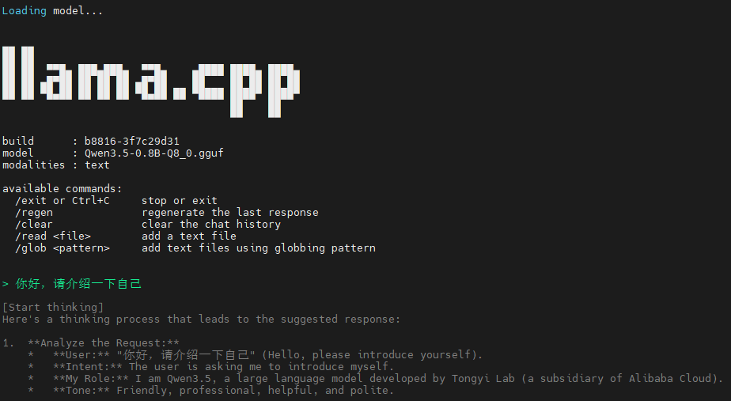

# llama.cpp 运行在OpenHarmony small系统的开发指南

本文档介绍如何编译能够在Hi3403V100芯片的HiSpark Aifly开发板运行系统时兼容的llama.cpp应用，它将用于在设备上运行大语言模型推理。

## 1. 下载代码

注：当前只测试了这个版本，其它版本的步骤可能会有一些不同，请自行适配。

```bash
git clone https://gitcode.com/GitHub_Trending/ll/llama.cpp.git -b b8816
```

## 2. 准备工具链配置文件

> **前置条件**：需要确保**已经编译过hispark_aifly**，下面的步骤中会用到其中`sysroot`目录下的文件。

在 llama.cpp 源码根目录创建 `ohos.toolchain.cmake` 文件：

```cmake
# ohos.toolchain.cmake

# 1. 基础系统信息
set(CMAKE_SYSTEM_NAME Linux)
set(CMAKE_SYSTEM_PROCESSOR aarch64)

# 2. 定义 SDK 根目录 (根据实际路径来修改)
set(OHOS_SDK_ROOT "/data/oh5.1.0-3403")

# 3.指定编译器(OpenHarmony 预置的 Clang)
set(CMAKE_C_COMPILER   ${OHOS_SDK_ROOT}/prebuilts/clang/ohos/linux-x86_64/llvm/bin/aarch64-unknown-linux-ohos-clang)
set(CMAKE_CXX_COMPILER ${OHOS_SDK_ROOT}/prebuilts/clang/ohos/linux-x86_64/llvm/bin/aarch64-unknown-linux-ohos-clang++)

# 4. 指定 Sysroot (这是 musl libc 所在的位置)
set(CMAKE_SYSROOT ${OHOS_SDK_ROOT}/out/hispark_aifly/ipcamera_hispark_aifly_linux/sysroot)

# 5. 核心编译标志
set(CMAKE_C_FLAGS "${CMAKE_C_FLAGS} -target aarch64-unknown-linux-ohos -D__MUSL__")
set(CMAKE_CXX_FLAGS "${CMAKE_CXX_FLAGS} -target aarch64-unknown-linux-ohos -D__MUSL__")

# 6. 搜索路径配置 (确保只在 sysroot 里找库，防止污染)
set(CMAKE_FIND_ROOT_PATH ${CMAKE_SYSROOT})
set(CMAKE_FIND_ROOT_PATH_MODE_PROGRAM NEVER)
set(CMAKE_FIND_ROOT_PATH_MODE_LIBRARY ONLY)
set(CMAKE_FIND_ROOT_PATH_MODE_INCLUDE ONLY)
set(CMAKE_FIND_ROOT_PATH_MODE_PACKAGE ONLY)
```

## 3. 编译步骤

```bash
cd /data/packages/origin/llama.cpp

# 创建构建目录
mkdir -p build_ohos && cd build_ohos

# 配置项目
cmake .. \
  -DCMAKE_TOOLCHAIN_FILE=../ohos.toolchain.cmake \
  -DCMAKE_BUILD_TYPE=Release \
  -DLLAMA_CUBLAS=OFF \
  -DLLAMA_VULKAN=OFF \
  -DLLAMA_METAL=OFF \
  -DLLAMA_OPENMP=OFF \
  -DBUILD_SHARED_LIBS=OFF

# 开始编译
make -j$(nproc)
```

## 4. 编译产物说明

编译完成后，所有产物位于 `build_ohos/` 目录下。

### 4.1 静态库文件
位于 `build_ohos/` 各子目录中：
- `ggml/src/libggml.a` - GGML主库
- `ggml/src/libggml-base.a` - GGML基础库
- `ggml/src/libggml-cpu.a` - GGML CPU后端库
- `src/libllama.a` - llama主库

### 4.2 可执行工具
编译成功后，以下工具将生成在 `build_ohos/bin/` 目录：

**主要工具：**
- `llama-cli` (11MB) - 命令行推理工具，用于与模型交互
- `llama-server` (18MB) - HTTP服务器，提供OpenAI兼容的API接口

**辅助工具：**
- `llama-bench` (5.6MB) - 性能基准测试工具

### 4.3 示例程序
在 `build_ohos/bin/` 目录下：
- `llama-simple` (3.9MB) - 最简单的推理示例
- `llama-simple-chat` (3.9MB) - 简单的对话示例

## 5. 获取模型

llama.cpp 需要GGUF格式的模型文件，可以通过以下方式获取：

1. **直接下载GGUF模型**：从 Hugging Face 下载已转换的GGUF模型
   - 搜索关键词：`gguf` 或访问 https://huggingface.co/models?library=gguf

2. **转换现有模型**：在电脑上拉取llamacpp源码，然后使用llama.cpp提供的转换脚本处理，示例如下：
   ```bash
   # 将HuggingFace模型转换为GGUF格式
   pip install -r requirements.txt
   python3 convert_hf_to_gguf.py /models/Qwen3-30B-A3B
   ```

## 6. 部署到开发板

按照下面的步骤将可执行文件部署到hispark_aifly开发板：

### 6.1 需要部署的文件
```bash
# 主要工具（根据需要选择）
build_ohos/bin/llama-cli        # 命令行推理工具
build_ohos/bin/llama-server     # HTTP服务器

# 示例程序（可选）
build_ohos/bin/llama-simple
build_ohos/bin/llama-simple-chat

# 依赖库
{OHOS_SDK_ROOT}/prebuilts/clang/ohos/ohos-arm64/llvm/lib/aarch64-linux-ohos/libomp.so
```

### 6.2 部署方式
可以通过以下方式将文件传输到开发板：
- 通过HDC推送到设备
- 通过网络传输
- 通过U盘等设备传输
- 打包到系统镜像中

### 6.3 部署示例
1. 需要先在pc端通过`nfs-kernel-server`工具创建共享文件夹。
    ```bash
	# 安装nfs服务
	sudo apt install nfs-kernel-server -y

	# 配置共享目录
	sudo vim /etc/exports
	# 写入以下内容
	/share *(rw,sync,no_root_squash,no_subtree_check,insecure)

	# 重启nfs服务
	sudo exportfs -arv
	sudo systemctl restart nfs-server
    ```

2. 把要共享的内容放到共享目录后，就可以切换到开发板的环境中了。
    ```bash
    mkdir /share
    mount -t nfs -o nolock,addr=192.168.31.100 192.168.31.100:/share /share
    ls /share
    llama-cli libomp.so Qwen3.5-0.8B-Q8_0.gguf

    cp /share/libomp.so /lib64
    ./llama-cli -m /share/Qwen3.5-0.8B-Q8_0.gguf -c 256 -t 4 -p "你好，请介绍一下自己"
    ```
3. 效果如下：
    

## 7. 注意事项

1. **交叉编译环境**：确保使用OpenHarmony提供的工具链，不要使用系统默认的gcc/clang
2. **Sysroot路径**：根据实际鸿蒙SDK路径修改 `OHOS_SDK_ROOT`
3. **静态链接**：建议使用静态链接(`BUILD_SHARED_LIBS=OFF`)，避免运行时库依赖问题
4. **模型格式**：llama.cpp使用GGUF格式模型，需要使用转换工具将HuggingFace模型转换为GGUF格式

## 8. 性能优化建议

1. **使用量化模型**：Q4_0量化可以在保持性能的同时大幅减少内存占用
2. **调整线程数**：使用 `-t N` 参数指定推理线程数，建议设置为CPU核心数
3. **批处理大小**：使用 `-b N` 调整批处理大小，可以提升吞吐量

## 9. 常见问题

### Q1: 编译时找不到sysroot目录
**A:** 确保已经编译过鸿蒙系统，并且 `OHOS_SDK_ROOT` 路径设置正确。sysroot目录通常在：
```
{OHOS_SDK_ROOT}/out/hispark_aifly/ipcamera_hispark_aifly_linux/sysroot
```

### Q2: 运行时提示"cannot execute binary file"
**A:** 这是因为编译的是aarch64架构程序，需要在hispark_aifly开发板上运行，不能在x86_64主机上直接执行。

### Q3: 推理速度慢怎么办？
**A:** 可以尝试：
- 减小上下文长度（`-c` 参数）
- 增加线程数（`-t` 参数，但不要超过CPU核心数）
- 使用更小的模型或更高量化程度
- 减小批处理大小

### Q4: 依赖缺失怎么办？
例如：

```bash
Error loading shared library libomp.so: No such file or directory (needed by ./llama-cli)
Error relocating ./llama-cli: __kmpc_global_thread_num: symbol not found
```

***A:** 当编译llamacpp时，如果源码的目录下无法搜索到这个文件，可能是在hispark_aifly鸿蒙系统源码目录下，也就是{OHOS_SDK_ROOT}目录，因为我们交叉编译的时候用到了里面的一些文件。找到之后，放到开发板的`/lib64`目录下即可。
