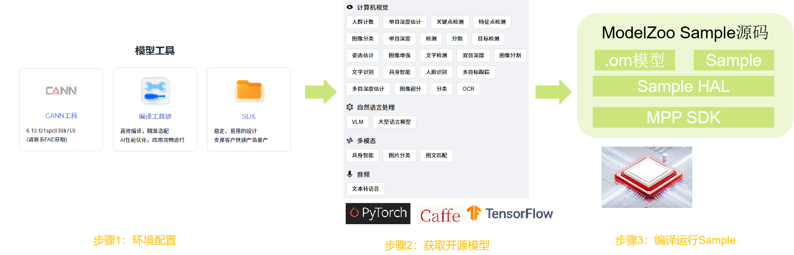

# Hi3403V100 AI模型推理概述

Hi3403V100芯片为AI推理提供了两种计算方案：**CPU推理**和**NPU推理**。CPU推理适用于轻量级模型和通用AI任务，灵活性高；NPU推理依托10TOPS神经网络加速引擎，提供强大的算力支持，适合实时性要求高的视觉AI场景。开发者可根据应用场景选择合适的推理框架。

## 推理方案总览

| 硬件平台 | 适用场景 | 框架/工具 | 算力支持 | 特点 |
|---------|---------|----------|---------|------|
| CPU | 大语言模型、轻量级AI任务 | llamacpp、MindSporeLite | 四核A55@1.4GHz | 灵活性高、易于部署、模型兼容性好 |
| NPU | 实时视觉AI、目标检测 | ModelZoo + SVP NPU | 10TOPS INT8 | 高性能、低功耗、实时性强 |

### AI推理软件架构图

```
┌────────────────────────────────────────────────────┐
│                  应用层 (Application)               │
│           AI推理应用 (对话/分类/检测等)              │
├────────────────────────────────────────────────────┤
│               推理框架层 (Inference Framework)      │
│  ┌──────────────┐  ┌──────────────┐  ┌───────────┐ │
│  │  llamacpp    │  │ MindSporeLite│  │  SVP SDK  │ │
│  │  Runtime     │  │   Runtime    │  │  (NPU)    │ │
│  └──────────────┘  └──────────────┘  └───────────┘ │
├────────────────────────────────────────────────────┤
│                计算引擎层 (Compute Engine)          │
│  ┌────────────────────────┐  ┌─────────────────┐   │
│  │    CPU (四核A55)       │  │   NPU (10TOPS)   │  │
│  │    GGML计算库          │  │   NNIE引擎        │ │
│  │    MindSpore算子       │  │   Vision Q6 DSP  │  │
│  └────────────────────────┘  └──────────────────┘  │
├────────────────────────────────────────────────────┤
│                 驱动层 (Driver Layer)               │
│  ┌────────────────────────┐  ┌──────────────────┐  │
│  │    OSAL/CPU驱动        │  │   SVP NPU驱动    │   │
│  └────────────────────────┘  └──────────────────┘   │
├─────────────────────────────────────────────────────┤
│                 硬件层 (Hardware)                    │
│    Hi3403V100 SoC (A55 CPU + NPU + DSP)             │
└─────────────────────────────────────────────────────┘
```

## CPU推理

Hi3403V100搭载四核ARM Cortex-A55处理器（主频1.4GHz），可运行多种CPU推理框架：

### 1. MindSpore Lite

MindSpore Lite是华为开源的轻量级AI推理框架，专为端侧设备优化。在HarmonyOS中是系统内置的轻量化AI引擎，面向全场景构建支持多处理器架构的开放AI架构，支持业界通用的CPU、NPU硬件设备。

**使用场景**：
- 图像分类（Image Classification）
- 目标检测（Object Detection）
- 图像分割（Image Segmentation）
- 语音识别（ASR）

**技术特点**：
- **更优性能**：高效内核算法和汇编级优化，支持CPU、NPU高性能推理
- **轻量化**：超轻量解决方案，支持模型量化压缩，模型更小跑得更快
- **全场景支持**：支持多种操作系统和嵌入式系统，适配多种智能设备
- **高效部署**：支持MindSpore/TFLite/Caffe/ONNX模型转换，提供.ms格式模型
- 提供benchmark性能测试工具和可视化工具

### 2. llamacpp

llamacpp是开源的大语言模型推理框架，支持多种LLM架构的量化推理。

**适用场景**：
- 大语言模型推理（Qwen、LLaMA等）
- 文本生成
- 对话交互

**技术特点**：
- 支持GGUF格式量化模型
- 提供HTTP API服务（OpenAI兼容）
- 多线程推理优化
- 支持从0.5B到30B+的多种模型规模

### 3. CPU推理流程

```
PC端                         开发板
  │                            │
  │ 1. 获取模型文件             │
  │    （.ms/.gguf）           │
  ├────────────────────────────┤
  │                            │
  │ 2. 编译推理框架             │
  │    （交叉编译）             │
  ├────────────────────────────┤
  │                            │
  │ 3. 部署可执行文件           │
  │    + 模型文件               │
  ├───────────────────────────>│
  │                            │ 4. 加载模型
  │                            │    （.ms/.gguf）
  │                            ├─────────────┤
  │                            │
  │                            │ 5. CPU推理
  │                            │    （A55算子）
  │                            ├─────────────┤
  │                            │
  │                            │ 6. 输出结果
  │                            ├─────────────┤
  │                            │
```

## NPU推理

Hi3403V100内置10TOPS INT8神经网络加速引擎，通过SVP（Smart Vision Platform）提供硬件加速支持：

### ModelZoo NPU推理

ModelZoo是一个集合各类开源AI模型并提供一站式开发评测工具的平台，包含80+成熟AI视觉算法模型，已针对Hi3403V100 NPU进行优化。

#### 开源模型实践流程



#### NPU推理流程

```
PC端                         开发板
  │                            │
  │ 1. 获取OM模型               │
  │    （下载或自行转换）        │
  ├────────────────────────────┤
  │                            │
  │ 2. 编译代码                 │
  │    （交叉编译应用）          │
  ├────────────────────────────┤
  │                            │
  │ 3. 部署到开发板             │
  │      OM模型文件             │
  ├───────────────────────────>│
  │                            │ 4. 运行推理
  │                            │    （加载.om模型）
  │                            ├─────────────┤
  │                            │
  │                            │ 5. 输出结果
  │                            ├─────────────┤
  │                            │
```

## 选择建议

根据应用场景选择合适的推理方案：

| 应用需求 | 推荐方案 | 理由 |
|---------|---------|------|
| 大语言模型对话 | llamacpp (CPU) | GGUF量化支持、内存占用低、文本生成能力强 |
| 通用图像分类 | MindSporeLite (CPU) | 轻量级、部署简单、模型兼容性好 |
| 实时目标检测 | ModelZoo (NPU) | 10TOPS算力、实时性强、多路视频支持 |
| 低功耗场景 | NPU推理 | 硬件加速效率高、功耗低 |
| 快速原型验证 | CPU推理 | 易于部署、调试方便、无需模型转换 |

## 相关文档

详细开发指南请参考：

- [llamacpp开发指南](./porting-smallchip-ai-CPU-llamacpp.md) - 大语言模型CPU推理框架编译和部署
- [MindSporeLite开发指南](./porting-smallchip-ai-CPU-MindSporeLite.md) - 轻量级AI推理框架编译和部署
- [ModelZoo NPU推理案例](./porting-smallchip-ai-NPU-ModelZoo.md) - NPU硬件加速推理案例开发指导