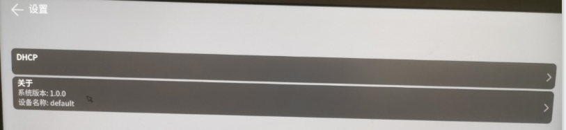
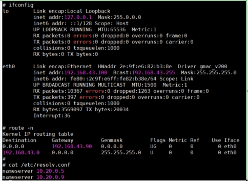

# OpenHarmony DHCP 服务技术文档

## 1. 概述

DHCP客户端是OpenHarmony系统中负责向DHCP服务器请求IP地址和网络配置信息的组件。DHCP客户端实现了完整的DHCP协议栈，支持IPv4和IPv6地址自动配置，能够自动获取IP地址、子网掩码、网关、DNS等网络参数。


## 2 约束与限制

- **轻量化**：支持小型系统

## 3 DHCP客户端公开接口 (IDhcpClient)

### 3.1 DHCP服务的主要代码位于以下目录：

| 组件 | 路径 | 说明 |
|------|------|------|
| 服务器端 | `foundation/communication/dhcp/services/dhcp_server/` | DHCP服务器实现 |
| 客户端 | `foundation/communication/dhcp/services/dhcp_client/` | DHCP客户端实现 |
| 公共组件 | `foundation/communication/dhcp/services/utils/` | 公共工具函数 |
| 框架接口 | `foundation/communication/dhcp/frameworks/` | 框架层接口定义 |

### 3.2 接口说明

| 接口名称 | 功能描述 | 参数 | 返回值 |
|---------|---------|------|--------|
| `RegisterDhcpClientCallBack` | 注册DHCP客户端状态变化的回调函数 | ifname: 网络接口名称<br>callback: 回调对象 | ErrCode |
| `StartDhcpClient` | 启动指定接口的DHCP客户端 | config: 路由器配置对象 | ErrCode |
| `StopDhcpClient` | 停止指定接口的DHCP客户端 | ifname: 网络接口名称<br>bIpv6: 是否为IPv6 | ErrCode |
| `DealWifiDhcpCache` | 处理WiFi网络的DHCP缓存信息 | cmd: 命令类型<br>ipCacheInfo: IP缓存信息 | ErrCode|

### 3.3 数据结构定义

#### 3.3.1 DhcpRange 结构

| 字段名 | 类型 | 说明 |
|--------|------|------|
| `ifname` | string | 网络接口名称 |
| `bssid` | string | BSSID地址 |
| `prohibitUseCacheIp` | bool | 是否禁止使用缓存IP |
| `bIpv6` | bool | 是否启用IPv6 |
| `bSpecificNetwork` | bool | 是否为特定网络 |

#### 3.3.2 IpCacheInfo 结构

| 字段名 | 类型 | 说明 |
|--------|------|------|
| `ssid` | string | SSID名称 |
| `bssid` | string | BSSID地址 |

#### 3.3.3 ErrCode错误码定义

| 错误码 | 值 | 说明 |
|--------|-----|------|
| `DHCP_E_SUCCESS` | 0 | 成功 |
| `DHCP_E_FAILED` | -1 | 失败 |
| `DHCP_E_INVALID_PARAM` | -2 | 无效参数 |
| `DHCP_E_NON_SYSTEMAPP` | -3 | 非系统应用 |
| `DHCP_E_PERMISSION_DENIED` | -4 | 无权限 |
| `DHCP_E_INVALID_CONFIG` | -4 | 非法配置 |
| `DHCP_E_UNKNOWN` | -4 | 未知错误 |

### 3.4 DHCP客户端使用示例
```cpp

static ClientCallBack g_callback = {
    OnIpSuccessChanged,
    OnIpFailChanged,
};

// 1. 注册客户端回调函数
int ret = RegisterDhcpClientCallBack("eth0", &g_callback);
if (ret == DHCP_SUCCESS) {
    RouterConfig config = {0};
    strcpy(config.ifname, "eth0");
    // 2. 启动DHCP客户端
    StartDhcpClient(config);
}
// 3. 停止DHCP客户端
StopDhcpClient("eth0", false);

```
### 4 DHCP 服务启动配置
```json
打开./vendor/hisilicon/hispark_aifly_linux/init_configs/init_linux_openharmony.cfg配置如下

{
    "jobs" : [{
            "name" : "pre-init",
            "cmds" : []
        }, {
            "name" : "init",
            "cmds" : [
                "start dhcp_client_mgr"  // 启动dhcp_client_mgr服务
            ]
        }, {
            "name" : "post-init",
            "cmds" : []
        }
    ],
    "services" : [{
            "name" : "udhcpc_client",
            "path" : ["/bin/busybox", "udhcpc", "-i", "eth0", "-s", "/etc/udhcpc.script"],
            "uid" : 0,
            "gid" : 0,
            "once" : 0,
            "importance" : 0,
            "caps" : [1, 17, 21, 23]
        }, {
            "name" : "dhcp_client_mgr",  // 添加dhcp_client_mgr服务
            "path" : ["/bin/dhcp_client_mgr"],
            "uid" : 0,
            "gid" : 0,
            "once" : 0,
            "importance" : 0,
            "caps" : [1, 17, 21, 23]
        }
    ]
}

```

### 5 DHCP 应用操作步骤

**图 1**  DHCP 步骤1<a name="fig01"></a>


**图 2**  DHCP 步骤2<a name="fig02"></a>


**图 3**  DHCP 验证<a name="fig03"></a>



### 6 注意事项
**权限要求**：使用DHCP服务需要`ohos.permission.NETWORK_DHCP`权限

