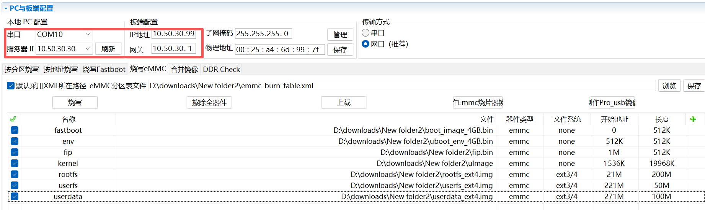
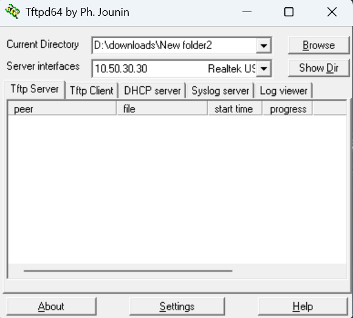
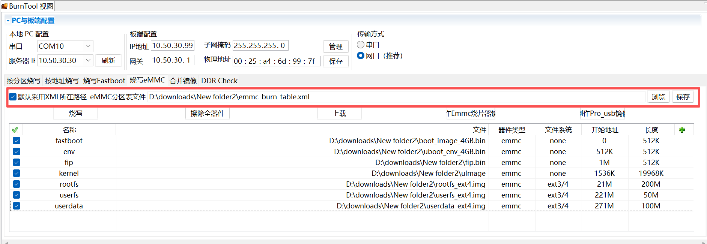
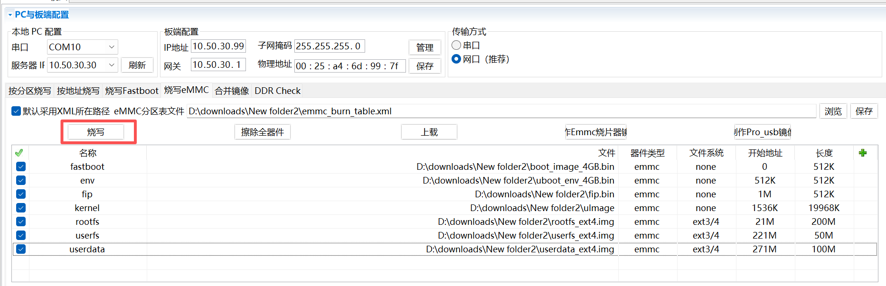

# OpenHarmony U-Boot服务技术文档

## 1. 概述

U-Boot（Universal Boot Loader）是一款开源、跨平台、功能强大的嵌入式系统引导程序，广泛应用于 ARM、RISC-V、MIPS 等各类嵌入式芯片平台，是嵌入式 Linux、OpenHarmony 等操作系统启动流程中必备的底层引导固件，也是海思 HiSpark 系列开发板标准启动引导组件。

## 2 约束与限制

- **轻量化**：适用于资源受限的小型系统

## 3 修改说明

Hi3403V100采用ARMv8-A 64位架构，与Hi3516DV300的ARMv8-A 32位架构存在差异。ARMv8-A 64位架构编译需启用安全编译配置，集成Trusted Firmware-A(ATF)引导加载程序，依赖ATF开源项目。
由于该开源项目未集成至HarmonyOS中，修改方案如下：
1. 将ATF项目集成至device_soc_hisilicon_hispark_aifly仓库的hi3403v100/uboot/目录下，增加包含ATF的fip.bin文件。 
2. fip.bin与uImage划分独立分区进行烧写。
3. 为了适配fip.bin与uImage划分独立分区进行烧写，需要修改bootargs、emmc_burn_table.xml、uboot_env_4GB.bin及boot_image_4GB.bin文件。

## 4 修改接口

### 4.1 修改代码代码位于以下目录：

| 路径 | 说明 |
|------|------|
| `u-boot-2020.01/common/load_fip.c` | uboot加载fip |

### 4.2 修改接口说明

| 接口名称 | 功能描述 | 参数 | 返回值 |
|---------|---------|------|--------|
| `load_fip` | 加载fip | buff: fip地址 | ErrCode |
| `create_entry_bl31_info` | 创建BL31的入口点 | bl31_pc: BL31的入口地址 | ErrCode |
| `create_entry_bl33_info` | 创建BL33的入口点 | bl33_ep: BL33的入口地址 | ErrCode |

### 4.3 数据结构定义

#### 4.3.1 entry_point_info 结构

| 字段名 | 类型 | 说明 |
|--------|------|------|
| `h` | param_header_t | 参数头 |
| `pc` | uint64_t | pc寄存器 |
| `spsr` | uint32_t | spsr寄存器 |
| `args` | aapcs64_params_t | 参数 |

#### 4.3.2 param_header_t 结构

| 字段名 | 类型 | 说明 |
|--------|------|------|
| `type` | uint8_t | 结构体类型 |
| `version` | uint8_t | 结构体版本 |
| `size` | uint16_t | 结构体大小 |
| `attr` | uint32_t | 属性 |

### 5 U-boot烧写EMMC操作步骤

**图 1**  U-Boot烧写EMMC步骤1 

**图 2**  U-Boot烧写EMMC步骤2 

**图 3**  U-Boot烧写EMMC步骤3 

**图 4**  U-Boot烧写EMMC步骤4 

