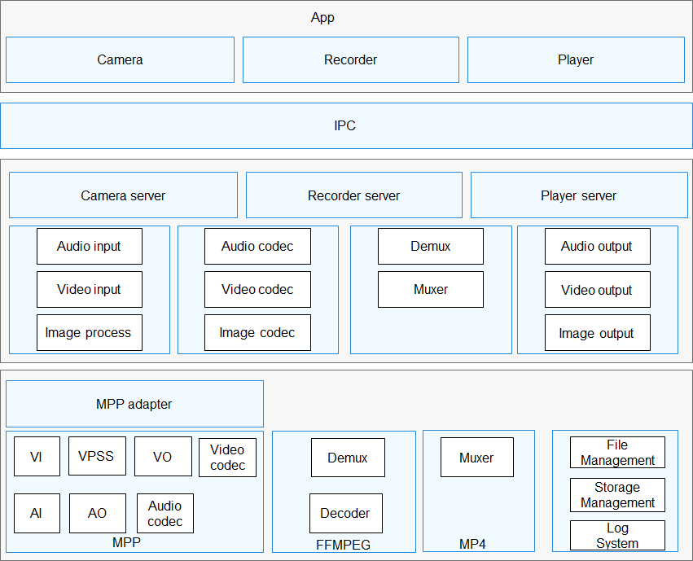

# Hi3516dv300介绍<a name="ZH-CN_TOPIC_0000001142448981"></a>

-   [简介](#section11660541593)
-   [目录](#section161941989596)
-   [约束](#section119744591305)
-   [编译构建](#section137768191623)
-   [协议说明](#section1312121216216)
    -   [许可说明](#section129654513264)

-   [相关仓](#section1371113476307)

## 简介<a name="section11660541593"></a>

本目录为hi3516dv300芯片的底层处理驱动，为“媒体/图形子系统”提供基础的多媒体处理功能。主要功能有：音视频采集、音视频编解码、音视频输出、视频前处理、封装、解封装、文件管理、存储管理、日志系统等。如图1所示。

**图 1**  多媒体子系统架构图<a name="fig4460722185514"></a>  




## 目录<a name="section161941989596"></a>

```
/device/soc/hisilicon/hi3516dv300
├── sdk_linux
│   ├── drv
│   │   ├── interdrv    # 外设模块
│   │   │   ├── common
│   │   │   │   ├── cipher    # 加解密模块
│   │   │   │   ├── hi_adc    # adc总线控制器
│   │   │   │   ├── hi_ir     # 红外控制器
│   │   │   │   ├── hi_irq    # 用户态驱动中断注册管理模块
│   │   │   │   ├── hi_proc   # 调试信息管理模块
│   │   │   │   └── wtdg      # 看门狗
│   │   │   └── hi3516cv500
│   │   │       ├── mipi_rx   # mipi协议rx方向
│   │   │       ├── mipi_tx   # mipi协议tx方向
│   │   │       └── sysconfig  # 系统管脚配置相关配置
│   │   ├── mpp
│   │   │   ├── cbb
│   │   │   │   ├── based # 日志相关功能
│   │   │   │   ├── sysd  # 系统基础模块，提供内存、模块绑定等功能
│   │   │   │   └── vo    # video output
│   │   │   └── component
│   │   │       ├── hdmi  # HDMI接口输出
│   │   │       ├── hifb  # frame buffer管理
│   │   │       └── tde   # Two Dimensional Engine
│   │   └── osal             # 驱动适配层，用于屏蔽系统差异，提供统一接口
│   ├── out
│   │   ├── ko              # Hi3516DV300芯片的内核模块加载脚本
│   │   └── lib             # Hi3516DV300芯片的媒体图形库文件、LICENSE文件
│   └── usr
│       └── sensor            # sensor驱动（用户态）
├── sdk_liteos
│   ├── hdf_config            # Hi3516DV300设备hdf驱动配置信息
│   └── mpp
│       ├── lib               # Hi3516DV300芯片的媒体库文件、LICENSE文件
│       └── module_init       # Hi3516DV300芯片媒体各模块驱动对应的库、LICENSE文件
└── uboot                     # uboot二进制

```

## 约束<a name="section119744591305"></a>

当前支持Hi3516DV300芯片。

## 编译构建<a name="section137768191623"></a>

standard linux：
./build.sh --product-name Hi3516DV300

small/mini：
hb set
. (当前路径)
ipcamera_hispark_taurus_linux/ipcamera_hispark_taurus
hb build -f

## hi3516dv300协议说明<a name="section1312121216216"></a>

-   hi3516dv300\\sdk\_linux\\out\\lib里面为上海海思的自研库，遵循上海海思的LICENSE，这个目录下有LICENSE文件，LICENSE文件中可以看到版权信息：

    ```
    / *End User License Agreement ...  Copyright (C) 2021 Hisilicon (Shanghai) Technologies Co., Ltd. All rights reserved. * /
    ```

-   hi3516dv300\\sdk\_linux\\drv目录下为上海海思自研代码，使用基于GPL许可的Hisilicon \(Shanghai\) 版权声明，在该目录下有License目录，许可信息和版权信息通常可以在文件开头看到：

    ```
     / *Copyright (c) 2021 HiSilicon (Shanghai) Technologies CO., LIMITED. 
       *
       * This program is free software; you can redistribute  it and/or modify it
       * under  the terms of  the GNU General  Public License as published by the
       * Free Software Foundation;  either version 2 of the  License, or (at your
       * option) any later version.
       * ... * /
    ```

-   hi3516dv300\\sdk\_liteos\\mpp\\module\_init\\lib和device\\soc\\hisilicon\\hi3516dv300\\sdk\_liteos\\mpp\\lib里面为上海海思的自研库，遵循上海海思的LICENSE，这两个目录下均有LICENSE文件，LICENSE文件结尾可以看到版权信息：

    ```
    Copyright (C) 2020 Hisilicon (Shanghai) Technologies Co., Ltd. All rights reserved.
    ```

-   hi3516dv300\\sdk\_liteos\\mpp\\module\_init\\src目录下为上海海思自研代码，使用基于Apache License Version 2.0许可的Hisilicon \(Shanghai\) 版权声明，在该目录下有Apache License Version 2.0的LICENSE文件，许可信息和版权信息通常可以在文件开头看到：

    ```
     / *Copyright (c) 2020 HiSilicon (Shanghai) Technologies CO., LIMITED. Licensed under the Apache License,* ... * / 
    ```

### 许可说明<a name="section129654513264"></a>


third\_party\\uboot\\u-boot-2020.01为U-Boot开源代码，遵循软件版本自带的开源许可声明，具体请参看third\_party\\uboot\\u-boot-2020.01\\Licenses目录下的README。

## 相关仓<a name="section1371113476307"></a>

[vendor_hisilicon](https://gitee.com/openharmony/vendor_hisilicon)

[device_board_hisilicon](https://gitee.com/openharmony/device_board_hisilicon)

