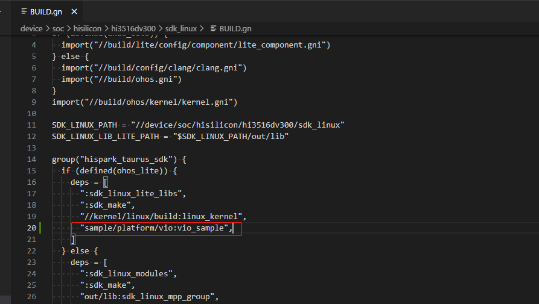

# vio sample操作指导

## 1. 概述

vio  sample是海思Hi3516DV300的SDK sample，本文以Taurus套件为例，vio sample详细介绍Sensor通过HDMI在显示屏的整个视频通路实现方式，从编码的角度引导开发者跑通Hi3516DV300的媒体通路，并将视频流通过HDMI显示到显示屏上。

## 2. 目录

```shell
//device/soc/hisilicon/hi3516dv300/sdk_linux/sample/platform/vio
├── BUILD.gn                # 编译ohos vio sample需要的gn文件
├── sample_vio_main.c       # ohos vio sample主函数入口
├── sample_vio.h            # ohos vio sample所需的头文件
└── smp
    └── sample_vio.c        # ohos vio sample业务代码
```

## 3.代码修改

由于我的显示器是只支持1080P60帧，所以需要修改device/soc/hisilicon/hi3516dv300/sdk_linux/sample/platform/common/目录下的sample_comm_vo.c的**SAMPLE_COMM_VO_GetDefConfig()**函数中的VO 输出配置，这个请根据自己的显示器支持的参数进行配置。

```c++
pstVoConfig->enIntfSync = VO_OUTPUT_1080P60; // 第483行的VO_OUTPUT_1080P30; 改成 VO_OUTPUT_1080P60;
```


## 4. 编译

在编译vio sample之前，需确保OpenHarmony 小型系统的主干代码已经整编通过，**且已经按照《[修改源码及配置文件适配Taurus开发板](../../taurus/doc/2.2.1.%E4%BF%AE%E6%94%B9%E6%BA%90%E7%A0%81%E5%8F%8A%E9%85%8D%E7%BD%AE%E6%96%87%E4%BB%B6%E9%80%82%E9%85%8DTaurus%E5%BC%80%E5%8F%91%E6%9D%BF.md)》的内容进行修改**。在单编vio sample之前，需修改目录下的一处依赖，进入//device/soc/hisilicon/hi3516dv300/sdk_linux目录下，通过修改BUILD.gn，在deps下面新增target，``"sample/platform/vio:vio_sample"``，如下图所示：



* 编译成功后，如下图所示：


* 编译成功后，即可在out/hispark_taurus/ipcamera_hispark_taurus_linux/rootfs/bin目录下，生成 ohos_vio_demo可执行文件，如下图所示：


## 5. 拷贝可执行程序和依赖文件至开发板的mnt目录下

**方式一：使用SD卡进行资料文件的拷贝**

* 首先需要自己准备一张SD卡
* 步骤1：将编译后生成的可执行文件拷贝到SD卡中。

* 步骤2：将device\soc\hisilicon\hi3516dv300\sdk_linux\out\lib\目录下的**libvb_server.so和 libmpp_vbs.so**拷贝至SD卡中


* 步骤3：可执行文件拷贝成功后，将内存卡插入开发板的SD卡槽中，可通过挂载的方式挂载到板端，可选择SD卡 mount指令进行挂载。

```shell
mount -t vfat /dev/mmcblk1p1 /mnt
# 其中/dev/mmcblk1p1需要根据实际块设备号修改
```

* 挂载成功后，如下图所示：


**方式二：使用NFS挂载的方式进行资料文件的拷贝**

* 首先需要自己准备一根网线
* 步骤1：参考[博客链接](https://blog.csdn.net/Wu_GuiMing/article/details/115872995?spm=1001.2014.3001.5501)中的内容，进行nfs的环境搭建

* 步骤2：将编译后生成的可执行文件拷贝到Windows的nfs共享路径下

* 步骤3：将device\soc\hisilicon\hi3516dv300\sdk_linux\out\lib\目录下的**libvb_server.so和 libmpp_vbs.so**拷贝至Windows的nfs共享路径下


* 步骤4：执行下面的命令，将Windows的nfs共享路径挂载至开发板的mnt目录下

```
mount -o nolock,addr=192.168.200.1 -t nfs 192.168.200.1:/d/nfs /mnt
```

## 6.拷贝mnt目录下的文件至正确的目录下

* 执行下面的命令，拷贝mnt目录下面的ohos_vio_demo至根目录，拷贝mnt目录下面的libvb_server.so和 libmpp_vbs.so至/usr/lib/目录下

```
cp /mnt/ohos_vio_demo  /userdata
cp /mnt/*.so /usr/lib/
```


* 执行下面的命令，给ohos_vio_demo文件可执行权限

```
chmod 777 /userdata/ohos_vio_demo
```

## 7. 功能验证

* 上述步骤完成后，需要将mini HDMI线一端接口Tauru套件的HDMI口（mini HDMI线需要开发者自行购买），另一端接显示器，接下来执行下面的命令，启动可执行文件

```
cd /userdata

./ohos_vio_demo 0
```


* 此时，通过HDMI在显示屏幕上即可出现实时码流，如下图所示：


* 敲两下回车即可关闭程序


