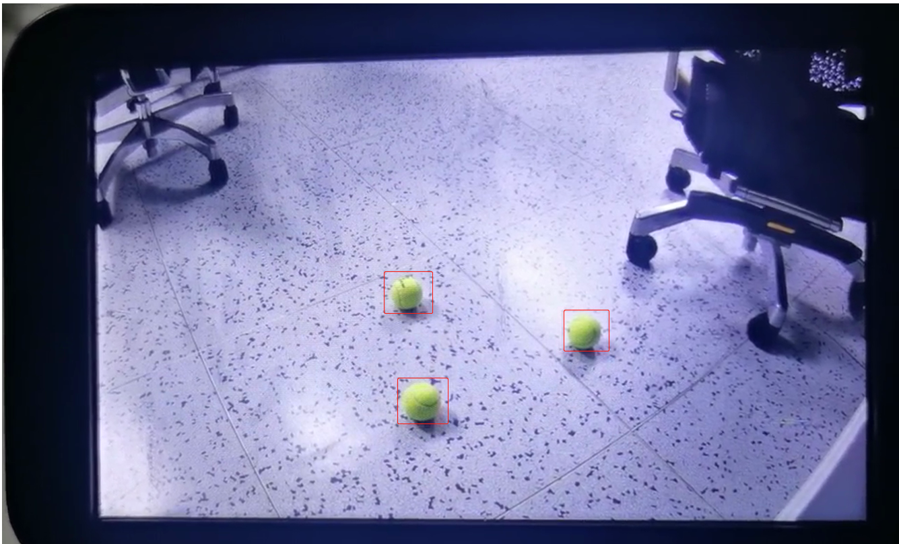

# 5.4、网球检测实验功能验证

* 步骤1：在SD卡或Windows的nfs共享目录下，创建一个**sample_ai.conf**的文件，然后把下面的内容拷贝到此文件中

```cobol
; ai sample configuration file

[audio_player]
support_audio = false ; 垃圾识别语音播放

[ai_function]
support_ai = true ; 是否支持AI

[trash_classify_switch]
support_trash_classify = false ; 是否支持垃圾分类功能

[hand_classify_switch]
support_hand_classify = false ; 是否手势检测识别功能

[tennis_detect_switch]
support_tennis_detect = true ; 是否支持网球检测功能
```


* 步骤2：再通过下面的挂载命令，把SD卡或者Windows的nfs共享目录挂载到开发板上

  * 方式1：SD卡

  ```
  mount -t vfat /dev/mmcblk1p1 /mnt
  # 其中/dev/mmcblk1p1需要根据实际块设备号修改
  ```

  * 方式2：Windows的nfs共享目录

    ```
    mount -o nolock,addr=192.168.200.1 -t nfs 192.168.200.1:/d/nfs /mnt
    ```

* 步骤3：将/mnt目录下的sample_ai.conf文件复制到userdata目录下。

```
cp /mnt/sample_ai.conf  /userdata
```


* 步骤4：执行下面的命令：进入/ko目录，加载mipi_tx驱动。

```
cd /ko
insmod hi_mipi_tx.ko
```


* 步骤5：执行下面的命令，把userdata/lib 加到环境变量里面

```
export LD_LIBRARY_PATH=$LD_LIBRARY_PATH:/userdata/lib
```


* 步骤6：执行下面的命令，进行网球检测sample的验证

```
cd  /userdata
./ohos_camera_ai_demo 2
```


* 具体的现象如下图所示



* 敲两下回车即可关闭程序


