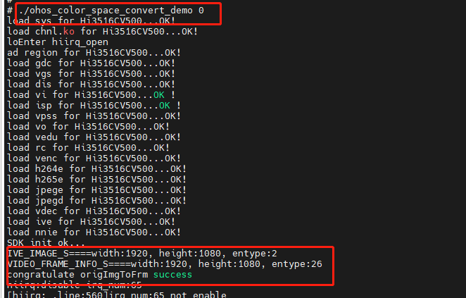
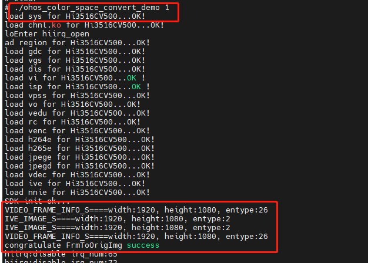
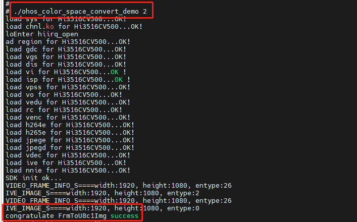
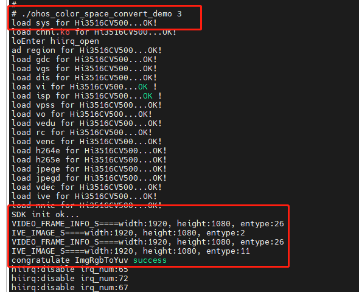
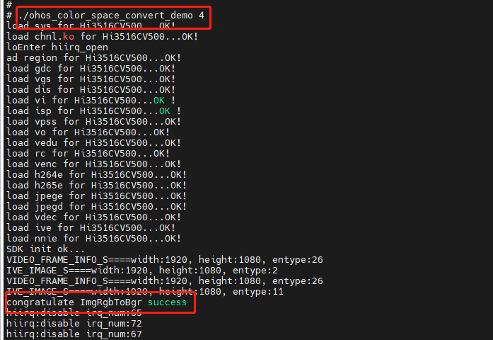

# color_space_convert sample操作指导

## 1. 概述

color_space_convert  sample基于OpenHarmony 小型系统开发，以Taurus套件为例，color_space_convert sample 介绍了常用色彩空间转换算子的具体实现过程。

## 2. 目录

```shell
//device/soc/hisilicon/hi3516dv300/sdk_linux/sample/taurus/color_space_convert
├── BUILD.gn                   				 # 编译ohos color_space_convert sample需要的gn文件
├── sample_color_space_convert_main.c        # ohos color_space_convert sample主函数入口
└── smp
    ├── smp_color_space_convert.c       	 # ohos color_space_convert sample业务代码
    └── smp_color_space_convert.h       	 # ohos color_space_convert sample业务代码所需的头文件
```

## 3. 编译

* 在编译color_space_convert  sample前，需确保OpenHarmony 小型系统的主干代码已整编通过，且**已经按照《[修改源码及配置文件适配Taurus开发板](../doc/2.2.1.%E4%BF%AE%E6%94%B9%E6%BA%90%E7%A0%81%E5%8F%8A%E9%85%8D%E7%BD%AE%E6%96%87%E4%BB%B6%E9%80%82%E9%85%8DTaurus%E5%BC%80%E5%8F%91%E6%9D%BF.md)》的内容进行修改**。
* 在单编color_space_convert  sample之前，需修改目录下的一处依赖，进入//device/soc/hisilicon/hi3516dv300/sdk_linux目录下，通过修改BUILD.gn，在deps下面新增target，``"sample/taurus/color_space_convert:hi3516dv300_color_space_convert_sample"``，如下图所示：


* 点击Deveco Device Tool工具的Build按键进行编译，具体的编译过程这里不再赘述，编译成功后，如下图所示：


* 编译成功后，即可在out/hispark_taurus/ipcamera_hispark_taurus_linux/rootfs/bin目录下，生成 ohos_color_space_convert_demo可执行文件，如下图所示：


## 4. 拷贝可执行程序和依赖文件至开发板的mnt目录下

**方式一：使用SD卡进行资料文件的拷贝**

* 首先需要自己准备一张SD卡

* 步骤1：将编译后生成的可执行文件拷贝到SD卡中。

* 步骤2：将device\soc\hisilicon\hi3516dv300\sdk_linux\out\lib\目录下的**libvb_server.so和 libmpp_vbs.so**拷贝至SD卡中
* 步骤3：将device/soc/hisilicon/hi3516dv300/sdk_linux/sample/taurus/data/目录下的 UsePic_1920_1080_420.yuv文件拷贝至SD卡中。（前提是按照《[获取sample依赖的资源文件到本地](../doc/6.2.%E8%8E%B7%E5%8F%96sample%E4%BE%9D%E8%B5%96%E7%9A%84%E8%B5%84%E6%BA%90%E6%96%87%E4%BB%B6%E5%88%B0%E6%9C%AC%E5%9C%B0.md)》文档获取了资源文件）


* 步骤4：可执行文件拷贝成功后，将内存卡插入开发板的SD卡槽中，可通过挂载的方式挂载到板端，可选择SD卡 mount指令进行挂载。

```shell
mount -t vfat /dev/mmcblk1p1 /mnt
# 其中/dev/mmcblk1p1需要根据实际块设备号修改
```

* 挂载成功后，如下图所示：


**方式二：使用NFS挂载的方式进行资料文件的拷贝**

* 首先需要自己准备一根网线
* 步骤1：参考[博客链接](https://blog.csdn.net/Wu_GuiMing/article/details/115872995?spm=1001.2014.3001.5501)中的内容，进行nfs的环境搭建

* 步骤2：将编译后生成的可执行文件拷贝到Windows的nfs共享路径下

* 步骤3：将device\soc\hisilicon\hi3516dv300\sdk_linux\out\lib\目录下的**libvb_server.so和 libmpp_vbs.so**拷贝至Windows的nfs共享路径下

* 步骤4：将device/soc/hisilicon/hi3516dv300/sdk_linux/sample/taurus/data/目录下的 UsePic_1920_1080_420.yuv文件拷贝至Windows的nfs共享路径下。（前提是按照《[获取sample依赖的资源文件到本地](../doc/6.2.%E8%8E%B7%E5%8F%96sample%E4%BE%9D%E8%B5%96%E7%9A%84%E8%B5%84%E6%BA%90%E6%96%87%E4%BB%B6%E5%88%B0%E6%9C%AC%E5%9C%B0.md)》文档获取了资源文件）


* 步骤5：依赖文件拷贝至Windows的nfs共享路径下后，执行下面的命令，将Windows的nfs共享路径挂载至开发板的mnt目录下

```
mount -o nolock,addr=192.168.200.1 -t nfs 192.168.200.1:/d/nfs /mnt
```

## 5.拷贝mnt目录下的文件至正确的目录下

* 执行下面的命令，拷贝mnt目录下面的color_space_convert_demo至/userdata目录，拷贝mnt目录下面的libvb_server.so和 libmpp_vbs.so至/usr/lib/目录下，再创建一个/userdata/data/input/color_convert_img/目录和一个/userdata/data/output/color_convert_res/目录

```
mkdir -p /userdata/data/input/color_convert_img/
mkdir -p /userdata/data/output/color_convert_res/
cp /mnt/ohos_color_space_convert_demo  /
cp /mnt/*.so /usr/lib/
cp /mnt/UsePic_1920_1080_420.yuv /userdata/data/input/color_convert_img/
```


* 执行下面的命令，给color_space_convert_demo文件可执行权限

```
chmod 777 ohos_color_space_convert_demo
```

## 6. 功能验证

### 6.1、ive image to video frame

* 执行下面的命令，即可完成ive image to video frame的转换，如下图所示：

```
./ohos_color_space_convert_demo 0
```



* 转换成功后，即可在/userdata/data/output/color_convert_res/目录下，生成complete_ive_to_video.yuv图片，如下图所示：


### 6.2、video frame to ive image

* 执行下面的命令，即可完成video frame to ive imag的转换，如下图所示：

```
./ohos_color_space_convert_demo 1
```



* 转换成功后，即可在/userdata/data/output/color_convert_res/目录下，生成complete_frm_orig_img.yuv图片，如下图所示：


### 6.3、video YUV frame to ive image (U8C1)

* 执行下面的命令，即可完成video YUV frame to ive image (U8C1)的转换，如下图所示：

  ```
  ./ohos_color_space_convert_demo 2
  ```



* 转换成功后，即可在/userdata/data/output/color_convert_res/目录下，生成complete_u8c1.yuv图片，如下图所示：


### 6.4、YUV video frame to RGB ive image - ive image RGB to YUV

* 执行下面的命令，即可完成YUV video frame to RGB ive image - ive image RGB to YUV的转换，如下图所示：

```
./ohos_color_space_convert_demo 3
```



* 转换成功后，即可在/userdata/data/output/color_convert_res/目录下，生成complete_frm_rgb_yuv.yuv图片，如下图所示：


### 6.5、YUV video frame to RGB ive image - ive image RGB to BGR

* 执行下面的命令，即可完成YUV video frame to RGB ive image - ive image RGB to BGR的转换，如下图所示：

```
./ohos_color_space_convert_demo 4
```




