### 3.1.2 VI理论及实现方式

#### 3.1.2.1  VI理论

视频输入（VI）模块实现的功能：通过 MIPI Rx(含MIPI接口、LVDS接口和HISPI接口)，SLVS-EC，BT.1120，BT.656，BT.601，DC等接口接收视频数据。VI将接收到的数据存入到指定的内存区域，在此过程中，VI可以对接收到的原始视频图像数据进行处理，实现视频数据的采集。

VI功能框图如下：

VI从软件上划分了输入设备（DEV），输入PIPE (图示为物理PIPE，虚拟PIPE只包含ISP_BE)、物理通道（PHY_CHN）、扩展通道（EXT_CHN）四个层级。Hi3516DV300的设备、PIPE、通道个数差异如下表所示：

| 芯片        | DEV  VI_MAX_ DEV_NUM | PHY_PIPE VI_MAX_PHY _PIPE_NUM | VIR_PIPE  VI_MAX_VIR _PIPE_NUM | PHY_CHN VI_MAX_PHY _CHN_NUM | EXT_CHN VI_MAX _EXT_CHN_NUM |
| ----------- | :-----------------------: | --------------------------------------- | ---------------------------------------- | ------------------------------------- | :-----------------------------------: |
| Hi3516DV300 |             2             | 4                                       | 0                                        | 1                                     |                   8                   |

Hi3516DV300视频输入通道功能如下图所示：

#### 3.1.2.2 VI实现方式

在helloworld中，VI部分实现细节如下：

##### 3.1.2.2.1 config vi

配置vi参数首先要对Sensor的参数进行配置，其中，SAMPLE_COMM_VI_GetSensorInfo接口是获取Sensor信息，该接口是对SAMPLE_VI_CONFIG_S结构体的配置， SAMPLE_VI_CONFIG_S如下图所示：

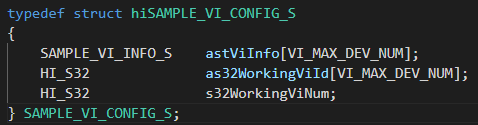

分析SAMPLE_VI_CONFIG_S结构体，核心是对SAMPLE_VI_INFO_S结构体进行配置，如下图所示：

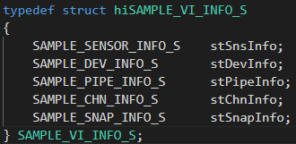

分析SAMPLE_VI_INFO_S结构体，其围绕SAMPLE_SENSOR_INFO_S、SAMPLE_DEV_INFO_S、SAMPLE_PIPE_INFO_S、SAMPLE_CHN_INFO_S、SAMPLE_SNAP_INFO_S结构体来展开，其每个结果体成员定义如下：

**SAMPLE_SENSOR_INFO_S:**

该结构体成员分别定义：SnsType、SnsId、BusId、MipiDev成员。

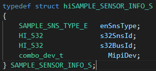

**SAMPLE_DEV_INFO_S:**

该结构体定义：ViDev、WDRMode成员。

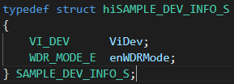

**SAMPLE_PIPE_INFO_S:**

该结构体定义：Pipe、MastPipeMode、MultiPipe、VcNumCfged、IspBypass、PixFmt、VCNum结构体成员。

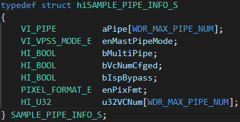

**SAMPLE_CHN_INFO_S:**

该结构体成员定义：ViChn、PixFormat、DynamicRange、VideoFormat、CompressMode成员。

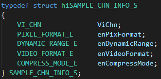

**SAMPLE_SNAP_INFO_S:**

该结构体成员定义：Snap、DoublePipe、VideoPipe、SnapPipe、VideoPipeMode、SnapPipeMode成员。

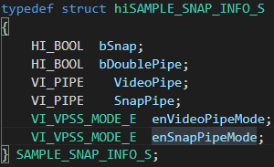

关于上述结构体列举的枚举型成员，自行查阅**源码的device/soc/hisilicon/hi3516dv300/sdk_linux/sample/platform/common/sample_comm.h**文件，该文件里面详细定义枚举型成员，这里不再详细阐述。

SAMPLE_COMM_VI_GetSensorInfo接口实现细节，如下图所示：

可参考**源码的device/soc/hisilicon/hi3516dv300/sdk_linux/sample/taurus/platform/common/中的sample_comm_vi.c文件**

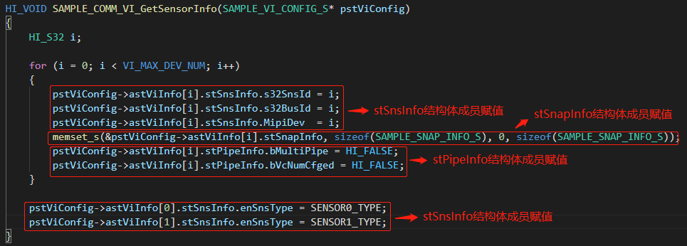

配置vi还需要配置SAMPLE_VI_CONFIG_S其他成员元素，实现细节如下：

以下截图可在device/soc/hisilicon/hi3516dv300/sdk_linux/sample/taurus/helloworld/smp/sample_lcd.c文件中找到

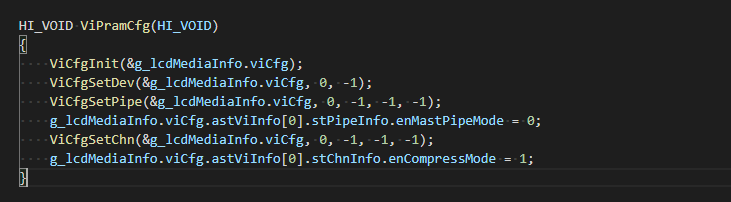

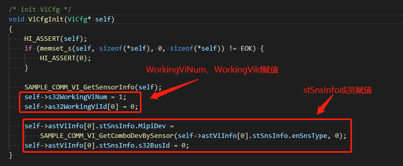

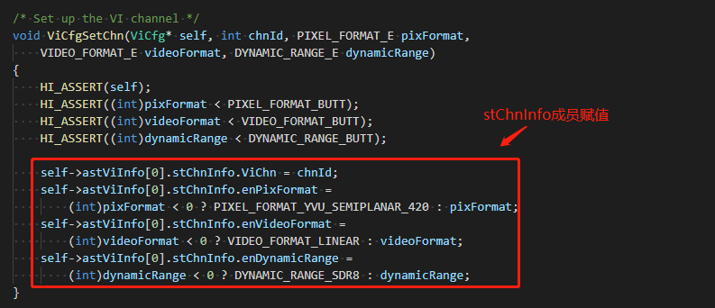

##### 3.1.2.2.2 get picture size

SAMPLE_COMM_VI_GetSizeBySensor接口通过sensor型号来获取图片的大小，通过enPicSize输出，如PIC_1080P，实现接口如下：

可参考**源码的device/soc/hisilicon/hi3516dv300/sdk_linux/sample/taurus/helloworld/smp/sample_lcd.c**中的int SampleVioVpssVoMipi(void)接口中的get picture size部分。

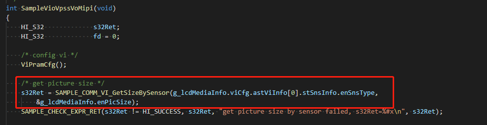

根据SAMPLE_COMM_VI_GetSizeBySensor接口输出的enPicSize来得到图片的width和height，实现方式通过SAMPLE_COMM_SYS_GetPicSize来实现，如下图所示：

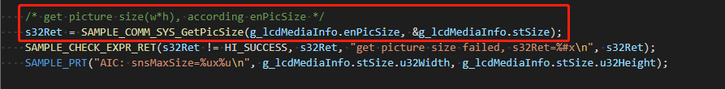

SAMPLE_COMM_VI_GetSizeBySensor和SAMPLE_COMM_SYS_GetPicSize接口实现方式较为简单，读者自行查阅**源码的device/soc/hisilicon/hi3516dv300/sdk_linux/sample/platform/common/目录**下的**sample_comm_vi.c和sample_comm_sys.c**即可。

##### 3.1.2.2.3 config vb and get picture/raw buffer size

启动vi之前，需要配置vb（视频缓存池），视频缓存池的概念如下：

视频缓存池主要向媒体业务提供大块物理内存管理功能，负责内存的分配和回收，充分发挥内存缓存池的作用，让物理内存资源在各个媒体处理模块中合理使用。

一组大小相同、物理地址连续的缓存块组成一个视频缓存池。必须在系统初始化之前配置公共视频缓存池。根据业务的不同，公共缓存池的数量、缓存块的大小和数量不同。

所有的视频输入通道都可以从公共视频缓存池中获取视频缓存块用于保存采集的图像，如下图所示，VI从公共视频缓存池B中获取视频缓存块Bm，缓存块Bm经VI发送给VPSS，输入缓存块Bm经过VPSS处理之后被释放回公共视频缓存池。假设VPSS通道的工作模式是USER，则VPSS通道0从公共视频缓存池B中获取缓存块Bi作为输出图像缓存buffer发送给VENC，VPSS通道1从公共视频缓存池B中获取缓存块Bk作为输出图像缓存buffer发送给VO，Bi经VENC编码完之后释放回公共视频缓存池，Bk经VO显示完之后释放回公共视频缓存池。

典型的公共视频缓存池数据流图如下图所示：

**注：**不同类型的视频缓存池大小计算请参考**源码的device/soc/hisilicon/hi3516dv300/sdk_linux/sample/doc中**的《HiMPP媒体处理软件 V4.0 开发参考.pdf》文档中的表2-1中的hi_buffer.h内容。

核心配置VB_CONFIG_S结构体，该结构体定义如下：

以下结构体可在device/soc/hisilicon/hi3516dv300/sdk_linux/sample/include/mpi_vb.h文件中找到

**VB_CONFIG_S**

【说明】

* 定义视频缓存池属性结构体

【定义】

【成员】

**【注意事项】**

* u32BlkSize等于0或u32BlkCnt等于0，则对应的缓存池不会被创建。

* 建议整个结构体先memset为0再按需赋值。

**对VB_CONFIG_S中嵌套的VB_POOL_CONFIG_S结构体进行说明。**

**VB_POOL_CONFIG_S**

【说明】

* 定义视频缓存池属性结构体。

【定义】

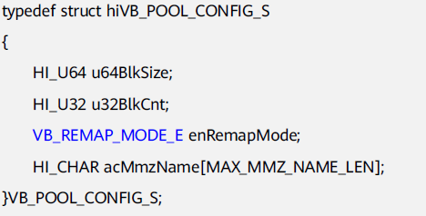

【成员】

【注意事项】

*  每个缓存块的大小u64BlkSize应根据当前图像宽高、像素格式、数据位宽、是否压缩等来计算。详细计算方法请参见**源码的device/soc/hisilicon/hi3516dv300/sdk_linux/sample/doc中**的《HiMPP媒体处理软件 V4.0 开发参考.pdf》表2-1和代码[hi_buffer.h](https://gitee.com/openharmony/device_soc_hisilicon/blob/master/hi3516dv300/sdk_linux/include/hi_buffer.h)里面各种格式的图像存储计算公式。

* 该缓存池是从空闲MMZ内存中分配，一个缓存池包含若干个大小相同的缓存块。如果该缓存池的大小超过了保留内存中的空闲空间，则创建缓存池会失败。

* 用户需保证输入的DDR名字已经存在，如果输入不存在DDR的名字，会造成分不到内存。如果数组acMmzName被memset为0则表示在没有命名的DDR中创建缓存池。

**对VB_POOL_CONFIG_S中嵌套的结构体VB_REMAP_MODE_E进行解释。**

**VB_REMAP_MODE_E**

【说明】

* 定义VB内核态虚拟地址映射模式。

【定义】

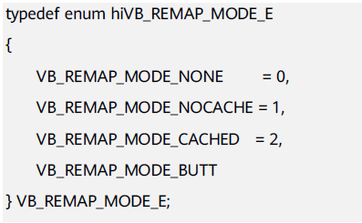

【成员】

【注意事项】

* 无

**配置vb具体的代码实现方式如下图所示：**

* 可参考**源码的device/soc/hisilicon/hi3516dv300/sdk_linux/sample/taurus/helloworld/smp/sample_lcd.c文件中** StVbParamCfg( )函数。

**get picture buffer size和get raw buffer size代码实现方式如下图所示：**

* 可参考**源码的device/soc/hisilicon/hi3516dv300/sdk_linux/sample/taurus/helloworld/smp/sample_lcd.c中的**HI_S32 int SampleVioVpssVoMipi(void)接口中的get picture buffer size部分和get raw buffer size部分。

##### 3.1.2.2.4 Vb init & MPI system init

通过**HI_S32 SAMPLE_COMM_SYS_Init(VB_CONFIG_S* pstVbConfig);**接口进行system初始化，可参考**源码的device/soc/hisilicon/hi3516dv300/sdk_linux/sample/taurus/helloworld/smp/sample_lcd.c中**的**int SampleVioVpssVoMipi(void)**接口中的**vb init & MPI system init**部分，如下图所示：

进入device/soc/hisilicon/hi3516dv300/sdk_linux/sample/platform/common/sample_comm_sys.c的SAMPLE_COMM_SYS_Init接口，对其调用的底层接口进行说明和阐述，调用的接口如下：

以下接口可以在device/soc/hisilicon/hi3516dv300/sdk_linux/sample/include/mpi_sys.h文件中找到

**HI_MPI_SYS_Exit**

【描述】

* 去初始化MPP系统。包括音频输入输出、视频输入输出、视频编解码、视频叠加区域、视频处理、图形处理等模块都会被销毁或者禁用

【语法】

* HI_S32 HI_MPI_SYS_Exit(HI_VOID);

【参数】

* 无

【返回值】

【需求】

* 头文件：hi_comm_sys.h、mpi_sys.h

* 库文件：libmpi.a

【注意】

* 去初始化时，如果有阻塞在MPI上的用户进程，则去初始化会失败。如果所有阻塞在MPI上的调用都返回，则可以成功去初始化。

* 可以反复去初始化，不返回失败。

* 由于系统去初始化不会销毁音频的编解码通道，因此这些通道的销毁需要用户主动进行。如果创建这些通道的进程退出，则通道随之被销毁。

**注：本章节涉及到的错误码请参考源码的device/soc/hisilicon/hi3516dv300/sdk_linux/sample/doc中的《HiMPP媒体处理软件V4.0开发参考.pdf》指导手册中对应的错误码**

以下四个接口可在device/soc/hisilicon/hi3516dv300/sdk_linux/sample/include/mpi_vb.h文件中找到

**HI_MPI_VB_Exit**

【描述】

* 去初始化MPP视频缓存池。

【语法】

* HI_S32 HI_MPI_VB_Exit (HI_VOID);

【参数】

* 无。

【返回值】

【需求】

* 头文件：hi_comm_vb.h、mpi_vb.h

* 库文件：libmpi.a

【注意】

* 必须先调用HI_MPI_SYS_Exit去初始化MPP系统，再去初始化缓存池，否则返回失败。

* 可以反复去初始化，不返回失败。

* 去初始化不会清除先前对缓存池的配置。

* 退出VB池之前请确保VB池里的任何VB都没有被占用，否则无法退出。

**HI_MPI_VB_SetConfig**

【描述】

* 设置MPP视频缓存池属性。

【语法】

* HI_S32 HI_MPI_VB_SetConfig(const VB_CONFIG_S *pstVbConfig);

【参数】

【返回值】

【需求】

* 头文件：hi_comm_vb.h、mpi_vb.h

* 库文件：libmpi.a

【注意】

* 只能在系统处于未初始化的状态下，才可以设置缓存池属性，否则会返回失败。

* video buf根据不同的应用场景需要不同的配置。配置规则参见**源码的device/soc/hisilicon/hi3516dv300/sdk_linux/sample/doc中**的《HiMPP媒体处理软件 V4.0 开发参考.pdf》2.2.1 “视频缓存池”。

* 公共缓存池中每个缓存块的大小应根据当前图像像素格式以及图像是否压缩而有所不同。具体分配大小请参考VB_CONFIG_S结构体中的描述。

**HI_MPI_VB_Init**

【描述】

* 初始化MPP视频缓存池。

【语法】

* HI_S32 HI_MPI_VB_Init (HI_VOID);

【参数】

* 无。

【返回值】

【需求】

* 头文件：hi_comm_vb.h、mpi_vb.h

* 库文件：libmpi.a

【注意】

* 必须先调用HI_MPI_VB_SetConfig配置缓存池属性，再初始化缓存池，否则会失败。

* 可反复初始化，不返回失败。

**HI_MPI_SYS_Init**

【描述】

* 初始化MPP系统。包括音频输入输出、视频输入输出、视频编解码、视频叠加区域、视频处理、图形处理等模块都会被初始化。

【语法】

* HI_S32 HI_MPI_SYS_Init(HI_VOID);

【参数】

* 无。

【返回值】

【需求】

* 头文件：hi_comm_sys.h、mpi_sys.h

* 库文件：libmpi.a

【注意】

* 必须先调用HI_MPI_SYS_SetConfig配置MPP系统后才能初始化，否则初始化会失败。
* 由于MPP系统的正常运行依赖于缓存池，因此需要先调用HI_MPI_VB_Init初始化缓存池，再初始化MPP系统，否则会导致业务运行异常。
* 如果多次初始化，仍会返回成功，但实际上系统不会对MPP的运行状态有任何影响。
* 只要有一个进程进行初始化即可，不需要所有的进程都做系统初始化的操作。
* 由于音频模块依赖用户态属性，故音频不支持多进程操作。用户需要保证音频的相关操作和HI_MPI_SYS_Init在同一个进程中。

SAMPLE_COMM_SYS_Init接口实现细节如下：

以下截图可在device/soc/hisilicon/hi3516dv300/sdk_linux/sample/platform/common/sample_comm_sys.c文件中找到

##### 3.1.2.2.5 start vi

通过SAMPLE_COMM_VI_StartVi接口实现启动vi功能，可参考

**源码的device/soc/hisilicon/hi3516dv300/sdk_linux/sample/taurus/helloworld/smp/sample_lcd.c中**的

**int SampleVioVpssVoMipi(void)**接口中的start vi部分，如下图所示：

针对SAMPLE_COMM_VI_StartVi 调用的底层接口进行如下解释和说明：

HI_S32 SAMPLE_COMM_VI_StartVi(SAMPLE_VI_CONFIG_S * pstViConfig)接口开启vi，包括SAMPLE_COMM_VI_StartMIPI()、SAMPLE_COMM_VI_SetParam()、SAMPLE_COMM_VI_CreateVi()、SAMPLE_COMM_VI_CreateIsp()等接口。

这些接口都可以在device/soc/hisilicon/hi3516dv300/sdk_linux/sample/platform/common/sample_comm_vi.c文件中找到

**(1) SAMPLE_COMM_VI_StartMIPI()**

该接口为初始化MIPI。

**(2) SAMPLE_COMM_VI_SetParam()**

该接口涉及到的关键接口HI_MPI_SYS_GetVIVPSSMode、HI_MPI_SYS_SetVIVPSSMode，下面逐一进行解读。

以下接口可在device/soc/hisilicon/hi3516dv300/sdk_linux/sample/include/mpi_sys.h文件中找到

**HI_MPI_SYS_GetVIVPSSMode**

【描述】

获取VI、VPSS的工作模式

【语法】

HI_S32 HI_MPI_SYS_GetVIVPSSMode(VI_VPSS_MODE_S* pstVIVPSSMode);

【参数】

| 参数名称      | 描述            | 输入/输出 |
| ------------- | --------------- | --------- |
| pstVIVPSSMode | VI/VPSS工作模式 | 输出      |

【返回值】

【需求】

* 头文件：hi_comm_sys.h、mpi_sys.h

* 库文件：libmpi.a

针对HI_MPI_SYS_GetVIVPSSMode接口的出参VI_VPSS_MODE_S结构体进行说明：

**VI_VPSS_MODE_S**

【说明】

* 定义VI PIPE和VPSS组的工作模式

【定义】

【成员】

【注意事项】

Hi3559AV100ES只支持VI_OFFLINE_VPSS_OFFLINE，VI_ONLINE_VPSS_OFFLINE，VI_PARALLEL_VPSS_OFFLINE三种模式

VI_VPSS_MODE_S嵌套VI_VPSS_MODE_E结构体，对该枚举型结构体说明如下：

**VI_VPSS_MODE_E**

【说明】

定义VI PIPE和VPSS组的工作模式。

【定义】

【成员】

【注意事项】

* VI_OFFLINE_VPSS_ONLINE，VI_ONLINE_VPSS_ONLINE，VI_PARALLEL_VPSS_PARALLEL模式下VI PIPE编号与VPSS GROUP号一一对应，数据从VI PIPE流动到VPSS GROUP，不需要软件设定绑定关系。

**HI_MPI_SYS_SetVIVPSSMode**

【描述】

* 设置VI、VPSS工作模式。

【语法】

* HI_S32 HI_MPI_SYS_SetVIVPSSMode(const VI_VPSS_MODE_S* pstVIVPSSMode);

【参数】

【返回值】

【需求】

* 头文件：hi_comm_sys.h、mpi_sys.h

* 库文件：libmpi.a

【注意】

* 必须在HI_MPI_SYS_Init后，所有的VI PIPE和所有的VPSS组创建前设置。

**(3) SAMPLE_COMM_VI_CreateVi()**

以下接口可在device/soc/hisilicon/hi3516dv300/sdk_linux/sample/include/mpi_vi.h文件中找到

**HI_MPI_VI_SetDevAttr**

【描述】

* 设置VI设备属性。基本设备属性默认了部分芯片配置，满足大部分的sensor对接要求。

【语法】

* HI_S32 HI_MPI_VI_SetDevAttr(VI_DEV ViDev, const VI_DEV_ATTR_S *pstDevAttr);

【参数】

【返回值】

【芯片差异】

无。

【需求】

* 头文件： hi_comm_vi.h 、 mpi_vi.h

* 库文件：libmpi.a

【注意】

* 不支持BT.1120隔行输入。

* 在调用前要保证VI设备处于禁用状态。如果VI设备已处于使能状态，可以使用HI_MPI_VI_DisableDev来禁用设备

* 参数pstDevAttr主要用来配置指定VI设备的视频接口模式，用于与外围camera、sensor或codec对接，支持的接口模式包括MIPI Rx（MIPI/LVDS/HISPI）、SLVS-EC。用户需要配置以下几类信息，具体属性意义参见**源码的device/soc/hisilicon/hi3516dv300/sdk_linux/sample/doc中**的《HiMPP媒体处理软件 V4.0 开发参考.pdf》3.6“数据类型”部分的说明：
  * 接口模式信息：接口模式为MIPI Rx（MIPI/LVDS/HISPI）、SLVS-EC等模式
  * 工作模式信息：1路、2路、4路复合模式
  * 数据布局信息：复合模式下多路数据的排布
  *  数据信息：逐行输入、YUV数据输入顺序
  * 同步时序信息：垂直、水平同步信号的属性

* WDR模式下不支持BAS功能。

针对HI_MPI_VI_SetDevAttr 接口参数涉及到VI_DEV_ATTR_S结构体进行说明：

以下结构体可在device/soc/hisilicon/hi3516dv300/sdk_linux/sample/include/mpi_vi.h文件中找到

**VI_DEV_ATTR_S**

【说明】

定义视频输入设备的属性

【定义】

【成员】

【芯片差异】

* 自行查阅**源码的device/soc/hisilicon/hi3516dv300/sdk_linux/sample/doc中**的《HiMPP媒体处理软件 V4.0 开发参考.pdf》VI_DEV_ATTR_S结构体芯片差异部分。

【注意事项】

* as32AdChnId为无效参数，推荐统一将数组as32AdChnId的值都设为-1

* 不支持多路复合只有1路复合工作模式，必须设置为VI_WORK_MODE_1Multiplex，否则报错。

* stSize中u32Width必须等于实际输入图像的宽度，u32Height必须等于实际输入图像的高度，否则会导致没有图像输出。

* 只有DEV0支持DATA_RATE_X2。enDataRate的值需与mipi_data_rate_t（详情请参考MIPI章节）保持一致。

* 并行模式时，必须配置enDataRate为DATA_RATE_X2。

* DATA_RATE_X2通路配置：MIPI0配置为MIPI_DATA_RATE_X2，DEV0配置DATA_RATE_X2，DEV0绑定PIPE0，其他通路不支持。

* 当接口模式为VI_MODE_MIPI_YUV420_NORMAL，VI_MODE_MIPI_YUV420_LEGACY，VI_MODE_MIPI_YUV422时bDataReverse必须为HI_FALSE，且掩码的设置必须为au32ComponentMask[0] = 0xFF000000，au32ComponentMask[1]= 0x00FF0000，即高8bit输入Y数据，低8bit输入C数据，否则会导致图像异常或无图像等现像。

**HI_MPI_VI_EnableDev**

【描述】

* 启动VI设备

【语法】

* HI_S32 HI_MPI_VI_EnableDev(VI_DEV ViDev);

【参数】

【返回值】

【芯片差异】

* 无。

【需求】

* 头文件：hi_comm_vi.h、mpi_vi.h

* 库文件：libmpi.a

【注意】

* 启用前必须已经设置设备属性，否则返回失败。

* 可重复启用，不返回失败。

* Hi3516DV300支持同时启动两个VI DEV。

**HI_MPI_VI_SetDevBindPipe**

【描述】

* 设置VI设备与物理PIPE的绑定关系

【语法】

* HI_S32 HI_MPI_VI_SetDevBindPipe(VI_DEV ViDev, const VI_DEV_BIND_PIPE_S *pstDevBindPipe);

【参数】

【返回值】

【芯片差异】

* 无

【需求】

* 头文件：hi_comm_vi.h、mpi_vi.h

* 库文件：libmpi.a

针对HI_MPI_VI_SetDevBindPipe接口入参涉及的VI_DEV_BIND_PIPE_S进行如下说明：

**VI_DEV_BIND_PIPE_S**

【说明】

* 定义 VI DEV 与 PIPE 的绑定关系。

【定义】

【成员】

【注意】

* 无。

**HI_MPI_VI_CreatePipe**

【描述】

* 创建一个VI PIPE

【语法】

* HI_S32 HI_MPI_VI_CreatePipe(VI_PIPE ViPipe, const VI_PIPE_ATTR_S *pstPipeAttr);

【参数】

【返回值】

【芯片差异】

* 自行查阅**源码的device/soc/hisilicon/hi3516dv300/sdk_linux/sample/doc中**的《HiMPP媒体处理软件 V4.0 开发参考.pdf》HI_MPI_VI_CreatePipe芯片差异部分。

【需求】

* 头文件：hi_comm_vi.h、mpi_vi.h

* 库文件：libmpi.a

【注意】

* 只有PIPE0支持并行模式。

* 物理PIPE属性中的u32MaxW、u32MaxH、enPixFmt、enBitWidth等必须与前端进入VI的时序设置保持一致，否则会出现错误。

* 不支持重复创建。

* 当VI离线且输入图像大于4096时，不支持压缩。

* WDR模式下需要创建多个物理PIPE绑定到同一个开了WDR的设备上，当进行切换时，需要把所有绑定到该设备的物理PIPE销毁再重建。不能使用上次使用过而未销毁的物理PIPE，否则可能造成错误。

针对HI_MPI_VI_CreatePipe接口中入参VI_PIPE_ATTR_S结构体进行如下说明：

**VI_PIPE_ATTR_S**

【描述】

* 设置VI PIPE属性

【定义】

【成员】

【芯片差异】

* 自行查阅**源码的device/soc/hisilicon/hi3516dv300/sdk_linux/sample/doc中**的《HiMPP媒体处理软件 V4.0 开发参考.pdf》VI_PIPE_ATTR_S结构体芯片差异内容。

【注意事项】

* 自行查阅**源码的device/soc/hisilicon/hi3516dv300/sdk_linux/sample/doc中**的《HiMPP媒体处理软件 V4.0 开发参考.pdf》VI_PIPE_ATTR_S结构体注意事项内容。

**HI_MPI_VI_SetPipeVCNumber**

【描述】

* 设置VI物理PIPE对接前端sensor或者AD的VC号。

【语法】

* HI_S32 HI_MPI_VI_SetPipeVCNumber(VI_PIPE ViPipe, HI_U32 u32VCNumber); 

【参数】

【返回值】

【芯片差异】

* 无。

【需求】

* 头文件：mpi_vi.h

【注意】

* 必须在 PIPE 创建后，使能之前调用。

* 虚拟 PIPE 不支持。

  

**HI_MPI_VI_DestroyPipe**

【描述】

* 销毁一个VI PIPE

【语法】

* HI_S32 HI_MPI_VI_DestroyPipe(VI_PIPE ViPipe)；

【参数】

【返回值】

【芯片差异】

* 无。

【需求】

* 头文件：hi_comm.h、mpi_vi.h

【注意】

* 使用本接口前，需先调用HI_MPI_VI_StopPipe(ViPipe)停止PIPE，否则提示失败。
* 在未创建PIPE或重复销毁PIPE时，调用本接口，将提示PIPE不存在。

**HI_MPI_VI_StartPipe**

【配置】

* 启用VI PIPE

【语法】

* HI_S32 HI_MPI_VI_StartPipe(VI_PIPE ViPipe);

【参数】

【返回值】

【芯片差异】

* 无

【需求】

* 头文件：hi_comm_vi.h、mpi_vi.h

* 库文件：libmpi.a

【注意】

* PIPE必须已创建
* 重复调用该函数设置同一个PIPE返回成功。

**HI_MPI_VI_SetChnAttr**

【描述】

* 设置VI通道属性

【语法】

* HI_S32 HI_MPI_VI_SetChnAttr(VI_PIPE ViPipe, VI_CHN ViChn, const VI_CHN_ATTR_S *pstChnAttr);

【参数】

【返回值】

【芯片差异】

* 自行查阅**源码的device/soc/hisilicon/hi3516dv300/sdk_linux/sample/doc中**的《HiMPP媒体处理软件 V4.0 开发参考.pdf》中的HI_MPI_VI_SetChnAttr芯片差异内容。

【注意事项】

* 自行查阅**源码的device/soc/hisilicon/hi3516dv300/sdk_linux/sample/doc中**的《HiMPP媒体处理软件 V4.0 开发参考.pdf》中的HI_MPI_VI_SetChnAttr注意事项内容。

**HI_MPI_VI_EnableChn**

【描述】

* 启动VI通道

【语法】

* HI_S32 HI_MPI_VI_EnableChn(VI_PIPE ViPipe, VI_CHN ViChn);

【参数】

【返回值】

【芯片差异】

* 无

【需求】

* 头文件：hi_comm_vi.h、mpi_vi.h

* 库文件：libmpi.h

【注意】

* PIPE必须已创建，否则会返回失败。
* 必须先设置通道属性。 
* 若启用扩展通道，则必须保证此通道绑定的源物理通道已经使能，否则返回失败错误码。 
* 可重复启用VI通道，不返回失败。 
* VI在线VPSS在线模式、VI 离线VPSS在线模式，VI并行VPSS并行模式下，启动VI通道不生效，直接返回成功。

**HI_MPI_VI_StopPipe**

【描述】

* 禁用VI PIPE。

【语法】

* HI_S32 HI_MPI_VI_StopPipe(VI_PIPE ViPipe);

【参数】

【返回值】

【芯片差异】

* 无。

【需求】

* 头文件：hi_comm_vi.h、mpi_vi.h

【注意】

* PIPE必须已创建。

* 重复调用该函数设置同一个PIPE返回成功。

**HI_MPI_VI_DisableDev**

【描述】

* 禁用VI设备。

【语法】

* HI_S32 HI_MPI_VI_DisableDev(VI_DEV ViDev);

【参数】

【返回值】

【芯片差异】

* 无。

【需求】

* 头文件：hi_comm_vi.h、mpi_vi.h

* 库文件：libmpi.a

【注意】

* 需先销毁所有与该VI设备绑定的物理PIPE后，再禁用VI设备

* 可重复禁用，不返回失败。

* 支持低功耗处理，禁用VI设备后将完全关闭该设备，需要重新设置属性，才能使能VI设备。

**HI_MPI_VI_DisableChn**

【描述】

* 禁用VI通道。

【语法】

* HI_S32 HI_MPI_VI_DisableChn(VI_PIPE ViPipe, VI_CHN ViChn);

【参数】

【返回值】

【芯片差异】

* 无。

【需求】

* 头文件：hi_comm_vi.h、mpi_vi.h

* 库文件：libmpi.a

【注意】

* PIPE必须已创建，否则会返回失败。

* 若禁用物理通道，则必须保证此通道绑定的扩展通道已经全部禁用，否则返回失败的错误码。

* 可重复禁用VI通道，不返回失败。

* VI在线VPSS在线模式、VI离线VPSS在线模式，VI并行VPSS并行模式下，禁用VI通道不生效，直接返回成功。

**SAMPLE_COMM_VI_CreateIsp**

ISP通过一系列数字图像处理算法完成对数字图像的效果处理。主要包括3A、坏点校正、去噪、强光抑制、背光补偿、色彩增强、镜头阴影校正等处理。

ISP包括逻辑部分以及运行在其上的firmware ISP部分底层接口优先参考**源码的device/soc/hisilicon/hi3516dv300/sdk_linux/sample/doc中**的《HiISP 开发参考.pdf》指导手册，针对SAMPLE_COMM_VI_CreateIsp用到关键底层接口做如下说明：

**注：下文涉及的所有AE库接口都只是针对上海海思AE库，如果客户自己实现AE库，不需要关注这些接口，且无法使用这些接口。所有AWB库接口都只是针对上海海思AWB库，如果客户自己实现AWB库，不需要关注这些接口，且无法使用这些接口。**

以下接口可以在device/soc/hisilicon/hi3516dv300/sdk_linux/sample/include/mpi_isp.h文件中找到

**HI_MPI_ISP_MemInit**

【描述】

* 初始化ISP外部寄存器

【语法】

* HI_S32 HI_MPI_ISP_MemInit(VI_PIPE ViPipe);

【参数】

【返回值】

【需求】

* 头文件：hi_comm_isp.h、mpi_isp.h

* 库文件：libisp.a

【注意事项】

* 自行查阅**源码的device/soc/hisilicon/hi3516dv300/sdk_linux/sample/doc中**的《HiISP 开发参考.pdf》指导手册中的HI_MPI_ISP_MemInit结构体注意事项内容。

**HI_MPI_ISP_Init**

【描述】

* 初始化ISP firmware

【语法】

* HI_S32 HI_MPI_ISP_Init(VI_PIPE ViPipe);

【参数】

【返回值】

【需求】

* 头文件：hi_comm_isp.h、mpi_isp.h

* 库文件：libisp.a

【注意】

* 自行参考**源码的device/soc/hisilicon/hi3516dv300/sdk_linux/sample/doc中**的《HiISP 开发参考.pdf》指导手册中的HI_MPI_ISP_Init注意事项内容。

**HI_MPI_ISP_Exit**

【描述】

* 退出ISP firmware

【语法】

* HI_S32 HI_MPI_ISP_Exit(VI_PIPE ViPipe);

【参数】

【返回值】

【需求】

* 头文件：hi_comm_isp.h、mpi_isp.h

* 库文件：libisp.a

【注意】

* 调用HI_MPI_ISP_Init和HI_MPI_ISP_Run之后，再调用本接口退出ISP firmware。 

* 不支持多进程，必须要与 sensor_register_callback、HI_MPI_AE_Register、HI_MPI_AWB_Register、HI_MPI_ISP_MemInit、HI_MPI_ISP_Init、HI_MPI_ISP_Run 接口在同一个进程调用。 

* 支持重复调用本接口。

* 在拼接模式时，必须先退出主pipe，后退出其他pipe。 

* 不支持相同ViPipe时，多线程执行ISP创建和销毁（多线程同时调用sensor_register_callback、HI_MPI_AE_Register、HI_MPI_AWB_Register、HI_MPI_ISP_MemInit、HI_MPI_ISP_Init、HI_MPI_ISP_Exit） 

* 推荐调用 HI_MPI_ISP_Init 之后，在调用本接口。

**HI_MPI_ISP_SetPubAttr**

【描述】

* 设置 ISP 公共属性。

【语法】

* HI_S32 HI_MPI_ISP_SetPubAttr(VI_PIPE ViPipe, const ISP_PUB_ATTR_S *pstPubAttr);

【参数】

【返回值】

【需求】

* 头文件：hi_comm_isp.h、mpi_isp.h

* 库文件：libisp.a

【注意】

* 自行参考**源码的device/soc/hisilicon/hi3516dv300/sdk_linux/sample/doc中**的《HiISP 开发参考.pdf》HI_MPI_ISP_SetPubAttr中的注意内容。

**HI_MPI_ISP_Run**

【描述】

* 运行ISP firmware

【语法】

* HI_S32 HI_MPI_ISP_Run(VI_PIPE ViPipe);

【参数】

【返回值】

【需求】

* 头文件：hi_comm_isp.h、mpi_isp.h

* 库文件：libisp.a

【注意】

* 运行前需要确保sensor已经初始化，并且向ISP注册了回调函数。

* 运行前需要确保已调用HI_MPI_ISP_Init初始化ISP

* 不支持多进程，必须要与sensor_register_callback、HI_MPI_AE_Register、HI_MPI_AWB_Register、HI_MPI_ISP_MemInit、HI_MPI_ISP_Init、HI_MPI_ISP_Exit接口在同一个进程调用。

* 该接口是阻塞接口，建议用户采用实时线程处理。

此接口可以在device/soc/hisilicon/hi3516dv300/sdk_linux/sample/include/mpi_awb.h文件中找到

**HI_MPI_AWB_UnRegister**

【描述】

* 向ISP注消AWB库。

【语法】

* HI_S32 HI_MPI_AWB_UnRegister(VI_PIPE ViPipe, ALG_LIB_S*pstAwbLib);

【参数】

【返回值】

【需求】

* 头文件：hi_comm_isp.h、mpi_awb.h

* 库文件：libisp.a

【注意】

* 该接口调用了ISP库提供的AWB反注册回调接口HI_MPI_ISP_AWBLibRegCallBack，以实现AWB向ISP库反注册的功能。
* 用户调用此接口完成上海海思AWB库向ISP库反注册，此接口不支持多进程操作。
* 

以下接口可以在device/soc/hisilicon/hi3516dv300/sdk_linux/sample/include/mpi_ae.h文件中找到

**HI_MPI_AE_UnRegister**

【描述】

* 向ISP反注册AE库。

【语法】

* HI_S32 HI_MPI_AE_UnRegister(VI_PIPE ViPipe, ALG_LIB_S *pstAeLib);

【参数】

【返回值】

【需求】

* 头文件：hi_comm_isp.h、mpi_ae.h

* 库文件：libisp.a、lib_hiae.a

【注意】

* 该接口调用了ISP库提供的AE反注册回调接口HI_MPI_ISP_AELibUnRegCallBack，以实现AE向ISP库反注册的功能。

* 此接口不支持多进程操作。

**HI_MPI_AE_Register**

【描述】

* 向ISP注册AE库。

【语法】

* HI_S32 HI_MPI_AE_Register(VI_PIPE ViPipe, ALG_LIB_S *pstAeLib);

【参数】

【返回值】

【需求】

* 头文件：hi_comm_isp.h、mpi_ae.h

* 库文件：libisp.a、lib_hiae.a

【注意】

* 该接口调用了ISP库提供的AE注册回调接口HI_MPI_ISP_AELibRegCallBack，以实现上海海思AE库向ISP库注册的功能。
* AE库可以注册多个实例。
* 此接口不支持多进程操作。

以下接口可以在device/soc/hisilicon/hi3516dv300/sdk_linux/sample/include/mpi_awb.h文件中找到

**HI_MPI_AWB_Register**

【描述】

* 向ISP注册AWB库。

【语法】

* HI_S32 HI_MPI_AWB_Register(VI_PIPE ViPipe, ALG_LIB_S *pstAwbLib);

【参数】

【返回值】

【需求】

* 头文件：hi_comm_isp.h、mpi_awb.h

* 库文件：libisp.a

【注意】

* 该接口调用了ISP库提供的AWB注册回调接口HI_MPI_ISP_AWBLibRegCallBack，以实现向ISP库注册的功能。

* 用户调用此接口完成上海海思AWB库向ISP库注册。

* AWB库可以注册多个实例，此接口不支持多进程操作。

以下接口可以在device/soc/hisilicon/hi3516dv300/sdk_linux/sample/include/mpi_isp.h文件中找到

**HI_MPI_ISP_AWBLibRegCallBack**

【描述】

* ISP提供的AWB库注册的回调接口。

【语法】

* HI_S32 HI_MPI_ISP_AWBLibRegCallBack(VI_PIPE ViPipe, ALG_LIB_S *pstAwbLib, ISP_AWB_REGISTER_S *pstRegister);

【参数】

【返回值】

【需求】

* 头文件：hi_comm_isp.h、mpi_isp.h

* 库文件：libisp.a

【注意】

* ISP提供统一的AWB算法库接口，初始化、运行、控制、销毁AWB算法库。使用上海海思AWB算法库时，不需要关注此接口；使用用户自己的AWB算法库时，需要调用此接口向ISP注册回调函数。

* 此接口不支持多进程操作。

* 最大支持2个AWB库注册。

ISP库与AWB库间的接口如下图所示：

**HI_MPI_ISP_AELibUnRegCallBack**

【描述】

* ISP提供的AE库反注册的回调接口。

【语法】

* HI_S32 HI_MPI_ISP_AELibUnRegCallBack(VI_PIPE ViPipe, ALG_LIB_S *pstAeLib);

【参数】

【返回值】

【需求】

* 头文件：hi_comm_isp.h、mpi_isp.h

* 库文件：libisp.a

【注意】

* 使用上海海思AE算法库时，不需要关注此接口；使用用户自己的AE算法库时，需要调用此接口向ISP反注册回调函数。

* 此接口不支持多进程操作。

**HI_MPI_ISP_AELibRegCallBack**

【描述】

* ISP提供的AE库注册的回调接口。

【语法】

* HI_S32 HI_MPI_ISP_AELibRegCallBack(VI_PIPE ViPipe, ALG_LIB_S *pstAeLib, ISP_AE_REGISTER_S *pstRegister);

【参数】

【返回值】

【需求】

* 头文件：hi_comm_isp.h、mpi_isp.h

* 库文件：libisp.a

【注意】

* ISP提供统一的AE算法库接口，初始化、运行、控制、销毁AE算法库。使用上海海思AE算法库时，不需要关注此接口；使用用户自己的AE算法库时，需要调用此接口向ISP注册回调函数。

* 此接口不支持多进程操作。

* 最大支持2个AE库注册。

ISP库与AE库间的接口关系如下图所示：

