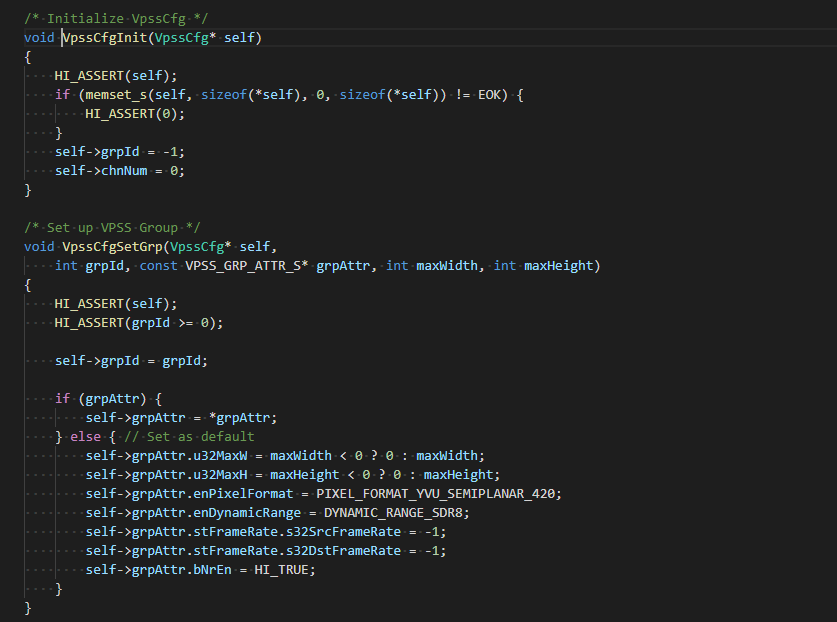
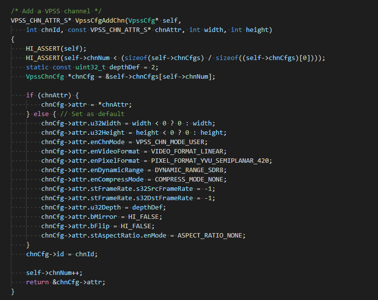
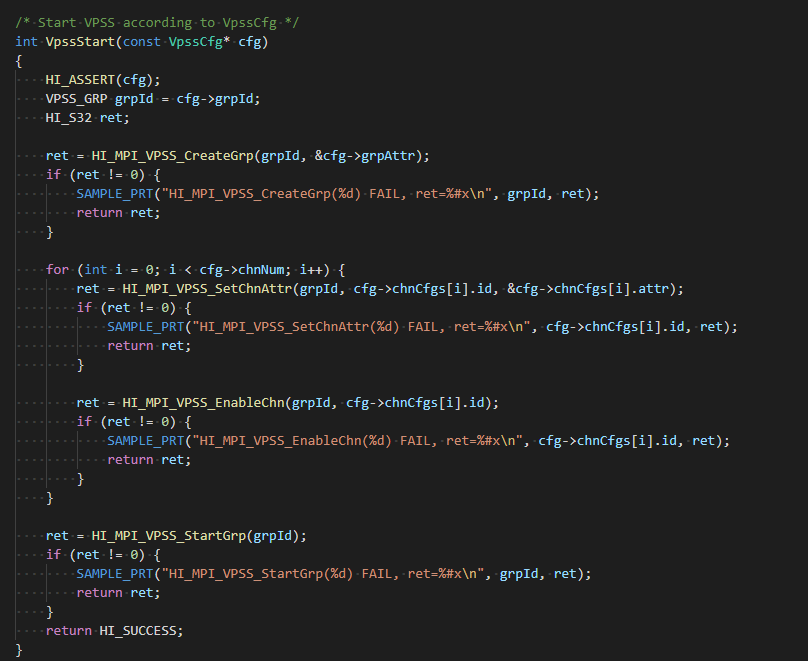
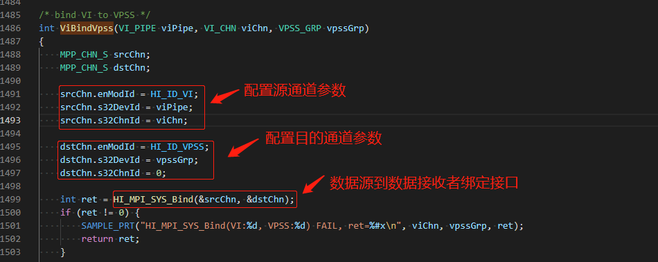

### 3.1.3 VPSS理论及实现方式

#### 3.1.3.1 VPSS理论

VPSS（Video Process Sub-System）支持对一幅输入图像进行统一预处理，如去噪、去隔行等，然后再对各通道分别进行缩放、锐化等处理，最后**输出多种不同分辨率**的图像。
 VPSS是视频处理子系统，支持的具体图像处理功能包括FRC（Frame Rate Control）、CROP、Sharpen、3DNR、Scale、像素格式转换、LDC、Spread、固定角度旋转、任意角度旋转、鱼眼校正、Cover/Coverex、Overlayex、Mosaic、Mirror/Flip、HDR、AspectRatio、压缩解压等。

关于VPSS的功能描述及相关名词概念描述请自行阅读**源码的device/soc/hisilicon/hi3516dv300/sdk_linux/sample/doc中**的《HiMPP媒体处理软件 V4.0 开发参考.pdf》第5章视频处理子系统中的5.2章节。

VPSS在系统中的位置如下图所示：

通过调用SYS模块的绑定接口，可与AVS/USER/VDEC/VI和VO/VENC/SVP等模块进行绑定，其中前者为VPSS的输入源，后者为VPSS的接收者。用户可通过MPI接口对GROUP进行管理。每个GROUP仅可与一个输入源绑定。GROUP的物理通道有两种工作模式：AUTO和USER，两种模式间可动态切换。AUTO模式下各通道仅可与一个接收者绑定，主要用于预览和回放场景下做播放控制。USER模式下各通道可与多个接收者绑定。**需要特别注意的是，USER模式主要用于对同一通道图像进行多路编码的场景，此模式下播放控制不生效，因此回放场景下不建议使用USER模式**。VPSS只有工作在离线模式下才支持AUTO模式。

Hi3516DV300 VPSS芯片数据处理流程如下图所示：

**注意：**

* VPSS在调用VGS做通道后处理时顺序为CoverEx、LumaStat、OverlayEx。

* 固定角度旋转和任意角度旋转功能互斥，这两个功能在图中的先后顺序无需关注。

* 扩展通道GDC任务和VGS任务互斥。

#### 3.1.3.2 VPSS实现方式

在device/soc/hisilicon/hi3516dv300/sdk_linux/sample/taurus/helloworld/中，VPSS部分实现细节如下：

##### 3.1.3.2.1 config vpss

首先需要配置vpss所需的结构体，核心对VPSS_GRP_ATTR_S结构体和VPSS_CHN_ATTR_S结构体进行配置，下面对这个两个结构体进行详细说明。

这两个结构体可在device/soc/hisilicon/hi3516dv300/sdk_linux/include/hi_comm_vpss.h中找到

**VPSS_GRP_ATTR_S**

【说明】

* 定义VPSS GROUP属性

【定义】

【成员】

注：表5-5来源于**源码的device/soc/hisilicon/hi3516dv300/sdk_linux/sample/doc中**的《HiMPP媒体处理软件 V4.0 开发参考.pdf》

【注意事项】

请查阅**源码的device/soc/hisilicon/hi3516dv300/sdk_linux/sample/doc中**的《HiMPP媒体处理软件 V4.0 开发参考.pdf》VPSS_GRP_ATTR_S结构体注意事项内容。

**VPSS_CHN_ATTR_S**

【说明】

* 定义VPSS物理通道的属性

【定义】

【成员】

注：表5-6来源于**源码的device/soc/hisilicon/hi3516dv300/sdk_linux/sample/doc中**的《HiMPP媒体处理软件 V4.0 开发参考.pdf》

【注意事项】

请查阅**源码的device/soc/hisilicon/hi3516dv300/sdk_linux/sample/doc中**的《HiMPP媒体处理软件 V4.0 开发参考.pdf》VPSS_CHN_ATTR_S结构体注意事项内容。

config vpss 代码实现可参考**源码的device/soc/hisilicon/hi3516dv300/sdk_linux/sample/taurus/helloworld/smp/sample_lcd.c**中的int SampleVioVpssVoMipi(void)接口，具体细节如下：

##### 3.1.3.2.2 start vpss

代码实现可参考**源码的device/soc/hisilicon/hi3516dv300/sdk_linux/sample/taurus/helloworld/smp/sample_lcd.c**文件

核心围绕VpssStart接口，如下图所示：

针对VpssStart接口调用的底层接口作如下说明：

**VPSS_GRP**

【说明】

* 定义VPSS组号

【定义】

* typedef HI_S32 VPSS_GRP；

【注意事项】

* 无

**HI_MPI_VPSS_CreateGrp**

【描述】

* 创建一个VPSS GROUP

【语法】

* HI_S32 HI_MPI_VPSS_CreateGrp(VPSS_GRP VpssGrp, const VPSS_GRP_ATTR_S *pstGrpAttr);

【参数】

【返回值】

【需求】

* 头文件：hi_comm_vpss.h、mpi_vpss.h

* 库文件：libmpi.a

【注意】

* 不支持重复创建。

* 当VPSS工作在VI_PARALLEL_VPSS_PARALLEL模式时，只有GROUP0可以被创建

* 当Hi3516DV300的GROUP0工作VI_ONLINE_VPSS_ONLINE模式时，只有GROUP0可以被创建。

**HI_MPI_VPSS_SetChnAttr**

【描述】

* 设置VPSS通道属性。

【语法】

* HI_S32 HI_MPI_VPSS_SetChnAttr(VPSS_GRP VpssGrp, VPSS_CHN VpssChn, const VPSS_CHN_ATTR_S *pstChnAttr);

【参数】

【返回值】

【需求】

* 头文件：hi_comm_vpss.h、mpi_vpss.h

* 库文件：libmpi.a

【注意】

* GROUP必须已创建。

* 扩展通道不支持此接口。 

* 通道做任意角度旋转、LDC、Spread处理或者其绑定的扩展通道开启了鱼眼校正时不支持通道尺寸动态改变，需要先关闭如上功能，才能动态改变通道尺寸。

**HI_MPI_VPSS_EnableChn**

【描述】

* 启用VPSS通道

【语法】

* HI_S32 HI_MPI_VPSS_EnableChn(VPSS_GRP VpssGrp, VPSS_CHN VpssChn);

【参数】

【返回值】

【需求】

* 头文件：hi_comm_vpss.h、mpi_vpss.h

* 库文件：libmpi.a

【注意】

* 多次使能返回成功。 
* GROUP 必须已创建。
* 若支持扩展通道，扩展通道必须保证此通道绑定的源物理通道已经使能，否则返回失败错误码。

**HI_MPI_VPSS_StartGrp**

【描述】

* 启用VPSS GROUP。

【语法】

* HI_S32 HI_MPI_VPSS_StartGrp(VPSS_GRP VpssGrp);

【参数】

【返回值】

【需求】

* 头文件：hi_comm_vpss.h、mpi_vpss.h

* 库文件：libmpi.a

【注意】

* GROUP必须已创建。

* 重复调用该函数设置同一个组返回成功。

#### 3.1.3.3 VI bind VPSS

MPP提供系统绑定接口（HI_MPI_SYS_Bind），即通过数据接收者绑定数据源来建立两者之间的关联关系（只允许数据接收者绑定数据源）。绑定后，数据源生成的数据将自动发送给接收者。目前MPP支持的绑定关系如下：

**VI bind VPSS绑定VI和VPSS之间的关联关系，绑定后，数据源生成的数据将自动发送给接收者，调用的底层接口如下：**

**HI_MPI_SYS_Bind**

【描述】

* 数据源到数据接收者绑定接口。

【语法】

* HI_S32 HI_MPI_SYS_Bind(const MPP_CHN_S *pstSrcChn, const MPP_CHN_S *pstDestChn);

【参数】

【返回值】

【需求】

* 头文件：hi_comm_sys.h、mpi_sys.h

* 库文件：libmpi.a

【注意】

* 系统目前支持的绑定关系，请参见**源码的device/soc/hisilicon/hi3516dv300/sdk_linux/sample/doc中**的《HiMPP媒体处理软件V4.0开发参考.pdf》中的表2-2。
* 同一个数据接收者只能绑定一个数据源。
* 绑定是指数据源和数据接收者建立关联关系。绑定后，数据源生成的数据将自动发送给接收者。
* VI和VDEC作为数据源，是以通道为发送者，向其他模块发送数据，用户将设备号置为0，SDK不检查输入的设备号。
* VO作为数据源发送回写(WBC)数据时，是以设备为发送者，向其他模块发送数据，用户将通道号置为0，SDK不检查输入的通道号。
* VPSS作为数据接收者时，是以设备（GROUP）为接收者，接收其他模块发来的数据，用户将通道号置为0。
* VENC作为数据接收者时，是以通道号为接收者，接收其他模块发过来的数据，用户将设备号置为0，SDK不检查输入的设备号。若VENC工作在VENC_PIC_RECEIVE_MULTI模式下，用户需要配置设备号，此时设备号实际用于指定输入源，可以使用VENC_PIC_RECEIVE_SOURCE0、VENC_PIC_RECEIVE_SOURCE1、VENC_PIC_RECEIVE_SOURCE2、VENC_PIC_RECEIVE_SOURCE3宏进行输入源指定。
* AVS作为数据接收者时，是以设备（GROUP）、通道（PIPE）为接收者。
* 其他情况均需指定设备号和通道号。

**在源码的device/soc/hisilicon/hi3516dv300/sdk_linux/sample/taurus/helloworld/smp/sample_lcd.c文件中**

vi bind vpss代码在ViVpssCreate()接口中的实现方式如下：

其中ViBindVpss具体实现细节如下：

