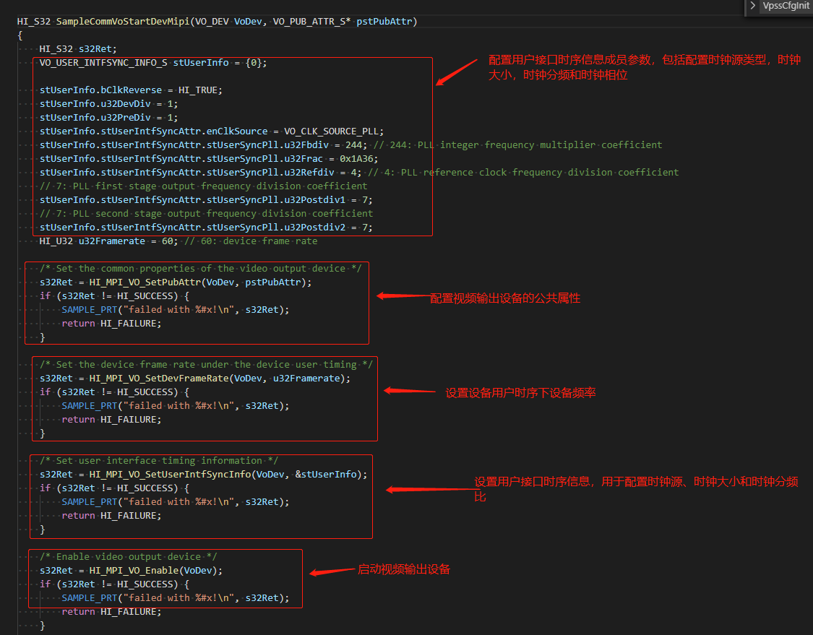
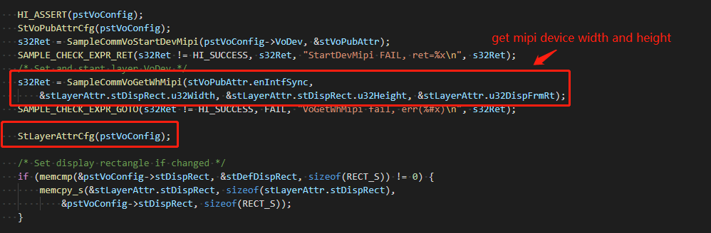
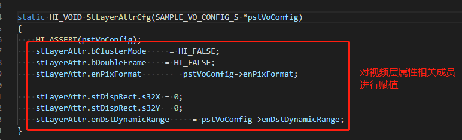
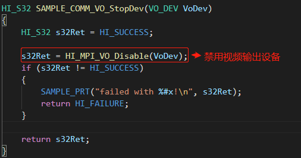
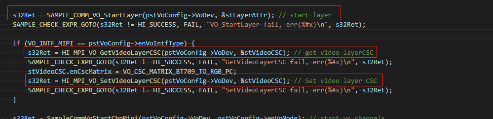
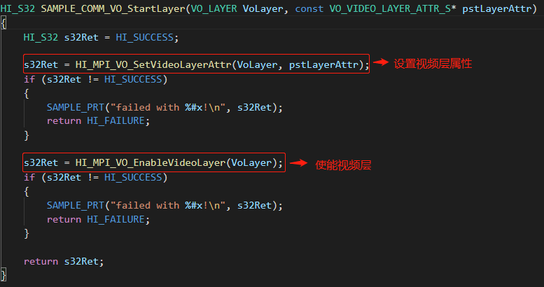
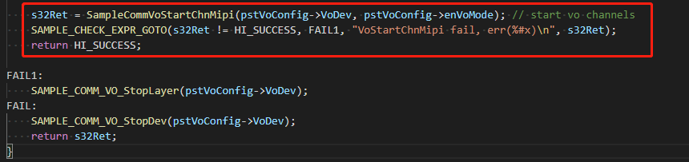
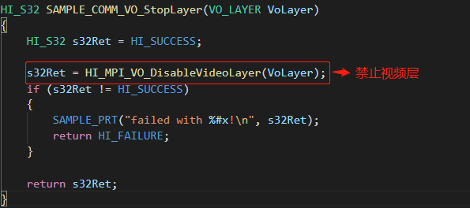
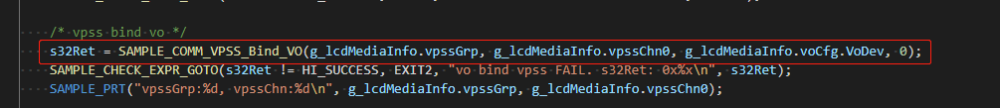
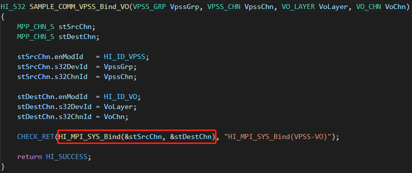

### 3.1.4 VO理论及实现方式

#### 3.1.4.1 VO理论

VO（Video Output，视频输出）模块主动从内存相应位置读取视频和图形数据，并通过相应的显示设备输出视频和图形。Hi3516DV300支持的显示/回写设备、视频层和图形层情况如下表所示，其他芯片型号请自行查阅**源码的device/soc/hisilicon/hi3516dv300/sdk_linux/sample/doc中**的《HiMPP媒体处理软件 V4.0 开发参考.pdf》中的表4-1内容。

注：缩写解释

DHD0：Device HD0，超高清设备0。

DHD1：Device HD1，高清设备1。

VHD0：Video layer of HD0，超高清视频层0，隶属于DHD0。

VHD1：Video layer of HD1，高清视频层1，隶属于DHD1。

VHD2：Video layer of HD2，高清视频层2，Hi3559AV100上隶属于DHD0，Hi3519AV100/Hi3556AV100上可以绑定至DHD0或者DHD1，用作PIP层。

WD：Write Back Channel Device，回写通道设备。

图形层G3：Graphic layer3，用作鼠标层，DHD0和DHD1中均有此项，但只能绑定其中一个设备，G3默认绑定在DHD1上

**VO基本概念：**

* 超高清、高清和标清显示设备

SDK将高清和标清显示设备分别标示为DHDx（Device High Definition x）和DSDx（Device Standard Definition x），其中，x为索引号，从0开始取值，表示第几路高清/标清显示设备。例如第0路高清设备标示为DHD0，第0路标清显示设备标示为DSD0。所有高清和标清显示设备又可分别简称为HD和SD设备。Hi3516DV300中有1个高清显示设备DHD0。由于DHD0能够支持到4K（3840x2160）的时序，因此DHD0也可以称之为超高清显示设备。

* 视频层

对于固定在每个显示设备上面对应的视频层，SDK也对应采取VHDx和VSDx来标示。芯片支持显示设备的情况请参见表4-1。芯片HD设备功能对比参考表4-2。芯片VHD视频层功能对比如表4-3所示。视频层和显示设备的实际显示分辨率依赖于具体输出接口，设备上视频输出接口支持的最大时序见表4-4所示。

**注：表4-1，表4-2，表4-3，表4-4均来自源码的device/soc/hisilicon/hi3516dv300/sdk_linux/sample/doc中的《HiMPP媒体处理软件 V4.0 开发参考.pdf》，对应各自的芯片型号查阅即可。**

#### 3.1.4.2 实现方式

在启动vo之前需要先config vo，围绕SAMPLE_VO_CONFIG_S结构体进行配置，该结构体由3大部分组成：device、layer、channel，如下图所示：

此结构体可在 device/soc/hisilicon/hi3516dv300/sdk_linux/sample/platform/common/sample_comm.h中找到

config vo代码实现细节如下图所示：

可参考源码device/soc/hisilicon/hi3516dv300/sdk_linux/sample/taurus/helloworld/smp/sample_lcd.c中的StVoParamCfg( )接口

需要配置mipi参数，配置前先仔细阅读mipi参数文档（由屏幕厂商提供），通过SAMPLE_VO_CONFIG_MIPI接口进行配置，如下图所示：

注：关于config mipi参与细节，自行查阅device/soc/hisilicon/hi3516dv300/sdk_linux/sample/taurus/helloworld/smp/sample_lcd.c 中SAMPLE_VO_CONFIG_MIPI内容即可。

下图可在device/soc/hisilicon/hi3516dv300/sdk_linux/sample/taurus/helloworld/smp/sample_lcd.c文件的SampleVioVpssVoMipi()接口中找到。

接下来需要start vo，start vo可参考SampleCommVoStartMipi接口，如下图所示：

下图可在device/soc/hisilicon/hi3516dv300/sdk_linux/sample/taurus/helloworld/smp/sample_lcd.c文件的SampleVioVpssVoMipi()接口中找到。

关于SampleCommVoStartMipi接口调用的底层API进行如下说明：

**VO_PUB_ATTR_S**

此结构体可在device/soc/hisilicon/hi3516dv300/sdk_linux/sample/include/hi_comm_vo_dev.h中找到

【说明】

定义视频输出公共属性结构体。

【定义】

【成员】

【芯片差异】

**源码的device/soc/hisilicon/hi3516dv300/sdk_linux/sample/doc中**的《HiMPP媒体处理软件 V4.0 开发参考.pdf》VO_PUB_ATTR_S结构体芯片差异内容。

【注意事项】

**源码的device/soc/hisilicon/hi3516dv300/sdk_linux/sample/doc中**的《HiMPP媒体处理软件 V4.0 开发参考.pdf》VO_PUB_ATTR_S结构体注意事项内容。

**VO_VIDEO_LAYER_ATTR_S**

此结构体可在device/soc/hisilicon/hi3516dv300/sdk_linux/sample/include/hi_comm_vo.h中找到

【说明】

定义视频层属性。

在视频层属性中存在三个概念，即设备分辨率、显示分辨率和图像分辨率。每种分辨率的概念可以从下图中可以看出：

* 图像分辨率指放置各个通道图像的画布大小。

* 显示分辨率是把图像分辨率中描述的画布经过VO放大后的显示区域。

* 设备分辨率与设备时序一致，即如果时序为1920 x 1080，那设备分辨率就为1920 x 1080。

视频层的内存使用分为通道聚集（如图a所示）和非聚集（如图b所示）两种方式。

* **聚集方式：**

  * 决定内存分配大小的因素：实际显示通道的分辨率的总和。

  * 不支持视频层的放大功能。

  * 仅适用于MULTI模式。

  * 聚集方式开启后，对于MULTI模式下的视频层，可以调用通道显示位置接口（HI_MPI_VO_SetChnDisplayPosition）来合理布局通道的显示位置。

* **非聚集方式：**
* 决定内存分配大小的因素：显示图像的起始坐标（0，0）与最右下角的坐标所决定的区域大小和缩放比例（图像分辨率与显示分辨率的比）。
  
* 支持视频层的放大功能。通过视频放大功能，在相同显示分辨率情况下，依据适当的比例把图像分辨率调小，那么需要分配的内存也相应减少，这种情况下可以做到节省内存，但是会因放大导致图像质量下降。
  
* 在拼接好图像画面后，通道画面的显示位置不可以调整。

图a 视频层使用聚集内存方式的场景a（聚集使用内存）

图b 视频层使用非聚集内存方式的场景b（非聚集使用内存）

【定义】

【成员】

【差异说明】

**源码的device/soc/hisilicon/hi3516dv300/sdk_linux/sample/doc中**的《HiMPP媒体处理软件 V4.0 开发参考.pdf》VO_VIDEO_LAYER_ATTR_S结构体差异说明内容。

【注意事项】

**源码的device/soc/hisilicon/hi3516dv300/sdk_linux/sample/doc中**的《HiMPP媒体处理软件 V4.0 开发参考.pdf》VO_VIDEO_LAYER_ATTR_S结构体注意事项内容。

**VO_CSC_S**

此结构体可在device/soc/hisilicon/hi3516dv300/sdk_linux/sample/include/hi_comm_vo_dev.h中找到

【说明】

定义图像输出效果结构体。

【定义】

【成员】

在SampleCommVoStartMipi接口中，调用了SampleCommVoStartDevMipi来启动device，对SampleCommVoStartDevMipi接口调用的底层接口做如下说明：

**VO_USER_INTFSYNC_INFO_S**

此结构体可在device/soc/hisilicon/hi3516dv300/sdk_linux/sample/include/hi_comm_vo_dev.h中找到

【说明】

用户接口时序信息，包括配置时钟源类型、时钟大小、时钟分频比和时钟相位，它们的拓扑关系如下图所示：

【定义】

【成员】

【注意事项】

**源码的device/soc/hisilicon/hi3516dv300/sdk_linux/sample/doc中**的《HiMPP媒体处理软件 V4.0 开发参考.pdf》VO_USER_INTFSYNC_INFO_S结构体中的注意事项内容，里面介绍了不同芯片的时钟分频比配置方法、前置分频配置方法、用户时序信息推导方法等，开发者自行查阅即可。

以下四个接口可在device/soc/hisilicon/hi3516dv300/sdk_linux/sample/include/hi_comm_vo_dev.h中找到

**HI_MPI_VO_SetPubAttr**

【描述】

配置视频输出设备的公共属性。

【语法】

HI_S32 HI_MPI_VO_SetPubAttr(VO_DEVVoDev, const VO_PUB_ATTR_S *pstPubAttr);

【参数】

【返回值】

【需求】

* 头文件：mpi_vo.h、hi_comm_vo.h

* 库文件：libmpi.a

【注意】

* 视频输出设备属性为静态属性，必须在执行HI_MPI_VO_Enable前配置。

* 各个DEV的使用说明详见VO_DEV。

* 视频输出设备属性的使用说明详见VO_PUB_ATTR_S章节。

**HI_MPI_VO_SetDevFrameRate**

【描述】

* 设置设备用户时序下设备帧率。

【语法】

* HI_S32 HI_MPI_VO_SetDevFrameRate(VO_DEVVoDev, HI_U32 u32FrameRate);

【参数】

【返回值】

【需求】

* 头文件：mpi_vo.h、hi_comm_vo.h

* 库文件：libmpi.a

【注意】

* 只能在用户时序下使用。

* 只能在调用HI_MPI_VO_SetPubAttr之后、HI_MPI_VO_Enable之前调用。

**HI_MPI_VO_SetUserIntfSyncInfo**

【描述】

* 设置用户接口时序信息，用于配置时钟源、时钟大小和时钟分频比。

【语法】

* HI_S32 HI_MPI_VO_SetUserIntfSyncInfo (VO_DEV VoDev, VO_USER_INTFSYNC_INFO_S *pstUserInfo);

【参数】

【返回值】

【需求】

* 头文件：mpi_vo.h、hi_comm_vo.h

* 库文件：libmpi.a

【注意】

* 在调用该接口前，必须对设备公共属性进行配置，否则返回设备未配置错误。

* 只有物理设备支持设置用户时序信息。

* 时钟源类型和时钟大小为静态信息，必须在执行HI_MPI_VO_Enable前配置。

* 仅在HI_MPI_VO_SetPubAttr中接口数据VO_PUB_ATTR_S的enIntfSync成员设置为VO_OUTPUT_USER时有效。

具体用户时序调试方法可参考**源码的device/soc/hisilicon/hi3516dv300/sdk_linux/sample/doc中**的《HiMPP 媒体处理软件V4.0 FAQ》，用户时序时钟相关的配置可参考VO_USER_INTFSYNC_INFO_S。

**HI_MPI_VO_Enable**

【描述】

* 启动视频输出设备。

【语法】

* HI_S32 HI_MPI_VO_Enable (VO_DEV VoDev);

【参数】

【返回值】

【需求】

* 头文件：mpi_vo.h、hi_comm_vo.h

* 库文件：libmpi.a

【注意】

* 由于系统没有初始化设备为使能状态，所以在使用视频输出功能前必须先进行设备使能操作。
* 在调用设备使能前，必须对设备公共属性进行配置，否则返回设备未配置错误。
* 为适应开机画面与正常操作界面间顺畅切换，此处需要检查VO硬件是否已经使能，如果已使能则返回成功，且沿用已有时序配置。如果希望更改VO的时序配置，则需要先调用HI_MPI_VO_Disable接口，强制关闭VO硬件后再使能。
* 各个DEV的使用说明详见VO_DEV。
* 重复调用此接口，会返回设备已使能。

关于SampleCommVoStartDevMipi接口实现细节如下图所示：

以下截图可在device/soc/hisilicon/hi3516dv300/sdk_linux/sample/taurus/helloworld/smp/sample_lcd.c文件中找到

在SampleCommVoStartMipi接口中，调用了SampleCommVoGetWhMipi来获取mipi设备的宽、高，如下图所示：

以下截图可在device/soc/hisilicon/hi3516dv300/sdk_linux/sample/taurus/helloworld/smp/sample_lcd.c文件中找到

进入SampleCommVoGetWhMipi接口，需要在最后配置下MIPI屏宽高的一个case，taurus套件使用的mipi屏宽800，高480，如下图所示：

以下截图可在device/soc/hisilicon/hi3516dv300/sdk_linux/sample/taurus/helloworld/smp/sample_lcd.c文件中找到

若SampleCommVoGetWhMipi接口等执行失败，会进入SAMPLE_COMM_VO_StopDev接口终止设备，该接口调用的底层接口如下：

**HI_MPI_VO_Disable**

此接口可以在device/soc/hisilicon/hi3516dv300/sdk_linux/sample/include/hi_comm_vo_dev.h文件中找到

【描述】

* 禁用视频输出设备。

【语法】

* HI_S32 HI_MPI_VO_Disable(VO_DEV VoDev);

【参数】

【返回值】

【需求】

* 头文件：mpi_vo.h、hi_comm_vo.h

* 库文件：libmpi.a

【注意】

* 设备禁止前必须先禁止该设备上的视频层。
* 设备禁止前，如果有使能WBC，则必须关闭该使能。
* 调用HI_MPI_VO_Enable后，如果未调用该接口进行禁止，则VO设备将一直保持使能状态，并且下次设置设备属性时不会生效。
* 设备禁止后需要重新设置设备公共属性，才可使能设备。

SAMPLE_COMM_VO_StopDev接口代码实现细节如下：

以下device/soc/hisilicon/hi3516dv300/sdk_linux/sample/platform/common/sample_comm_vo.c文件中找到

在SampleCommVoStartMipi接口中，调用了HI_MPI_VO_SetDisplayBufLen、HI_MPI_VO_SetVideoLayerPartitionMode、HI_MPI_VO_GetVideoLayerCSC、HI_MPI_VO_SetVideoLayerCSC底层接口，分别执行设置显示缓冲的长度、设置视频层的分割模式、获取设备输出图像效果、设置视频层输出图像效果的业务，上述接口详细说明如下：

**VO_LAYER**

此结构体可在device/soc/hisilicon/hi3516dv300/sdk_linux/sample/include/hi_common.h文件中找到

【说明】

* 定义视频层号。

【定义】

* typedef HI_S32 VO_LAYER;

【成员】

* 请根据芯片类型查阅**源码的device/soc/hisilicon/hi3516dv300/sdk_linux/sample/doc中**的《HiMPP媒体处理软件 V4.0 开发参考.pdf》VO_LAYER中的成员内容。

【芯片差异】

* 请根据芯片类型查阅**源码的device/soc/hisilicon/hi3516dv300/sdk_linux/sample/doc中**的《HiMPP媒体处理软件 V4.0 开发参考.pdf》VO_LAYER中的芯片差异内容。

以下四个接口可以在device/soc/hisilicon/hi3516dv300/sdk_linux/sample/include/mpi_vo.h文件中找到

**HI_MPI_VO_SetDisplayBufLen**

此接口可以在

【描述】

* 设置显示缓冲的长度。

【语法】

* HI_S32 HI_MPI_VO_SetDisplayBufLen(VO_LAYER VoLayer, HI_U32 u32BufLen);

【参数】

【返回值】

【需求】

* 头文件：mpi_vo.h、hi_comm_vo.h

* 库文件：libmpi.a

【注意】

* 调用前需保证视频输出视频层未使能。

* 缓冲长度默认值是0，默认是VO直通模式显示。

* 当不满足VO直通的条件时，需要调用该接口设置缓冲的长度，否则VO无法正常工作。

* 非直通情况下，当VO所有通道输入性能总和超过3840x2160@60（或7680x4320@15）时，VGS处理一帧的时间耗费得更多，一块缓存被占用的时间也更久，因此，设备帧率不变的情况下，需要将缓冲长度设置为大于等于4以满足低延时显示

**HI_MPI_VO_SetVideoLayerPartitionMode**

【描述】

* 设置视频层的分割模式。

【语法】

* HI_S32 HI_MPI_VO_SetVideoLayerPartitionMode(VO_LAYER VoLayer, VO_PART_MODE_E enPartMode);

【参数】

【返回值】

【需求】

* 头文件：mpi_vo.h、hi_comm_vo.h、hi_defines.h

* 库文件：libmpi.a

【注意】

请查阅**源码的device/soc/hisilicon/hi3516dv300/sdk_linux/sample/doc中**的《HiMPP媒体处理软件 V4.0 开发参考.pdf》HI_MPI_VO_SetVideoLayerPartitionMode结构体中注意事项内容

**HI_MPI_VO_GetVideoLayerCSC**

【描述】

* 获取设备输出图像效果。

【语法】

* HI_S32 HI_MPI_VO_GetVideoLayerCSC(VO_LAYER VoLayer, VO_CSC_S *pstVideoCSC);

【参数】

| 参数名称    | 描述                                         | 输入/输出 |
| ----------- | -------------------------------------------- | --------- |
| VoLayer     | 视频输出视频层号。  取值范围：物理视频层号。 | 输入      |
| pstVideoCSC | 图像输出效果结构体指针。                     | 输出      |

【返回值】

【需求】

* 头文件：mpi_vo.h、hi_comm_vo.h

* 库文件：libmpi.a

【注意】

* 该接口主要用于获取图像的输出效果，包括亮度、对比度、色调、饱和度，其取值范围均为[0, 100]。

**HI_MPI_VO_SetVideoLayerCSC**

【描述】

* 设置视频层输出图像效果。

【语法】

* HI_S32 HI_MPI_VO_SetVideoLayerCSC(VO_LAYER VoLayer, const VO_CSC_S *pstVideoCSC);

【参数】

| 参数名称    | 描述                                         | 输入/输出 |
| ----------- | -------------------------------------------- | --------- |
| VoLayer     | 视频输出视频层号。  取值范围：物理视频层号。 | 输入      |
| pstVideoCSC | 图像输出效果结构体指针。                     | 输入      |

【返回值】

【芯片差异】

* 请查阅**源码的device/soc/hisilicon/hi3516dv300/sdk_linux/sample/doc中**的《HiMPP媒体处理软件 V4.0 开发参考.pdf》HI_MPI_VO_SetVideoLayerCSC结构体芯片差异内容。

【需求】

* 头文件：mpi_vo.h、hi_comm_vo.h

* 库文件：libmpi.a

【注意】

* 请查阅**源码的device/soc/hisilicon/hi3516dv300/sdk_linux/sample/doc中**的《HiMPP媒体处理软件 V4.0 开发参考.pdf》HI_MPI_VO_SetVideoLayerCSC结构体注意事项内容。

在SampleCommVoStartMipi接口中，需要调用SAMPLE_COMM_VO_StartLayer接口来start layer，如下图所示：

以下截图可以在device/soc/hisilicon/hi3516dv300/sdk_linux/sample/taurus/helloworld/smp/sample_lcd.c文件中找到

进入SAMPLE_COMM_VO_StartLayer接口进行分析，分析其调用的底层接口。

以下两个接口可在device/soc/hisilicon/hi3516dv300/sdk_linux/sample/include/mpi_vo.h文件中找到

**HI_MPI_VO_SetVideoLayerAttr**

【描述】

* 设置视频层属性。

【语法】

* HI_S32 HI_MPI_VO_SetVideoLayerAttr(VO_LAYER VoLayer, const VO_VIDEO_LAYER_ATTR_S *pstLayerAttr);

【参数】

【返回值】

【需求】

* 头文件：mpi_vo.h、hi_comm_vo.h

* 库文件：libmpi.a

【注意】

* 需要在视频层所绑定的设备处于使能状态时才能设置视频层属性。

* 设置视频层属性（SINGLE模式下除了pstLayerAttr中stDispRect的s32X,s32Y）必须在视频层禁止的情况下进行。

* SINGLE模式下，视频层使能后，可单独设置视频层显示位置。

* 视频层属性的使用说明详见VO_VIDEO_LAYER_ATTR_S。

**HI_MPI_VO_EnableVideoLayer**

【描述】

* 使能视频层。

【语法】

* HI_S32 HI_MPI_VO_EnableVideoLayer (VO_LAYER VoLayer);

【参数】

【返回值】

【需求】

* 头文件：mpi_vo.h、hi_comm_vo.h

* 库文件：libmpi.a

【注意】

* 视频层使能前必须保证该视频层所绑定的设备处于使能状态。

* 视频层使能前必须保证该视频层已经配置。

* 各个视频层的使用说明详见VO_LAYER。

SAMPLE_COMM_VO_StartLayer具体代码实现细节如下：

此截图可以在device/soc/hisilicon/hi3516dv300/sdk_linux/sample/platform/common/sample_comm_vo.c文件中找到

在SampleCommVoStartMipi接口的最后，会调用SampleCommVoStartChnMipi接口来启动vo channels，如下图所示：

此截图可以在device/soc/hisilicon/hi3516dv300/sdk_linux/sample/taurus/helloworld/smp/sample_lcd.c文件中找到

若SampleCommVoStartChnMipi接口返回值不等于HI_SUCCESS，需StopLayer and StopDev，及调用SAMPLE_COMM_VO_StopLayer和SAMPLE_COMM_VO_StopDev，其中SAMPLE_COMM_VO_StopDev接口上文已经讲述，这里只分析SAMPLE_COMM_VO_StopLayer接口，如下图所示。

此截图可以在device/soc/hisilicon/hi3516dv300/sdk_linux/sample/platform/common/sample_comm_vo.c文件中找到

针对其调用的HI_MPI_VO_DisableVideoLayer接口作如下解释：

此接口可在device/soc/hisilicon/hi3516dv300/sdk_linux/sample/include/mpi_vo.h文件中找到

【描述】

* 禁止视频层

【语法】

* HI_S32 HI_MPI_VO_DisableVideoLayer(VO_LAYER VoLayer);

【参数】

【返回值】

【需求】

* 头文件：mpi_vo.h、hi_comm_vo.h

* 库文件：libmpi.a

【注意】

* 视频层禁止前必须保证其上的通道全部禁止。

* 在禁止视频层时，非直通情况下，如果用户没有释放从VO获取的图像buffer资源，该接口会返回HI_ERR_VB_BUSY的错误码，表示VO创建的VB资源没有释放。多见于用户调用获取屏幕图像未释放的情况下。

* 在禁止视频层时，如果用户选择了WBC数据源为VO_WBC_DATASOURCE_VIDEO模式，则必须保证将该设备的WBC功能关闭使能。

进入SampleCommVoStartChnMipi接口进行分析，发现其调用如下底层接口，接下来进行解读。

**VO_CHN_ATTR_S**

此结构体可在device/soc/hisilicon/hi3516dv300/sdk_linux/sample/include/hi_comm_vo.h文件中找到

【说明】

* 定义视频输出通道属性。

【定义】

【成员】

【注意事项】

* 属性中的优先级，数值越大优先级越高。
* SINGLE模式下，当多个通道有重叠的显示区域时，优先级高的通道图像将覆盖优先级低的通道。优先级相同的各通道有重叠时，默认通道号大的图像将覆盖通道号小的通道图像。
* 通道显示区域不能超过视频层属性中设定的画布大小(stImageSize大小)。
* 如果有视频层放大的情况，stRect是放大前视频层上的起始位置和宽高，放大后显示的起始位置和宽高会按视频层放大的比例偏移或放大。

以下四个接口可以在device/soc/hisilicon/hi3516dv300/sdk_linux/sample/include/mpi_vo.h文件中找到

**HI_MPI_VO_GetVideoLayerAttr**

【描述】

* 获取视频层属性。

【语法】

* HI_S32 HI_MPI_VO_GetVideoLayerAttr(VO_LAYER VoLayer, VO_VIDEO_LAYER_ATTR_S *pstLayerAttr);

【参数】

【返回值】

【需求】

* 头文件：mpi_vo.h、hi_comm_vo.h

* 库文件：libmpi.a

【注意】

* 不调用HI_MPI_VO_EnableVideoLayer和HI_MPI_VO_SetVideoLayerAttr也可获取视频层属性。此时获取的为默认值。

* 建议在设置视频层属性前先调用此接口获取视频层属性。

**HI_MPI_VO_SetChnAttr**

【描述】

* 配置指定视频输出通道的属性。

【语法】

* HI_S32 HI_MPI_VO_SetChnAttr(VO_LAYER VoLayer, VO_CHN VoChn, const VO_CHN_ATTR_S *pstChnAttr);

【参数】

【返回值】

【需求】

* 头文件：mpi_vo.h、hi_comm_vo.h

* 库文件：libmpi.a

【注意】

* 请查阅**源码的device/soc/hisilicon/hi3516dv300/sdk_linux/sample/doc中**的《HiMPP媒体处理软件 V4.0 开发参考.pdf》HI_MPI_VO_SetChnAttr结构体注意事项内容。

**HI_MPI_VO_SetChnRotation**

【描述】

* 设置指定视频输出通道的旋转角度。对通道设置旋转角度，该旋转角度将作用于进入通道的视频图像，具体效果是对图像旋转相应的角度后再进行显示。

【语法】

* HI_S32 HI_MPI_VO_SetChnRotation(VO_LAYER VoLayer, VO_CHN VoChn, ROTATION_E enRotation);

【参数】

【返回值】

【需求】

* 头文件：mpi_vo.h、hi_comm_vo.h

* 库文件：libmpi.a

【注意】

* 设置旋转的角度只能是ROTATION_0, ROTATION_90, ROTATION_180, ROTATION_270其中之一。

* VO在SINGLE模式下并且前端在预览模式下旋转功能才会生效。但如果VO前端绑定VPSS并且VPSS工作在USER模式下，即使VPSS前端为回放模式，旋转也会生效。

* VO在MULTI模式下通道不支持旋转，即使对通道设置了旋转角度，也不生效。

**HI_MPI_VO_EnableChn**

【描述】

* 启用指定的视频输出通道。

【语法】

* HI_S32 HI_MPI_VO_EnableChn (VO_LAYER VoLayer, VO_CHN VoChn);

【参数】

【返回值】

【需求】

* 头文件：mpi_vo.h、hi_comm_vo.h

* 库文件：libmpi.a

【注意】

* 调用前必须保证视频层绑定关系存在，否则将返回失败。

* 调用前必须使能相应设备上的视频层。

* 通道使能前必须进行通道配置，否则返回通道未配置的错误。

* 允许重复使能同一视频输出通道，不返回失败。

#### 3.1.4.3 VPSS bind VO

VPSS bind VOS绑定VPSS和VO之间的关联关系，绑定后，数据源生成的数据将自动发送给接收者，依然调用HI_MPI_SYS_Bind接口，上文已经对HI_MPI_SYS_Bind接口进行详细解释，这里不再阐述，如下图所示：

以下截图可以在device/soc/hisilicon/hi3516dv300/sdk_linux/sample/taurus/helloworld/smp/sample_lcd.c文件中找到

注：SAMPLE_VIO_VPSS_VO_MIPI接口中VI、VPSS、VO每个环节均有异常判断，若进入到异常环节，均会goto到异常判断API，该部分异常判断接口较为简单，自行查阅源码即可，如下图所示：

以下截图可以在device/soc/hisilicon/hi3516dv300/sdk_linux/sample/taurus/helloworld/smp/sample_lcd.c文件中找到

