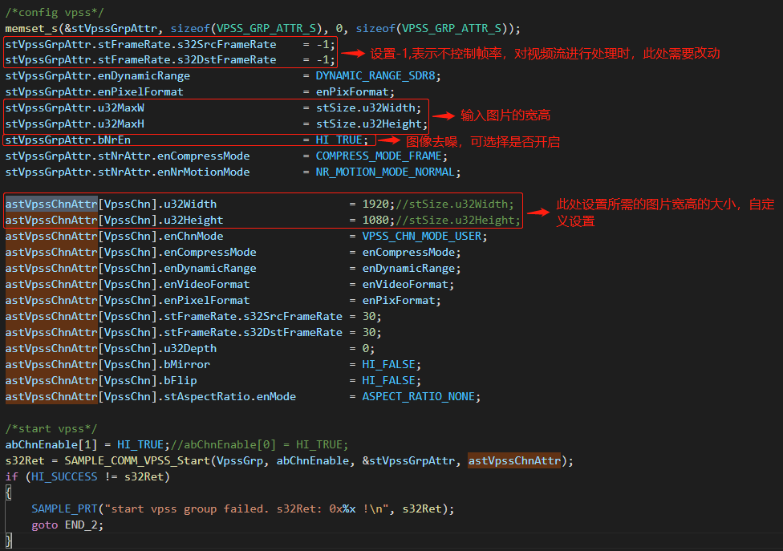
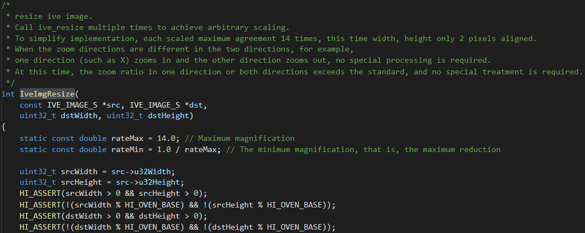

## 3.2 图像Resize

### 3.2.1 VPSS

VPSS(Video Process Sub-System)是视频处理子系统，支持的具体图像处理功能包括FRC(Frame Rate Control)、CROP、Sharpen、3DNR、Scale、像素格式转换、LDC、Spread、固定角度旋转、任意角度旋转、鱼眼校正、Cover/Coverex、Overlayex、Mosaic、Mirror/Flip、HDR、Aspect Ratio、压缩解压等。

VPSS对用户提供组（GROUP）的概念。最大个数请参见 VPSS_MAX_GRP_NUM 定义，各GROUP分时复用 VPSS 硬件，硬件依次处理各个组提交的任务。缩放，对图像进行缩小放大。物理通道水平、垂直最大支持 15 倍缩小，最大支持 16 倍放大；扩展通道水平、垂直最大支持 30 倍缩小，最大支持 16 倍放大。

通过VPSS实现图像resize方法如下：

可参考**源码的device/soc/hisilicon/hi3516dv300/sdk_linux/sample/platform/svp/ive/sample**路径下的sample_ive_kcf.c接口中的config vpss参数进行配置，核心围绕VPSS_GRP_ATTR_S、VPSS_CHN_ATTR_S结构体来展开，VPSS_GRP_ATTR_S结构体定义如下：

**VPSS_GRP_ATTR_S**

【说明】

* 定义VPSS GROUP属性。

【定义】

【成员】

* 请参考**源码的device/soc/hisilicon/hi3516dv300/sdk_linux/sample/doc中**的《HiMPP媒体处理软件 V4.0 开发参考.pdf》文档中的VPSS_GRP_ATTR_S结构体成员的内容。

【注意事项】

* **源码的device/soc/hisilicon/hi3516dv300/sdk_linux/sample/doc中**的《HiMPP媒体处理软件 V4.0 开发参考.pdf》文档中的VPSS_GRP_ATTR_S结构体注意事项内容。

VPSS_CHN_ATTR_S结构体定义如下：

**VPSS_CHN_ATTR_S**

【说明】

* 定义VPSS物理通道的属性。

【定义】

【成员】

注：u32Width及u32Height请参考**源码的device/soc/hisilicon/hi3516dv300/sdk_linux/sample/doc中**的《HiMPP媒体处理软件 V4.0 开发参考.pdf》文档中的表5-6内容

【注意事项】

* **源码的device/soc/hisilicon/hi3516dv300/sdk_linux/sample/doc中**的《HiMPP媒体处理软件 V4.0 开发参考.pdf》中的VPSS_CHN_ATTR_S结构体注意事项内容。

将void SAMPLE_IVE_Kcf(void){}接口按照下图进行配置：

以下截图可在device/soc/hisilicon/hi3516dv300/sdk_linux/sample/platform/svp/ive/sample/sample_ive_kcf.c文件中找到

### 3.2.2 VGS

VGS是视频图形子系统，全称为Video GraphicsSub-System。支持对一幅输入图像进行处理，如进行缩放、像素格式转换、视频存储格式转换、压缩/解压、打COVER、打OSD、画线、旋转、动态范围转换等处理。

关于VGS的基本概念、功能描述请参考**源码的device/soc/hisilicon/hi3516dv300/sdk_linux/sample/doc中**的《HiMPP媒体处理软件 V4.0 开发参考.pdf》第10章内容，这里不再详细论述。

接下来讲解通过VGS方式对图片进行RESIZE，其涉及的关键底层API接口如下：

**HI_MPI_VGS_BeginJob**

【描述】

* 启动一个job。

【语法】

* HI_S32 HI_MPI_VGS_BeginJob(VGS_HANDLE *phHandle);

【参数】

【返回值】

【需求】

* 头文件：hi_comm_vgs.h、mpi_vgs.h

* 库文件：libmpi.a

【注意】

* 可一次启动多个job，但必须判断HI_MPI_VGS_BeginJob函数返回成功后才能使用phHandle返回的HANLDE

* phHandle不能为空指针或非法指针。

**HI_MPI_VGS_AddScaleTask**

【描述】

* 往一个已经启动的job里添加缩放task。

【语法】

* HI_S32 HI_MPI_VGS_AddScaleTask(VGS_HANDLE hHandle, const VGS_TASK_ATTR_S *pstTask, VGS_SCLCOEF_MODE_E enScaleCoefMode);

【参数】

【返回值】

【需求】

* 头文件：hi_comm_vgs.h、mpi_vgs.h

* 库文件：libmpi.a

【注意】

* hHandle标识的job必须是已经启动的job。

* task属性必须满足VGS的能力。

* 如果此接口返回失败，如不需再添加其他任务，可以调用HI_MPI_VGS_EndJob接口提交已经添加的task，否则必须调用HI_MPI_VGS_CancelJob接口取消掉hHandle标识的job。否则会导致hHandle标识的job不能再被循环利用。

* 如果宽（高）度的缩小倍数大于15倍时，要求输入图像的宽（高）度4像素对齐。

* 用户态调用VGS做10bit位宽数据压缩时，要注意扩展地址和扩展stride等参数的配置，具体配置方法参考VGS 10bit位宽数据压缩sample。

* 缩放任务比较灵活，不限制用户输入输出是否使用同一块VB。

* 2阶缩放系数仅Hi3516EV200支持

* 支持非VB内存的物理地址，用户只需配置正确的物理地址即可，无需配置PoolId和虚拟地址，但用户需要保证物理连续的内存大小足够。

**HI_MPI_VGS_EndJob**

【描述】

* 提交一个job。

【语法】

* HI_S32 HI_MPI_VGS_EndJob(VGS_HANDLE hHandle);

【参数】

【返回值】

【需求】

* 头文件：hi_comm_vgs.h、mpi_vgs.h

* 库文件：libmpi.a

【注意】

* hHandle标识的job必须是已经启动的job。

* 如果此接口返回失败，必须调用HI_MPI_VGS_CancelJob接口取消掉hHandle标识的job。否则会导致hHandle标识的job不能再被循环利用。

**HI_MPI_VGS_CancelJob**

【描述】

* 取消一个job。

【语法】

* HI_S32 HI_MPI_VGS_CancelJob(VGS_HANDLE hHandle);

【参数】

【返回值】

【需求】

* 头文件：hi_comm_vgs.h、mpi_vgs.h

* 库文件：libmpi.a

【注意】

* hHandle标识的job必须是已经启动的job。

### 3.2.3 IVE

IVE（IntelligentVideoEngine）是上海海思媒体处理芯片智能分析系统中的硬件加速模块。用户基于IVE开发智能分析方案可以加速智能分析，降低CPU占用。当前IVE提供的算子可以支撑开发视频诊断、周界防范等智能分析方案。

通过IVE来可实现图像的resize，可通过**源码的device/soc/hisilicon/hi3516dv300/sdk_linux/sample/taurus/resize_crop/smp/smp_resize_crop.c文件中**的**IveImgResize**接口进行实现，如下图所示：

分析上图可以发现，其中const IVE_IMAGE_S *src为待缩放的原始image，IVE_IMAGE_S *dst为保存缩放后的image，uint32_t dstWidth为需要缩放的width，uint32_t dstHeight为需要缩放的height。分析IveImgResize函数，接下来对IveImgResize函数调用的底层API进行如下解读：

**HI_MPI_IVE_Resize**

【描述】

* 创建图像缩放任务，支持bilinear、area插值缩放，支持多张U8C1\U8C3_PLANAR图像同时输入做一种类型的缩放。

【语法】

* HI_S32 HI_MPI_IVE_Resize(IVE_HANDLE *pIveHandle, IVE_SRC_IMAGE_S astSrc[], IVE_DST_IMAGE_S astDst[], IVE_RESIZE_CTRL_S *pstResizeCtrl, HI_BOOL bInstant);

【参数】

【返回值】

【需求】

* 头文件：hi_comm_ive.h、hi_ive.h、mpi_ive.h

* 库文件：libive.a（PC上模拟用ive_clib2.1.lib）

【注意】

* 基于OpenCV中resize实现，IVE_RESIZE_MODE_LINEAR、IVE_RESIZE_MODE_AREA分别对应OpenCV resize的INTER_LINEAR、INTER_AREA。

* 支持U8C1、U8C3_PLANAR混合图像数组输入，但所有图像的缩放模式相同。

* 最大支持16倍缩放。

* pstResizeCtrl→stMem内存至少需要25*U8C1_NUM + 49 * (pstResizeCtrl->u16Num –U8C1_NUM)字节，其中U8C1_NUM为混合图像数组中U8C1图像的数目。

**HI_MPI_IVE_Query**

【描述】

* 查询已创建任务完成情况。

【语法】

* HI_S32 HI_MPI_IVE_Query(IVE_HANDLE IveHandle, HI_BOOL *pbFinish, HI_BOOL bBlock);

【参数】

【返回值】

【需求】

* 头文件：hi_comm_ive.h、hi_ive.h、mpi_ive.h

* 库文件：libive.a（PC上模拟用ive_clib2.x.lib）

【注意】

* 在用户使用IVE任务结果前，为确保IVE任务已完成，用户可以使用阻塞方式调用此接口查询。

* IVE内部是按任务创建顺序依次执行任务的，所以用户不必每次都使用查询接口，如用户依次创建了A，B两个任务，那么如果B任务完成了，这个时候A任务肯定也完成了，此时使用A任务的结果时不必再次调用查询接口。

* 返回值为HI_ERR_IVE_QUERY_TIMEOUT（查询超时）时，可以继续查询。

* 返回值为HI_ERR_IVE_SYS_TIMEOUT（系统超时）时，用户的IVE任务必须全部重新提交。

### 3.2.4 Resize sample

* 以IVE为例，讲述如何跑通resize，该部分请参考[ resize_crop操作指导](../resize_crop/README.md)的Resize部分的内容。

