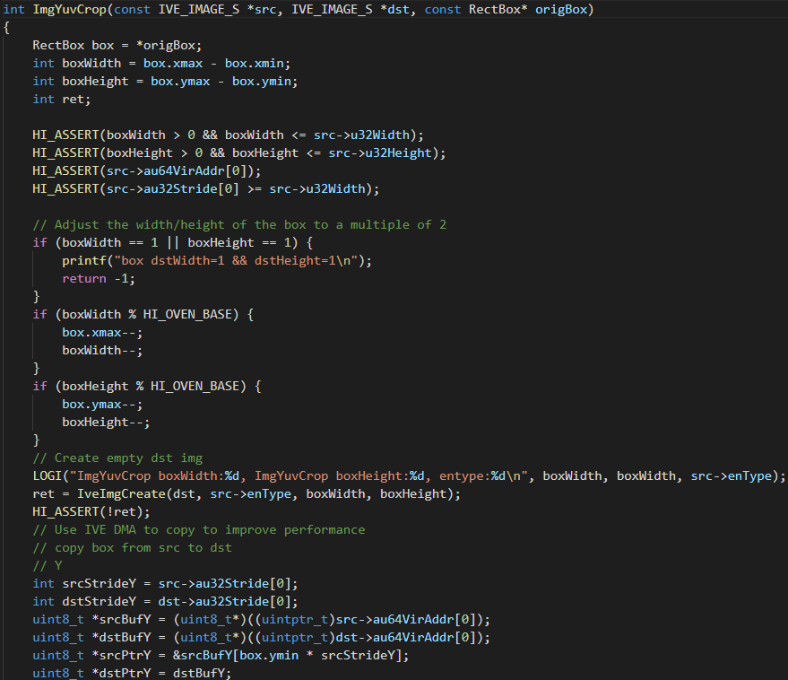

## 3.3 图像Crop

### 3.3.1 VPSS

VPSS(Video Process Sub-System)是视频处理子系统，VPSS对输入图像进行裁剪，属于组裁剪的范畴，SDK封装了相关接口，如：设置VPSS CROP属性HI_MPI_VPSS_SetGrpCrop、获取 VPSS CROP 功能属性HI_MPI_VPSS_GetGrpCrop

SDK中实现路径在**源码的device/soc/hisilicon/hi3516dv300/sdk_linux/include中**的mpi_vpss.h里面，如下图所示：

对HI_MPI_VPSS_SetGrpCrop API接口阐述如下：

**HI_MPI_VPSS_SetGrpCrop**

【语法】

* HI_S32 HI_MPI_VPSS_SetGrpCrop(VPSS_GRP VpssGrp, const VPSS_CROP_INFO_S *pstCropInfo);

【参数】

【返回值】

【需求】

* 头文件：hi_comm_vpss.h、mpi_vpss.h

* 库文件：libmpi.a

【注意】

* GROUP 必须已创建

* 通道 AUTO 模式下不支持。 

* 如果裁剪区域超出图像范围，丢弃超出部分图像，优先保证裁剪坐标与所设置的 参数相同。

* 通道裁剪不能与幅形比同时开启。

* 通道做任意角度旋转、LDC、Spread 处理或者其绑定的扩展通道开启鱼眼校正时 不支持再做通道裁剪。

* 物理通道做裁剪时，绝对模式裁剪要求配置的裁剪坐标和宽高 2 像素对齐，相对 模式裁剪计算出的坐标和宽高自动向下 2 像素对齐；扩展通道做裁剪时，如果处 理的是 8bit YUV，裁剪坐标和宽高要求 2 像素对齐，如果处理的是 10bit YUV， 裁剪 x 坐标会自适应向下做 4 对齐。

* 扩展通道先做裁剪，后做缩放。

对HI_MPI_VPSS_GetChnCrop API接口阐述如下：

**HI_MPI_VPSS_GetChnCrop**

【语法】

* HI_S32 HI_MPI_VPSS_GetChnCrop(VPSS_GRP VpssGrp, VPSS_CHN VpssChn, VPSS_CROP_INFO_S *pstCropInfo);

【参数】

【返回值】

【需求】

* 头文件：hi_comm_vpss.h、mpi_vpss.h 

* 库文件：libmpi.a

【注意】

* GROUP必须已经创建

注：关于VPSS实现组裁剪API接口的详细定义，请参考**源码的device/soc/hisilicon/hi3516dv300/sdk_linux/sample/doc中**的《HiMPP媒体处理软件 V4.0 开发参考.pdf》文档中的第5章节视频处理子系统中的5.3章节API参考部分。

### 3.3.2 VGS

扩展通道裁剪，VPSS调用VGS对扩展通道的输出图像进行裁剪，VPSS扩展通道调用VGS做裁剪、缩放时，需要额外申请一块临时buffer，用于存放处理后的图像，因此也需要一次额外读写DDR。关于Hi3516DV300中的VPSS数据流图如下：

其SDK封装了相关接口，如：设置VPSS通道裁剪功能属性HI_MPI_VPSS_SetChnCrop、获取VPSS通道裁剪功能属性HI_MPI_VPSS_GetChnCrop

SDK中实现路径在**源码的device/soc/hisilicon/hi3516dv300/sdk_linux/include中**的mpi_vpss.h里面，如下图所示：

对HI_MPI_VPSS_SetChnCrop API接口阐述如下：

**HI_MPI_VPSS_SetChnCrop**

【语法】

* HI_S32 HI_MPI_VPSS_SetChnCrop(VPSS_GRP VpssGrp, VPSS_CHN VpssChn, const VPSS_CROP_INFO_S *pstCropInfo);

【参数】

【返回值】

【需求】

* 头文件：hi_comm_vpss.h、mpi_vpss.h 

* 库文件：libmpi.a

【注意】

* GROUP 必须已创建。

* 通道AUTO模式下不支持。

* 如果裁剪区域超出图像范围，丢弃超出部分图像，优先保证裁剪坐标与所设置的参数相同。

* 通道裁剪不能与幅形比同时开启。

* 通道做任意角度旋转、LDC、Spread 处理或者其绑定的扩展通道开启鱼眼校正时不支持再做通道裁剪。

* 物理通道做裁剪时，绝对模式裁剪要求配置的裁剪坐标和宽高 2 像素对齐，相对模式裁剪计算出的坐标和宽高自动向下 2 像素对齐；扩展通道做裁剪时，如果处理的是 8bit YUV，裁剪坐标和宽高要求 2 像素对齐，如果处理的是 10bit YUV，裁剪 x 坐标会自适应向下做 4 对齐。

* 扩展通道先做裁剪，后做缩放。

对HI_MPI_VPSS_GetChnCrop API接口阐述如下：

**HI_MPI_VPSS_GetChnCrop**

【语法】

* HI_S32 HI_MPI_VPSS_GetChnCrop(VPSS_GRP VpssGrp, VPSS_CHN VpssChn, VPSS_CROP_INFO_S *pstCropInfo);

【参数】

【返回值】

【需求】

* 头文件：hi_comm_vpss.h、mpi_vpss.h

* 库文件：libmpi.a

【注意】

* GROUP 必须已创建。

注：关于VPSS实现扩展通道裁剪API接口的详细定义，请参考**源码的device/soc/hisilicon/hi3516dv300/sdk_linux/sample/doc中**的《HiMPP媒体处理软件 V4.0 开发参考.pdf》文档第5章节视频处理子系统中的5.3章节API参考部分。

### 3.3.3 IVE

IVE（IntelligentVideoEngine）是上海海思媒体处理芯片智能分析系统中的硬件加速模块。用户基于IVE开发智能分析方案可以加速智能分析，降低CPU占用。当前IVE提供的算子可以支撑开发视频诊断、周界防范等智能分析方案。

通过IVE来可实现图像的crop，可通过**源码的device/soc/hisilicon/hi3516dv300/sdk_linux/sample/taurus/resize_crop/smp/smp_resize_crop.c文件中**的ImgYuvCrop接口进行实现，如下图所示：

分析该接口，其支持对yuv图片的格式进行crop，且支持crop之后的图片width和height需大于等于32像素，其通过IVE对图像进行crop。

### 3.3.4 Crop sample

* 以IVE为例，讲述如何跑通crop，该部分请参考[ resize_crop操作指导](../resize_crop/README.md)的Crop部分的内容。

