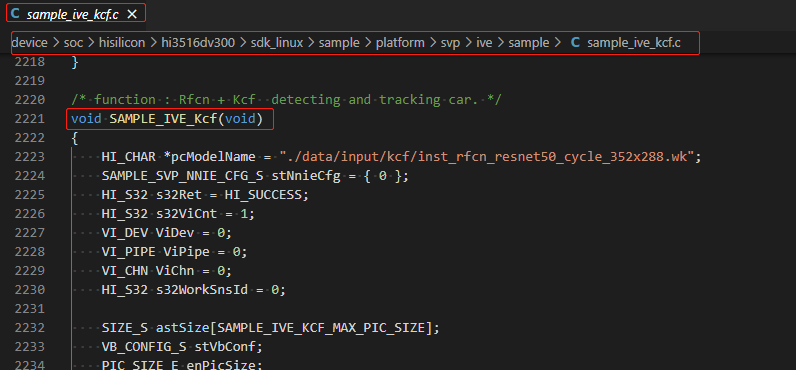

# 目标跟踪(KCF)

## 1.概述

* 基于SDK sample的KCF算子实现对汽车的跟踪，示例代码参考在device/soc/hisilicon/hi3516dv300/sdk_linux/sample/platform/svp/ive/sample路径下的sample_ive_kcf.c，如下图所示：



* 运行的主入口在device/soc/hisilicon/hi3516dv300/sdk_linux/sample/platform/svp/ive中sample_ive_main.c文件中，如下图所示：


* 关于KCF算子的其他细节，自行查阅device/soc/hisilicon/hi3516dv300/sdk_linux/sample/platform/svp/ive/sample/sample_ive_kcf.c代码即可

## 2.代码修改适配Sensor

在编译sample_ive_main.c之前，需确保OpenHarmony 小型系统的主干代码已经整编通过，**且已经按照《[修改源码及配置文件适配Taurus开发板](2.2.1.%E4%BF%AE%E6%94%B9%E6%BA%90%E7%A0%81%E5%8F%8A%E9%85%8D%E7%BD%AE%E6%96%87%E4%BB%B6%E9%80%82%E9%85%8DTaurus%E5%BC%80%E5%8F%91%E6%9D%BF.md)》的内容进行修改**。由于sample_ive_kcf.c适配的sensor是vpss0 chn0输出1080P，chn1 输出PIC_CIF分辨率，但是我们的摄像头是IMX335_4M，当使用4M或5M时序时，会因为规格限制出现报错，所以我们需要修改vpss0 chn1输出输出1080P，chn12输出PIC_CIF，就可以正常输出图像。

以下截图可在device/soc/hisilicon/hi3516dv300/sdk_linux/sample/platform/svp/ive/sample/sample_ive_kcf.c文件中找到

* 步骤1：修改SAMPLE_IVE_Rfcn_Detect()函数中HI_MPI_VPSS_ReleaseChnFrame()接口。

```c
s32Ret = HI_MPI_VPSS_ReleaseChnFrame(s32VpssGrp, 2, &stExtFrmInfo); // 第1682行,将第二个参数修改为2
```


* 步骤2：修改SAMPLE_IVE_GetFrame()函数中的HI_MPI_VPSS_GetChnFrame()和HI_MPI_VPSS_ReleaseChnFrame()接口。

```c++
s32Ret = HI_MPI_VPSS_GetChnFrame(0, 1, &astVideoFrame[0], s32MilliSec); // 第1704行，将第二个参数改为1

s32Ret = HI_MPI_VPSS_GetChnFrame(0, 2, &astVideoFrame[1], s32MilliSec); // 第1721行，将第二个参数改为2

s32Ret = HI_MPI_VPSS_ReleaseChnFrame(0, 1, &astVideoFrame[0]); // 第1737行，将第二个参数改为1
```


* 步骤3：修改SAMPLE_IVE_KcfTracking()函数中的HI_MPI_VPSS_ReleaseChnFrame()接口。

```c++
(HI_VOID)HI_MPI_VPSS_ReleaseChnFrame(0, 1, &pstQueueNode->stFrameInfo); // 第2047行，将第二个参数改为1
```


* 步骤4：修改SAMPLE_IVE_KcfDeInit()函数中的HI_MPI_VPSS_ReleaseChnFrame()接口。

```c++
(HI_VOID)HI_MPI_VPSS_ReleaseChnFrame(0, 2, &pstIveKcfInfo->astFrameInfo[1]); // 第2059行，将第二个参数改为2

(HI_VOID)HI_MPI_VPSS_ReleaseChnFrame(0, 1, &pstQueueNode->stFrameInfo); // 第2074行，将第二个参数改为1
```


* 步骤5：修改SAMPLE_IVE_Kcf()函数中的2345-2347行，如下所示

```c
# 将SAMPLE_IVE_Kcf()函数中的2345-2347行，从
for (i = 0; i < SAMPLE_IVE_KCF_VPSS_MAX_CHN; i++) {
    astVpssChnAttr[i].u32Width = astSize[i + 1].u32Width;
    astVpssChnAttr[i].u32Height = astSize[i + 1].u32Height;

# 改成
for (i = 1; i < SAMPLE_IVE_KCF_VPSS_MAX_CHN + 1; i++) {
    astVpssChnAttr[i].u32Width = astSize[i].u32Width;
    astVpssChnAttr[i].u32Height = astSize[i].u32Height;
```


由于我的显示器是只支持1080P60帧，所以需要修改device/soc/hisilicon/hi3516dv300/sdk_linux/sample/platform/common/sample_comm_vo.c文件中SAMPLE_COMM_VO_GetDefConfig()函数的VO 输出配置，这个请根据自己的显示器支持的参数进行配置。

```c++
pstVoConfig->enIntfSync = VO_OUTPUT_1080P60; // 第483行的VO_OUTPUT_1080P30; 改成 VO_OUTPUT_1080P60;
```


## 3.编译

在单编sample_ive_main.c前，需修改目录下的一处依赖，进入//device/soc/hisilicon/hi3516dv300/sdk_linux目录下，通过修改BUILD.gn，在deps下面新增target，``"sample/platform/svp/ive:hi3516dv300_ive_sample"``，如下图所示：


* 点击Deveco Device Tool工具的Build按键进行编译，具体的编译过程这里不再赘述，编译成功后，如下图所示：


* 编译成功后，即可在out/hispark_taurus/ipcamera_hispark_taurus_linux/rootfs/bin目录下，生成 ohos_ive_demo可执行文件，如下图所示：


## 4. 拷贝可执行程序和依赖文件至开发板的mnt目录下

**方式一：使用SD卡进行资料文件的拷贝**

* 首先需要自己准备一张SD卡
* 步骤1：将编译后生成的可执行文件拷贝到SD卡中。
* 步骤2：将device\soc\hisilicon\hi3516dv300\sdk_linux\out\lib\目录下的**libvb_server.so和 libmpp_vbs.so**拷贝至SD卡中
* 步骤3：将device/soc/hisilicon/hi3516dv300/sdk_linux/sample/platform/svp/ive/目录下的 data文件拷贝至SD卡中。（前提是按照《[获取sample依赖的资源文件到本地](6.2.%E8%8E%B7%E5%8F%96sample%E4%BE%9D%E8%B5%96%E7%9A%84%E8%B5%84%E6%BA%90%E6%96%87%E4%BB%B6%E5%88%B0%E6%9C%AC%E5%9C%B0.md)》文档获取了资源文件）


* 步骤4：可执行文件拷贝成功后，将内存卡插入开发板的SD卡槽中，可通过挂载的方式挂载到板端，可选择SD卡 mount指令进行挂载。

```shell
mount -t vfat /dev/mmcblk1p1 /mnt
# 其中/dev/mmcblk1p1需要根据实际块设备号修改
```

* 挂载成功后，如下图所示：


**方式二：使用NFS挂载的方式进行资料文件的拷贝**

* 首先需要自己准备一根网线
* 步骤1：参考[博客链接](https://blog.csdn.net/Wu_GuiMing/article/details/115872995?spm=1001.2014.3001.5501)中的内容，进行nfs的环境搭建
* 步骤2：将编译后生成的可执行文件拷贝到Windows的nfs共享路径下
* 步骤3：将device\soc\hisilicon\hi3516dv300\sdk_linux\out\lib\目录下的**libvb_server.so和 libmpp_vbs.so**拷贝至Windows的nfs共享路径下
* 步骤4：将device/soc/hisilicon/hi3516dv300/sdk_linux/sample/platform/svp/ive/目录下的 data文件拷贝至Windows的nfs共享路径下。（前提是按照《[获取sample依赖的资源文件到本地](6.2.%E8%8E%B7%E5%8F%96sample%E4%BE%9D%E8%B5%96%E7%9A%84%E8%B5%84%E6%BA%90%E6%96%87%E4%BB%B6%E5%88%B0%E6%9C%AC%E5%9C%B0.md)》文档获取了资源文件）


* 步骤5：执行下面的命令，将Windows的nfs共享路径挂载至开发板的mnt目录下

```
mount -o nolock,addr=192.168.200.1 -t nfs 192.168.200.1:/d/nfs /mnt
```

## 5.拷贝mnt目录下的文件至正确的目录下

* 执行下面的命令，拷贝mnt目录下面的ohos_ive_demo和data至userdata目录，拷贝mnt目录下面的libvb_server.so和 libmpp_vbs.so至/usr/lib/目录下,

```
cp /mnt/ohos_ive_demo  /userdata
cp /mnt/data /userdata -rf
cp /mnt/*.so /usr/lib/
```


* 执行下面的命令，给ohos_ive_demo文件可执行权限

```
chmod 777 /userdata/ohos_ive_demo
```

## 6. 功能验证

* 上述步骤完成后，需要将mini HDMI线一端接口Tauru套件的HDMI口(mini HDMI线没有提供，需要开发者自行购买)，另一端接显示器，接下来执行下面的命令，启动可执行文件

```
cd /userdata

./ohos_ive_demo 7
```


* 如果需要退出程序，就敲两下回车，等待一段时间，程序就会退出运行


