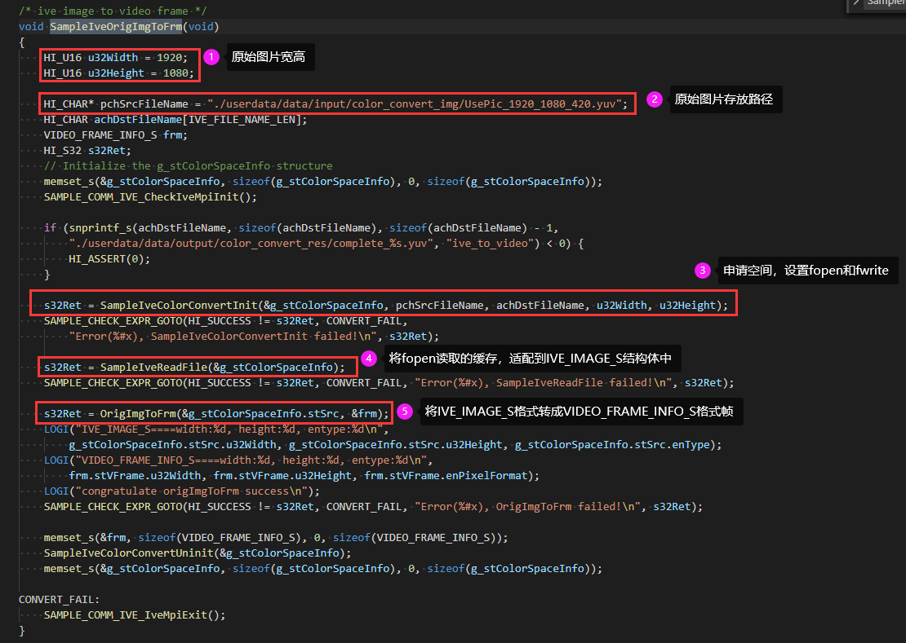
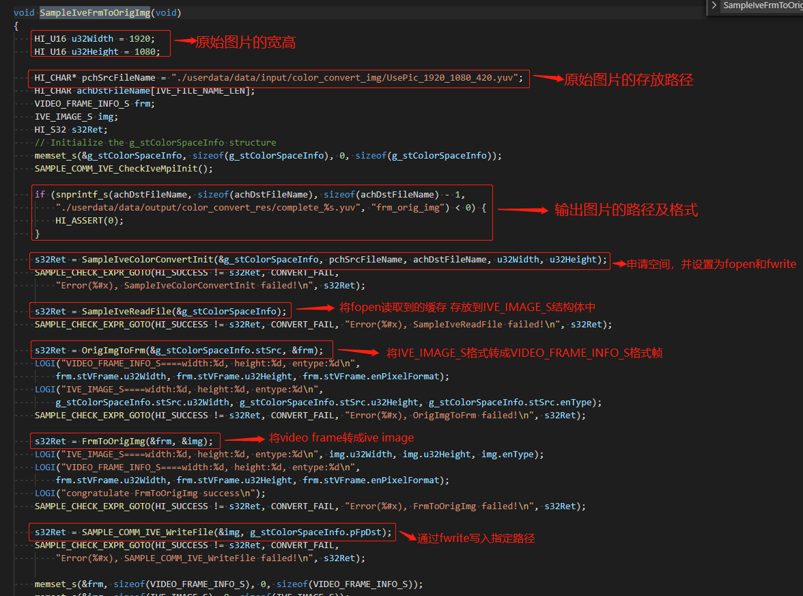
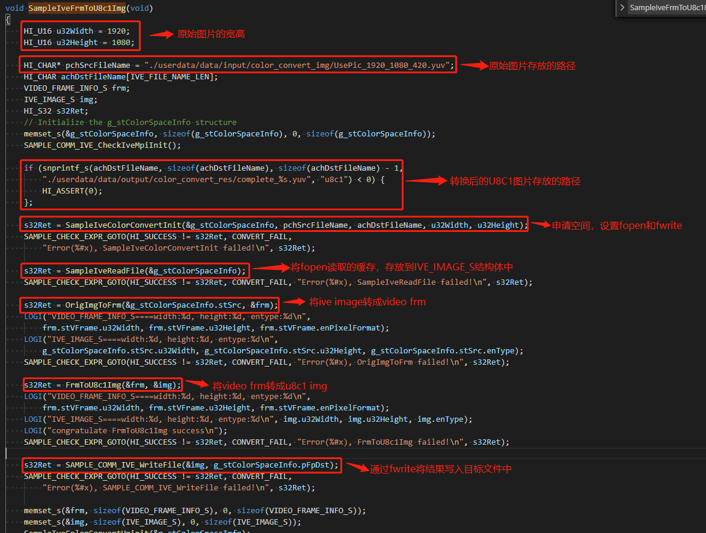
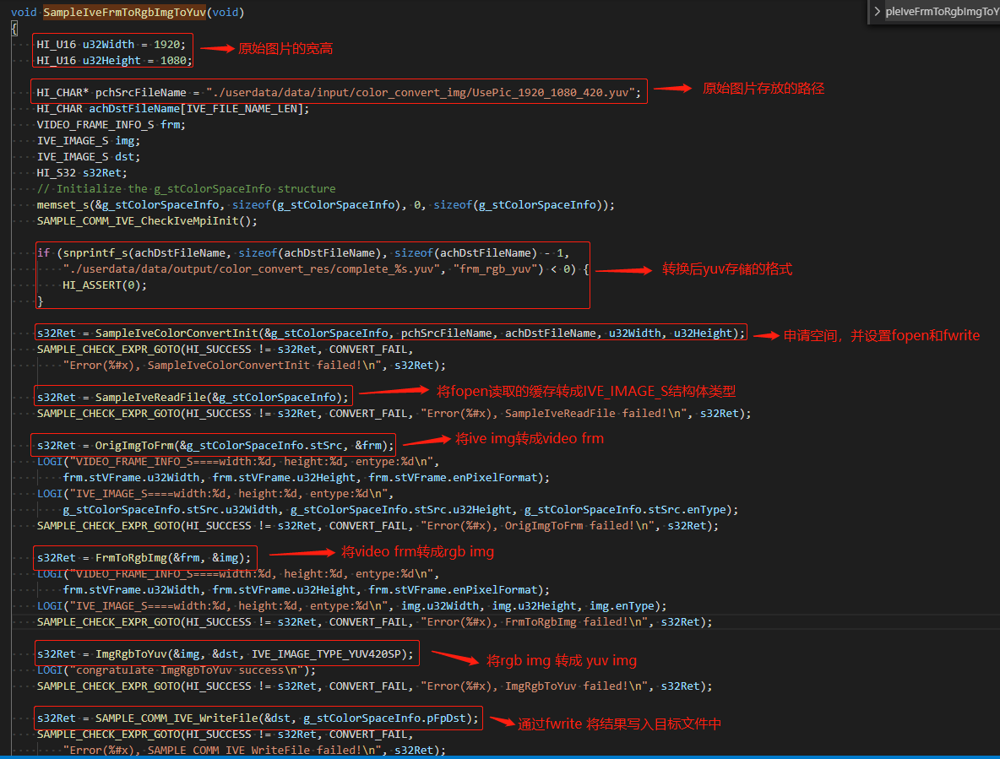
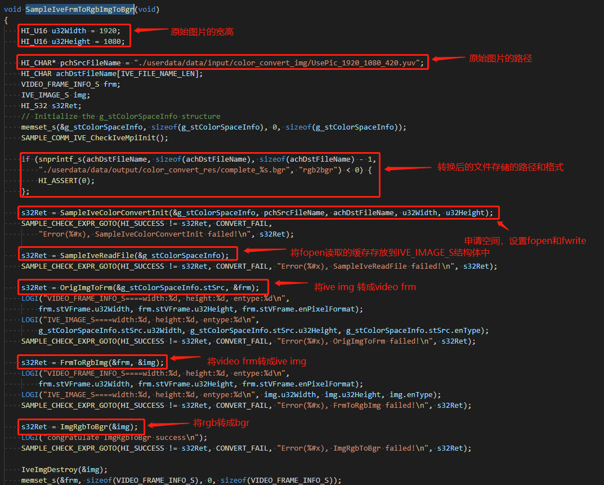

### 4.1.6 色彩空间转换算子

#### 4.1.6.1 色彩空间转换算子实现

通过IVE加速过得色彩空间转换算子可以提高软件在板端运行效率，充分利用硬件资源来为软件服务，color_space_convert中定义了如下空间转换算子，可参考**源码的device/soc/hisilicon/hi3516dv300/sdk_linux/sample/taurus/color_space_convert/smp中**的smp_color_space_convert.h，如下图所示：

详细讲解下各算子的用法。

以下算子的实现都可以在device/soc/hisilicon/hi3516dv300/sdk_linux/sample/taurus/color_space_convert/smp/smp_color_space_convert.c中找到

###### SAMPLE_IVE_OrigImgToFrm

* 功能：ive image to video frame.

* 具体实现方式如下：

###### SAMPLE_IVE_FrmToOrigImg

* 功能：video frame to ive image.

* 具体实现方式如下：

###### SAMPLE_IVE_FrmToU8c1Img

* 功能：video YUV frame to ive image (U8C1)

* 具体实现方式如下：

###### SAMPLE_IVE_FrmToRgbImg_ImgRgbToYuv

* 具体实现方式如下：

* 功能：ive image RGB to YUV

###### SAMPLE_IVE_FrmToRgbImg_ImgRgbToBgr

* 功能：ive image RGB to BGR

* 具体实现方式如下：

