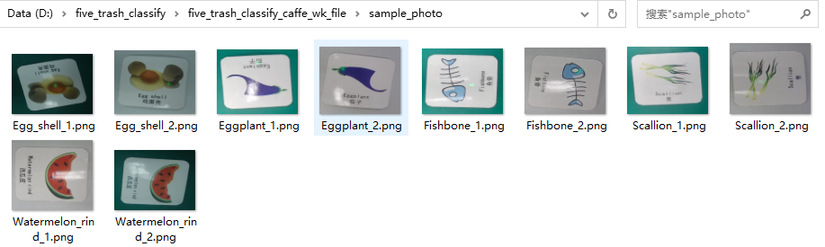

### 4.2.3 分类网

#### 4.2.3.1 训练思路

一般来讲，训练出一个神经网络模型，做成端到端模型并可视化需要经过视频录制、数据集制作和标注、模型训练（本地）、模型转换（模型-caffe）、模型量化、仿真、板端推理可视化。本章节以垃圾分类为例，重点介绍分类网（resnet18），从视频录制、数据集制作和标注、模型训练、模型转换来展开论述。

训练流程图如下：

 

#### 4.2.3.2 视频录制

* 参考[store_sample操作指导](../store_sample/README.md)的步骤进行视频的录制。
* 将录制好的视频按类整理（这里自行创建目录即可），可参考下图：

​	本文档以垃圾分类训练图片为例进行指导和说明。本文录制了20种垃圾样例视频，具体垃圾样本如下表所示：


| **垃圾性质** | **种类** | **具体样本**                                   |
| ------------ | -------- | ---------------------------------------------- |
| 厨余垃圾     | 6        | 蘑菇、葱、茄子、西瓜皮、蛋壳、鱼骨             |
| 有害垃圾     | 4        | 废旧电池、过期化妆品、医用纱布、创可贴         |
| 可回收垃圾   | 6        | 易拉罐、旧手提包、牛奶盒、牙刷、旧架子、旧玩偶 |
| 其他垃圾     | 4        | 盘子、砖块、坏马桶、烟蒂                       |

* 视频录制注意事项：

  * 录制视频时保证训练的可靠性，素材全部在镜头之内，防止素材跑出镜头的情况

  * 可以选不同的背景色来录制，如白色、绿色等，本次示例选择白色和绿色背景色来录制

  * 对垃圾分类样本进行视频码流采集，采集过程中可通过镜头平移和旋转的方法来录制，增加样本的多样性

* 处理录制好的视频：

​	本次录制的样例视频为.h264格式，分辨率为1920*1080，实际使用时，建议将h264格式转成通用mp4格式的视频，可使用格式工厂或者其他工具进行格式转换。格式工厂的具体转换步骤可参考《[使用格式工厂将H264文件转成mp4文件](https://blog.csdn.net/Wu_GuiMing/article/details/123717780)》。

#### 4.2.3.3 数据集制作和标注

**步骤1：搭建FFmpeg环境：**

* 进入[FFmpeg网站](https://ffmpeg.org/download.html)，选择windows版本，直接下载exe文件即可，本文的FFmpeg版本仅做参考，开发者可参考下图选择最新版本即可。


* 下载完成后解压该文件，本示例解压在D盘，这里自行解压即可，如下图所示：


* 复制\bin文件夹的目录


* 在“此电脑”上 右键-属性-高级系统设置，在高级选项卡点击环境变量，如下图所示：


* 在系统变量下找到path，然后点击编辑，再点新建，将刚才复制的\bin\地址粘贴进去，如下图所示：


* windows+R键，运行cmd，输入ffmpeg，若显示如下，则表示安装成功。


**步骤2：制作数据集**

* 在dos窗口下，将路径切换到存储视频的目录下，本示例路径如下图所示：


* 输入下面的命令，即可实现素材的制作，本实例每一秒截取一张。以如下图所示：

```
ffmpeg –i xxx.mp4 –r 1 –y xxx_%06d.png  # xxx为你视频文件的名字
```


* 截取成功后，即可在路径下显示png格式的素材，如下图所示：


**步骤3：数据清洗**

* 数据获取成功之后，需要对数据进行清洗，即对数据进行重新审查和校验的过程，目的在于删除不完整的数据、错误的数据、重复的数据，以便更好的进行数据标注，保证最终模型训练的效果。

**步骤4：数据标注**

* 本次示例以分类网制作素材集，首先制作分类目录，建议按照 标号_垃圾性质_垃圾名称来分类，可参考下图：


**分类网除正常的分类目标外，最后还需添加一类作为背景集，背景集选择常用背景，防止误报，上图21_Other_background为背景集。**

* 将制作好的垃圾素材放置该目录下，素材命名需遵循分类规则，最好数据标注前缀跟上一层folder同名，如下图所示：


对垃圾分类样本图片随机分组分别作为训练数据集及验证数据集（注：分组过程中可对图片进行随机采样，也可以对码流样本随机采样，尝试构建多样性验证集以有效评估分类模型），建议对采样数据10%用作验证集即可。

在模型训练测和后端推理测需要1920*1080进行缩放和裁剪，resize为256*256，crop为224*224。

#### 4.2.3.4 分类网本地训练

##### 4.2.3.4.1 本地训练环境搭建

​	**本地训练环境搭建须知**

* 本文环境采用2张NVIDIA GPU服务器环境来做训练，训练环境如下图所示：


**本地环境搭建**

* 安装需求

  * Python 3.6+

  * PyTorch 1.3+

  * MMCV

  * 兼容的MMClassification和MMCV版本如下。请安装正确版本的MMCV，以避免安装问题，如下表所示。


**软件包安装**

​	本文所有的环境都是基于本地linux 服务器版本进行安装。

* 步骤1：Anaconda安装

  首先下载anaconda安装脚本，在有GPU环境的服务器下，本文选择Anaconda3-5.2.0-Linux-x86_64，切换到安装目录下，在linux命令端输入：

  ```sh
  wget https://repo.anaconda.com/archive/Anaconda3-5.2.0-Linux-x86_64.sh 
  ```

  如下图所示：


​       由于**Anaconda3-5.2.0-Linux-x86_64.sh**文件较大，下载过程需要耐心等待，下载成功后，在下载目录下即可看到该文件，如下图所示：


下载成功后，安装Anaconda，在命令行输入下面的命令，如下图所示：

```shell
bash Anaconda3-5.2.0-Linux-x86_64.sh
```


按enter键，即可开始安装，如下图所示：


在Do you accept the license terms? [yes|no]，输入yes


稍等片刻等待安装完成。若安装成功，输入conda --version，即可显示版本号，如下图所示：


若运行过程中出现：conda command not found类似字样，需配置下环境，输入：

``` shell
export PATH="/home/xxx/anaconda3/bin:$PATH"
# /home/xxx/anaconda3/ 需根据开发者服务器实际路径进行替换，替换成功后，退出terminal并再次打开terminal即可。
```

创建conda虚拟环境，并激活，由于安装包较大，在安装之前先配置下清华源，加速下载，输入：

```sh
conda config --add channels https://mirrors.tuna.tsinghua.edu.cn/anaconda/pkgs/free/
conda config --add channels https://mirrors.tuna.tsinghua.edu.cn/anaconda/pkgs/main/ 
```


* 步骤2：安装open-mmlab和python

在服务器路径下输入``conda create -n open-mmlab python=3.6``，本环境安装的python版本为3.6.13，如下图所示：


在安装开始会提示The following packages will be downloaded，The following NEW packages will be INSTALLED字样，若出现Proceed ([y]/n)? y，选择y，如下图所示：


若下载过程中出现CondaError: Downloaded bytes did not match Content-Length，表示某些包没有下载成功，这里与网络速度有关，再次输入``conda create -n open-mmlab python=3.6``下载即可，系统会自动下载没有下载成功的软件，如下图所示：


载成功后，会出现如下字样，如下图所示：


* 步骤3：激活虚拟环境

输入``conda activate open-mmlab``命令，若出现如下图所示的(open-mmlab) 显示，表示显示成功。


若出现激活击败的情况，按照如下步骤操作即可，如下图所示：

```shell
# 激活环
source activate

# 退出环境
source deactivate
conda activate open-mmlab
```


**注：以下软件包和环境的安装均需要在(open-mmlab)虚拟环境下进行。**

* 步骤4：安装跟CUDA版本对应的torch

  例如：本文的CUDA版本为10.0，可通过nvcc --verision查看，如下图所示：

  

CUDA匹配的torch和torchversion版本，可通过如下链接查看，这里需读者仔细确认，以免安装错误，耽误安装时间和开发效率。

```
https://download.pytorch.org/whl/cu100/torch_stable.html 
```

本环境CUDA版本为10.0，torch版本为1.4.0，torchvision版本为0.4.0, 安装torch包，输入``pip3 install torch==1.4.0``命令，若安装成功，则出现Successfully installed torch-1.4.0


* 步骤5：安装跟CUDA版本对应torchversion

输入下面的命令，安装torchvision包，如下图所示：

```
pip3 install torchvision==0.4.0
```


* 步骤6：安装mmcv包

  输入下面的命令，安装mmcv，如下图所示：

```
pip3 install mmcv
```


**代码下载**

* 步骤1：下载mmclassification代码到本地服务器

在虚拟环境(open-mmlab)下，下载v0.11.0的代码，下载链接如下：

https://github.com/open-mmlab/mmclassification/releases/tag/v0.11.0 ，即可将代码下载至相应目录下，本地训练代码文件名为mmclassification，开发者可自行进行命名，如下图所示：


cd mmclassification到该目录下，ls查看代码结构，如下图所示：


* 步骤2：安装mmclassfication所需环境和库

在mmclassification路径下，输入``pip install -e .``，这里需要注意提前安装好mmcv。


至此环境搭建结束。

##### 4.2.3.4.2 本地环境进行模型训练

* 步骤1：本地训练素材的准备和代码修改

  * 本地训练素材准备请参考4.2.3分类网（resnet18）章节中的4.2.3.2视频录制和4.2.3.3数据集制作和标注章节中的内容，这里不再详细阐述。 

  * 将生成的数据集存放在本地服务器路径下（一般为data区），本文路径如下图所示：

  

  

  * 接下来修改开源代码，需配置数据集路径，该文件路径在/mmclassification/configs/_base_/datasets目录下，这里需替换自己的数据集实际路径，安装下图所示进行修改，包括mean、std、resize、crop、data_prefix确认修改，这个务必配置对，否则影响模型训练的效果。

  

  * 修改/mmclassification/configs/_base_/models目录下resnet18.py，按下图修改即可：


* 步骤2：本地模型训练

切换到mmclassification目录下，运行下面的命令：

```shell
sh ./tools/dist_train.sh configs/resnet/resnet18_b32x8_imagenet.py 2 --work-dir ./ckpt
# 对上述命令阐述如下：
# dist_train.sh – 训练sh脚本
# configs/resnet/resnet18_b32x8_imagenet.py – 训练依赖的配置
# 2 – GPU个数
# --work-dir ./ckp – 模型存放的路径
```

若上述配置成功，即可进行训练，如下图所示：


由于训练过程消耗时间较长，请耐心等待，epoch可根据实际情况进行设置，观察训练是否收敛，准确率在一段时间内稳定不再上升时，代表训练结束，如下图所示： 


进入ckpt文件夹，即可查看训练出来的pytorch模型，如下图所示：


#### 4.2.3.5 PytorchCaffe 方案

目前 NNIE 配套软件及工具链仅支持以 Caffe 框架，使用其他框架的网络模型需要转化为Caffe框架下的模型，具体转换过程如下。

**（1）环境搭建**

模型转换需要依赖torch和torchvison，我们选择版本为torch为**1.4.0**，torchvision为**0.5.0**，python版本为**3.6.9**，可通过pip或者conda进行安装，若本地训练时已经安装，该步骤可以省略。若没有安装，可参考如下命令进行安装：

```
pip3 install torch==1.4.0 -i https://pypi.tuna.tsinghua.edu.cn/simple some-package
pip3 install torchvision==0.5.0 -i https://pypi.tuna.tsinghua.edu.cn/simple some-package
pip3 install google -i https://pypi.tuna.tsinghua.edu.cn/simple some-package
pip3 install protobuf -i https://pypi.tuna.tsinghua.edu.cn/simple some-package
```

**（2）开源代码的下载**

* 步骤1：下载pytorch2caffe代码，链接如下：

```
https://codeload.github.com/xxradon/PytorchToCaffe/zip/refs/heads/master 
```

* 步骤2：下载visionmaster代码，链接如下：

```
https://github.com/pytorch/vision/releases/tag/v0.9.1
```

下载成功后，解压该文件，存放在服务器目录下，并将vision-0.9.1拷贝至PytorchToCaffe-master目录下，如下图所示：


可将代码文件自主命名，本文命名为：pytorch_to_caffe_master，如下图所示：


**注：本文以基于renet18网络训练出来的垃圾分类模型进行阐述。**

* 步骤3：接下来对开源代码进行适配，将pytorch_to_caffe_master/Caffe目录下的layer_param.py文件中的class Layer_param()接口进行修改，如下图所示：


* 步骤3：对pytorch_to_caffe_master/example/resnet_pytorch_2_caffe.py进行修改，如下图所示：


**注意：**

```shell
# 若采用GPU去转模型，只需要将
checkpoint = torch.load('/home/hispark/code/pytorch_to_caffe_master/latest.pth',map_location = 'cpu')
# 改成
checkpoint = torch.load("/home/hispark/code/pytorch_to_caffe_master/latest.pth")
# 其他保持不变即可。
```

* 步骤4：修改/visionmaster/torchvision/models/resnet.py，如下图所示：


**（3）模型转换及结果生成**

* 模型转换时，在服务器输入：**python3.6 example/resnet_pytorch_2_caffe.py**，如下图所示：


* 转换成功后，即可在pytorch_to_caffe_master目录下生成resnet18.caffemodel和resnet18.prototxt文件。


至此，模型转换已经完成。

#### 4.2.3.6 prototxt网络层适配

##### 4.2.3.6.1 网络层参数对齐及layer检查

**（1）prototxt网络层适配**

模型prototxt网络层适配之前，请确保 4.2.3.4和4.2.3.5章节均已完成。

* 步骤1：网络层对齐及layer检查

一般来讲，pytorch2caffe自动生成的.prototxt网络需要进行手动修改，以保证量化成正确的wk模型，需要根据特定的网络特定的环境来进行修改。本文以resnet18网络训练垃圾分类生成的prototxt网络进行讲解。

首先将pytorch2caffe工具自动生成的.prototx网络文件，通过工具打开，这里选用Ultra Edit或者Notepad++均可。

观察pth转caffe运行日志，若出现pooling参数不对齐的问题，需要先将pooling参数对齐，如下图所示：


* 解决方案：

  * 将resent18网络中的maxpooling layer padding参数修改为0

  

  * 同时将生成的.prototxt文件中ceil_mode参数拿掉，因为后续wk文件时，wk不包含此入参，默认为True。

  

  * prototxt layer描述格式具有一定要求，要求层以layer开头，type以带双引号字符表示，且需将开头input_dim按下图所示更改：

  

  * Pytorch转caffe时，不包含最后一层softmax，须在full-connected layer(fc1)后手动添加。

  

  * 检查下网络，若fc1上一层layer无view1，手工加上该layer，如下图所示：

  

  * 最后核对下layer fc1 num_output是否为实际分类种类数，本文训练5类垃圾，故为5，如下图所示：

  **注：请仔细检查如下layer层中是否有bottom: “view_blob1”，若无参考下图手工加上。**


​       至此，.prototxt已经修改完毕，请保证上述每一步都修改正确，否则影响模型量化和推理结果。

##### 4.2.3.6.2 Netscope网络结构可视化

Netscope是个支持prototxt格式描述的神经网络结构的在线可视工具，它可以用来可视化Caffe结构里prototxt格式的网络结构，使用起来也较为简单，在google浏览器打开如下网址：

http://ethereon.github.io/netscope/#/editor


将适配好的.prototxt代码放到相应位置，按Shift+Enter之后，即可显示网络层级，如下图所示：


Netscope可帮助开发着可视化网络层级，判断网络层是否正确。

#### 4.2.3.7 模型量化

定义：量化的过程将caffe模型转换成可以在海思芯片上执行的wk文件，同时将float类型数据转换成int8/int16类型的数据。

相关nnie_mapper配置概念请阅读**源码的device/soc/hisilicon/hi3516dv300/sdk_linux/sample/doc中**《HiSVP 开发指南.pdf》3.5.2章节配置文件说明，如下图所示：


接下来以垃圾分类sample为例，通过RuyiStudio工具将转换好的caffemodel和prototxt量化成wk文件。

**注：以下所有路径建议采用纯英文命名，防止出现编码解析错误，为提高转换速度，加载路径层级越短越好**

**（1）mean.txt制作**

* 本文以基于resnet18垃圾分类量化wk模型为例，由于在blob1里面需要加载mean_file，如下图所示：


* 我们需提前制作好mean.txt文件，首先新建一个txt文件修改为mean.txt存放在本地，将里面内容需要跟mmclassification_master/configs/_base_/datasets/imagenet_bs32.py里面的mean值对应，如下图所示：


* mean.txt制作如下，如下图所示：


**（2）imagelist.txt制作**

由于Ruyi工具量化模型的过程中，blob1中需要加载image_list所需的文件，这里需要提前制作好。


我们在素材集里面截取典型的图片，约10张左右即可，建议宽高大于256*256，如下图sample_photo文件夹所示：



imagelist.txt里面需要添加sample_photo文件加图片的本地绝对路径，如下图所示：


**（3）RuyiStudio量化wk模型**

NNIE新建工程完成的前提下，右键.cfg文件-Open With-Mapper Configuration Editor打开.cfg文件，如下图所示：


需仔细配置.cfg里面的每一个参数，勾选Relative path。

* 首先配置Input_Setting

  

  * prototxt：选择适配之后的.prototxt，如：D:\five_trash_classify \five_trash_classify_resnet18.prototxt
  * caffemodel：选择转化出来.caffemodel，如：D:\five_trash_classify\five_trash_classify_resnet18.caffemodel
  * net_type：本实例选择CNN，需根据自己的网络来选
  * is_simulation：量化选择Inst/Chip直接部署到板端，若选择simulation，则表示在pc端仿真后再进行部署
  * markd_prototxt：按照默认即可
  * output_wk_name：按照默认或者自行命名均可

* Mapper Setting配置：


本模型为CNN模型，compile_mode选择Low-bandwidth，log_level默认选择Not print，align_bytes选择16，batch_num输入1，sparse_rate输入0即可，gfpq_param_file为空即可，若使用其他模型，需根据模型实际参数进行配置。

* Dynamic Parameters配置：

  

  * image_typex：需根据实际来选择，本实例为YUV420SP

  * image_list：加载制作生成的imageList.txt，一般十张左右图片，imageList.txt填写图片的绝对路径

  * RGB_order：本实例为RGB，需根据实际来选择

  * nor_type：本实例选择channel mean_value_with_data_scale，其他网络根据实际来选择

  * data_scale=1/(0.5*255)=1/std=0.0078431372549019607843137254902，注：data_scale精度越高越好

  * std来源于mmclassification_master/configs/_base_/datasets/imagenet_bs32.py

    

  * mean_file：加载制作生成的mean.txt即可

* 所有的参数都配置正确后，接下来进行量化，运行代码，点击如下图所示的标志：


* 稍等片刻，等待转换成功，如下图所示：


* 转换成功后，在output_wk_name下点击Browse，本文即可在D:\RuyiStudio-2.0.41\workspace\five_resnet18_trash_classify目录下查看.wk文件，如下图所示：


至此，模型的量化已经阐述完毕。

#### 4.2.3.8 模型部署板端和调试

* [分类网部署及板端推理](4.2.3.8.%E5%88%86%E7%B1%BB%E7%BD%91%E9%83%A8%E7%BD%B2%E5%8F%8A%E6%9D%BF%E7%AB%AF%E6%8E%A8%E7%90%86.md)

