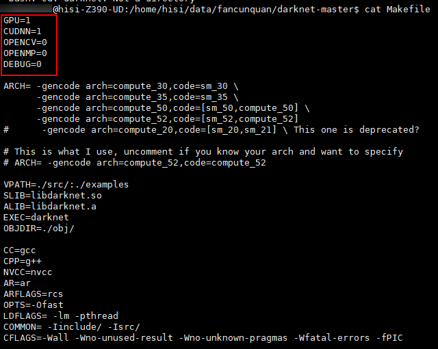
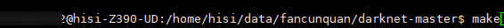
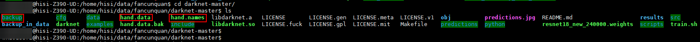
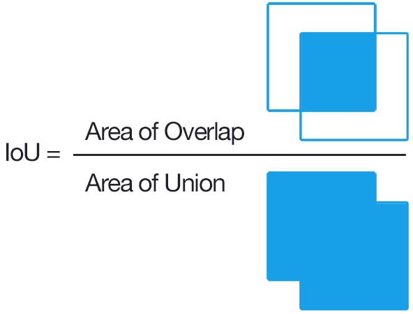

### 4.2.4.检测网

检测网作为人工智能训练的常用网络，NNIE支持的检测网有FasterRcnn、SSD、Yolov1、Yolov2、Yolov3、RFCN等，本文采用darknet框架，以Yolov2网络为例，来对检测网进行阐述。

#### 4.2.4.1 数据集制作和标注

数据集制作可以采用开源的数据或者自研数据集，若采用自研数据集，视频录制的方法、数据集的制作请参考[《分类网》的4.2.3.2章](4.2.3.%E5%88%86%E7%B1%BB%E7%BD%91.md#4232-%E8%A7%86%E9%A2%91%E5%BD%95%E5%88%B6)节和[《分类网》的4.2.3.3章节](4.2.3.%E5%88%86%E7%B1%BB%E7%BD%91.md#4233-%E6%95%B0%E6%8D%AE%E9%9B%86%E5%88%B6%E4%BD%9C%E5%92%8C%E6%A0%87%E6%B3%A8)的内容，这里不再赘述。

* 本文公开数据集为例，讲述如何进行检测网的数据集制作和标注,具体步骤请参考《[hand_dataset开源数据集的处理及标注](https://blog.csdn.net/Wu_GuiMing/article/details/123718854)》。

* 若是自己的数据集，可通过**labelme**开源工具进行标注，将标注生成的.json格式或者其他格式通过脚本转成dartnet框架支持的数据集标注方式，进行训练即可，该方式参考开源代码自行实现即可。

#### 4.2.4.2 本地模型训练

**（1）训练环境搭建**

使用目前较为流行的yolo检测框架，其训练环境名为darknet。下载地址为https://github.com/pjreddie/darknet

如果需要使用cuda、opencv，可以在Makefile中勾选，前提是环境中已经配置好。若需要使用NIVIDIA显卡驱动，需要装好NIVIDIA显卡驱动，并按照跟显卡类型相匹配的CUDA和CUDNN，如果仅仅需要cpu，且不需要使用opencv，可以直接编译，若使用CUDA，操作步骤如下图所示：



cd darknet-master目录下，make即可，如下图所示：



编译成功后，即可生成相应的库文件，如下图所示：


**（2）模型训练**

* 训练指令如下：

````sh
./darknet detector train hand.data cfg/resnet18.cfg
````

* 针对上述指令进行解读：
  * darknet为可执行文件
  * detector为必选参数，直接沿用即可
  * train指定当前模式为训练模式，测试时候需要改成test或者valid。
  * hand.data是一个文件，文件中指定了训练中数据、类别、模型存储路径等信息。
  * resnet18.cfg是一个文件，文件中指定了训练的模型。
  * -gpus指定使用GPU的序号。

* 接下来针对hand.data进行讲解，如下图所示：


* 分析上图，其中：

  * classes：为指定类别数量，手部检测模型为1，其他模型需根据实际场景进行填写
  * train：指定训练数据list的路径
  * valid：指定测试数据list的路径
  * names：指定类别的名字
  * backup：指定训练后权重的保存路径

  

* 对hand.names进行讲解，如下图所示：


* 上述文件配置好后，放到darknet-master目录下，如下图所示：



* 将/cfg目录下的resnet18.cfg按照如下方式进行修改，具体修改方式参考附录[yolov2 resnet18.cfg网络](./6.1.yolov2%20resnet18.cfg%E7%BD%91%E7%BB%9C.md)。

* 上述步骤修改完成后，输入./darknet detector train hand.data cfg/resnet18.cfg即可进行训练。

**注：以上训练指令路径需在Linux环境下进行修改，并确保resnet18.cfg已经参考[yolov2 resnet18.cfg网络](./6.1.yolov2%20resnet18.cfg%E7%BD%91%E7%BB%9C.md)修改正确。可参考 https://netron.app/ 查看网络结构和参数，部分网络结构截图如下图所示：**


* 接下来输入下面的命令，即可开始训练，如下图所示：

```
./darknet detector train hand.data cfg/resnet18.cfg
```


* 训练过程如下图所示：


* 对终端输出的一个截图做如下解释：

  * Region Avg IOU：表示当前的subdivision内图片的平均IOU，代表预测的矩形框和真实目标的交集与并集之比，若为100%，表示我们已经拥有了完美的检测，即我们的矩形框跟目标完美重合，若为其他值较小值，表示这个模型需要进一步训练。

  

  * Class：标注物体分类的正确率，期望该值趋近于1。
  * Obj：越接近1越好。
  * No Obj：期望该值越来越小，但不为零。
  * Avg Recall：在recall/count中定义的，是当前模型在所有subdivision图片中检测出的正样本与实际的正样本的比值。
  * count：count后的值是所有的当前subdivision图片中包含正样本的图片的数量。

由于检测网训练时间较长，请耐心等待。

**（3）模型结果**

训练成功后，即可在/backup目录下查看.weights文件，若出现resnet18_new_final.weights表示最终训练完成，如下图所示：


#### 4.2.4.3 Darknet模型转caffe方案

##### 4.2.4.3.1 Caffe环境搭建

关于Caffe环境的搭建，请参考[2.4、Caffe环境搭建](2.4.Caffe环境搭建.md)章节，这里不再论述。

##### 4.2.4.3.2 Darknet2caffe模型转换

* 步骤1：在Ubuntu系统下，分步执行下面的命令，安装编译darknet2caffe时需要的torch环境

```
pip3 install torchvision==0.5.0 -i https://pypi.tuna.tsinghua.edu.cn/simple some-package
pip3 install torch==1.4.0 -i https://pypi.tuna.tsinghua.edu.cn/simple some-package
```

* 步骤2：执行下面的命令，下载darknet2caffe的代码到Ubuntu系统的code目录下

```
cd code
git clone https://github.com/ChenYingpeng/darknet2caffe
```

* 步骤3：由于python的本地版本是python3.6，开源代码为 python2.X，因此需要对代码语法做适当调整

  * 将 darknet2caffe.py 中的**所有的** if block.has_key('name'):替换成 if 'name' in block:

  

  * 再将caffe_root修改为caffe的实际的绝对路径，如：/home/hispark/code/caffe/

  ```sh
  # 将
  caffe_root='/home/chen/caffe/'
  # 改为
  caffe_root='/home/hispark/code/caffe/'  # /home/hispark/code/caffe/是本地caffe的路径
  ```

  * 将prototxt.py 按照如下方式进行修改，适配python3版本的print。

  

  

  修改后的protxt.py如附录[修改后的darknet2caffe 中prototxt.py代码](./6.3.%E4%BF%AE%E6%94%B9%E5%90%8E%E7%9A%84darknet2caffe%20%E4%B8%ADprototxt.py%E4%BB%A3%E7%A0%81.md)所示：

  **注：请通过对比工具仔细核对源码和附录[修改后的darknet2caffe 中prototxt.py代码](./6.3.%E4%BF%AE%E6%94%B9%E5%90%8E%E7%9A%84darknet2caffe%20%E4%B8%ADprototxt.py%E4%BB%A3%E7%A0%81.md)中的更改点，这里不逐一列举。**

  * l 进入darknet2caffe目录，执行下面的命令，将三个文件拷贝到caffe目录下

  ```sh
  cp caffe_layers/upsample_layer/upsample_layer.hpp  ../caffe/include/caffe/layers/
  cp caffe_layers/upsample_layer/upsample_layer.c*  ../caffe/src/caffe/layers/
  ```

  * 进入caffe的 src/caffe/proto/目录下，修改caffe.proto文件

  ```sh
  cd ../caffe/src/caffe/proto/
  ```

  * 在 message LayerParameter {}中新增 optional UpsampleParameter upsample_param = 150;

  

  * 在caffe.proto最后添加UpsampleParameter参数，如下图所示：

  ```python
  message UpsampleParameter {
           optional int32 scale = 1 [default = 1];
  }
  ```

  

  * l 在caffe目录下，执行下面的命名，重新编译caffe环境，命令如下。

  ```
  make clean
  make -j4
  make pycaffe
  ```

  若无任何报错，证明darknet2caffe环境和代码已经适配成功。

* 步骤3：模型转换

  * 将训练生成的文件存放到darknet2caffe目录下，如：resnet18_new_final.weights

  

  * 在Ubuntu系统的darknet2caffe目录下，执行下面的命令，创建一个resnet18.cfg文件，将本文附《[6.1.yolov2 resnet18.cfg网络.md](./6.1.yolov2 resnet18.cfg网络.md)》中的内容都复制到resnet18.cfg文件中。

  

  * 执行下面的命令，将darknet模型转换为caffe模型。

  ```sh
  # 转换命令遵循：
  python cfg[in] weights[in] prototxt[out] caffemodel[out]
  # 本文转换命令如下：
  python3.6 darknet2caffe.py resnet18.cfg resnet18_new_final.weights resnet18.prototxt resnet18.caffemodel
  ```

  如下图所示：

  

  * 当转换成功后，会在darknet2caffe目录生成一个resnet18.caffemodel和一个resnet18.prototxt文件，如下图所示。

  

  

#### 4.2.4.4 模型量化

**注：nnie_mapper配置概念请阅读源码的device/soc/hisilicon/hi3516dv300/sdk_linux/sample/doc中《HiSVP 开发指南.pdf》3.5.2章节配置文件说明**

* 由于yolo2网络的最后一层需要通过AI CPU推理，转换之前，需要手工将其删除，如下图所示：


* 接下来通过RuyiStudio进行模型的量化，首先新建一个NNIE工程，点击File-New-NNIE Project，如下图所示：


* 输入Project name，选择SOC Version为Hi3516DV300，如下图所示：


* 点击Next，其余按照默认配置即可，创建成功后，如下图所示：


* 通过RuyiStudio进行模型转化，配置文件如下图所示：


注：关于模型量化imageList.txt制作，请仔细参考4.2.3.7章节内容

其中：本模型image_type为YVU420SP，RGB_order为RGB，norm_type选择data_scale

data_scale = 1/255=0.0039215686274509803921568627451

点击转换按钮，稍等片刻，即可完成转换，如下图所示：


转换成功后，如下图所示：


#### 4.2.4.5 模型部署板端和调试

* [检测网部署及板端推理](4.2.4.5.%E6%A3%80%E6%B5%8B%E7%BD%91%E9%83%A8%E7%BD%B2%E5%8F%8A%E6%9D%BF%E7%AB%AF%E6%8E%A8%E7%90%86.md)


