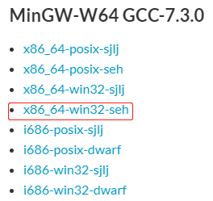
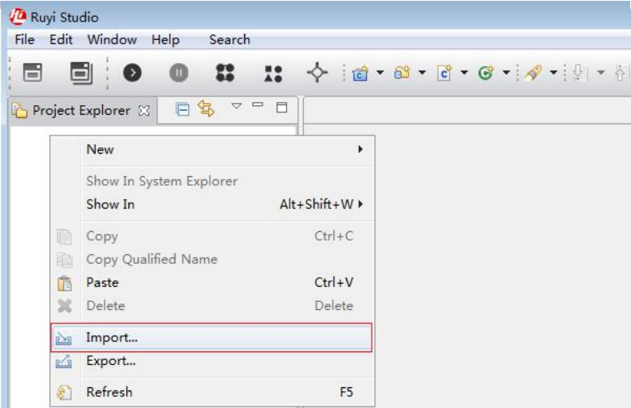
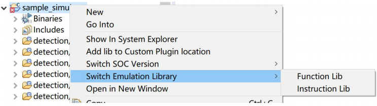
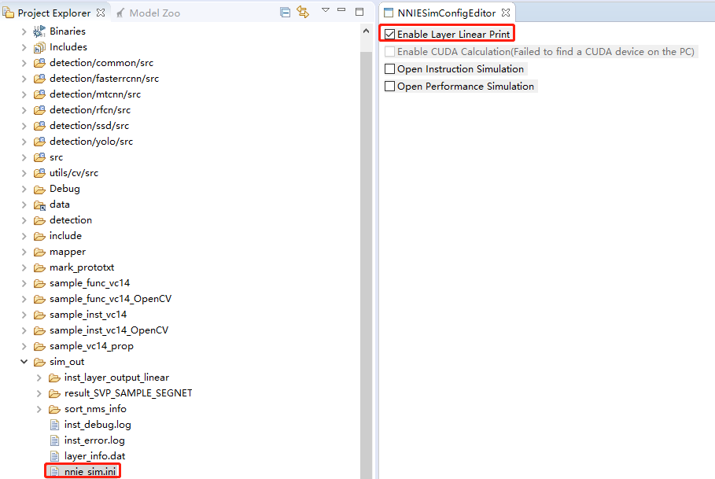
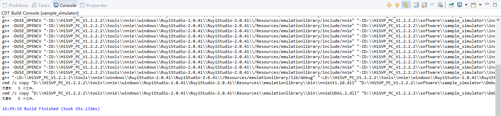

### 4.2.5 分割网

#### 4.2.5.1 分割网仿真

在进行分割网仿真之前，需搭建好RuyiStudio环境和Caffe环境等，具体内容如下：

**（1）RuyiStudio依赖环境**

* MinGW-W64 GCC-7.3.0

​		如果安装配置了其他的mingw版本则sample工程下仿真库依赖的opencv库功能可能会异常，因其opencv库是在指定版本上编译出来的。

* msys+7za+wget+svn+git+mercurial+cvs-rev13.7z

​		msys中会提供用于清理Ruyi工程缓存时用到的rm.exe

* Python3.5+caffe

​		RuyiStudio的Get Caffe Output功能是集成python脚本实现的，依赖python3.5与caffe

​		注：Python版本不同开发场景会有差异，使用前请仔细核对Python版本

* requirement库

​		在RuyiStudio-2.0.41\ruyi_env_setup-2.0.41\requirements.txt文档中列举了caffe环境安 装所需的库文件

* nnie_mapper工具

  nnie_mapper依赖 opencv3.4.2和 protobuf3.6.1，通过pip install 命令安装opencv_python-3.4.2.16-cp35- cp35m-win_amd64.whl和protobuf-3.6.1-cp35-cp35m-win_amd64.whl

* RuyiStudio安装包

  RuyiStudio安装包路的获取，请参考《[RuyiStudio的环境搭建](2.3.RuyiStudio%E7%8E%AF%E5%A2%83%E6%90%AD%E5%BB%BA.md)》


**（2）下载RuyiStudio开发所需的工具压缩包**

* 步骤1：下载MinGW-W64 GCC-7.3.0，选择 x86_64-win32-seh版本下载，如下图所示：注意下载文件为后缀是.7z的压缩文件，推荐解压到C盘根目录。下载地址：https://sourceforge.net/projects/mingw-w64/files/mingw-w64/ 



* 步骤2：下载msys+7za+wget+svn+git+mercurial+cvs-rev13.7z，解压到MinGW文件夹下。msys中有提供用于清理Ruyi工程缓存时用到的rm.exe。下载地址：https://sourceforge.net/projects/mingwbuilds/files/external-binary-packages/

  


* 步骤3：设置环境变量

  在计算机上选择此电脑->属性->高级系统设置->环境变量，在系统变量中添加以下变量（若已有同名变量则添加变量值用分号隔开），找到变量名Path，新增两个变量值，分别为MinGW的bin路径和msys的bin路径，可参考下图：

  

* 步骤4：识别MinGW工具链

​		在MinGw安装目录下bin目录中（如C:\mingw64\bin），将x86_64-w64-mingw32-gcc.exe再拷贝一份并将副本文件重命名为mingw32-gcc.exe（当前目录下），否则RuyiStudio工具不能自动识别到MinGW工具链；

* 步骤5：重新启动计算机

**（3）Python3.5+caffe环境配置**

* 步骤1：下载libraries_v140_x64_py35_1.1.0.tar.bz2并放置在\HiSVP_PC_V1.2.2.2\tools\nnie\windows\ruyi_en v_setup-2.0.41文件夹下，下载链接如下：

  https://github.com/willyd/caffe-builder/releases

  

  

* 步骤2：在系统环境变量中增加RUYI_PYTHON_PATH，变量值为 

```
HiSVP_PC_V1.2.2.2\tools\nnie\windows\ruyi_env_setup-2.0.41\python35; 
HiSVP_PC_V1.2.2.2\tools\nnie\windows\ruyi_env_setup- 2.0.41\python35\Scripts; 
HiSVP_PC_V1.2.2.2\tools\nnie\windows\ruyi_env_setup- 2.0.41\python35\Library\bin；
```

添加%RUYI_PYTHON_PATH%到系统环境变量path的开头；

**注意：HiSVP_PC_V1.2.2.2\tools\nnie\windows\ruyi_env_setup-2.0.41只是参考路径，具体路径以用户实际为准。**


* 步骤3：手动添加用户环境变量PYTHONPATH，HiSVP_PC_V1.2.2.2\tools\nnie\windows\ruyi_env_setup-2.0.41\python35\Lib\site- packages\caffe\python，用于工具识别到caffe；


* 步骤4：参照RuyiStudio-2.0.41\ruyi_env_setup-2.0.41\requirements.txt中给出的版本号下载相关的包，在RuyiStudio-2.0.41\ruyi_env_setup-2.0.41路径下手动新建python35文件夹，并将下载的包直接放到RuyiStudio-2.0.41\ruyi_env_setup-2.0.41\python35文件夹下进行解压，whl文件也放在该路径下，参考**步骤6**进行安装；

* 步骤5：caffe.zip 需要放到RuyiStudio-2.0.41\ruyi_env_setup-2.0.41\python35\Lib\site-packages下并解压，然后解压**步骤1**下载的libraries_v140_x64_py35_1.1.0.tar.bz2，将如下文件拷贝到 RuyiStudio-2.0.41\ruyi_env_setup-2.0.41\python35\Lib\site-packages\caffe\python\caffe文件夹下。

```sh
# libraries\bin**目录下的 
caffehdf5.dll 
caffehdf5_hl.dll 
caffezlib1.dll 
glog.dll 
libgcc_s_seh-1.dll 
libgfortran-3.dll 
libopenblas.dll 
libquadmath-0.dll 
VCRUNTIME140.dll 

# libraries\x64\vc14\bin** 目录下的 
opencv_core310.dll 
opencv_imgcodecs310.dll 
opencv_imgproc310.dll 

# 以及libraries\lib目录下的 
boost_chrono-vc140-mt-1_61.dll
boost_filesystem-vc140-mt-1_61.dll
boost_python-vc140-mt-1_61.dll
boost_system-vc140-mt-1_61.dll
boost_thread-vc140-mt-1_61.dll
gflags.dll
```

* 步骤6：Opencv，protobuf，PyYAML以及Cython几个文件的安装，用 win+R命令进入 cmd 对话框，在cmd对话框进到RuyiStudio-2.0.41\ruyi_env_setup-2.0.41\python35目录 ，用pip install 指令进行安装；

```sh
pip install opencv_python-3.4.2.16-cp35-cp35m-win_amd64.whl 
pip install protobuf-3.6.1-cp35-cp35m-win_amd64.whl 
pip install PyYAML-3.13-cp35-cp35m-win_amd64.whl 
pip install Cython-0.28.5-cp35-cp35m-win_amd64.whl
```

* 步骤7：重启计算机

**（4）导入工程开始模型仿真**

搭建成功后，导入\HiSVP_PC_V1.2.2.2\software\sample_simulator默认工程，其中HiSVP_PC_V1.2.2.2\software路径下包含PC端仿真库sample工程和模型与测试数据，sample_simulator 为功能仿真和指令仿真默认工程。默认工程的导入步骤如下：

* 步骤1：右键点击Project Explore， 在弹出菜单中选择**import**，如下图所示：



* 步骤2：在弹出的导入对话框中，选择 **Existing Projects into Workspace**，如下图所示：


* 步骤3：点击Next，在弹出的对话框中，选择工程所在路径，并在Projects下选择该路径下要导入的sample工程， 点击**Finish**按钮，导入成功后工程将显示在**Project Explore**视图中，如下图所示：


导入成功后，如下图所示：


* 步骤4：在项目上点击右键->Switch Emulation Library->Function Lib/Instruction Lib 来切换，同时会自动做切换编译宏和依赖库两个步骤，本文以指令仿真为例来进行分割网讲解，如下图所示：



* 步骤5：在项目的sim_out目录下有nnie_sim.ini文件，打开后界面如图，打开选项Enable Layer Linear Print后仿真时会在sim_out目录下打印仿真推理结果，如下图所示：



* 步骤6：打开src目录下的main.cpp，将SvpSampleCnnFcnSegnet()分割网接口打开，其他函数屏蔽，如下图所示：


* 步骤7：右键sample_simulator工程，先Clean Project，在Build project，编译成功后如下图所示：



接下来进行模型的仿真，在main.cpp文件下右键Run As选择1 Local C/C++ Application，由于分割网仿真需要消耗一段时间，请耐心等待。

仿真完成后，即可在sim_out的inst_layer_output_linear目录下查看相应的layer层结果，如下图所示：


#### 4.2.5.2 输出模型浮点结果

* 步骤1：首先需在sim_out目录下新建output文件夹，用来存放浮点结果，点击工具栏的 Get Caffe Output 功能，弹出如下对话框；


* 步骤2：依次设置输出中间结果网络的prototxt, caffemodel, Image File等，如果要对图像做预处理，需要配置Norm Type，Data Scale和MeanFile等，本文分割网预处理部分按照下图配置即可。


* 步骤3：点击OK，开始输出浮点结果，当出现caffe output Successfully表示输出成功，如下图所示：


* 步骤4：模型浮点结果，存放在sim_out目录的output目录下，如下图所示：


#### 4.2.5.3 比较模型输出结果

点击工具栏 Vector Comparision 按钮，弹出向量比较视图，在Left Folders和Right Folder中分别选择需要比较的不同配置的中间输出结果所在的文件夹，如下图所示：

**注意：如果两边对应的层不能对齐比较，还需要勾选Parse Dot File 选择nnie_mapper生成的dot文件来进行层的匹配**

若无dot文件，需要重新对模型进行量化，量化步骤如下：

* 步骤1：确认下当前使用的芯片，右键工程->Switch SOC Version，选择与芯片对应的NNIE，如下图所示：


* 步骤2：双击左侧Project Explorer视图中segnet_inst.cfg文件，或者选中cfg文件右键选择Open with-> Mapper Configuration Editor，打开cfg配置界面；


* 步骤3：打开成功后，按照如下图所示方式进行配置：


* 步骤4：配置成功，点击保存，点击运行按钮，稍等片刻，即可完成模型量化，此时在sample_simulator目录下即可出现.dot文件，如下图所示：


* 步骤5：点击Vector Comparsion按钮，按照下图方式进行配置。


* 步骤6：点击Compare即可开始比较，稍等片刻即可完成比较，如下图所示：


分析上图可以看出，对齐之后的相似度各层稳定在0.99，结果可信。

最终仿真之后的图像存放在sim_out/ result_SVP_SAMPLE_SEGNET目录下，如下图所示：


#### 4.2.5.4 分割网部署及板端推理

* [分割网部署及板端推理](4.2.5.4.%E5%88%86%E5%89%B2%E7%BD%91%E9%83%A8%E7%BD%B2%E5%8F%8A%E6%9D%BF%E7%AB%AF%E6%8E%A8%E7%90%86.md)

