# Pegasus与Taurus WiFi互联通信<a name="ZH-CN_TOPIC_0000001130176841"></a>
-    在学习Pegasus与Taurus WiFi互联通信前，需要将[device_soc_hisilicon](http://gitee.com/openharmony/device_soc_hisilicon)仓下载，在ubuntu下执行：git lfs clone xxxxx仓库地址,下载完成后，将device_soc_hisilicon\hi3516dv300\sdk_linux\sample\taurus\histreaming_server这整个文件夹放到自己源码对应device\soc\hisilicon\hi3516dv300\sdk_linux\sample\taurus目录下，同时将device_soc_hisilicon/hi3861v100/sdk_liteos/build/libs/libhistreaminglink.a这个库文件替换到device\soc\hisilicon\hi3861v100\sdk_liteos\build\libs\目录下。

-    前言：HiStreaming 组件作为一种技术基础设施，使得海思芯片可以通过WiFi或有线网络实现物联网设备之间的设备自动发现、服务注册与识别、服务操作。HiStreaming把物联网设备分为两类角色，对外部提供服务的设备称之为 Server 设备，而使用其他设备提供的服务的设备称之为 Client 设备。

     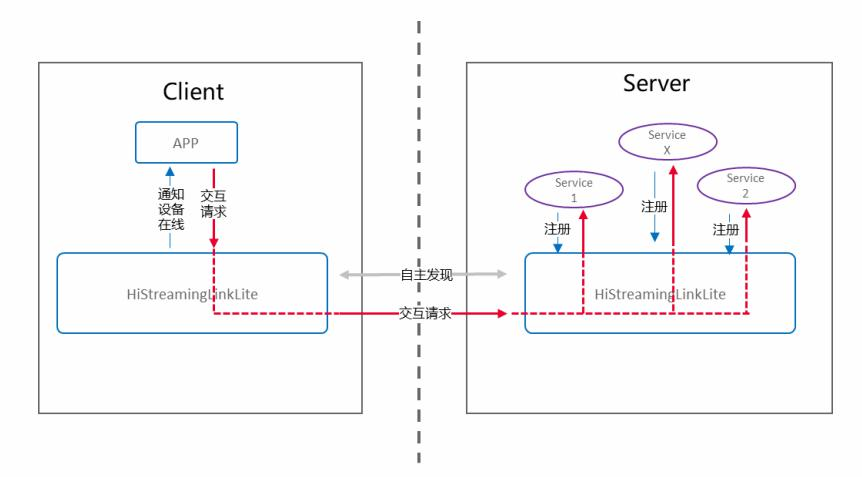

## 硬件环境搭建
-    硬件要求：Taurus开发板；硬件搭建如下图所示。注意这里需要跟Taurus同时使用，详情可以参考[WiFi互联client端](http://gitee.com/openharmony/vendor_hisilicon/blob/master/hispark_pegasus/demo/histreaming_client_demo/README.md)端。

     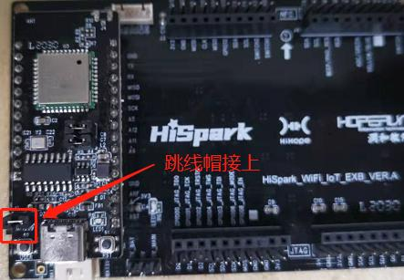

     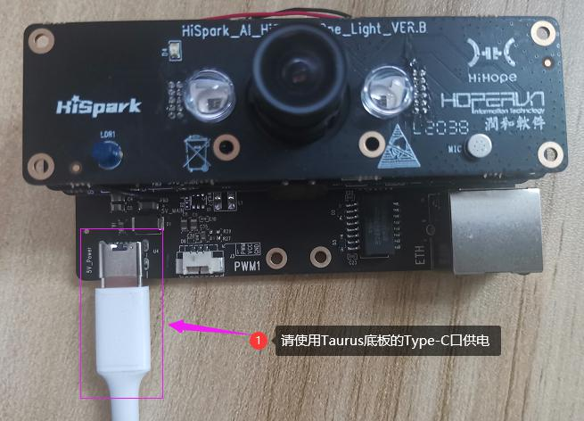

## 组网方式
-    组网方案1：将Taurus开发套件设置成为WiFi AP模式，Pegasus开发套件和手机直接连接到Taurus的WiFi AP热点。Taurus开发板上跑的是HiStreaming-Server和HiStreaming-Client程序，Pegasus开发板上跑的是HiStreaming-Server程序，手机上跑的是HiStreaming-Client程序。当三者在同一局域网内，手机能够同时发现Taurus和Pegasus上的HiStreaming-Server，且Taurus上的HiStreaming-Client也能发现Pegasus上的HiStreaming-Server。Taurus端、Pegasus端、手机端，三者之间的组网方式如下图所示。

     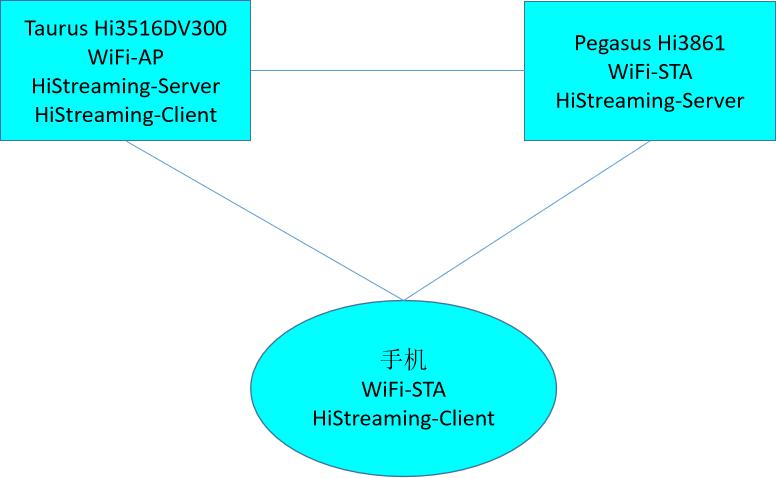 

-    组网方案2：Pegasus端、Taurus端、手机端都配置成为STA模式，使Taurus开发套件、Pegasus开发套件以及手机都连接在同一路由器发出的WiFi AP热点下面，组成一个局域网。其中，Taurus开发板上跑的是HiStreaming-Server和HiStreaming-Client程序，Pegasus开发板上跑的是HiStreaming-Server程序，手机上跑的是HiStreaming-Client程序。当三者在同一局域网内，手机能够同时发现Taurus和Pegasus上的HiStreaming-Server，且Taurus上的HiStreaming-Client也能发现Pegasus上的HiStreaming-Server。Taurus端、Pegasus端、手机端，三者之间的组网方式如下图所示。（其实手机作为热点代替路由器也是可行的）

     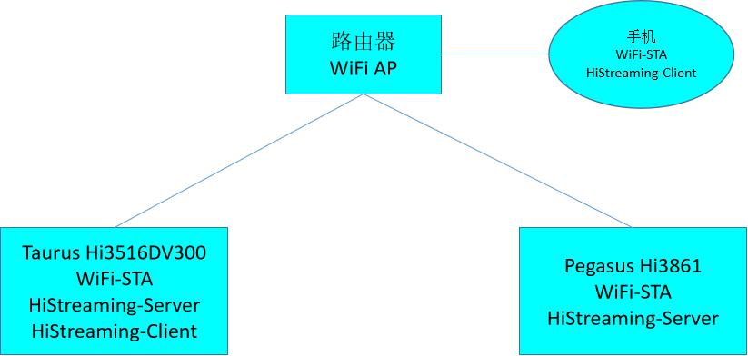

## 软件介绍
-    注意这里需要跟Taurus同时使用，Taurus软件介绍详情可以参考[WiFi互联client端](http://gitee.com/openharmony/vendor_hisilicon/blob/master/hispark_pegasus/demo/histreaming_client_demo/README.md)。
-    1.代码目录结构及相应接口功能介绍

-    HiStreaming接口：

| API                 | 描述               |
| ------------------- | ------------------ |
| LinkPlatformGe | 获得HiStreamingLinkLite组件对象 |
| LinkPlatformFree | 释放HiStreamingLinkLite组件对象     |
| LinkServiceAgentFree  | 释放从设备列表中pop出来的LinkServiceAgent对象     |
| LinkAgentGet  | 获得LinkAgent对象     |
| LinkAgentFree  | 释放LinkAgent对象    |
| QueryResultFree  | 释放设备列表QueryResult。同时也释放设备列表关联的LinkServiceAgent对象    |

## 获取WiFi可执行文件([util_OHOSL1_3516.zip](https://gitee.com/hihope_iot/embedded-race-hisilicon-track-2022/tree/master/taurus_resource))
* 解压util_OHOSL1_3516.zip到util_OHOSL1_3516文件。
* 在util_OHOSL1_3516文件包新建hostapd.conf，udhcpd.conf，wpa_supplicant.conf文件(注意这些文件需要在ubuntu下创建，windows下会出现格式问题)。
* 在hostapd.conf文件写入如下内容。

```
interface=wlan0
driver=hdf wifi
ssid=H
hw_mode=g
channel=6
ignore_broadcast_ssid=0
#下面wpa2-psk类型加密的配置
#如果不需要可以删除
auth_algs=1
wpa=2
wpa_passphrase=12345678
rsn_pairwise=CCMP
```

* 在udhcpd.conf文件写入如下内容。

```
# Sample udhcpd configuration file (/etc/udhcpd.conf)
# The start and end of the IP lease block
start 192.168.12.2
end 192.168.12.100

# The interface that udhcpd will use
interface wlan0 #default: eth0

# The maximim number of leases (includes addressesd reserved
# by OFFER's, DECLINE's, and ARP conficts
max_leases 20 #default: 254

# If remaining is true (default), udhcpd will store the time
# remaining for each lease in the udhcpd leases file. This is
# for embedded systems that cannot keep time between reboots.
# If you set remaining to no, the absolute time that the lease
# expires at will be stored in the dhcpd.leases file.
remaining yes #default: yes

# The time period at which udhcpd will write out a dhcpd.leases
# file. If this is 0, udhcpd will never automatically write a
# lease file. (specified in seconds)
auto_time 7200 #default: 7200 (2 hours)

# The amount of time that an IP will be reserved (leased) for if a
# DHCP decline message is received (seconds).
decline_time 3600 #default: 3600 (1 hour)

# The amount of time that an IP will be reserved (leased) for if an
# ARP conflct occurs. (seconds)
conflict_time 3600 #default: 3600 (1 hour)

# How long an offered address is reserved (leased) in seconds
offer_time 60 #default: 60 (1 minute)

# If a lease to be given is below this value, the full lease time is
# instead used (seconds).
min_lease 60 #defult: 60

# The location of the leases file
lease_file /vendor/etc/udhcpd.leases

# The remainer of options are DHCP options and can be specifed with the
# keyword 'opt' or 'option'. If an option can take multiple items, such
# as the dns option, they can be listed on the same line, or multiple
# lines. The only option with a default is 'lease'.

#Examples
opt dns 10.221.0.11 8.8.8.8
option subnet 255.255.255.0
opt router 192.168.12.1
```

* 在wpa_supplicant.conf文件写入如下内容。
```
country=GB
network={
    ssid="H"
    psk="12345678"
}
```

**编译**

* 在编译histreaming_server之前，需确保已经docker上整编通过，整编成功后，将./out/hispark_taurus/ipcamera_hispark_taurus_linux/usr/lib/libcjson_shared.so放到device\soc\hisilicon\hi3516dv300\sdk_linux\out\lib目录下，**且已经按照《[修改源码及配置文件适配Taurus开发板](../doc/2.2.1.%E4%BF%AE%E6%94%B9%E6%BA%90%E7%A0%81%E5%8F%8A%E9%85%8D%E7%BD%AE%E6%96%87%E4%BB%B6%E9%80%82%E9%85%8DTaurus%E5%BC%80%E5%8F%91%E6%9D%BF.md)》的内容进行修改**。然后在单编ohos_histreaming_server之前，需修改目录下的一处依赖，进入//device/soc/hisilicon/hi3516dv300/sdk_linux目录下，通过修改BUILD.gn，在deps下面新增target，``"sample/taurus/histreaming_server:hi3516dv300_histreaming_server"``。
```
group("hispark_taurus_sdk") {
  if (defined(ohos_lite)) {
    deps = [
      ":sdk_linux_lite_libs",
      ":sdk_make",
      "//kernel/linux/build:linux_kernel",
      "sample/taurus/histreaming_server:hi3516dv300_histreaming_server",
    ]
```

* 点击Deveco Device Tool工具的Build按键进行编译，具体的编译过程这里不再赘述。

* 编译成功后，即可在out/hispark_taurus/ipcamera_hispark_taurus_linux/rootfs/bin目录下，生成ohos_histreaming_server可执行文件。

**使用NFS挂载的方式进行资料文件的拷贝**

* 首先需要自己准备一根网线

* 步骤1：参考[博客链接](https://blog.csdn.net/Wu_GuiMing/article/details/115872995?spm=1001.2014.3001.5501)中的内容，进行nfs的环境搭建

* 步骤2：将编译后生成的可执行文件拷贝到Windows的nfs共享路径下

* 步骤3：将device\soc\hisilicon\hi3516dv300\sdk_linux\sample\taurus\histreaming_server\lib\目录下的**libhistreaminglink.a**和解压后的**util_OHOSL1_3516文件夹**拷贝至Windows的nfs共享路径下

* 步骤4：依赖文件拷贝至Windows的nfs共享路径下后，执行下面的命令，将Windows的nfs共享路径挂载至开发板的mnt目录下

```
mount -o nolock,addr=192.168.200.1 -t nfs 192.168.200.1:/d/nfs /mnt
```

## 拷贝mnt目录下的文件至正确的目录下
* 执行下面的命令，拷贝mnt目录下面的ohos_histreaming_server至userdata目录，拷贝mnt目录下面的libhistreaminglink.a和util_OHOSL1_3516至/usr/lib/目录下，再将目录下

```
cp /mnt/ohos_histreaming_server  /userdata/
cp /mnt/*.so /usr/lib/
cp -rf /mnt/util_OHOSL1_3516/  /usr/lib/
```

* 第一种方式：执行下面的命令，将Taurus设置为AP模式。hostapd.conf文件设置AP名和密码。启动成功后，手机端可以搜索wifi名：H，密码：12345678。

```
cd /usr/lib/util_OHOSL1_3516
mkdir /usr/tmp
mkdir /var/run
touch /var/run/udhcpd.pid
mkdir -p /vendor/etc
touch /vendor/etc/udhcpd.leases
./hostapd -i wlan0 hostapd.conf &
ifconfig wlan0 192.168.12.145
./busybox ./udhcpd udhcpd.conf
```
* 执行下面的命令，Taurus运行ohos_histreaming_server
```
cd /userdata
chmod 777 ohos_histreaming_server
./ohos_histreaming_server
```

* 板端运行后，参考[WiFi互联client端](http://gitee.com/openharmony/vendor_hisilicon/blob/master/hispark_pegasus/demo/histreaming_client_demo/README.md)

* Taurus端或者路由器需要发出热点，同时Taurus端运行ohos_histreaming_server可执行文件，再次点击Hi3861核心板上的“RST”复位键，此时开发板的系统会运行起来。运行结果:打开串口工具，可以看到如下打印,同时3861主板灯闪亮一下。

  

  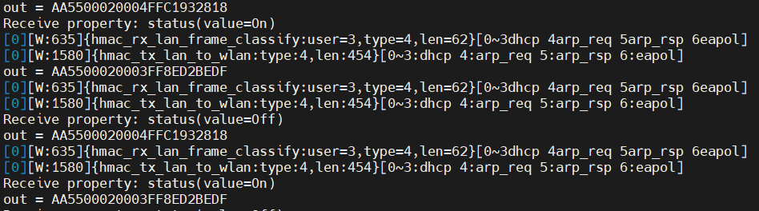

  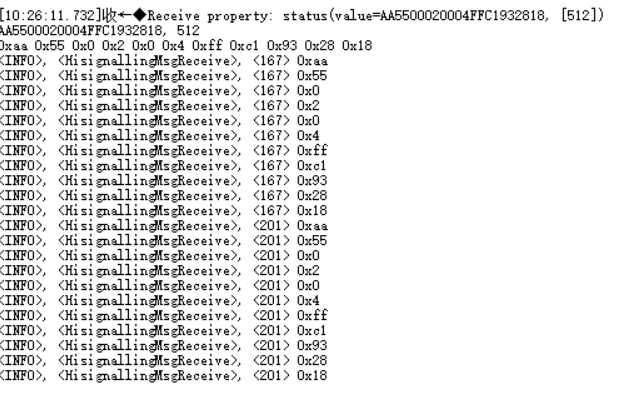

* 如果你想使用手机来控制Pegasus或者Taurus，手机端安装及使用（源码下载](https://gitee.com/leo593362220/shistreaming.git)），然后进入app-release.rar目录，将程序安装到手机上，具体的安装过程这里就不介绍了(通过数据线复制到手机，或使用微信、QQ等方式发送到手机再安装)。
APP安装成功后，打开手机的WiFi列表，连接到Taurus开发板的AP热点或者路由器热点，再打开刚安装好的HiStreaming APP，下拉刷新几次，手机会发现两个设备，分别是Pegasus开发板设备和Taurus开发板设备。

  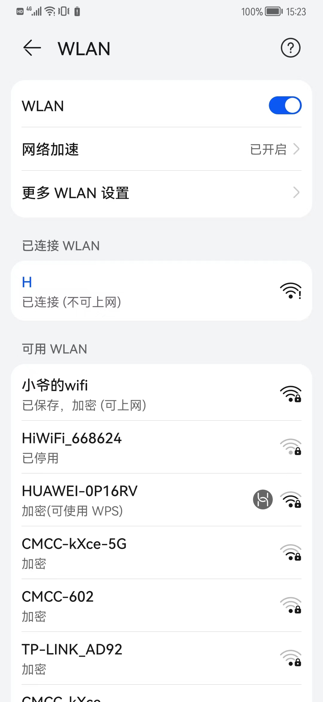

  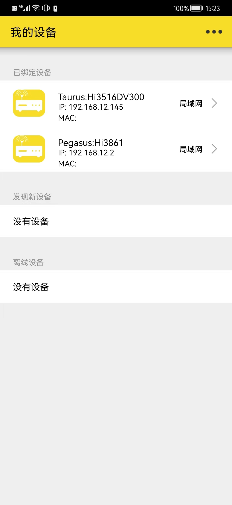

* 任意点击一个设备进行操作，点击LED灯控制按钮，会进入一个灯的控制界面。点击图片会发生变化，且会给对应的设备发送数据,同时控制灯亮与熄。

  

  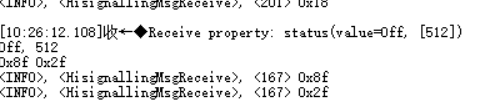
  
  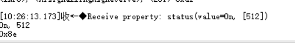

  

* 第二种方式：执行下面的命令，将Taurus设置为STA模式。wpa_supplicant.conf文件设置连接的WIFI名和密码。(手机和路由器使用4G网)
```
cd /usr/lib/util_OHOSL1_3516  
./wpa_supplicant -i wlan0 -c wpa_supplicant.conf &
连接热点：
./busybox ./udhcpc -s ./default.script -b -i wlan0
```
* 执行下面的命令，Taurus运行ohos_histreaming_server
```
cd /userdata
chmod 777 ohos_histreaming_server
./ohos_histreaming_server
```

* 板端运行后，参考[WiFi互联client端](http://gitee.com/openharmony/vendor_hisilicon/blob/master/hispark_pegasus/demo/histreaming_client_demo/README.md)

* Taurus端或者路由器需要发出热点，同时Taurus端运行ohos_histreaming_server可执行文件，再次点击Hi3861核心板上的“RST”复位键，此时开发板的系统会运行起来。运行结果:打开串口工具，可以看到如下打印,同时3861主板灯闪亮一下。

  

  

  

* 如果你想使用手机来控制Pegasus或者Taurus，手机端安装及使用（源码下载](https://gitee.com/leo593362220/shistreaming.git)），然后进入app-release.rar目录，将程序安装到手机上，具体的安装过程这里就不介绍了(通过数据线复制到手机，或使用微信、QQ等方式发送到手机再安装)。
APP安装成功后，打开手机的WiFi列表，连接到Taurus开发板的AP热点或者路由器热点，再打开刚安装好的HiStreaming APP，下拉刷新几次，手机会发现两个设备，分别是Pegasus开发板设备和Taurus开发板设备。

* 任意点击一个设备进行操作，点击LED灯控制按钮，会进入一个灯的控制界面。点击图片会发生变化，且会给对应的设备发送数据,同时控制灯亮与熄。

  

  
  
  

  

