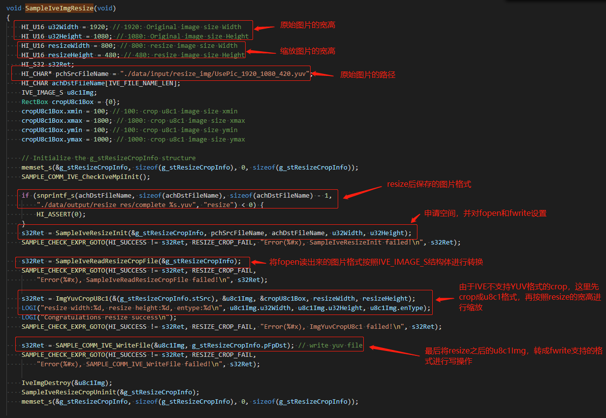
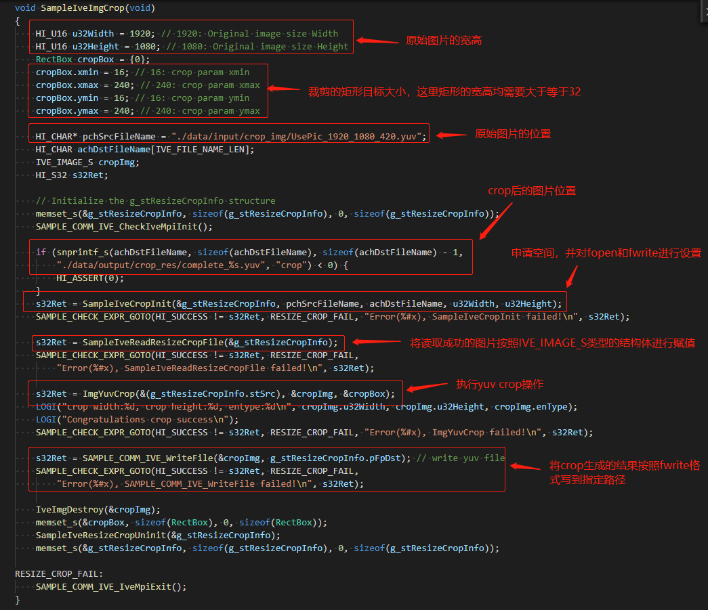

# resize_crop操作指导

## 1. 概述

resize_crop  sample基于OpenHarmony 小型系统开发，以Taurus套件为例，resize_crop sample 介绍了对图片的预处理，resize实现了对一帧图片的缩放，crop实现了对一帧图片的裁剪，其缩放比例或裁剪参数，需要根据客户的网络模型输入参数进行确定。

## 2. 目录

```shell
//device/soc/hisilicon/hi3516dv300/sdk_linux/sample/taurus/color_space_convert
├── BUILD.gn                   		 # 编译ohos resize_crop sample需要的gn文件
├── sample_resize_crop_main.c        # ohos resize_crop sample主函数入口
└── smp
    ├── smp_resize_crop.c       	 # ohos resize_crop sample业务代码
    └── smp_resize_crop.h       	 # ohos resize_crop sample业务代码所需的头文件
```

## 3. 编译

在编译resize_crop  sample之前，需确保OpenHarmony 小型系统的主干代码已经整编通过，**且已经按照《[修改源码及配置文件适配Taurus开发板](../doc/2.2.1.%E4%BF%AE%E6%94%B9%E6%BA%90%E7%A0%81%E5%8F%8A%E9%85%8D%E7%BD%AE%E6%96%87%E4%BB%B6%E9%80%82%E9%85%8DTaurus%E5%BC%80%E5%8F%91%E6%9D%BF.md)》的内容进行修改**。在单编resize_crop  sample之前，需修改目录下的一处依赖，进入//device/soc/hisilicon/hi3516dv300/sdk_linux目录下，通过修改 BUILD.gn，在deps下面新增target，``"sample/taurus/resize_crop:hi3516dv300_resize_crop_sample"``，如下图所示：


* 点击Deveco Device Tool工具的Build按键进行编译，具体的编译过程这里不再赘述，编译成功后，如下图所示：


* 编译成功后，即可在out/hispark_taurus/ipcamera_hispark_taurus_linux/rootfs/bin目录下，生成 ohos_resize_crop_demo可执行文件，如下图所示：


## 4. 拷贝可执行程序和依赖文件至开发板的mnt目录下

**方式一：使用SD卡进行资料文件的拷贝**

* 首先需要自己准备一张SD卡

* 步骤1：将编译后生成的可执行文件拷贝到SD卡中。
* 步骤2：将device\soc\hisilicon\hi3516dv300\sdk_linux\out\lib\目录下的**libvb_server.so和 libmpp_vbs.so**拷贝至SD卡中
* 步骤3：将device/soc/hisilicon/hi3516dv300/sdk_linux/sample/taurus/data/目录下的 UsePic_1920_1080_420.yuv文件拷贝至SD卡中。（前提是按照《[获取sample依赖的资源文件到本地](../doc/6.2.%E8%8E%B7%E5%8F%96sample%E4%BE%9D%E8%B5%96%E7%9A%84%E8%B5%84%E6%BA%90%E6%96%87%E4%BB%B6%E5%88%B0%E6%9C%AC%E5%9C%B0.md)》文档获取了资源文件）


* 步骤4：可执行文件拷贝成功后，将内存卡插入开发板的SD卡槽中，可通过挂载的方式挂载到板端，可选择SD卡 mount指令进行挂载。

```sh
mount -t vfat /dev/mmcblk1p1 /mnt
# 其中/dev/mmcblk1p1需要根据实际块设备号修改
```

* 挂载成功后，如下图所示：


**方式二：使用NFS挂载的方式进行资料文件的拷贝**

* 首先需要自己准备一根网线
* 步骤1：参考[博客链接](https://blog.csdn.net/Wu_GuiMing/article/details/115872995?spm=1001.2014.3001.5501)中的内容，进行nfs的环境搭建

* 步骤2：将编译后生成的可执行文件拷贝到Windows的nfs共享路径下

* 步骤3：device\soc\hisilicon\hi3516dv300\sdk_linux\out\lib\目录下的**libvb_server.so和 libmpp_vbs.so**拷贝至Windows的nfs共享路径下

* 步骤4：将device/soc/hisilicon/hi3516dv300/sdk_linux/sample/taurus/data/目录下的 UsePic_1920_1080_420.yuv文件拷贝至Windows的nfs共享路径下。（前提是按照《[获取sample依赖的资源文件到本地](../doc/6.2.%E8%8E%B7%E5%8F%96sample%E4%BE%9D%E8%B5%96%E7%9A%84%E8%B5%84%E6%BA%90%E6%96%87%E4%BB%B6%E5%88%B0%E6%9C%AC%E5%9C%B0.md)》文档获取了资源文件）


* 步骤5：依赖文件拷贝至Windows的nfs共享路径下后，执行下面的命令，将Windows的nfs共享路径挂载至开发板的mnt目录下

```
mount -o nolock,addr=192.168.200.1 -t nfs 192.168.200.1:/d/nfs /mnt
```

## 5.拷贝mnt目录下的文件至正确的目录下

* 分步执行下面的命令，创建/userdata/data/input/resize_img/、/userdata/data/output/resize_res/、/userdata/data/input/crop_img/、

  /userdata/data/input/crop_res/ 四个目录，目录拷贝mnt目录下面的ohos_resize_crop_demo至userdata目录，拷贝mnt目录下面的libvb_server.so和 libmpp_vbs.so至/usr/lib/目录下，再把mnt目录下面的UsePic_1920_1080_420.yuv分步拷贝至color_convert_img和crop_img目录下

```
mkdir -p /userdata/data/input/resize_img/
mkdir -p /userdata/data/output/resize_res/
mkdir -p /userdata/data/input/crop_img/
mkdir -p /userdata/data/output/crop_res/
cp /mnt/ohos_resize_crop_demo  /userdata/
cp /mnt/*.so /usr/lib/
cp /mnt/UsePic_1920_1080_420.yuv /userdata/data/input/resize_img/
cp /mnt/UsePic_1920_1080_420.yuv /userdata/data/input/crop_img/
```


* 执行下面的命令，给ohos_resize_crop_demo文件可执行权限

```
chmod 777 /userdata/ohos_resize_crop_demo
```

## 6. 功能验证

### 6.1、验证Resize功能

* 以IVE为例，讲述如何跑通Resize，该部分请参考resize_crop。代码实现方式主入口为[smp_resize_crop.c](https://gitee.com/openharmony/device_soc_hisilicon/blob/master/hi3516dv300/sdk_linux/sample/taurus/resize_crop/smp/smp_resize_crop.c)中void SampleIveImgResize(void)接口，如下图所示：



* 执行下面的命令，运行可执行程序，验证Resize功能，如下图所示：

```
cd /userdata/
./ohos_resize_crop_demo 0
```


* 运行成功后，会在/userdata/data/output/resize_res/目录下生成一个complete_resize.yuv文件。如下图所示：


### 6.2、验证Crop功能

* 以IVE为例，讲述如何跑通crop，该部分请参考resize_crop。代码实现方式主入口为[smp_resize_crop.c](https://gitee.com/openharmony/device_soc_hisilicon/blob/master/hi3516dv300/sdk_linux/sample/taurus/resize_crop/smp/smp_resize_crop.c)中void SampleIveImgCrop(void)接口，如下图所示：



* 执行下面的命令，运行可执行程序，如下图所示：

```
cd /userdata/
./ohos_resize_crop_demo 1
```


* 运行成功后，会在/userdata/data/output/crop_res/目录下生成一个complete_crop.yuv文件。如下图所示：


