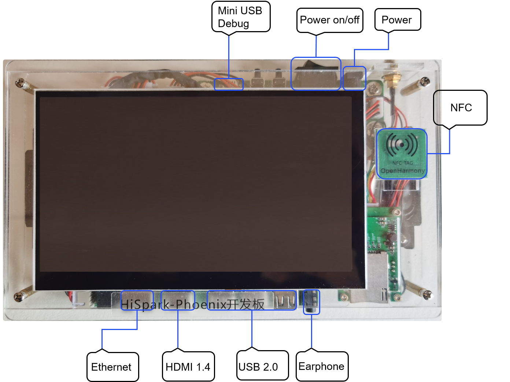

# Hi3751V35X开发指引<a name="ZH-CN_TOPIC_0000001142448981"></a>

-   [简介](#section11660541593)
-   [目录](#section835037926256)
-   [许可说明](#section777565921879 )
-   [开发环境搭建](#section161941989596)
    -   [系统要求](#section149127526335)
    -   [IDE方式](#section724948309150)
    -   [安装包方式](#section204672979943)
    
-   [代码下载](#section119744591305)
-   [编译烧录](#section137768191623)
-   [调试说明](#section1312121216216)
    -   [hdc工具](#section129654513264)
    -   [点屏配置](#section864408051434)

-   [相关仓](#section144978787332)
-   [FAQ](#section1371113476307)

## 简介<a name="section11660541593"></a>

HiSpark-Phoenix是基于海思Hi3751V350智能电视芯片的一块高性能开发板，内置高性能多核 ARM A53 CPU，多核MALI T450 GPU，支持NTSC/PAL/SECAM制式解调，支持DTMB/DVB-C/ATSC/ISDB-T等全球数字Demod,可以扩展DVB-T/T2/S/S2,支持USB播放，支持主流的视频格式包括MPGE2、H.264、H.265、RMVB、AVS+等，支持主流音频解码及音效处理，以及海思自研的SWS音效处理，支持LVDS和miniLVDS接口，支持主流的Tconless屏。

**图 1**  HiSpark_Phoenix单板正面外观图<a name="fig4460722185514"></a>  



## 目录<a name="section835037926256"></a>
```
.
├── docs    # 资料文档
│   ├── figures
│   └── public_sys-resources
├── gpu
│   └── lib       # gpu预编译库
└── sdk_linux     # SDK目录
    ├── bin       # SDK预编译可执行程序
    ├── include   # SDK向上提供的接口头文件
    ├── lib       # SDK用户态驱动和接口库
    └── source    # SDK内核态驱动源码
        ├── common
        │   ├── drv
        │   │   ├── himedia     # 海思媒体平台驱动
        │   │   ├── include
        │   │   ├── mmz         # 海思媒体内存空间管理模块
        │   │   └── osal        # 驱动适配层，用于屏蔽系统差异，提供统一接口
        │   └── include
        └── msp
            ├── drv
            │   ├── devfreq     # 芯片调频驱动模块
            │   ├── gpio        # 通用输入输出驱动模块
            │   ├── gt911       # 图形处理器驱动模块
            │   ├── hiirq       # 用户态驱动中断注册管理模块
            │   ├── hiproc      # 调试信息管理模块
            │   ├── i2c         # I2C驱动模块
            │   ├── include
            │   └── regulator   # 芯片调压驱动模块
            └── include

```

## 许可说明<a name="section777565921879"></a>
-   sdk_linux/source/目录下为上海海思自研代码，使用基于GPL许可的Hisilicon (Shanghai) 版权声明，该目录下有LICENSE文件。许可信息和版权信息通常可以在文件开头看到：
```
    / *Copyright (C) 2022 HiSilicon (Shanghai) Technologies CO., LIMITED. 
      *
      * This program is free software; you can redistribute  it and/or modify it
      * under  the terms of  the GNU General  Public License as published by the
      * Free Software Foundation;  either version 2 of the  License, or (at your
      * option) any later version.
      * ... * /
```

-   sdk_linux/include目录下为上海海思自研代码，使用基于Apache License Version 2.0许可的Hisilicon (Shanghai) 版权声明，在该目录下有Apache License Version 2.0的LICENSE文件。
  
-   sdk_linux/bin、sdk_linux/lib和gpu/lib下内容为上海海思自研二进制，遵循上海海思的LICENSE，此三者目录下均有LICENSE文件，LICENSE文件中可以看到版权信息：
```
    / *End User License Agreement ...  Copyright (C) 2021 Hisilicon (Shanghai) Technologies Co., Ltd. All rights reserved. * /

```

## 开发环境搭建<a name="section161941989596"></a>

通常在嵌入式开发中，开发者习惯于使用Windows进行代码的编辑，比如使用Windows的Visual Studio Code进行OpenHarmony代码的开发。但当前阶段，大部分的开发板源码还不支持在Windows环境下进行编译，如Hi3861、Hi3516和Hi3751系列开发板。因此，建议搭建Windows + Ubuntu混合开发环境。

Windows: 源码编辑、烧录、调试  
Ubuntu: 编译构建

### 系统要求<a name = "section149127526335"></a>

- Windows系统要求：Windows10 64位系统。
- Ubuntu系统要求：Ubuntu18.04~21.10版本，内存推荐16 GB及以上，python版本要求3.7以上。
- Windows系统和Ubuntu系统的用户名不能包含中文字符。

### IDE（DevEco Device Tool）方式<a name = "section724948309150"></a>

IDE方式完全采用DevEco Device Tool进行一站式开发，编译依赖工具的<b>安装</b>及<b>编译</b>、<b>烧录</b>、<b>运行</b>都通过IDE可视化操作, 这种方式需要在Windows和Ubuntu系统上安装的DevEco Device Tool 3.0 Release版本以上。

   >  **说明：**
   > 详细步骤请参考DOC仓[搭建IDE混合开发环境][ide_standard_envsetup]。

[ide_standard_envsetup]: https://gitee.com/openharmony/docs/blob/master/zh-cn/device-dev/quick-start/quickstart-ide-standard-env-setup-win-ubuntu.md

### 安装包方式<a name = "section204672979943"></a>

安装包方式直接在Ubuntu环境下执行命令来安装依赖工具，下载源码，编译构建，然后通过HiTool/IDE工具进行烧录。同时OpenHarmony还为开发者提供了[Docker][OpenHarmony docker]环境，在很大程度上简化了编译前的环境配置，习惯使用安装包方式的开发者也可以选择Docker环境进行编译 。

   >  **说明：**
   > 详细步骤请参考DOC仓[搭建标准系统环境][standard-env-setup], 若使用HiTool工具进行烧录，可不安装IDE，仅按照参考文档安装必要的库和工具。

[OpenHarmony docker]: https://gitee.com/openharmony/docs/blob/master/zh-cn/device-dev/get-code/gettools-acquire.md
[standard-env-setup]: https://gitee.com/openharmony/docs/blob/master/zh-cn/device-dev/quick-start/quickstart-standard-env-setup.md

## 代码下载<a name="section119744591305"></a>

Hispark_phoenix产品可在master和OpenHarmony-3.1-Release分支获取到，OpenHarmony-3.1-Release分支更稳定，建议下载OpenHarmony-3.1-Release分支。请参考[获取源码][sourcecode-acquire]配置git并下载码云repo工具。

- OpenHarmony主干
  - 方式一：通过repo + ssh下载（需注册公钥，请参考码云帮助中心）。

    repo init -u git@gitee.com:openharmony/manifest.git -b master --no-repo-verify  
    repo sync -c  
    repo forall -c 'git lfs pull'  
    bash build/prebuilts_download.sh

  - 方式二：通过repo + https下载。

    repo init -u https://gitee.com/openharmony/manifest.git -b master --no-repo-verify  
    repo sync -c  
    repo forall -c 'git lfs pull'  
    bash build/prebuilts_download.sh

- OpenHarmony-3.1-Release分支(推荐)
  - 方式一：通过repo + ssh下载（需注册公钥，请参考码云帮助中心）。

    repo init -u git@gitee.com:openharmony/manifest.git -b OpenHarmony-3.1-Release    --no-repo-verify  
    repo sync -c  
    repo forall -c 'git lfs pull'  
    bash build/prebuilts_download.sh

  - 方式二：通过repo + https下载。

    repo init -u https://gitee.com/openharmony/manifest.git -b OpenHarmony-3.1-Release --no-repo-verify  
    repo sync -c  
    repo forall -c 'git lfs pull'  
    bash build/prebuilts_download.sh

   >  **说明：**
   > 在repo init时加参数--depth=1，能减少网络异常导致的下载失败，下载耗时也更短，缺点是git log信息太少，仅有最新的commit。

[sourcecode-acquire]: https://gitee.com/openharmony/docs/blob/master/zh-cn/device-dev/get-code/sourcecode-acquire.md

## 编译烧录<a name="section137768191623"></a>

### 编译源码
 
安装包方式请参考文档[编译](./docs/quickstart-standard-running-hi3751-build.md)。  
IDE方式编译请先按照[导入工程][create_project]导入源码工程到IDE，然后参考文档[IDE编译](./docs/quickstart-ide-standard-running-hi3751-build.md)进行源码编译。

### 烧录

HiTool方式烧录直接选择分区配置文件//out/hispark_phoenix/packages/phone/images/Hi3751V350-slaveboot-emmc.xml后烧录，不做赘述。  
通过IDE烧录请参考[IDE烧录](./docs/quickstart-ide-standard-running-hi3751-burning.md)；前面使用安装包方式编译，再使用IDE工具烧录请参考[烧录](./docs/quickstart-standard-running-hi3751-burning.md)， 与前者的主要差异是需要先导入工程，再进行同样的烧录步骤。

[create_project]: https://gitee.com/openharmony/docs/blob/master/zh-cn/device-dev/quick-start/quickstart-ide-standard-create-project.md

## 调试<a name="section1312121216216"></a>

### hdc 工具<a name="section129654513264"></a>
hdc工具获取和详细使用方法请参考文档[HDC-OpenHarmony设备连接器](https://gitee.com/openharmony/developtools_hdc)。  
需要注意的是Hi3751V35X仅支持TCP连接方式，且端口固定为34567，请依据本地网络环境配置开发版IP。

    // hdc tcp链接方式：
    ifconfig eth0 xxx.xxx.xxx.xxx netmask 255.255.xxx.xxx
    hdc_std -tconn xxx.xxx.xxx.xxx:34567

### 点屏配置<a name="section864408051434"></a>

持续完善中......

## 相关仓<a name="section144978787332"></a>

[vendor_hisilicon](https://gitee.com/openharmony/vendor_hisilicon)  
[device_board_hisilicon](https://gitee.com/openharmony/device_board_hisilicon)

## FAQ<a name="section1371113476307"></a>
