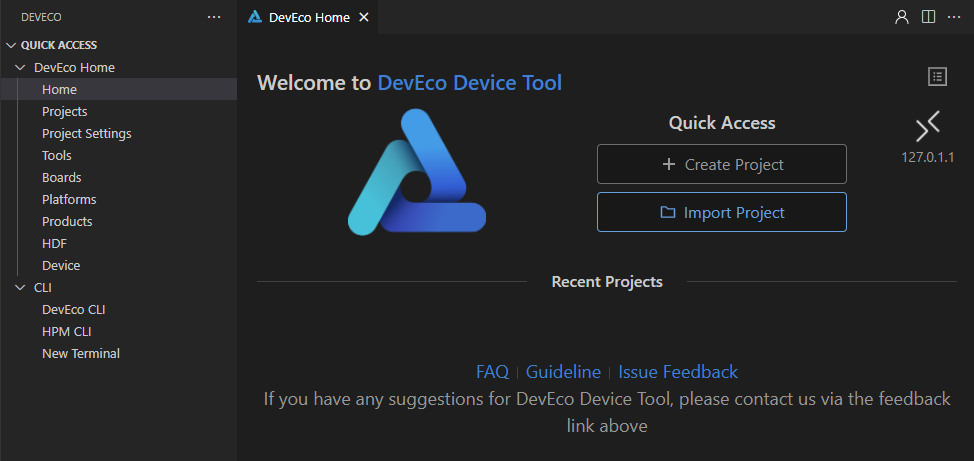
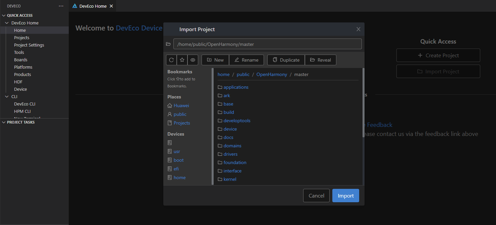
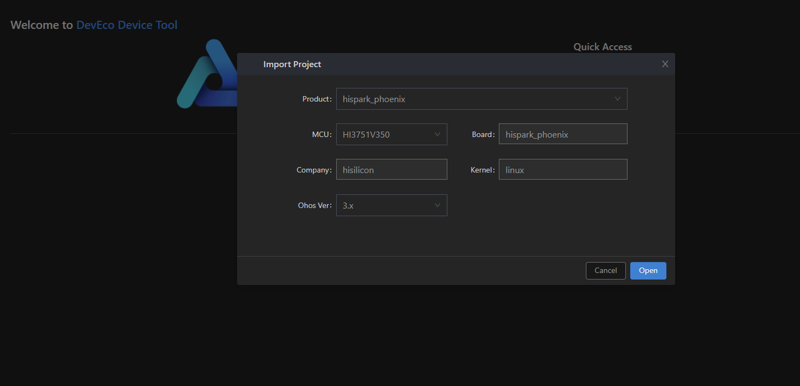
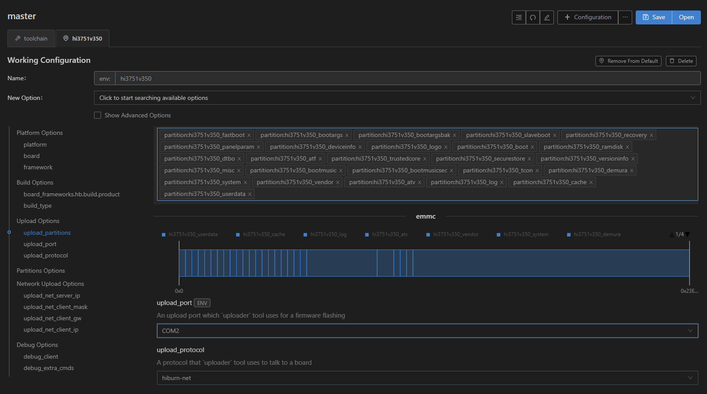
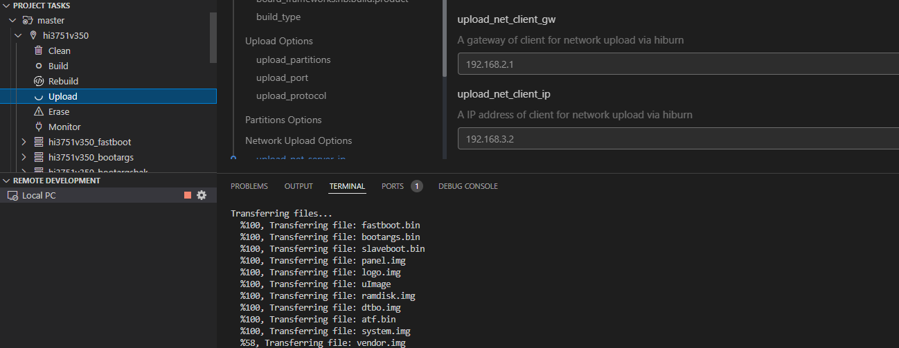

# 烧录

在Windows下采用USB烧录方式进行Hi3751V350的烧录，具体步骤如下：

### 导入源码

在编译完成后，[保证Windows系统可以远程访问Ubuntu环境](../quick-start/quickstart-standard-env-setup.md)的情况下，您还需要通过以下步骤导入源码后，方可进行烧录。

1. 打开DevEco Device Tool，进入Home页，点击**Import Project**打开工程。

   

2. 选择要导入的源码目录（需要访问Ubuntu下的源码目录），点击**Import**打开。

   

3. 如果您打开的目录不是DevEco Device Tool工程，则会出现如下提示框，点击**Import**。

   

4. 在Select Project type界面，选择**Import from OpenHarmony Source**。

   

5. 在Import Project界面，选择**Product**后，会自动填充对应的MCU、Board、company和kernel信息，然后**ohosVersion**选择对应的OpenHarmony源码版本。此处Product选择“hispark_phoenix”。

   

6. 点击**Open**打开工程或源码。

### 烧录

完成源码导入后，通过以下步骤进行烧录：

1. 请使用串口线连接电脑USB口和待烧录开发板miniUSB debug接口，同时需要连接开发板和电脑到同一个局域网，保证两侧网口可互通。

2. 在DevEco Device Tool中，选择REMOTE DEVELOPMENT &gt; Local PC，查看远程计算机（Ubuntu开发环境）与本地计算机（Windows开发环境）的连接状态。

   - 如果Local PC右边连接按钮为，则远程计算机与本地计算机为已连接状态，不需要执行其他操作。
   - 如果Local PC右边连接按钮为，则点击绿色按钮进行连接。

   

   >  **说明：**
   > 该操作仅在远程模式（Windows+Ubuntu混合开发环境）中需要设置，如果采用本地模式（Windows开发环境或Ubuntu开发环境），则请跳过该步骤。

3. 在DevEco Device Tool中，点击QUICK ACCESS &gt; DevEco Home &gt; Device，查看并记录对应的串口号。

   

   >  **说明：**
   > 如果对应的串口异常，请根据[Hi3516DV300/Hi3751V350/Hi3518EV300开发板串口驱动安装指导](https://device.harmonyos.com/cn/docs/documentation/guide/hi3516_hi3518-drivers-0000001050743695)安装USB转串口的驱动程序。

4. 在QUICK ACCESS &gt; DevEco Home &gt; Projects中，点击**Settings**打开工程配置界面。

   

5. 在“hi3751v350”页签，设置烧录选项，包括upload_partitions、upload_port和upload_protocol。

   - upload_partitions：选择待烧录的文件，默认情况下会同时烧录fastboot、bootargs、bootargsbak、slaveboot等全部分区。
   - upload_port：选择已查询到的串口号，可通过Windows设备管理器查看。
   - upload_protocol：选择烧录协议，固定选择“hiburn-net”。

   

6. 根据下表分别检查待烧录分区是否完整，DevEco Device Tool已按照默认的烧录分区文件配置烧录信息，可根据实际情况进行调整。

   | 分区 | 烧录文件路径 | 内容 |
   | --------- | ------- | ---- |
   | fastboot | //out/hispark_phoenix/packages/phone/images/fastboot.bin | uboot镜像 |
   | bootargs  | //out/hispark_phoenix/packages/phone/images/bootargs.bin | 启动参数二进制 |
   | bootargsbak  | //out/hispark_phoenix/packages/phone/images/bootargs.bin | 启动参数二进制 |
   | slaveboot | //out/hispark_phoenix/packages/phone/images/slaveboot.bin | 从核启动镜像 |
   | panelparam | //out/hispark_phoenix/packages/phone/images/panel.img | 屏幕参数 |
   | logo | //out/hispark_phoenix/packages/phone/images/logo.img | 开机logo |
   | boot | //out/hispark_phoenix/packages/phone/images/uImage | 内核镜像 |
   | ramdisk | //out/hispark_phoenix/ramdisk.img | RAMDisk启动镜像 |
   | dtbo | //out/hispark_phoenix/packages/phone/images/dtbo.img | 内核DTS |
   | atf | //out/hispark_phoenix/packages/phone/images/atf.bin | ARM trusted firmware |
   | system | //out/hispark_phoenix/packages/phone/images/system.img | system分区镜像 |
   | vendor | //out/hispark_phoenix/packages/phone/images/vendor.img | vendor分区镜像 |
   | userdata | //out/hispark_phoenix/packages/phone/images/userdata.img | data分区镜像 |

   >  **说明：**
   > 特殊需要则可以按如下步骤进行手动配置

   1. 在“hi3751v350”页签中的“Partitions Options”，选择需要修改的分区，点击右侧的展开按钮，可配置如partition_type（分区类型）、partition_addr（烧录文件起始地址）、partition_length（烧录文件分区长度）等。

       

   2. 选中partition_bin，可自定义指定烧写文件。

   3. 在设置烧录分区起始地址和分区长度时，应根据实际待烧录文件的大小进行设置，要求设置的烧录分区大小，要大于待烧录文件的大小；同时，各烧录文件的分区地址设置不能出现重叠。

   4. 按照相同的方法调整修改剩余烧录文件信息。

7. 在保证开发板和电脑连接到同一个局域网后，进行Hiburn_net网络配置，配置项如下表。
   |配置信息|介绍|
   |-------|----|
   |upload_net_server_ip|在烧录时作为server端向开发板传输镜像文件，此处为Windows IP。|
   |upload_net_client_mask|设置开发板网络的掩码，与当前局域网掩码一致。|
   |upload_net_client_gw|设置开发版本网络的网关，与当前局域网掩码一致。|
   |upload_net_client_ip|设置开发板的IP，需要避免和当前网络环境的其他主机的IP冲突。|

   1. 选择“Network Upload Options”栏配置“upload_net_server_ip”，工具将自动检测Windows主机的所有IP地址，然后需要手动选择IP，选择IP时要选择Windows主机和单板所在局域网的IP地址。

   2. 默认情况下“upload_net_client_mask”、“upload_net_client_gw”和“upload_net_client_ip”会在前一步选择IP后自动配置，依然需要根据当前局域网环境检查自动配置的信息，避免掩码错误，网关错误或者IP冲突，否则可能会导致烧录失败。

      

8. 前述配置都调整修改完成后，在“hi3751v350”页签的顶部，点击**Save**进行保存。

9. 点击“PROJECT TASKS”下hi3751v350的**Upload**按钮，启动烧录。

   >  **说明：**
   > 如果开始烧录时，其他串口工具如MobaXterm连接了开发板的串口，则需要断开与开发板串口的连接，否则烧录会失败。

    

   >  **说明：**
   > 点击“Upload”按钮后，会完整烧录第5点“upload_partitions”内容的所有分区。如要单独烧录某个分区， 
   > 则在“PROJECT TASKS”下点击对应的分区的**Upload**按钮，比如hi3751v350_fastboot。

10. 在终端窗口显示Please power off, then power on the device信息时，开关电源键对单板（下电并）上电，启动烧录。

      

      启动烧录后，界面提示“SUCCESS”信息时，表示烧录成功。

      

11. 烧录成功后，请根据“[运行](./quickstart-ide-standard-running-hi3751-running)”章节进行操作，启动系统。