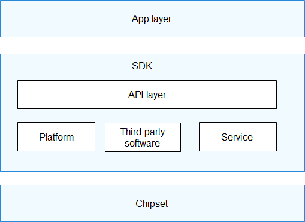

# HiSpark\_pegasus<a name="EN-US_TOPIC_0000001130176841"></a>

-   [Introduction](#section11660541593)
-   [Features](#section12212842173518)
-   [Directory Structure](#section1464106163817)
-   [License Agreement](#section1478215290)
-   [Repositories Involved](#section1371113476307)

## Introduction<a name="section11660541593"></a>

HiSpark\_pegasus \(Hi3861 V100\) is a 2 x 5 cm development board. It is a 2.4 GHz Wi-Fi SoC chip that highly integrates the IEEE 802.11b/g/n baseband and radio frequency \(RF\) circuit. The RF circuit includes modules such as the power amplifier \(PA\), low noise amplifier \(LNA\), RF Balun, antenna switch, and power management. It supports a standard bandwidth of 20 MHz and a narrow bandwidth of 5 MHz or 10 MHz, and provides a maximum rate of 72.2 Mbit/s at the physical layer. The Hi3861 V100 Wi-Fi baseband supports the orthogonal frequency division multiplexing \(OFDM\) technology and is backward compatible with the direct sequence spread spectrum \(DSSS\) and complementary code keying \(CCK\) technologies. It also supports various data rates specified in the IEEE 802.11 b/g/n protocol. Hi3861 V100 integrates the high-performance 32-bit microprocessor, hardware security engine, and various peripheral interfaces. The peripheral interfaces include the Synchronous Peripheral Interface \(SPI\), Universal Asynchronous Receiver & Transmitter \(UART\), the Inter Integrated Circuit \(I2C\), Pulse Width Modulation \(PWM\), General Purpose Input/Output \(GPIO\) interface, and multi-channel Analog to Digital Converter \(ADC\). In addition, Hi3861 V100 supports the high-speed SDIO 2.0 Device interface, with a maximum clock frequency of 50 MHz. This chip has a built-in static random access memory \(SRAM\) and flash memory, so that programs can run independently or run from a flash drive. Hi3861 V100 applies to Internet of Things \(IoT\) devices such as smart home appliances.

The Hi3861 platform software shields the underlying layer from the application layer, providing application programming interfaces \(APIs\) for the application software to implement required functions. The following figure shows the typical system application architecture.

**Figure  1**  System application architecture<a name="fig4460722185514"></a>  




This framework consists of the following layers:

-   APP layer: represents the application layer. The sample code provided by the SDK is stored in the  **app\\demo\\src**  directory.
-   API layer: provides common APIs developed based on the SDK.
-   Platform layer: provides a board support package \(BSP\) for the SoC, including the following functions:
    -   Chip and peripheral driver
    -   Operating system
    -   System management

-   Service layer: provides application protocol stacks such as Wi-Fi. It is used to send and receive data for upper-layer applications.
-   Third party: provides third-party software libraries for the service layer or application layer.

## Features<a name="section12212842173518"></a>

**Stable and reliable communication capability**

-   Reliable communication algorithms such as TPC, automatic rate, and immunity against weak interference in complex environments

**Flexible networking capability**

-   256-node mesh networking
-   Standard bandwidth \(20 MHz\) and narrow bandwidth \(5 MHz or 10 MHz\) networking

**Comprehensive network support**

-   IPv4 and IPv6-compliant networking
-   DHCPv4 and DHCPv6 Client and Server
-   DNS Client
-   mDNS
-   Basic CoAP, MQTT, HTTP and JSON components

**Advanced security engine**

-   AES-128 and AES-256 encryption and decryption algorithms
-   HASH-SHA256 and HMAC\_SHA256 algorithms
-   RSA and ECC signature verification algorithms
-   True random number generation, meeting the FIPS140-2 random test standard
-   TLS and DTLS acceleration
-   eFUSE for secure storage, boot, and upgrade
-   Built-in MPU feature for memory isolation

**Open operating system**

-   Low power consumption, small memory, high stability, and high real-time performance
-   Flexible protocol support and extension capabilities
-   Interfaces for secondary development
-   Multi-layer development interfaces: operating system adaptation, system diagnosis, link layer, and network layer interfaces

## Directory Structure<a name="section1464106163817"></a>

The root directory of the Hi3861 SDK is  **device\\hisilicon\\hispark\_pegasus\\sdk\_liteos**. Its directory structure is as follows:

```
device/hisilicon/hispark_pegasus/sdk_liteos
├── app                 # Application layer code, including the demo program
├── boot                # Flash bootloader code
├── build               # Library, link, and configuration files required for SDK construction
├── BUILD.gn            # GN building script
├── build_patch.sh      # File used for decompressing the U-Boot open-source code package and applying patches
├── build.sh            # Building script for startup, which can be customized using the sh build.sh menuconfig command
├── components          # Files related to the SDK platform
├── config              # SDK system configuration files
├── config.gni          # Configuration files supporting OpenHarmony
├── factory.mk          # Building script of the factory-test version
├── hm_build.sh         # Building script for adapting to OpenHarmony
├── include             # Header files declaring APIs
├── license             # License of the open-source SDK
├── Makefile            # File for building using the make or make all command
├── non_factory.mk      # Building script of the non-factory-test version
├── platform            # Files related to the SDK platform, including the kernel image and driver modules
├── SConstruct          # SCons build script
├── third_party         # Open-source third-party software
└── tools               # Tools provided by the SDK for Linux and Windows systems, including the NV making tool, signature tool, and Menuconfig
```

## License Agreement<a name="section1478215290"></a>

-   The Hi3861 V100 self-developed code uses the HiSilicon copyright notice licensed under the 2.0 version of the Apache License. The license and copyright information can be viewed at the beginning of the code:

```
  / *Copyright (c) 2020 HiSilicon (Shanghai) Technologies CO., LIMITED.Licensed under the Apache License,* ... * / 
```

-   The third-party code used by Hi3861 V100 complies with the open-source license notice delivered with the software version.
-   The generated library files are stored in  **build/libs**  in the root directory.
-   Some open-source software components may be used in Hi3861 V100. If the licenses applicable to those open-source software components conflict with this Agreement, the former ones shall prevail.

## Repositories Involved<a name="section1371113476307"></a>

**device/hisilicon/hispark\_pegasus**

vendor/hisilicon

