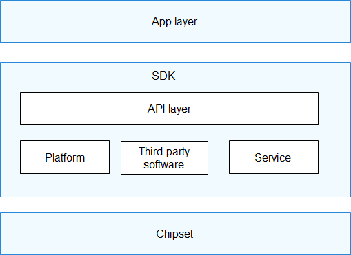

# HiSpark\_pegasus<a name="ZH-CN_TOPIC_0000001130176841"></a>

-   [简介](#section11660541593)
-   [特点](#section12212842173518)
-   [目录](#section1464106163817)
-   [许可协议](#section1478215290)
-   [相关仓](#section1371113476307)

## 简介<a name="section11660541593"></a>

HiSpark\_pegasus（Hi3861V100）是一款高度集成的2.4GHz WiFi SoC芯片，集成IEEE 802.11b/g/n基带和RF电路，RF电路包括功率放大器PA、低 噪声放大器LNA、RF balun、天线开关以及电源管理等模块；支持20MHz标准带宽和5MHz/10MHz窄带宽，提供最大72.2Mbit/s 物理层速率。 Hi3861V100 WiFi基带支持正交频分复用（OFDM）技术，并向下兼容直接序列扩频（DSSS）和补码键控（CCK）技术，支 持IEEE 802.11 b/g/n协议的各种数据速率。 Hi3861V100芯片集成高性能32bit微处理器、硬件安全引擎以及丰富的外设接口，外设接口包括SPI、UART、I2C、PWM、 GPIO和多路ADC，同时支持高速SDIO2.0 Device接口，最高时钟可达50MHz；芯片内置SRAM和Flash，可独立运行，并支持 在Flash上运行程序。 Hi3861V100芯片适应于智能家电等物联网智能终端领域。

上海海思Hi3861系列的平台软件对应用层实现了底层屏蔽，并对应用软件直接提供API\(Application Programming Interface\)接口完成相应功能。典型的系统应用架构如下：

**图 1**  系统架构图<a name="fig4460722185514"></a>  




该框架可以分为以下几个层次：

-   APP层：即应用层。SDK提供的代码示例在SDK的代码目录：app\\demo\\src。
-   API层：提供基于SDK开发的通用接口。
-   Platform平台层：提供SOC系统板级支持包，包括如下功能：
    -   芯片和外围器件驱动
    -   操作系统
    -   系统管理

-   Service服务层：提供包含WiFi等应用协议栈。用于上层应用软件进行数据收发等操作。
-   第三方：提供给Service服务层或提供给应用层使用的第三方软件库。

## 特点<a name="section12212842173518"></a>

**稳定、可靠的通信能力**

-   支持复杂环境下 TPC、自动速率、弱干扰免疫等可靠性通信算法

**灵活的组网能力**

-   支持 256 节点 Mesh 组网
-   支持标准 20M 带宽组网和 5M/10M 窄带组网

**完善的网络支持**

-   支持 IPv4/IPv6 网络功能
-   支持 DHCPv4/DHCPv6 Client/Server
-   支持 DNS Client 功能
-   支持 mDNS 功能
-   支持 CoAP/MQTT/HTTP/JSON 基础组件

**强大的安全引擎**

-   硬件实现 AES128/256 加解密算法
-   硬件实现 HASH-SHA256、HMAC\_SHA256 算法
-   硬件实现 RSA、ECC 签名校验算法
-   硬件实现真随机数生成，满足 FIPS140-2 随机测试标准
-   硬件支持 TLS/DTLS 加速
-   内部集成 EFUSE，支持安全存储、安全启动、安全升级
-   内部集成 MPU 特性，支持内存隔离特性

**开放的操作系统**

-   丰富的低功耗、小内存、高稳定性、高实时性机制
-   灵活的协议支撑和扩展能力
-   二次开发接口
-   多层级开发接口：操作系统适配接口和系统诊断接口、 链路层接口、网络层接口

## 目录<a name="section1464106163817"></a>

Hi3861的SDK软件包根目录结构所在位置device\\hisilicon\\hispark\_pegasus\\sdk\_liteos，如下图所示：

```
device/hisilicon/hispark_pegasus/sdk_liteos
├── app                 # 应用层代码（其中包含demo程序为参考示例）。
├── boot                # Flash bootloader代码。
├── build               # SDK构建所需的库文件、链接文件、配置文件。
├── BUILD.gn            # GN构建脚本
├── build_patch.sh      # 用于解压uboot开源源码包和打patch。
├── build.sh            # 启动编译脚本，同时支持“sh build.sh menuconfig”进行客制化配置。
├── components          # SDK平台相关的组件
├── config              # SDK系统配置文件。
├── config.gni          # 支持OpenHarmony配置文件。
├── factory.mk          # 厂测版本编译脚本。
├── hm_build.sh         # 适配OpenHarmony构建脚本。
├── include             # API头文件存放目录。
├── license             # SDK开源license声明
├── Makefile            # 支持make编译，使用“make”或“make all”启动编译。
├── non_factory.mk      # 非厂测版本编译脚本。
├── platform            # SDK平台相关的文件（包括：内核镜像、驱动模块等）
├── SConstruct          # SCons编译脚本。
├── third_party         # 开源第三方软件目录。
└── tools               # SDK提供的Linux系统和Windows系统上使用的工具（包括：NV制作工具、签名工具、Menuconfig等）。
```

## 许可协议<a name="section1478215290"></a>

-   Hi3861V100自研代码使用基于Apache License Version 2.0许可的hisi版权声明。许可信息和版权信息通常可以在代码开头看到：

```
  / *Copyright (c) 2020 HiSilicon (Shanghai) Technologies CO., LIMITED.Licensed under the Apache License,* ... * / 
```

-   Hi3861V100使用的第三方代码遵循软件版本自带的开源许可声明。
-   将生成的库文件统一存放于根目录下的build/libs下。
-   Hi3861V100可能会使用一些开源软件组件。如果这些开源软件组件所适用的许可与本协议内容冲突，则以该开源软件组件的许可为准。

## 相关仓<a name="section1371113476307"></a>

**device/hisilicon/hispark\_pegasus**

vendor/hisilicon

