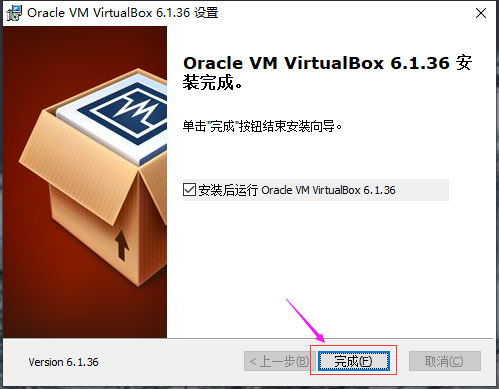
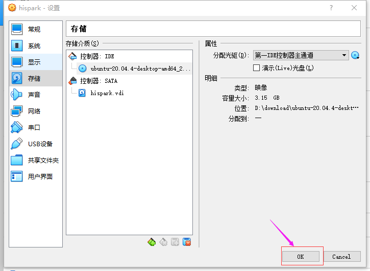
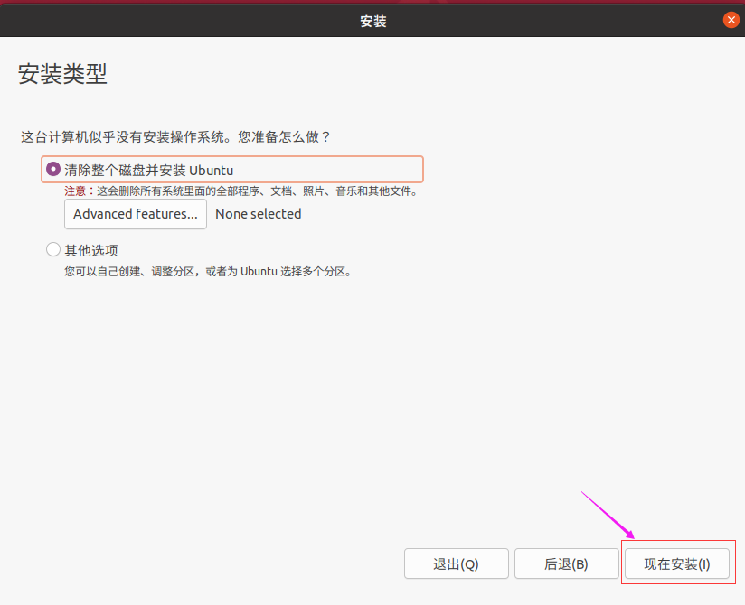
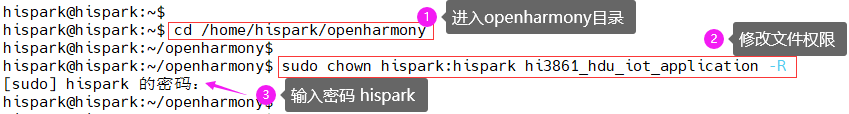

# 环境搭建指南

## 1、介绍

该SDK包使用Openharmony系统，方便开发者快速开发Openharmony应用。

## 2、linux下编译环境搭建

### 2.1 软件获取

<font color='RedOrange'>**（注意：以下软件包仅用于教学，未经允许不得转发用于商业用途）**</font>

| 工具名称    | 用途说明                          | 版本要求   | 获取渠道                                                     |
| ----------- | --------------------------------- | ---------- | ------------------------------------------------------------ |
| VirtualBox  | Windows安装Ubuntu系统所需的虚拟机 | 6.1.36版本 | [VirtualBox下载链接](https://download.virtualbox.org/virtualbox/6.1.36/VirtualBox-6.1.36-152435-Win.exe) |
| Ubuntu20.04 | 编译环境所需的Linux系统           | 20.04版本  | [Ubuntu20.04下载链接](https://mirrors.huaweicloud.com/ubuntu-releases/20.04/ubuntu-20.04.6-desktop-amd64.iso) |
| VScode      | 代码阅读和编辑所需的IDE工具       | 1.70.1版本 | [VScode下载链接](https://az764295.vo.msecnd.net/stable/6d9b74a70ca9c7733b29f0456fd8195364076dda/VSCodeUserSetup-x64-1.70.1.exe) |

### 2.2 VirtualBox的安装

- 双击在 **2.1 软件获取章节下载** 的VirtualBox-6.1.36-152435-Win.exe 安装包，点击下一步，安装VirtualBox。


- 点击浏览按钮，修改VirtualBox的安装路径，然后点击确定按钮，再点击下一步。


- 当出现下面的界面，点击下一步。


- 当出现下面的界面，点击是。


- 当出现下面的安装界面时，点击安装。


- 点击完成，即可完成VirtualBox的安装。



### 2.3 Ubuntu20.04的安装

#### 步骤1：导入Ubuntu20.04镜像到VirtualBox

- 打开VirtualBox，点击新建


- 修改虚拟机的名称为hispark，然后修改Ubuntu系统的安装文件夹，把典型配置为linux,然后版本选择 Ubuntu(64-bit)，然后再点击下一步。


- 修改Ubuntu的运行内存大小为4G，然后点击下一步。


- 选择现在创建虚拟硬盘，然后点击创建按钮。


- 选择VDI（VirtualBox磁盘映像），然后点击下一步。


- 选择动态分配，然后点击下一步。


- 修改磁盘空间大小为100GB，然后点击创建按钮。


- 点击设置按钮，选择常规选项，在高级选项处，把共享粘贴板和拖放都设置为双向，然后点击OK按钮。


- 点击VirtualBox的设置，然后点击系统，选择处理器，把处理器的数量改为4。
- 注意：如果您的处理器小于等于4个的话，请把处理器数量改小一些。


- 点击网络，选择网卡2，勾选启动网络连接，选择仅主机网络，点击OK。


- 点击设置按钮，选择存储，然后选择没有盘片，点击光盘按钮，点击选择虚拟盘。


- 选择 **1.1.2 软件获取章节下载**的Ubuntu20.04的镜像文件，然后点击打开按钮。


- 然后点击设置的OK按钮。



- 点击启动，启动Ubuntu系统


#### 步骤2：Ubuntu系统的安装

- 选择中文(简体)，然后点击安装Ubuntu。


- 如果您安装Ubuntu的时候和我一样，因为分辨率问题，导致界面显示不全，无法看到下面的按钮，您需要按住组合键 ``` Ctrl+Alt+t```打开终端面板，然后输入 ```xrandr -s 1920x1080``` 后敲回车，修改Ubuntu的分辨率。


- 选择Chinese，然后点击继续按钮。


- 将安装Ubuntu时下载更新的勾选去掉，然后点击继续按钮。


- 点击现在安装。



- 点击继续按钮。


- 选择上海，然后点击继续按钮。


- 设置好账号和密码，点击继续按钮，此处的账号和密码即为您Ubuntu的登录所需的账号和密码。
- 请按照本文的配置来，账号为：hispark，密码为：hispark。


- 开始安装各种软件。


- Ubuntu安装完成后，点击现在重启按钮。


- 当出现此类弹窗，点击跳过即可。若Ubuntu弹出是否更新的弹窗，点击取消即可。我们先暂时不更新。


- 点击virtualbox的设备，点击安装增强功能


- 当弹出 弹窗询问是否运行自启动软件时，点击取消。
- 此时左边任务栏会多出一个光盘一样的图标，点击并打开光盘图标，进入该文件夹内。


- 在光盘文件夹的空白处，鼠标右键，点击在终端打开。


- 执行下面的命令，进行增强功能的安装。

```
sudo apt-get install  gcc make perl -y

sudo ./VBoxLinuxAdditions.run
```


- 安装成功后，重启一下Ubuntu

#### 步骤3：更新软件

- 当Ubuntu重启之后，点击Ubuntu桌面左下角九个点图标，然后打开软件和更新图标。


- 点击Ubuntu软件，在**下载自**处点击下拉框，选择其他站点。


- 在**中国**下方选择**阿里云**，然后点击选择服务器。


- 此时弹出认证对话框，输入您的Ubuntu登录密码，本文为hispark。


- 点击关闭按钮，然后有对话框时，点击重新载入，此时会有一段时间的软件更新，耐心等待即可。


- 更新完成后，在Ubuntu的桌面，点击鼠标右键，点击在终端打开，打开终端窗口。


- 在终端输入下面两条命令，进行软件更新

```
sudo apt-get update
sudo apt-get upgrade -y
```


#### 步骤4：配置Ubuntu的samba服务

* 执行下面的命令，下载samba服务

```
sudo apt-get install samba samba-common -y 
```


* 执行完成后，在桌面处选择“hispark”文件夹，右键选择属性，等待桌面弹出对话框hispark属性，选择本地网络共享。

  

* 在本地网络共享，按如下配置勾选，设置共享名（注意：共享名不能为hispar），点击创建共享。


* 创建共享之后，会弹出对话框，选择“自动添加权限”（一定要选择，否则无法使用），添加完成后，关闭hispark属性对话框。

  

* 执行下面的命令，重启samba 服务器

```
sudo service smbd restart
```


* 执行下面的命令，安装net-tools工具

```
sudo apt install net-tools  -y
```


* 执行下面的命令，查看Ubuntu的IP地址，本文unbuntu的IP地址是 192.168.56.104

```
ifconfig
```


* 点击Windows的此电脑，鼠标右键，选择映射网络驱动器

  

* 输入<font color='RedOrange '>\\\您Ubuntu的IP地址\hispark</font>，然后点击完成，本文的账号为：hispark，密码为：hispark

```
\\192.168.56.104\share
```

* <font color='RedOrange '>注意：下方的\\\192.168.56.104\share中的192.168.56.104，是本文ubuntu的IP地址，每个人的ubuntu的IP地址可能不一样，这里需要注意。</font>

* 这样Ubuntu的家目录就能够在Windows的磁盘下面显示了。这样您就可以方便的进行Windows和Ubuntu之间的文件共享了。（注意：如果重启电脑或者虚拟机导致映射断开，请重新映射）


- https://blog.csdn.net/qq_60750453/article/details/128636298)

## 3、Docker安装及编译、烧录

### 3.1 Docker安装

 #### 步骤1：安装Docker软件

- 在终端输入下面的命令，安装docker工具 

```
sudo apt install docker.io -y
```


#### 步骤2：配置docker用户权限

* 在Ubuntu的终端，执行下面的命令，配置docker用户的权限

```shell
sudo groupadd docker

sudo gpasswd -a $USER docker

newgrp docker

sudo chmod a+rw /var/run/docker.sock
```


#### 步骤3：下载Docker镜像文件到Ubuntu

* 在Ubuntu的终端，执行下面命令下载docker镜像到Ubuntu，这里需要一点时间，请耐心等待。

```sh
docker pull swr.cn-north-4.myhuaweicloud.com/hi_spark/ohos_ws63:0.0.1
```


#### 步骤4：查看docker image信息

- 输入下面的命令，查看docker image的具体信息

```
docker image ls
```


#### 步骤5：启动docker编译环境

- 执行下面的命令，启动docker编译环境，其中第一个<font color='RedOrange '>openharmony</font>为自定义的docker的名字，<font color='RedOrange '>bfb8a25acad9</font>为我Ubuntu下docker的IMAGE ID，这里<font color='RedOrange '>请根据自己docker image ID的不同自行修改</font>。

```shell
docker run -itd -p 2222:22 -v /home/xxx/code:/home --name openharmony bfb8a25acad9

# -p：2222:22 linux的2222端口映射到容器22端口, 访问linux的2222端口即可访问容器的ssh
# -v：表示目录映射关系（前者是宿主机目录，后者是映射到宿主机上的目录），可以使用多个－v做多个目录或文件映射
# --name：为创建的容器命名。
# /home/xxx/code:/home/root：/home/xxx/code为本地虚拟机目录，将容器/home目录内容映射到本地虚拟机code，xxx代表用户名
```

- 进入docker需要执行下面的命令，**<font color='RedOrange '>注意：如果您的Ubuntu重启之后，需要再次启动dcoker编译环境,请重新执行下面指令</font>**

```sh
# 查看当前运⾏的docker实例状态
docker ps -a

# 在上⼀条指显示结果列表中，查看openharmony的STATUS
# 如为 Exited，则需要执⾏下⾯这条指令，再次启动
# 如为 Up，则跳过下⾯这条指令
docker start openharmony

# 进⼊docker编译环境
docker exec -it openharmony bash
# 执⾏后，出现类似如下信息，说明再次进⼊成功
# root@64ee57e1eb19:
```


* 如果您想<font color='RedOrange '>退出docker的编译环境</font>，需要执行下面的命令。

```
exit
```


### 3.2 编译代码

* 在docker容器里面执行如下命令安装码云repo工具

```
cd /root
mkdir bin
curl https://gitee.com/oschina/repo/raw/fork_flow/repo-py3 -o bin/repo 
chmod a+x bin/repo
pip3 install -i https://repo.huaweicloud.com/repository/pypi/simple requests
```

* 在docker容器里面将repo添加到环境变量。
```
vim ~/.bashrc               # 编辑环境变量
export PATH=/root/bin:$PATH     # 在环境变量的最后添加一行repo路径信息
source ~/.bashrc            # 应用环境变量
```

* 在docker容器里面下载主干master分支代码

```
cd /root
mkdir openharmony
cd openharmony
git config --global user.email "you@example.com"  #"you@example.com" gitee账号的邮箱
git config --global user.name "Your Name"         #"Your Name" gitee账号的用户名
repo init -u https://gitee.com/openharmony/manifest.git -b master --no-repo-verify
repo sync -c
repo forall -c 'git lfs pull'
```

- 如果在拉取代码过程中遇到如下问题，在docker目录执行如下指令(如果拉取成功则可以跳过此步骤):

```
curl -s https://packagecloud.io/install/repositories/github/git-lfs/script.deb.sh | sudo bash
sudo apt install git-lfs
cd /root/openharmony
repo sync -c
repo forall -c 'git lfs pull'
```

* 执行下面的命令，进入本地Ubuntu的 /home/xxx目录下,然后添加code目录权限，"code"为本地虚拟机目录（没有请自己创建mkdir code），用户可以自己指定(指定方式参考步骤5)。

```
cd /home/xxx // xxx代表用户名，本地虚拟机

sudo chown xxx:xxx code -R // xxx代表用户名
```



- 在docker容器中，源码根目录下载pre软件

```
cd /root
cd openharmony
./build/prebuilts_download.sh
```

- 在docker容器中，源码根目录运行如下命令设置编译产品

```
hb set -p nearlink_dk_3863
```

- 编译

```
hb build -f
```

  

- 制品存放在以下路径

```
out/nearlink_dk_3863/nearlink_dk_3863/ws63-liteos-app/
```

### 3.3 烧录

- 安装串口终端工具和串口驱动程序

  

  （1） 学校或家庭用户到xshell官网下载xshell,下载完成后双击安装即可。

  ```
  链接：https://cdn.netsarang.net/5849fa07/Xshell-7.0.0164p.exe
  ```
  （2） 下载CH340驱动,下载完成后双击安装即可。

  ```
  链接：https://www.wch.cn/downloads/file/65.html
  ```
  （3） 下载BurnTool烧录工具并解压。

  ```
  链接：https://gitee.com/hihope_iot/near-link/tree/master/tools
  ```


- 打开烧录工具，选择对应的串口,打开烧录工具,点开Option选项,选择对应的芯 片,WS63E与WS63属于同一款系列，芯片选择WS63即可。

  

  （2）选择烧录文件,示例路径为（选ws63-liteos-app-all.fwpkg）

  ```hljs
  home\xxx\code\sdk_temp\out\nearlink_dk_3863\nearlink _dk_3863\ws63-liteos-app // xxx代表用户名
  ```

  

如果无法映射，可以在本地linux执行

```
docker cp openharmony:/root/sdk_temp/out/nearlink_dk_3863/nearlink _dk_3863/ws63-liteos-app/ws63-liteos-app_all.fwpkg ./  // /root/sdk_temp/out/nearlink_dk_3863/nearlink _dk_3863/ws63-liteos-app/ws63-liteos-app_all.fwpkg 代表镜像生产目录路径；./代表本地虚拟机当前目录
```

  （3）勾选Auto Burn和Auto disconnect选项,点击connect连接,单按开发板RST按键 开始烧录。

  （4）烧录完成结果如下：

  

  （4） 打开串口工具,波特率选择115200,上电后可以看到相关的串口打印。

  
